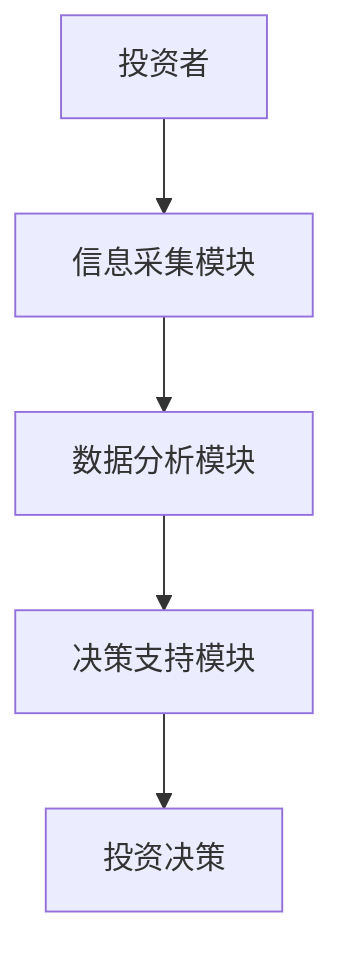
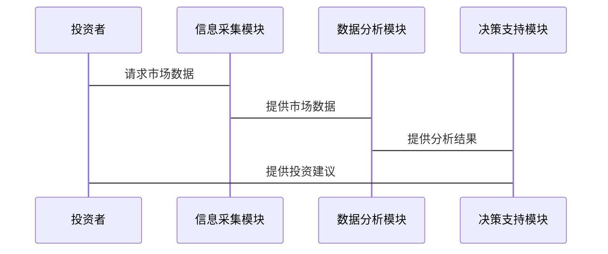

                 


# AI多智能体如何优化价值投资者的信息获取和处理

> 关键词：AI多智能体，价值投资，信息处理，优化算法，投资决策

> 摘要：本文探讨了AI多智能体技术在价值投资中的应用，分析了如何通过多智能体协同优化信息获取和处理流程，提升投资决策的效率和准确性。文章从背景介绍、核心概念、算法原理、系统架构到项目实战，详细阐述了AI多智能体在价值投资中的实现与优化过程。

---

## 第一章：价值投资与AI多智能体的背景介绍

### 1.1 价值投资的基本概念

价值投资是一种以基本面分析为基础的投资策略，强调以低于内在价值的价格购买优质资产。其核心在于通过分析财务报表、市场趋势、行业动态等信息，识别被市场低估的投资标的。传统价值投资依赖于分析师的主观判断，存在信息处理效率低、决策周期长等问题。

### 1.2 AI多智能体技术的引入

AI多智能体系统由多个分布式智能体组成，每个智能体负责特定的任务或信息处理，通过协同工作实现整体目标。在价值投资中，AI多智能体可以分别负责数据采集、分析、预测和决策支持，从而提高信息处理效率和决策的准确性。

### 1.3 当前价值投资者的痛点

1. **信息获取效率低**：传统方式依赖人工收集和分析数据，耗时且容易遗漏关键信息。
2. **信息处理复杂**：海量数据的处理需要强大的计算能力和高效的算法支持。
3. **决策风险高**：依赖单个分析师的判断，存在主观性和片面性。

### 1.4 AI多智能体的优化目标

通过多智能体协同，优化信息获取和处理流程，降低投资风险，提高投资收益。

---

## 第二章：AI多智能体与价值投资的核心概念

### 2.1 多智能体系统的定义与属性

多智能体系统由多个分布式智能体组成，每个智能体具备以下属性：
1. **自主性**：能够独立感知环境并做出决策。
2. **反应性**：能够实时响应环境变化。
3. **协作性**：通过通信和协调完成共同目标。
4. **学习能力**：能够通过经验优化自身行为。

### 2.2 价值投资者的信息处理流程

1. **数据采集**：从多个来源获取市场数据、财务报表等信息。
2. **数据分析**：对数据进行清洗、建模和分析，识别投资机会。
3. **决策支持**：基于分析结果，提供投资建议。

### 2.3 多智能体与价值投资的实体关系

```mermaid
er
actor(投资者) --> InformationSource(信息源)
actor --> AIAssistant(智能体)
AIAssistant --> InvestmentDecision(投资决策)
```

---

## 第三章：AI多智能体的算法原理

### 3.1 强化学习算法

#### 3.1.1 强化学习的基本原理

强化学习是一种通过试错机制优化决策的算法。智能体通过与环境交互，学习最优策略以最大化累积奖励。

#### 3.1.2 多智能体强化学习的挑战

1. **状态空间复杂性**：多个智能体共享状态空间，导致状态空间维度爆炸。
2. **动作协调问题**：智能体之间需要协调动作，避免冲突。

#### 3.1.3 实例分析：价值投资者的决策优化

通过强化学习，智能体可以学习在不同市场环境下做出最优投资决策。

### 3.2 多智能体协作算法

#### 3.2.1 基于图的多智能体协作

利用图结构表示智能体之间的关系，通过消息传递机制实现协作。

#### 3.2.2 实例分析：信息协同处理

多个智能体分别负责不同的数据源，协同完成信息整合和分析。

### 3.3 算法实现代码

```python
import numpy as np
from gym import spaces

class MultiAgentEnv:
    def __init__(self, num_agents):
        self.num_agents = num_agents
        self.observation_space = spaces.Box(-1, 1, shape=(num_agents,))
        self.action_space = spaces.Discrete(3)
```

---

## 第四章：数学模型与公式推导

### 4.1 价值投资者的数学模型

#### 4.1.1 CAPM模型

$$ E(r_i) = r_f + \beta_i (r_m - r_f) $$

其中，$E(r_i)$ 为资产的期望收益率，$r_f$ 为无风险利率，$\beta_i$ 为资产的贝塔系数，$r_m$ 为市场期望收益率。

#### 4.1.2 马科维茨投资组合理论

$$ \text{Minimize} \sum_{i=1}^n w_i^2 \sigma_i^2 $$
$$ \text{Subject to} \sum_{i=1}^n w_i = 1 $$

其中，$w_i$ 为资产权重，$\sigma_i$ 为资产收益率的波动率。

### 4.2 AI多智能体的优化公式

通过多智能体协同优化投资组合，最大化收益与风险的比率。

$$ \text{Maximize} \frac{E(r_i) - r_f}{\sigma_i} $$

---

## 第五章：系统架构与设计

### 5.1 系统功能设计

1. **信息采集模块**：从多个数据源获取市场数据。
2. **数据分析模块**：对数据进行清洗、建模和分析。
3. **决策支持模块**：基于分析结果提供投资建议。

### 5.2 系统架构设计



### 5.3 系统交互设计



---

## 第六章：项目实战与案例分析

### 6.1 项目背景与目标

构建一个AI多智能体系统，优化价值投资者的信息获取和处理流程。

### 6.2 系统实现

1. **环境安装**：安装必要的Python库，如TensorFlow、PyTorch等。
2. **核心实现**：实现多智能体协同算法，优化投资组合。
3. **系统测试**：通过实际案例验证系统的有效性。

### 6.3 实际案例分析

通过具体案例分析，展示AI多智能体在价值投资中的实际应用效果。

### 6.4 项目小结

总结项目实现的过程、成果和经验教训。

---

## 第七章：最佳实践与小结

### 7.1 最佳实践

1. **数据质量控制**：确保数据的准确性和完整性。
2. **算法优化**：根据实际需求调整算法参数。
3. **系统维护**：定期更新数据和优化算法。

### 7.2 小结

AI多智能体技术为价值投资者提供了高效的信息处理和决策支持工具，能够显著提升投资效率和准确性。

### 7.3 注意事项

1. **数据隐私保护**：确保数据处理符合相关法律法规。
2. **系统稳定性**：保证系统在复杂环境下的稳定运行。
3. **持续学习**：及时更新算法和模型，适应市场变化。

### 7.4 拓展阅读

推荐相关书籍和论文，供读者深入学习。

---

## 参考文献

1. 强化学习相关论文
2. 多智能体系统相关书籍
3. 价值投资经典文献

---

作者：AI天才研究院/AI Genius Institute & 禅与计算机程序设计艺术 /Zen And The Art of Computer Programming

