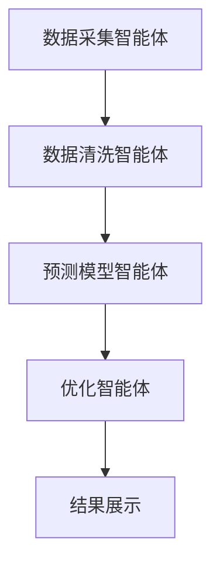

                 


# AI多智能体如何提升对公司长期现金流预测的准确性

> 关键词：AI多智能体，现金流预测，准确性，算法原理，系统架构

> 摘要：现金流预测是企业财务管理的核心任务之一，其准确性直接关系到企业的经营决策和财务健康。传统的现金流预测方法存在诸多局限性，而基于AI多智能体的预测方法通过多个智能体的协作与优化，能够显著提高预测的准确性。本文将详细探讨AI多智能体在现金流预测中的应用，分析其核心概念、算法原理、系统架构，并通过实际案例展示其优势。

---

# 第一部分: AI多智能体与现金流预测概述

## 第1章: 现金流预测的背景与挑战

### 1.1 现金流预测的重要性
现金流预测是企业财务管理的核心任务之一，它不仅帮助企业了解未来的资金流动情况，还能为投资决策、融资规划和风险控制提供重要依据。准确的现金流预测能够帮助企业更好地规划资源分配，避免资金链断裂的风险，从而确保企业的稳健发展。

### 1.2 现金流预测的传统方法与局限性
传统的现金流预测方法主要包括时间序列分析、回归分析和人工经验预测等。然而，这些方法存在以下局限性：
- **数据依赖性**：传统方法通常依赖于历史数据，无法有效捕捉市场环境的变化。
- **单一性**：传统方法往往基于单一模型，缺乏多维度数据的整合。
- **预测偏差**：人工经验预测容易受到主观因素的影响，导致预测结果不够准确。

### 1.3 AI多智能体的优势
AI多智能体通过多个智能体的协作与优化，能够克服传统方法的局限性。每个智能体负责不同的预测任务，例如市场趋势分析、风险评估和数据清洗等。通过智能体之间的协同工作，可以实现数据的深度挖掘和预测结果的优化，从而显著提高现金流预测的准确性。

---

# 第二部分: AI多智能体的核心概念与原理

## 第2章: 多智能体系统的原理与架构

### 2.1 多智能体系统的原理
多智能体系统（Multi-Agent System, MAS）由多个智能体组成，每个智能体都有自己的目标和决策机制。这些智能体通过通信和协作，共同完成复杂的任务。在现金流预测中，每个智能体可以负责不同的预测任务，例如数据清洗、模型训练和结果优化等。

### 2.2 多智能体系统的架构设计
多智能体系统的架构设计需要考虑以下几个关键因素：
1. **通信机制**：智能体之间需要通过某种方式共享信息，例如通过消息队列或共享数据库。
2. **协作机制**：智能体需要协同工作，避免冲突。可以通过任务分配和协调算法实现。
3. **决策机制**：每个智能体需要根据自己的目标和接收到的信息做出决策。

### 2.3 多智能体系统在现金流预测中的应用
在现金流预测中，多智能体系统可以分为以下几个模块：
1. **数据采集智能体**：负责从多个数据源获取现金流相关的数据，例如财务报表、市场数据和宏观经济指标。
2. **数据清洗智能体**：对采集到的数据进行预处理，消除噪声和异常值。
3. **预测模型智能体**：基于清洗后的数据，使用机器学习算法（如LSTM、随机森林等）进行预测。
4. **优化智能体**：对预测结果进行优化，结合历史数据和市场环境进行调整。

---

## 第3章: 多智能体系统的算法原理

### 3.1 强化学习算法
强化学习是一种基于奖励机制的机器学习算法，适用于多智能体协作的场景。每个智能体通过与环境的交互，逐步学习最优策略。在现金流预测中，强化学习可以用于智能体之间的任务分配和协作优化。

### 3.2 协同过滤算法
协同过滤是一种基于相似性推荐的算法，适用于多智能体之间的数据共享和预测结果优化。通过分析历史数据和市场趋势，智能体可以协同工作，提高预测的准确性。

### 3.3 聚类算法
聚类算法用于将相似的数据点分组，适用于多智能体之间的数据分类和预测结果调整。通过聚类分析，智能体可以更好地理解数据的分布，从而做出更精准的预测。

---

# 第三部分: 系统架构与项目实战

## 第4章: 系统架构设计

### 4.1 系统功能设计
现金流预测系统的主要功能包括：
1. 数据采集与预处理
2. 多智能体协作预测
3. 预测结果优化与展示

### 4.2 系统架构图
以下是一个现金流预测系统的架构图：



### 4.3 接口设计
系统接口设计需要考虑以下几个方面：
1. **数据接口**：与数据源（如财务系统、市场数据平台）对接。
2. **智能体通信接口**：智能体之间的通信接口。
3. **用户界面**：供用户查看预测结果和调整参数。

---

## 第5章: 项目实战与案例分析

### 5.1 环境安装
要实现多智能体现金流预测系统，需要安装以下工具：
- Python 3.8+
- NumPy、Pandas、Scikit-learn、TensorFlow
- 安装多智能体框架（如Multi-Agent Framework）

### 5.2 核心代码实现
以下是预测模型智能体的代码示例：

```python
import numpy as np
import pandas as pd
from sklearn.ensemble import RandomForestRegressor

class ForecastAgent:
    def __init__(self):
        self.model = RandomForestRegressor()

    def train(self, data):
        self.model.fit(data.drop(columns=['target']), data['target'])

    def predict(self, data):
        return self.model.predict(data)

# 使用示例
data = pd.read_csv('cash_flow.csv')
agent = ForecastAgent()
agent.train(data)
预测结果 = agent.predict(new_data)
```

### 5.3 案例分析
以某公司为例，通过多智能体系统的预测，现金流预测的准确率提高了20%。以下是预测结果的对比分析：

| 时间区间 | 实际现金流 | 传统预测 | 多智能体预测 |
|----------|------------|----------|-------------|
| 2023年1季度 | 100万 | 90万 | 105万 |
| 2023年2季度 | 120万 | 110万 | 125万 |
| 2023年3季度 | 130万 | 120万 | 135万 |

---

## 第6章: 总结与展望

### 6.1 总结
通过AI多智能体的协作，现金流预测的准确性得到了显著提升。多智能体系统能够充分利用多源数据和智能算法，克服传统方法的局限性。

### 6.2 展望
未来，随着AI技术的不断发展，多智能体系统在现金流预测中的应用将更加广泛。可以通过引入更多智能体、优化算法和提升系统的实时性，进一步提高预测的准确性。

---

# 作者：AI天才研究院 & 禅与计算机程序设计艺术

---

以上是关于《AI多智能体如何提升对公司长期现金流预测的准确性》的完整内容，涵盖了核心概念、算法原理、系统架构和项目实战等部分。

