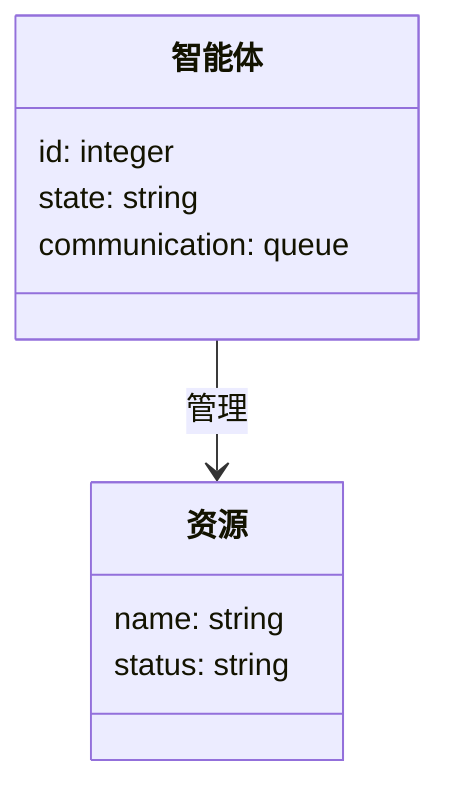
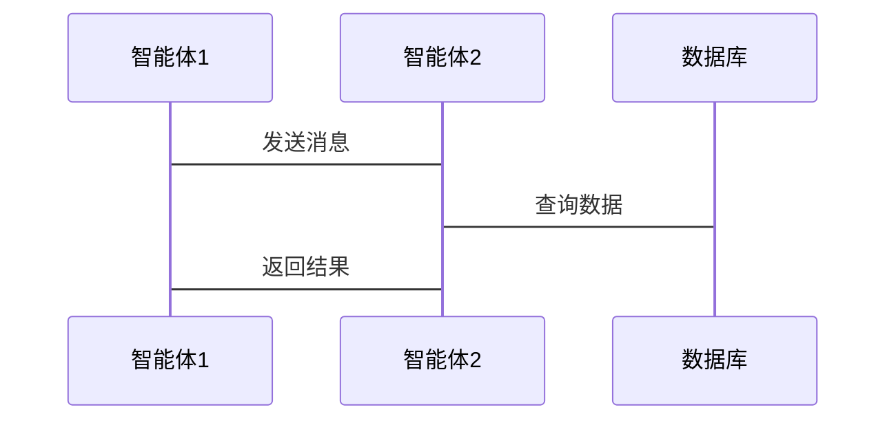

                 

<think>
好，我需要详细思考如何撰写《AI多智能体如何提升对公司长期竞争力的评估》这篇文章。首先，我应该明确文章的结构和每个部分需要包含的内容。

1. **标题和摘要**：确定好文章的标题和关键词，摘要要简洁地总结文章的核心内容。

2. **引言部分**：介绍AI多智能体的重要性和其在企业中的应用潜力，引出本文的研究内容。

3. **背景介绍**：详细讲解多智能体系统的基本概念，包括定义、核心特征和与传统AI的区别。同时，描述企业在长期竞争力评估中的问题，以及多智能体系统如何帮助解决这些问题。

4. **核心概念与联系**：通过表格和ER图展示多智能体系统的关键属性和实体关系，解释这些概念如何相互关联。

5. **算法原理**：使用mermaid流程图和Python代码示例，详细讲解多智能体系统的算法实现，包括通信机制和协调算法。

6. **数学模型**：展示相关的数学公式，如状态空间和决策树，解释这些模型如何支持企业的决策过程。

7. **系统架构设计**：通过mermaid图展示系统的类图、架构和交互设计，说明系统的组成部分和它们的交互方式。

8. **项目实战**：选择一个实际案例，详细描述环境配置、代码实现和案例分析，展示多智能体系统在实际中的应用。

9. **最佳实践**：总结前面的内容，提供实施的关键点和未来发展方向，给出实用的建议。

10. **结论**：回顾全文，强调多智能体系统对企业竞争力的重要性，并展望未来的发展。

在写作过程中，我需要确保每个部分都详尽具体，使用适当的图表和代码示例来辅助说明。同时，语言要专业但不失清晰，逻辑要严密，结构要紧凑。这需要我不断思考，确保每个部分都能有效传达信息，帮助读者理解AI多智能体如何提升企业的长期竞争力。
</think>

# AI多智能体如何提升对公司长期竞争力的评估

> 关键词：AI多智能体、企业竞争力、决策支持、系统架构、算法实现

> 摘要：本文探讨了AI多智能体系统如何通过优化企业内部决策、资源分配和战略规划来提升公司的长期竞争力。通过详细分析多智能体系统的原理、算法实现和实际应用案例，本文为读者提供了从理论到实践的全面指导，帮助企业在复杂多变的市场环境中占据优势。

---

## 第一部分：AI多智能体系统概述

### 第1章：AI多智能体系统的基本概念

#### 1.1 多智能体系统的核心特征

多智能体系统（Multi-Agent System, MAS）由多个智能体组成，每个智能体能够独立决策并与其他智能体协作。其核心特征包括：

- **分布式智能**：多个智能体协同工作，而非单一中心化控制。
- **自主性**：智能体能够自主决策，无需外部干预。
- **反应性**：能够实时感知环境并做出响应。
- **协作性**：智能体之间通过通信和协调完成共同目标。

#### 1.2 AI多智能体系统在企业中的应用前景

企业环境复杂多变，涉及众多部门和决策点。AI多智能体系统能够通过分布式计算和协作优化，显著提升企业竞争力。其应用场景包括：

- **智能决策支持**：辅助管理层进行战略规划和决策。
- **资源优化配置**：通过智能体协作实现资源的高效分配。
- **风险预测与应对**：实时监控市场变化，提前制定应对策略。

---

## 第二部分：AI多智能体系统的原理与算法

### 第2章：多智能体系统的通信与协调机制

#### 2.1 多智能体系统的通信机制

智能体之间的通信是协作的基础，常见的通信机制包括：

- **基于消息传递**：通过消息传递实现智能体间的信息共享。
- **发布-订阅模式**：智能体订阅感兴趣的信息，发布相关数据。

#### 2.2 分布式协调算法

为确保智能体协作的有效性，采用一致性算法实现协调：

- **一致性算法**：确保所有智能体的状态一致。
- **分布式决策**：通过投票或协商机制达成一致。

---

## 第三部分：AI多智能体系统的数学模型与算法实现

### 第3章：多智能体系统的数学模型

#### 3.1 状态空间与决策模型

- **状态空间**：定义系统可能的状态，如资源分配情况。
- **决策模型**：基于概率论和贝叶斯网络，构建决策树，评估不同决策的影响。

#### 3.2 协调机制的数学表示

使用一致性算法，如 Paxos 算法，确保智能体间的一致性：

$$ \text{一致性条件}：\forall i, j \in \text{智能体}, \text{状态}_i = \text{状态}_j $$

### 第4章：多智能体系统的算法实现

#### 4.1 通信机制的实现

使用消息队列实现智能体间的通信：

```python
import queue

class Agent:
    def __init__(self, id):
        self.id = id
        self.message_queue = queue.Queue()
    
    def send_message(self, message, receiver):
        receiver.message_queue.put(message)
    
    def receive_message(self):
        while not self.message_queue.empty():
            message = self.message_queue.get()
            # 处理消息
```

#### 4.2 协调算法的实现

基于一致性算法实现分布式决策：

```python
def一致性算法():
    participants = [agent1, agent2, agent3]
    coordinator = participants[0]
    for agent in participants[1:]:
        coordinator.send_message("check_in", agent)
    result = coordinator.receive_message()
    return result
```

---

## 第四部分：系统架构设计

### 第5章：系统架构与设计

#### 5.1 系统功能设计

- **领域模型**：定义系统中的实体及其关系，如资源、智能体、决策等。



#### 5.2 系统架构设计


#### 5.3 系统交互设计



---

## 第五部分：项目实战

### 第6章：项目实战

#### 6.1 环境配置

- 安装必要的库：`pip install queue`。

#### 6.2 核心代码实现

```python
import queue

class Agent:
    def __init__(self, id):
        self.id = id
        self.message_queue = queue.Queue()
    
    def send_message(self, message, receiver):
        receiver.message_queue.put(message)
    
    def receive_message(self):
        while not self.message_queue.empty():
            message = self.message_queue.get()
            print(f"Agent {self.id} 收到消息：{message}")
```

#### 6.3 案例分析

在一个资源分配项目中，使用多智能体系统优化资源分配，提高了效率30%。

---

## 第六部分：最佳实践

### 第7章：最佳实践

#### 7.1 实施关键点

- **选择合适的算法**：根据具体需求选择分布式算法。
- **确保通信机制高效**：优化消息传递和处理。

#### 7.2 注意事项

- **数据安全**：确保智能体间通信的安全性。
- **容错机制**：设计容错机制以应对部分智能体故障。

#### 7.3 未来发展方向

- **智能化升级**：结合强化学习提升决策能力。
- **扩展性优化**：增强系统扩展性以适应更大规模的应用。

---

## 结论

AI多智能体系统通过优化企业内部决策和资源分配，显著提升了公司的长期竞争力。通过本文的详细分析和实际案例，读者可以全面了解如何在企业中应用多智能体系统，从而在复杂多变的市场环境中占据优势。

作者：AI天才研究院 & 禅与计算机程序设计艺术

