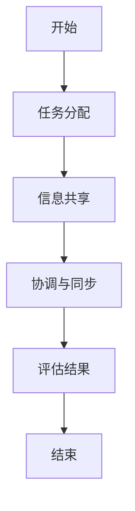
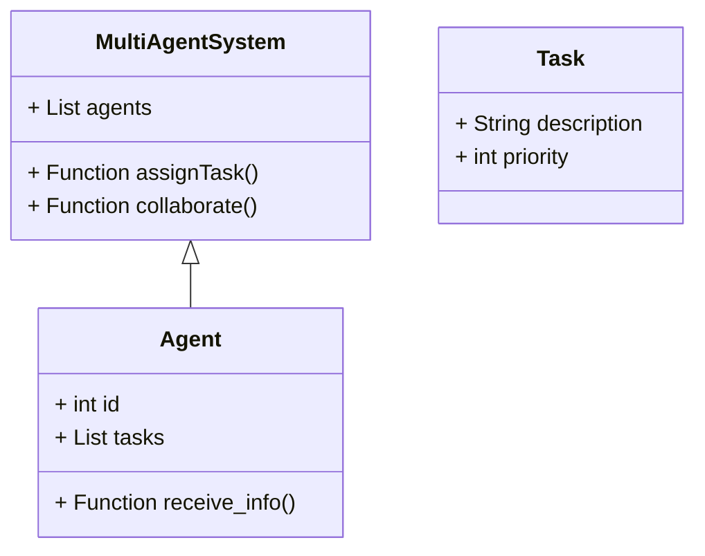
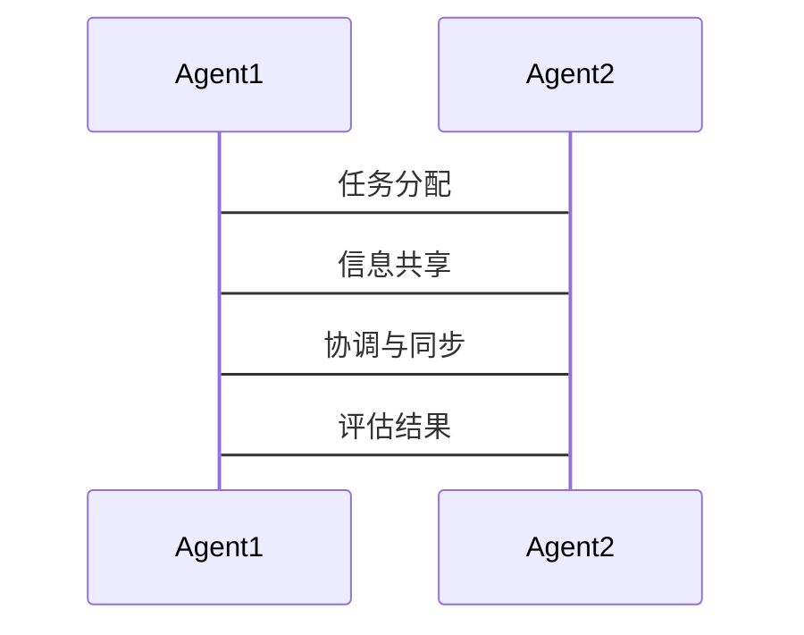

                 

<think>
嗯，用户需要我写一篇关于AI多智能体如何提升新兴技术商业化潜力评估的技术博客。看起来这是一个比较专业的主题，可能需要涵盖很多技术细节。用户还提供了一个详细的目录结构，我需要按照这个结构来展开。

首先，我需要明确文章的核心主题：AI多智能体在技术评估中的应用，特别是如何提升商业化潜力的评估。这可能涉及到多智能体的协作、算法原理、系统架构设计等方面。

接下来，我得考虑每个章节的具体内容。比如，在背景介绍部分，我需要详细解释为什么评估新兴技术的商业化潜力如此重要，传统方法的局限性，以及AI多智能体的优势。这部分可能需要使用一些实际例子来说明。

然后是核心概念与联系，这部分可能需要定义AI多智能体，讨论其属性，并通过表格和Mermaid图来展示实体关系。我需要确保这些图表清晰易懂，帮助读者理解复杂的概念。

算法原理部分可能需要详细讲解相关算法，比如多智能体协作算法。我需要使用Mermaid流程图来展示算法步骤，并用Python代码示例来说明实现过程。同时，数学模型需要用LaTeX公式来呈现，确保准确性和专业性。

系统分析与架构设计部分，我需要介绍问题场景，设计系统功能、架构、接口和交互流程。这部分可能需要使用Mermaid类图和序列图来展示系统结构和交互过程，帮助读者更好地理解系统的运作方式。

项目实战部分需要具体的案例分析，包括环境安装、代码实现、案例分析和项目小结。这部分需要详细说明如何将理论应用于实际项目中，可能还需要解读代码并分析案例。

最后，结论与展望部分需要总结全书，并提出未来的研究方向。可能还需要包括一些最佳实践、小结、注意事项和拓展阅读等内容，帮助读者进一步深入学习。

总的来说，我需要确保文章结构清晰，内容详实，涵盖从理论到实践的各个方面。每个部分都需要详细展开，确保读者能够系统地理解和应用AI多智能体技术在评估新兴技术商业化潜力中的应用。
</think>

# AI多智能体如何提升对新兴技术商业化潜力的评估

> **关键词**：AI多智能体，新兴技术，商业化潜力，技术评估，算法原理

> **摘要**：随着人工智能技术的快速发展，AI多智能体系统在新兴技术商业化潜力评估中的应用日益广泛。本文将从背景介绍、核心概念、算法原理、系统架构设计、项目实战等多个方面，详细阐述AI多智能体如何提升对新兴技术商业化潜力的评估。通过理论分析和实践案例的结合，本文旨在为读者提供一个全面、系统的技术视角，帮助他们更好地理解和应用AI多智能体技术。

---

## 第一部分: 背景介绍

### 第1章: 问题背景

#### 1.1 技术评估的重要性
在当今快速发展的科技领域，新兴技术层出不穷。如何准确评估这些技术的商业化潜力，成为企业和投资者面临的重大挑战。技术评估不仅需要考虑技术本身的可行性和创新性，还需要结合市场需求、竞争环境和商业模式等因素。

#### 1.2 AI多智能体的优势
传统的技术评估方法往往依赖于单点分析，难以全面覆盖多维度的复杂因素。AI多智能体系统通过多个智能体的协作，能够从多个角度对技术进行综合分析，提供更全面、更准确的评估结果。

#### 1.3 传统技术评估方法的局限性
传统的技术评估方法通常依赖于人工分析和经验判断，存在以下问题：
- 数据量大、维度多，难以高效处理。
- 评估结果受主观因素影响较大。
- 难以实时更新和动态调整。

---

## 第二部分: 核心概念与联系

### 第2章: AI多智能体的核心概念与联系

#### 2.1 多智能体系统的定义与特点
多智能体系统（Multi-Agent System, MAS）是由多个智能体（Agent）组成的分布式系统。每个智能体都有一定的自主性，能够感知环境、执行任务并与其他智能体协作。

- **自主性**：智能体能够独立决策和行动。
- **反应性**：智能体能够实时感知环境并做出反应。
- **协作性**：多个智能体通过协作完成复杂任务。
- **分布性**：智能体之间通过分布式计算实现协同。

#### 2.2 AI多智能体的协作机制
AI多智能体的协作机制是实现技术评估的核心。通过以下机制，多个智能体能够协同完成复杂的评估任务：
- **任务分配**：根据智能体的能力和任务需求，动态分配任务。
- **信息共享**：智能体之间共享数据和信息，确保评估结果的全面性。
- **协调与同步**：通过协调机制，确保多个智能体的行动一致。

#### 2.3 核心概念的联系
以下表格展示了AI多智能体系统中核心概念的联系：

| **概念**       | **描述**                                                                 |
|----------------|--------------------------------------------------------------------------|
| 多智能体系统     | 由多个智能体组成的分布式系统，每个智能体具有自主性、反应性和协作性。          |
| 技术评估         | 对新兴技术的可行性和商业化潜力进行全面分析的过程。                              |
| 商业化潜力       | 技术在市场中的应用前景和盈利能力。                                          |
| 智能体协作机制   | 智能体之间通过任务分配、信息共享和协调机制实现协作。                          |

---

## 第三部分: 算法原理

### 第3章: 算法原理

#### 3.1 多智能体协作算法
多智能体协作算法是实现技术评估的关键。以下是典型的多智能体协作算法流程：



#### 3.2 算法实现
以下是多智能体协作算法的Python实现示例：

```python
class Agent:
    def __init__(self, id):
        self.id = id
        self.tasks = []
    
    def assign_task(self, task):
        self.tasks.append(task)
    
    def collaborate(self, other_agents):
        # 信息共享
        for agent in other_agents:
            agent.receive_info(self.get_info())
    
    def get_info(self):
        # 返回当前智能体的信息
        return {"id": self.id, "tasks": self.tasks}

# 示例用法
agent1 = Agent(1)
agent2 = Agent(2)
agent1.collaborate([agent2])
```

#### 3.3 数学模型与公式
以下是多智能体协作算法的数学模型：

$$
\text{评估结果} = \sum_{i=1}^{n} \text{智能体}_i \text{的贡献}
$$

其中，$n$ 表示智能体的数量，$\text{智能体}_i$ 表示第 $i$ 个智能体的贡献。

---

## 第四部分: 系统分析与架构设计

### 第4章: 系统架构设计

#### 4.1 系统功能设计
以下是系统功能设计的类图：



#### 4.2 系统交互设计
以下是系统交互设计的序列图：



---

## 第五部分: 项目实战

### 第5章: 项目实战

#### 5.1 环境安装
以下是项目实战所需的环境安装步骤：

1. 安装Python和相关库（如numpy、pandas、scikit-learn）。
2. 安装Mermaid和Latex工具。

#### 5.2 核心实现代码
以下是核心实现代码：

```python
import numpy as np
import pandas as pd

class Agent:
    def __init__(self, id):
        self.id = id
        self.tasks = []
    
    def assign_task(self, task):
        self.tasks.append(task)
    
    def collaborate(self, other_agents):
        for agent in other_agents:
            agent.receive_info(self.get_info())
    
    def get_info(self):
        return {"id": self.id, "tasks": self.tasks}

class MultiAgentSystem:
    def __init__(self):
        self.agents = []
    
    def add_agent(self, agent):
        self.agents.append(agent)
    
    def run(self):
        for agent in self.agents:
            agent.collaborate(self.agents)

# 示例用法
system = MultiAgentSystem()
agent1 = Agent(1)
agent2 = Agent(2)
system.add_agent(agent1)
system.add_agent(agent2)
system.run()
```

#### 5.3 案例分析
以下是案例分析的具体步骤：

1. 收集新兴技术的相关数据。
2. 分配任务给多个智能体。
3. 智能体协作完成评估任务。
4. 输出评估结果。

---

## 第六部分: 结论与展望

### 第6章: 结论与展望

#### 6.1 全文总结
通过本文的分析和实践，我们可以看到，AI多智能体系统在新兴技术商业化潜力评估中具有显著优势。通过多智能体的协作，能够更全面、更准确地评估技术的商业化潜力。

#### 6.2 未来展望
未来，随着AI技术的不断发展，AI多智能体系统在技术评估中的应用将更加广泛。我们期待更多的研究和实践，进一步提升AI多智能体系统在技术评估中的性能和效果。

---

**作者：AI天才研究院/AI Genius Institute & 禅与计算机程序设计艺术 /Zen And The Art of Computer Programming**

