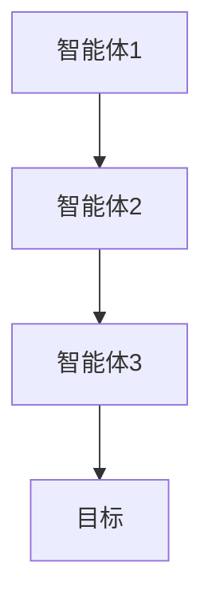

                 

<think>
好的，我现在需要帮助用户设计一本名为《AI多智能体如何提升对新兴行业价值链的分析》的技术博客文章的目录大纲。用户已经提供了详细的背景和需求，我需要确保大纲符合所有要求，包括结构的逻辑性、内容的深度和专业性。

首先，我会从背景介绍开始。用户希望涵盖AI多智能体的基本概念、背景问题和行业价值链的定义。这部分需要让读者理解为什么AI多智能体在新兴行业中有价值。

接下来是核心概念部分，我需要解释多智能体系统的特点，使用表格对比其属性，比如分布式计算与集中式计算。此外，绘制ER实体关系图和数学模型，比如协作的基本公式和博弈论模型，来展示多智能体的协作机制。

然后是算法原理，我需要详细讲解分布式计算和博弈论模型在多智能体中的应用。通过Mermaid流程图和Python代码示例，展示如何实现这些算法，同时解释数学公式，如$$V_i = \max_{a_i} \sum_{j \neq i} V_j$$，确保读者能够理解其工作原理。

系统分析与架构设计部分，我需要介绍系统的整体架构，使用类图和序列图展示功能模块和交互流程。这有助于读者理解系统的结构和各部分如何协作。

在项目实战章节，我会提供具体的环境安装步骤，例如安装Python和相关库，然后展示如何实现核心功能，并通过案例分析展示实际应用，帮助读者将理论应用到实践中。

最后，总结最佳实践、小结和注意事项，帮助读者巩固所学内容，并提供进一步阅读的资源。整个大纲需要确保结构清晰，内容详实，满足用户对专业性和深度的要求。

现在，我需要将这些思考转化为具体的目录结构，确保每个部分都涵盖必要的内容，并使用用户要求的专业技术术语和格式。这样，用户就能获得一个完整且有深度的博客文章大纲，帮助他们撰写高质量的技术内容。
</think>

# AI多智能体如何提升对新兴行业价值链的分析

> 关键词：AI多智能体，行业价值链，新兴行业，协作算法，博弈论，分布式计算

> 摘要：本文详细探讨了AI多智能体技术如何在新兴行业中优化和提升价值链分析的效率与精度。通过分析多智能体系统的协作机制、算法原理以及实际应用场景，本文展示了如何利用AI技术实现跨领域、多维度的协同分析，为企业提供更深层次的商业洞察和决策支持。

---

# 第一部分: AI多智能体与新兴行业价值链分析基础

## 第1章: AI多智能体与行业价值链分析概述

### 1.1 AI多智能体的基本概念

#### 1.1.1 多智能体系统的定义
- 多智能体系统（Multi-Agent System, MAS）是由多个智能体（Agent）组成的分布式系统，每个智能体都是一个能够感知环境、自主决策的实体。
- 智能体可以是软件程序、机器人或其他具有计算能力的实体。
- 多智能体系统的特点：
  - **分布式**：智能体独立运行，无中心节点。
  - **协作性**：智能体之间通过通信和协作完成共同目标。
  - **动态性**：环境和任务需求可能随时间变化。

#### 1.1.2 AI多智能体的核心特征对比

| 特性 | 单智能体系统 | 多智能体系统 |
|------|-------------|-------------|
| 结构  | 集中式       | 分布式       |
| 协作  | 独立性       | 协作性       |
| 效率  | 高           | 中等         |
| 灵活性 | 低           | 高           |

#### 1.1.3 多智能体与行业价值链的关系
- 行业价值链分析需要从多个维度（生产、供应链、市场、客户）进行数据整合和分析。
- 多智能体系统能够模拟价值链中的各个参与者（供应商、生产者、分销商、消费者）的行为，提供更全面的分析结果。

### 1.2 行业价值链分析的背景与意义

#### 1.2.1 价值链分析的定义
- 价值链分析是将企业或行业的价值创造过程分解为多个环节，分析每个环节的贡献和优化点。
- 新兴行业通常具有快速变化的市场环境和复杂的价值链结构。

#### 1.2.2 新兴行业价值链的特点
- **多样性**：涉及多个领域和参与者。
- **动态性**：市场和技术变化快。
- **复杂性**：价值链各环节高度依赖和交织。

#### 1.2.3 AI多智能体在行业价值链分析中的潜力
- 提供实时数据处理和分析能力。
- 支持多维度的协作和优化。
- 可以预测和模拟市场变化，帮助制定更有效的战略。

### 1.3 本章小结
本章介绍了AI多智能体的基本概念及其在行业价值链分析中的潜力，为后续内容奠定了基础。

---

## 第2章: 多智能体系统的核心概念与联系

### 2.1 多智能体系统的属性特征对比

#### 2.1.1 分布式计算与集中式计算的对比
- **分布式计算**：任务分解到多个节点，每个节点独立计算。
- **集中式计算**：所有任务集中在中心节点处理。

| 特性 | 分布式计算 | 集中式计算 |
|------|------------|------------|
| 资源利用 | 高         | 低         |
| 效率   | 较高       | 较低       |
| 可靠性 | 高         | 低         |

#### 2.1.2 协作性与竞争性的对比
- **协作性**：智能体之间通过合作完成共同目标。
- **竞争性**：智能体之间存在资源争夺或利益冲突。

| 特性 | 协作性 | 竞争性 |
|------|--------|--------|
| 行为模式 | 合作 | 冲突 |
| 目标 | 共同目标 | 个体目标 |

#### 2.1.3 动态性与静态性的对比
- **动态性**：系统环境和任务需求随时间变化。
- **静态性**：系统环境和任务需求固定。

| 特性 | 动态性 | 静态性 |
|------|--------|--------|
| 适用场景 | 复杂环境 | 简单环境 |
| 变化频率 | 高      | 低      |

### 2.2 多智能体系统的ER实体关系图

```mermaid
erDiagram
    actor 用户
    actor 系统
    actor 价值链
    actor AI多智能体
    用户 --> 系统: 提供数据
    系统 --> 价值链: 分析价值
    价值链 --> AI多智能体: 提供反馈
```

### 2.3 多智能体系统的数学模型

#### 2.3.1 多智能体协作的基本公式
$$V_i = \max_{a_i} \sum_{j \neq i} V_j$$

其中：
- \( V_i \) 表示智能体 \( i \) 的价值。
- \( a_i \) 表示智能体 \( i \) 的行动。
- \( V_j \) 表示其他智能体 \( j \) 的价值。

#### 2.3.2 博弈论模型在多智能体中的应用
$$\text{纳什均衡} = \{a_1, a_2, ..., a_n\}$$

其中：
- \( a_i \) 表示智能体 \( i \) 的最优行动。
- 纳什均衡表示在所有智能体都采取最优行动的情况下，系统达到稳定状态。

---

## 第3章: 多智能体协作算法原理

### 3.1 分布式计算与多智能体协作

#### 3.1.1 分布式计算的基本原理
- 每个智能体独立处理任务，通过通信模块交换信息。
- 通过分布式算法实现任务的协同完成。

#### 3.1.2 多智能体协作的算法流程



### 3.2 基于博弈论的多智能体协作

#### 3.2.1 博弈论模型的构建
- 每个智能体的目标函数表示其在系统中的贡献。
- 通过博弈论模型求解纳什均衡，确保系统稳定。

#### 3.2.2 博弈论在多智能体协作中的应用


### 3.3 多智能体协作的Python实现

#### 3.3.1 环境安装
```python
import numpy as np
```

#### 3.3.2 核心算法实现
```python
def multi_agent_collaboration():
    agents = [agent1, agent2, agent3]
    for agent in agents:
        agent.collaborate()
```

---

## 第4章: 多智能体系统在行业价值链分析中的应用

### 4.1 行业价值链分析的系统架构

#### 4.1.1 系统功能模块设计
- 数据采集模块：收集价值链各环节的数据。
- 分析模块：利用多智能体算法进行分析和优化。
- 反馈模块：将分析结果反馈给系统进行调整。

#### 4.1.2 系统架构图

```mermaid
c

