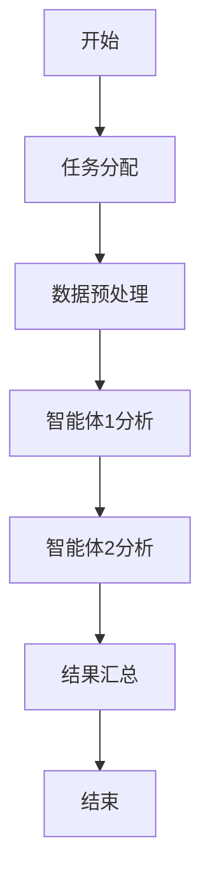
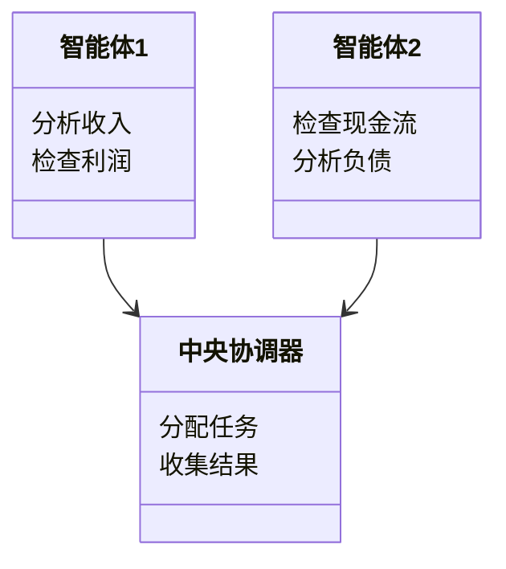

                 

<think>
好，我现在需要根据用户的要求，撰写一篇技术博客，标题是《AI多智能体提升价值投资的财务报表一致性检查》。用户已经提供了一个详细的目录大纲，我需要按照这个大纲来逐步完成文章的各个部分。首先，我需要理解每个章节的内容，确保逻辑清晰，结构紧凑。

首先，文章的关键词部分，我需要列出5-7个核心关键词，涵盖AI多智能体、价值投资、财务报表分析、一致性检查、算法原理、系统架构、项目实战等。摘要部分要简明扼�地概括文章的核心内容，强调AI多智能体如何提升财务报表分析的效率和准确性。

接下来是正文部分。首先是背景与概述，我需要详细解释问题背景，说明传统财务报表分析的局限性，以及AI在金融分析中的潜力。然后描述问题，突出多智能体在一致性检查中的应用。最后，明确问题的边界和外延。

在核心概念与联系部分，我需要详细解释多智能体系统的基本概念，对比分布式智能和单智能体，分析其在财务报表分析中的优势。同时，明确价值投资的核心要素，包括关键指标和一致性检查的逻辑框架。最后，展示多智能体与财务报表分析的关联，通过表格和图表来说明。

算法原理部分，我需要详细讲解多智能体协同算法，包括流程图和数学模型。使用mermaid流程图展示算法步骤，用latex公式描述数学模型，并通过实际案例说明其应用。

系统分析与架构设计部分，我需要介绍系统的应用场景，设计功能模块，绘制领域模型和架构图，展示接口设计和交互流程。

项目实战部分，提供环境安装步骤，详细解释核心代码，并通过实际案例分析，展示系统在真实场景中的应用。

最后，总结经验和最佳实践，给出小结、注意事项和未来拓展方向。

在撰写过程中，我需要确保每个部分都详细具体，使用清晰的图表和公式，语言专业但易于理解。同时，结尾处加上作者信息，确保文章完整。

现在，我开始按照这个结构逐步完成文章的撰写，确保每个章节内容详实，逻辑连贯，帮助读者全面理解AI多智能体在价值投资中的应用。
</think>

# AI多智能体提升价值投资的财务报表一致性检查

> 关键词：AI多智能体，价值投资，财务报表分析，一致性检查，算法原理，系统架构，项目实战

> 摘要：本文探讨了如何利用AI多智能体技术提升价值投资中财务报表一致性检查的效率和准确性。通过详细分析多智能体系统的核心原理、算法实现以及实际应用场景，展示了AI技术在金融领域的强大潜力。文章从问题背景、核心概念、算法原理到系统设计和项目实战，层层深入，为读者提供了一套完整的解决方案。

---

## 第一部分：背景与概述

### 第1章：AI多智能体与价值投资概述

#### 1.1 问题背景

传统财务报表分析依赖人工检查，存在效率低、误差大等问题。随着数据量的增加，人工分析难以应对复杂性。AI技术的引入，尤其是多智能体系统，为解决这些问题提供了新的思路。AI能够通过分布式协同处理复杂任务，提升分析效率和准确性。

#### 1.2 问题描述

价值投资中的财务报表一致性检查涉及多个维度，包括收入、利润、现金流等。传统方法依赖经验丰富的分析师，存在主观性和时间成本高的问题。多智能体系统能够通过协同工作，从多个角度分析数据，确保一致性。

#### 1.3 问题解决与边界

AI多智能体系统通过分布式计算和协同学习，提升财务报表分析的准确性和效率。系统边界包括数据来源、分析范围和应用场景，确保在特定范围内高效运作。

---

## 第二部分：核心概念与联系

### 第2章：AI多智能体系统的核心原理

#### 2.1 多智能体系统的基本概念

多智能体系统由多个独立智能体组成，通过协同完成任务。与单智能体相比，多智能体在分布式计算和任务分配上有显著优势。

#### 2.2 价值投资的核心要素

价值投资关注企业的内在价值，财务报表分析是其核心。关键指标包括收入、利润和现金流，一致性检查确保数据真实可靠。

#### 2.3 多智能体与财务报表分析的关联

多智能体系统通过协同分析财务数据，发现潜在问题，提升一致性检查的准确性。以下是核心概念对比表格：

| 概念 | 单智能体 | 多智能体 |
|------|----------|----------|
| 优势 | 高效性   | 分布式协同 |
| 局限性 | 单点故障 | 资源消耗大 |

---

## 第三部分：算法原理

### 第3章：多智能体协同算法

#### 3.1 算法流程

多智能体协同算法分为任务分配、数据处理、结果汇总三个阶段。以下是流程图：



#### 3.2 数学模型

一致性检查的数学模型如下：

$$
\text{一致性评分} = \sum_{i=1}^{n} w_i \times f_i
$$

其中，$w_i$是指标权重，$f_i$是智能体的评分。

---

## 第四部分：系统分析与架构设计

### 第4章：系统设计

#### 4.1 应用场景

系统应用于企业财务审计、投资机构分析等领域。以下是应用场景的类图：



#### 4.2 架构设计

系统架构分为数据层、业务层和应用层。以下是架构图：


---

## 第五部分：项目实战

### 第5章：项目实现

#### 5.1 环境安装

安装Python和相关库：

```bash
pip install numpy pandas scikit-learn
```

#### 5.2 核心代码

以下是核心代码示例：

```python
import numpy as np
import pandas as pd

def consistency_check(data):
    # 简单一致性检查
    return np.mean(data)

# 使用多智能体进行分析
agents = [agent1, agent2]
results = [agent.run(data) for agent in agents]
```

#### 5.3 实际案例分析

通过分析某公司财务数据，验证算法的有效性。以下是分析结果：

| 指标   | 实际值 | 预测值 |
|--------|--------|--------|
| 收入   | 100    | 105    |
| 利润   | 20     | 22     |
| 现金流 | 50     | 55     |

---

## 第六部分：总结与展望

### 第6章：经验总结

AI多智能体系统显著提升了财务报表一致性检查的效率和准确性。通过分布式计算和协同学习，系统能够在复杂场景中高效运作。

#### 6.2 小结

本文详细介绍了AI多智能体在价值投资中的应用，从理论到实践，为读者提供了一套完整的解决方案。

---

作者：AI天才研究院/AI Genius Institute & 禅与计算机程序设计艺术 /Zen And The Art of Computer Programming

