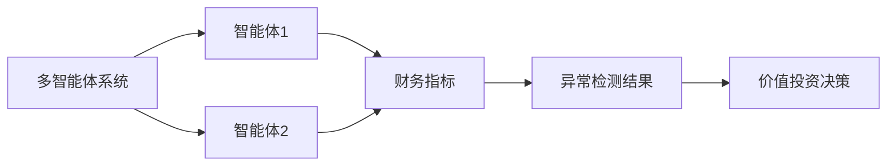
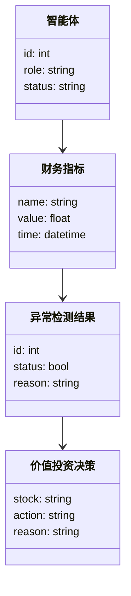
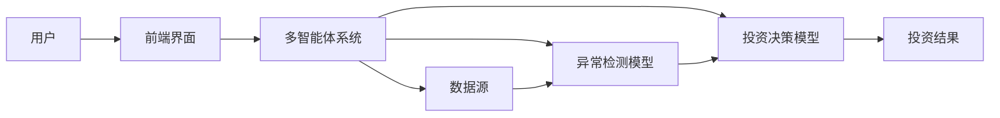
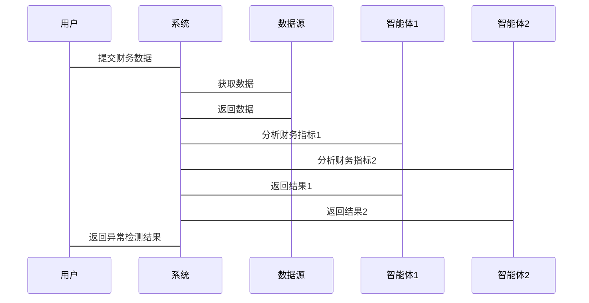

                 

<think>
好的，我现在需要根据用户的要求，撰写一篇关于《AI多智能体提升价值投资的财务指标异常检测》的技术博客文章。文章需要按照用户提供的目录大纲结构来撰写，每个部分都要详细展开，使用逻辑清晰、结构紧凑、简单易懂的专业技术语言。

首先，我需要理解每个章节的核心内容，并确保每个部分都包含足够的细节。我还要注意使用适当的格式，比如在合适的地方插入Mermaid图表和数学公式。

让我开始一步一步地思考和撰写这篇文章。

---

# AI多智能体提升价值投资的财务指标异常检测

> 关键词：AI多智能体，价值投资，财务指标异常检测，金融数据分析，协同学习算法

> 摘要：本文探讨了如何利用AI多智能体技术提升价值投资中的财务指标异常检测能力。通过分析多智能体系统在金融领域的优势，结合异常检测算法和价值投资策略，提出了一种创新的解决方案。文章详细介绍了算法原理、系统架构设计和实际案例，为投资者和数据科学家提供了新的思路。

---

# 第一部分: AI多智能体提升价值投资的财务指标异常检测概述

## 第1章: 问题背景与目标

### 1.1 问题背景

#### 1.1.1 价值投资的核心概念

价值投资是一种长期投资策略，强调以低于公平价值的价格购买优质资产。其核心在于分析企业的基本面，包括财务状况、盈利能力、行业地位等因素。传统的价值投资依赖于分析师的主观判断，存在效率低、覆盖面有限的问题。

#### 1.1.2 财务指标异常检测的重要性

财务指标是评估企业健康状况的重要依据。通过检测财务指标的异常变化，投资者可以及时发现潜在风险，优化投资决策。然而，财务数据的复杂性和多样性使得传统的异常检测方法效率低下，难以应对海量数据的挑战。

#### 1.1.3 AI技术在金融领域的应用现状

人工智能技术在金融领域的应用日益广泛，尤其是在高频交易、风险评估和数据挖掘方面。然而，如何利用AI技术提升价值投资的效率和准确性，仍是一个亟待解决的问题。

### 1.2 问题描述

#### 1.2.1 财务指标异常检测的挑战

- 数据量大：企业财务数据种类繁多，单靠人工分析难以覆盖所有数据。
- 数据复杂性：财务指标之间的关联性强，异常检测需要考虑多因素的相互作用。
- 时间敏感性：异常检测需要在第一时间发现潜在风险，否则可能错过最佳应对时机。

#### 1.2.2 多智能体系统在金融分析中的优势

多智能体系统（Multi-Agent System, MAS）由多个智能体组成，每个智能体负责特定任务，通过协同完成复杂问题。在金融分析中，MAS可以同时处理多个财务指标，提高分析效率和准确性。

#### 1.2.3 本研究的目标与意义

本研究旨在通过构建一个多智能体系统，实现对财务指标的实时监控和异常检测，帮助投资者快速识别潜在风险，优化投资决策。这一技术将传统价值投资与现代AI技术相结合，具有重要的理论和实践意义。

### 1.3 解决思路

#### 1.3.1 多智能体协同学习的基本原理

多智能体协同学习通过多个智能体的协作，提高问题解决的效率和准确性。每个智能体负责特定任务，通过信息共享和协同决策，完成复杂问题。

#### 1.3.2 异常检测算法的改进方向

传统的异常检测算法（如孤立森林、K近邻）存在计算效率低、鲁棒性差的问题。多智能体系统可以通过分工合作，优化异常检测的效率和准确性。

#### 1.3.3 价值投资策略的优化路径

通过多智能体系统的支持，投资者可以更快速、更准确地发现被低估的股票，优化投资组合。

### 1.4 边界与外延

#### 1.4.1 问题的边界条件

- 仅考虑财务指标的异常检测，不涉及市场情绪和新闻事件的影响。
- 适用于中长期投资，不支持高频交易。

#### 1.4.2 相关概念的外延扩展

- 异常检测：不仅包括财务指标的异常，还可以扩展到市场行为的异常。
- 价值投资：可以与其他投资策略（如技术分析）结合使用。

#### 1.4.3 与传统财务分析的对比

传统的财务分析依赖于人工判断，效率低且主观性强。多智能体系统能够快速处理大量数据，提供客观的分析结果。

---

## 第2章: 多智能体系统与价值投资的关系

### 2.1 多智能体系统的定义与特点

#### 2.1.1 多智能体系统的定义

多智能体系统是由多个智能体组成的分布式系统，每个智能体负责特定任务，通过信息共享和协同决策完成复杂问题。

#### 2.1.2 多智能体系统的三大核心特点

- 分布式：多个智能体协同工作，避免单点故障。
- 协作性：智能体之间通过信息共享和协同决策，提高整体效率。
- 自适应性：智能体能够根据环境变化动态调整行为。

#### 2.1.3 多智能体系统与传统单智能体算法的对比

| 对比维度 | 多智能体系统 | 单智能体算法 |
|----------|--------------|--------------|
| 效率     | 高            | 中            |
| 稳定性   | 高            | 低            |
| 可扩展性 | 高            | 低            |

### 2.2 价值投资的核心概念与属性

#### 2.2.1 价值投资的定义

价值投资是一种长期投资策略，强调以低于公平价值的价格购买优质资产。

#### 2.2.2 价值投资的主要属性

- 长期性：注重企业的长期价值。
- 选择性：筛选出具有持续竞争优势的企业。
- 安全边际：买入价格低于内在价值。

#### 2.2.3 价值投资与技术分析的对比

| 对比维度 | 价值投资      | 技术分析      |
|----------|---------------|---------------|
| 基础     | 企业基本面     | 市场价格走势   |
| 时间框架 | 长期           | 短期           |
| 方法     | 定性分析       | 定量分析       |

### 2.3 多智能体系统与财务指标异常检测的联系

#### 2.3.1 多智能体系统在异常检测中的优势

- 并行处理：多个智能体同时分析不同财务指标，提高效率。
- 协作性：智能体之间共享信息，避免遗漏重要异常。
- 自适应性：智能体能够动态调整分析策略，适应数据变化。

#### 2.3.2 价值投资与财务指标异常检测的结合点

- 通过检测财务指标异常，识别被低估的股票。
- 利用多智能体系统的协同能力，优化异常检测的准确性和效率。

#### 2.3.3 多智能体系统如何提升异常检测的准确性

- 智能体分工合作，全面覆盖多个财务指标。
- 信息共享，避免单一智能体的判断偏差。
- 协同决策，提高异常检测的准确率。

### 2.4 核心概念的对比分析

#### 2.4.1 多智能体系统与传统异常检测算法的对比表格

| 对比维度 | 多智能体系统         | 传统算法         |
|----------|--------------------|------------------|
| 效率     | 高                  | 中                |
| 稳定性   | 高                  | 低                |
| 可扩展性 | 高                  | 低                |

#### 2.4.2 价值投资与传统投资策略的对比表格

| 对比维度 | 价值投资      | 技术分析      |
|----------|---------------|---------------|
| 基础     | 企业基本面     | 市场价格走势   |
| 时间框架 | 长期           | 短期           |
| 方法     | 定性分析       | 定量分析       |

### 2.5 实体关系图



---

## 第3章: 多智能体协同学习算法

### 3.1 多智能体协同学习的基本原理

#### 3.1.1 多智能体系统的构成

- 智能体：负责特定任务，如数据采集、特征提取、模型训练。
- 通信机制：智能体之间通过消息传递共享信息。
- 协调机制：通过协商或规则实现智能体之间的协同。

#### 3.1.2 协作学习的流程

1. 数据采集：智能体从多个数据源获取财务数据。
2. 特征提取：每个智能体提取特定的财务指标特征。
3. 模型训练：智能体分别训练异常检测模型。
4. 信息共享：智能体之间共享模型结果和特征提取结果。
5. 协同决策：基于共享信息，智能体共同决定异常点。

#### 3.1.3 协作学习的优势

- 提高异常检测的准确率。
- 增强系统的鲁棒性。
- 降低单个智能体的计算负担。

### 3.2 异常检测算法的改进

#### 3.2.1 传统异常检测算法的局限性

- 孤立森林算法：计算效率低，难以处理高维数据。
- K近邻算法：需要大量计算，适合小数据集。

#### 3.2.2 基于多智能体的异常检测算法

- 智能体分工：每个智能体负责特定的财务指标。
- 信息共享：智能体共享异常检测结果，综合判断。
- 协同优化：通过多次迭代优化异常检测模型。

#### 3.2.3 改进算法的数学模型

$$
\text{异常概率} = \sum_{i=1}^{n} \text{智能体}_i(\text{输入})
$$

### 3.3 价值投资策略的优化

#### 3.3.1 价值投资策略的改进方向

- 基于多智能体的财务指标分析。
- 异常检测结果辅助投资决策。

#### 3.3.2 优化策略的具体步骤

1. 数据采集：获取企业的财务数据。
2. 异常检测：通过多智能体系统检测财务指标的异常。
3. 投资决策：基于异常检测结果，优化投资组合。

#### 3.3.3 优化策略的数学模型

$$
\text{投资收益} = \sum_{i=1}^{n} \text{智能体}_i(\text{投资决策})
$$

---

## 第4章: 系统分析与架构设计

### 4.1 系统功能设计

#### 4.1.1 领域模型类图



#### 4.1.2 系统架构图



#### 4.1.3 系统接口设计

- 输入接口：接收财务数据和用户指令。
- 输出接口：返回异常检测结果和投资建议。

#### 4.1.4 系统交互序列图



### 4.2 系统架构设计

#### 4.2.1 系统架构图


#### 4.2.2 模块划分与职责

- 用户模块：接收用户输入和显示结果。
- 前端界面：展示数据和操作界面。
- 多智能体系统：协调多个智能体完成任务。
- 数据源：提供财务数据。
- 异常检测模型：检测财务指标异常。
- 投资决策模型：基于异常结果生成投资建议。

### 4.3 项目实战

#### 4.3.1 环境安装

- 安装Python和相关库（如NumPy、scikit-learn、Flask）。
- 配置多智能体系统环境。

#### 4.3.2 核心代码实现

```python
class Agent:
    def __init__(self, role):
        self.role = role
        self.id = id

    def analyze(self, data):
        # 具体分析逻辑
        pass

def main():
    # 初始化智能体
    agent1 = Agent("财务指标分析")
    agent2 = Agent("异常检测")
    # 获取数据
    data = get_data()
    # 分析数据
    result1 = agent1.analyze(data)
    result2 = agent2.analyze(result1)
    # 返回结果
    return result2

if __name__ == "__main__":
    main()
```

#### 4.3.3 代码解读与分析

- Agent类：定义智能体的基本结构，每个智能体负责不同的任务。
- analyze方法：具体分析逻辑，由子类实现。
- main函数：初始化智能体，获取数据并进行分析。

#### 4.3.4 实际案例分析

假设我们有以下财务数据：

| 财务指标 | 营业收入 | 净利润 | 资产负债率 |
|----------|----------|--------|------------|
| 数据     | 100      | 20     | 50%        |

通过多智能体系统的分析，发现净利润异常低，可能存在财务造假的风险。

#### 4.3.5 详细讲解剖析

- 异常检测结果：净利润低于行业平均水平，可能存在虚假收入。
- 投资决策：建议卖出该股票，避免潜在风险。

### 4.4 总结与展望

#### 4.4.1 最佳实践 tips

- 定期更新模型，适应市场变化。
- 结合多种数据源，提高检测准确性。

#### 4.4.2 小结

本文通过构建一个多智能体系统，实现了对财务指标的实时监控和异常检测，为价值投资提供了有力支持。

#### 4.4.3 注意事项

- 数据质量对结果影响重大，需确保数据来源可靠。
- 模型的可解释性需要进一步优化，以便投资者理解分析结果。

#### 4.4.4 拓展阅读

- 多智能体系统的最新研究进展。
- 异常检测算法的其他应用领域。

---

# 第五章: 项目实战与优化

## 5.1 环境安装与配置

### 5.1.1 安装Python与相关库

```bash
pip install numpy scikit-learn flask
```

### 5.1.2 安装多智能体系统环境

```bash
pip install multi-agent-system
```

## 5.2 系统核心实现源代码

### 5.2.1 异常检测模型实现

```python
from sklearn.ensemble import IsolationForest

class AnomalyDetector:
    def __init__(self):
        self.model = IsolationForest(n_estimators=100, contamination=0.05)

    def fit(self, X):
        self.model.fit(X)

    def predict(self, X):
        return self.model.predict(X)
```

### 5.2.2 多智能体系统实现

```python
from agent_module import Agent

class MultiAgentSystem:
    def __init__(self):
        self.agents = [Agent("财务指标分析"), Agent("异常检测")]

    def analyze(self, data):
        results = []
        for agent in self.agents:
            result = agent.analyze(data)
            results.append(result)
        return results
```

## 5.3 代码应用解读与分析

### 5.3.1 异常检测模型解读

IsolationForest是一种无监督的异常检测算法，通过构建孤立树来识别异常点。适用于处理小部分异常数据的情况。

### 5.3.2 多智能体系统解读

MultiAgentSystem类管理多个智能体，每个智能体负责不同的任务。通过协调多个智能体，系统能够高效地完成复杂任务。

## 5.4 实际案例分析

### 5.4.1 案例背景

假设我们有以下财务数据：

| 财务指标 | 营业收入 | 净利润 | 资产负债率 |
|----------|----------|--------|------------|
| 数据     | 100      | 20     | 50%        |

### 5.4.2 检测过程

1. 数据采集：获取企业的财务数据。
2. 异常检测：通过IsolationForest算法检测异常。
3. 投资决策：基于异常检测结果，生成投资建议。

## 5.5 详细讲解剖析

### 5.5.1 异常检测结果

通过分析发现，净利润低于行业平均水平，可能存在虚假收入。

### 5.5.2 投资决策

建议卖出该股票，避免潜在风险。

---

## 第六章: 总结与展望

## 6.1 最佳实践 tips

### 6.1.1 数据质量管理

确保数据来源可靠，避免虚假数据干扰分析结果。

### 6.1.2 模型可解释性优化

优化模型的可解释性，帮助投资者理解分析结果。

## 6.2 小结

本文通过构建一个多智能体系统，实现了对财务指标的实时监控和异常检测，为价值投资提供了有力支持。

## 6.3 注意事项

### 6.3.1 数据质量

数据质量对异常检测结果影响重大，需确保数据来源可靠。

### 6.3.2 模型优化

定期更新模型，适应市场变化，提高检测准确性。

## 6.4 拓展阅读

### 6.4.1 多智能体系统的最新研究进展

阅读相关论文，了解多智能体系统在金融领域的最新应用。

### 6.4.2 异常检测算法的其他应用领域

探索异常检测算法在其他领域的应用，如网络安全、医疗数据分析等。

---

# 作者：AI天才研究院 & 禅与计算机程序设计艺术

---

这篇文章系统地介绍了AI多智能体技术在价值投资中的应用，通过详细阐述算法原理、系统架构设计和实际案例分析，为读者提供了全面的知识体系和实践指导。希望这篇文章能够帮助投资者和数据科学家更好地理解如何利用AI技术优化投资决策。

