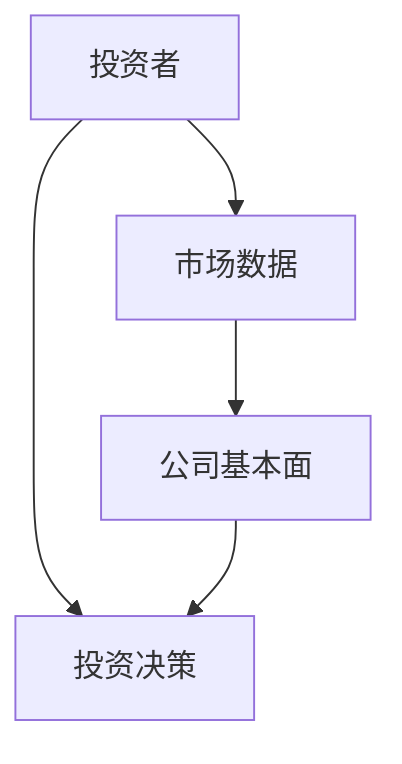
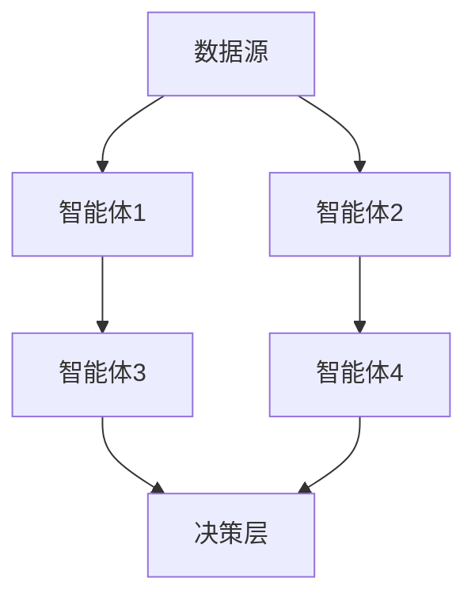
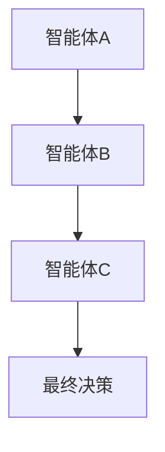
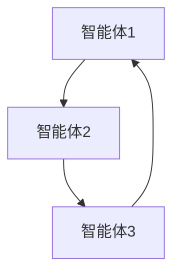
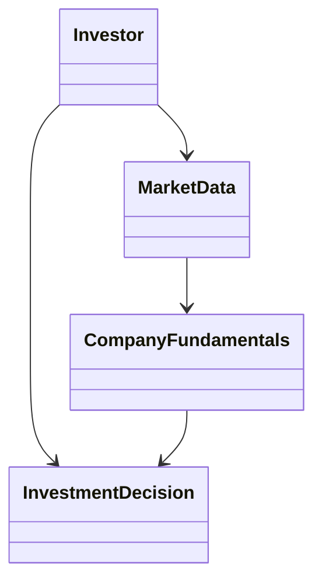
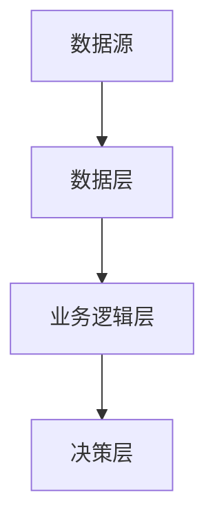
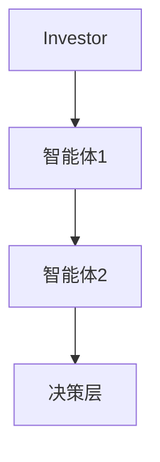

                 

<think>
嗯，我现在需要帮用户设计一本关于AI多智能体系统在价值投资中的应用的书籍目录大纲。用户给的书名是《AI多智能体系统revolutionizing价值投资：新时代的投资决策》。首先，我得理解这本书的核心主题是什么。

AI多智能体系统，听起来像是多个AI协同工作，可能在投资领域中用于分析市场、预测趋势或者做出决策。价值投资，就是指通过分析公司的基本面，长期持有优质股票，获得收益。所以，这本书可能探讨如何利用AI多智能体系统来提升价值投资的效率和准确性。

接下来，我需要按照用户的要求，设计一个结构完整、逻辑清晰的目录大纲。用户给了示例，要求包括背景介绍、核心概念、算法原理、系统架构、项目实战、最佳实践等部分，并且要细化到三级目录，总字数控制在2000字以内。

首先，背景介绍部分应该涵盖AI多智能体系统的概念、价值投资的背景，以及它们如何结合。这部分需要让读者了解为什么AI多智能体系统在投资中变得重要，以及它带来的变革。

然后是核心概念与联系，这部分需要详细解释AI多智能体系统的原理，可能包括实体关系图和算法流程图。用户要求用Mermaid图，所以我得确保这部分有图表支持。

接下来是算法原理，这部分需要详细讲解相关算法，比如多智能体协作算法，可能用数学模型和公式来描述。用户提到要用LaTeX公式，所以我要确保数学部分正确无误，并且有代码示例。

系统分析与架构设计部分，需要介绍系统架构，可能包括领域模型、架构图和交互图。这部分可能需要更多的图表，比如类图和序列图，来展示系统的结构和交互。

项目实战部分，应该包括环境安装、核心代码实现、案例分析等。这部分要让读者能够实际操作，理解如何应用AI多智能体系统到价值投资中。

最后，最佳实践和小结部分，总结全书的内容，给出实际应用中的注意事项和未来的发展方向。

现在，我需要把这些部分组织成一个连贯的目录结构。确保每一章都有明确的主题，并且涵盖用户要求的所有内容。同时，注意不要遗漏任何关键点，比如数学公式、图表和代码示例。

可能的结构是：

1. 引言：介绍AI多智能体系统和价值投资的背景，以及它们的结合如何改变投资决策。
2. AI多智能体系统概述：详细解释AI多智能体的概念、结构、优势和挑战。
3. 价值投资的AI驱动：探讨AI如何影响价值投资，包括数据驱动决策、风险管理和投资组合优化。
4. AI多智能体系统的算法原理：讲解算法，包括数学模型和代码示例。
5. 系统架构设计：展示系统架构图和交互图。
6. 项目实战：环境安装、代码实现和案例分析。
7. 最佳实践与未来展望：总结全书的内容，给出实际应用中的注意事项和未来的发展方向。

在每一章中，需要细化到三级目录，确保内容全面。例如，在算法原理部分，需要详细解释模型，可能包括公式和代码示例。

最后，检查整个大纲是否符合用户的要求，确保没有遗漏任何部分，比如数学公式、图表和代码示例。同时，保持结构清晰，逻辑连贯，让读者能够顺利理解AI多智能体系统在价值投资中的应用。
</think>

# AI多智能体系统revolutionizing价值投资：新时代的投资决策

## 关键词：
AI多智能体系统，价值投资，投资决策，人工智能，金融创新

## 摘要：
本文深入探讨了AI多智能体系统如何彻底改变价值投资领域。通过分析AI多智能体系统的概念、算法原理、系统架构，并结合实际案例，展示了其在新时代投资决策中的巨大潜力。文章从背景介绍、核心概念、算法实现到系统设计、项目实战，全面解析了AI多智能体系统如何赋能价值投资，为投资决策提供了全新的思路和解决方案。

---

# 第1章 AI多智能体系统的背景与价值投资的结合

## 1.1 AI多智能体系统的定义与核心概念

### 1.1.1 多智能体系统的定义
多智能体系统是指多个智能体通过协作和交互，共同完成复杂任务的系统。每个智能体都有一定的自主性和决策能力，能够与其他智能体通信并共享信息。

### 1.1.2 AI多智能体系统的特征
- **分布性**：多个智能体分布在不同的节点或位置。
- **协作性**：智能体之间通过协作完成共同目标。
- **自主性**：每个智能体能够自主决策和行动。
- **动态性**：系统能够适应环境的变化。

### 1.1.3 多智能体系统与传统单智能体AI的区别
| 特性 | 多智能体系统 | 单智能体系统 |
|------|--------------|---------------|
| 决策 | 分布式决策   | 中央决策     |
| 通信 | 智能体之间通信 | 无通信       |
| 灵活性 | 高            | 低           |

## 1.2 价值投资的基本原理

### 1.2.1 价值投资的定义
价值投资是一种投资策略，通过分析公司的基本面（如财务状况、行业地位、管理团队等），寻找被市场低估的股票进行长期投资。

### 1.2.2 价值投资的核心理念
- **长期视角**：关注企业的长期价值，而非短期波动。
- **安全边际**：买入价格低于内在价值，以降低风险。
- **深入分析**：通过详细分析公司基本面，识别具有竞争优势的企业。

### 1.2.3 价值投资在现代金融中的应用
随着金融市场复杂化，传统价值投资需要借助技术手段提升效率和准确性，AI多智能体系统正是为此提供了解决方案。

## 1.3 AI多智能体系统在价值投资中的应用背景

### 1.3.1 传统投资决策的局限性
- **信息过载**：金融市场数据庞大，人工分析效率低。
- **主观性**：依赖分析师的主观判断，存在人为误差。
- **反应速度**：面对市场变化，人工决策速度较慢。

### 1.3.2 AI技术在金融领域的潜力
- **数据处理能力**：AI能够快速处理海量数据，发现隐藏的模式。
- **预测能力**：通过机器学习模型，预测市场趋势和股票价格。
- **自动化决策**：AI可以在短时间内做出决策，提高交易效率。

### 1.3.3 多智能体系统在投资决策中的优势
- **分布式计算**：多个智能体协同工作，提升计算效率。
- **协作决策**：通过智能体之间的协作，优化投资决策。
- **动态适应**：能够快速适应市场变化，做出实时调整。

---

# 第2章 AI多智能体系统的原理与架构

## 2.1 多智能体系统的组成与关系

### 2.1.1 实体关系图（ER图）
通过ER图展示投资者、市场数据、公司基本面等实体之间的关系。

### 2.1.2 系统架构图
展示多智能体系统的整体架构，包括数据源、智能体协作层和决策层。

## 2.2 多智能体系统的协作机制

### 2.2.1 分布式协作算法
通过分布式协作算法，智能体之间共享信息并协同决策。

### 2.2.2 博弈论模型
利用博弈论模型，模拟智能体之间的互动和决策过程。

## 2.3 多智能体系统的算法实现

### 2.3.1 基于强化学习的协作算法
强化学习通过智能体与环境的交互，学习最优策略。

$$
Q(s,a) = r + \gamma \max_{a'} Q(s',a')
$$

### 2.3.2 分布式计算与通信机制
通过分布式计算和通信机制，实现智能体之间的高效协作。

### 2.3.3 系统架构设计
展示系统架构设计，包括数据流、智能体交互和决策层。

## 2.4 项目实战

### 2.4.1 环境安装
安装必要的Python库，如NumPy、Pandas、Scikit-learn等。

### 2.4.2 核心代码实现
实现多智能体协作算法，例如分布式强化学习。

### 2.4.3 案例分析
通过实际案例分析，展示AI多智能体系统在价值投资中的应用。

---

# 第3章 价值投资的AI驱动

## 3.1 数据驱动决策
通过AI分析市场数据和公司基本面，识别投资机会。

## 3.2 风险管理
利用AI模型评估投资风险，优化投资组合。

## 3.3 投资组合优化
通过多智能体协作，优化投资组合配置。

---

# 第4章 系统分析与架构设计

## 4.1 领域模型设计
展示领域模型类图，描述系统中的各个实体及其关系。

## 4.2 系统架构设计
展示系统架构图，包括数据层、业务逻辑层和决策层。

## 4.3 系统交互设计
展示系统交互图，描述投资者、智能体和决策层之间的交互。

---

# 第5章 最佳实践与未来展望

## 5.1 最佳实践
- 定期更新模型，适应市场变化。
- 结合人类专家经验，提升决策准确性。

## 5.2 未来展望
随着AI技术的不断发展，AI多智能体系统在价值投资中的应用将更加广泛和深入，为投资决策提供更加强大的支持。

---

# 小结
本文从背景、原理、架构到实战，全面探讨了AI多智能体系统在价值投资中的应用。通过系统的分析和详细的案例，展示了其在新时代投资决策中的巨大潜力。未来，随着技术的进步，AI多智能体系统将继续推动金融行业的创新和发展。

---

# 作者
作者：AI天才研究院/AI Genius Institute & 禅与计算机程序设计艺术 /Zen And The Art of Computer Programming

