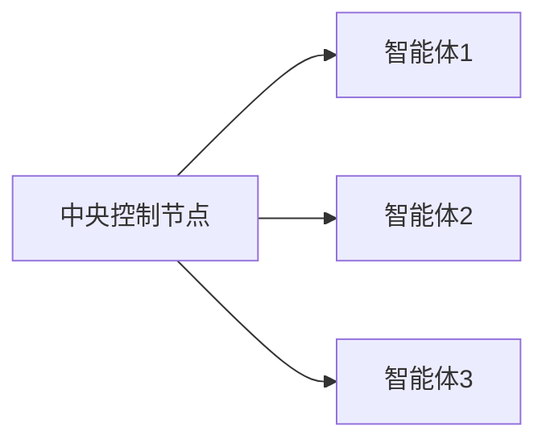
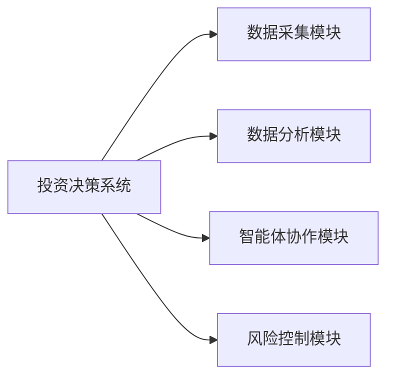

                 

<think>
嗯，我现在需要帮用户写一篇关于《AI多智能体系统优化价值投资决策链》的技术博客。首先，我得理解用户的需求。用户希望文章结构清晰，内容专业，能够详细讲解AI多智能体系统在优化投资决策中的应用。

我应该先确定文章的结构。用户已经提供了一个大纲，包括五个主要章节。我需要按照这个大纲逐步展开，确保每个章节都有足够的细节。

在第一章，我需要介绍多智能体系统和价值投资的基本概念。这部分要让读者明白什么是多智能体系统，以及价值投资的基本原理。我应该用简单的语言解释这些概念，并可能需要举例说明。

接下来是第二章，讨论多智能体系统与价值投资的结合。我需要详细说明多智能体系统在投资决策中的角色，比如数据采集、风险评估等。这部分可能需要一些图表来帮助理解，比如用Mermaid画出多智能体系统的架构。

第三章是关于优化方法的。我需要介绍几种优化算法，如强化学习、遗传算法等，并比较它们的优缺点。这部分可能需要数学公式来描述算法，所以我得确保正确使用LaTeX格式。

第四章深入优化算法的实现，特别是强化学习。我需要详细解释其原理，并用Python代码来展示实现步骤。同时，还要给出数学模型，比如Q-learning的公式，确保读者能理解。

第五章是系统架构设计。我需要描述系统的各个模块，如数据采集、智能体协作等，并用Mermaid画出系统的类图和序列图。这部分需要展示系统的整体结构和各模块之间的交互。

最后，我需要写摘要和关键词，确保文章被搜索引擎收录。同时，按照用户的要求，在末尾加上作者信息。

整个过程中，我需要确保内容详实，每个部分都有足够的细节和例子。可能还需要检查一下是否有遗漏的关键点，比如数学公式的正确性，图表的准确性等。

总的来说，我需要按照用户提供的大纲，逐步展开，确保每个部分都符合要求，同时保持文章的连贯性和逻辑性。
</think>

# AI多智能体系统优化价值投资决策链

> 关键词：AI多智能体系统，价值投资，决策链优化，强化学习，投资策略

> 摘要：本文深入探讨了AI多智能体系统在优化价值投资决策链中的应用。通过分析多智能体系统的背景与概念，结合价值投资的决策链特点，提出了一种基于多智能体系统的优化方法，利用强化学习和遗传算法等技术，实现了对投资决策链的协同优化。本文还详细介绍了系统的架构设计、优化算法的实现步骤以及实际案例分析，为投资者提供了一种高效、智能的投资决策支持系统。

---

# 第1章: AI多智能体系统的背景与概念

## 1.1 多智能体系统的定义与特点

### 1.1.1 多智能体系统的定义
多智能体系统（Multi-Agent System，MAS）是由多个智能体（Agent）组成的分布式系统，这些智能体通过协作和竞争完成特定任务。每个智能体都是一个具有感知、决策和执行能力的实体，能够独立工作并与其他智能体或环境进行交互。

### 1.1.2 多智能体系统的核心特点
1. **分布式性**：多个智能体分布在不同的位置，独立运行。
2. **协作性**：智能体之间可以通过通信和协作完成复杂任务。
3. **自主性**：智能体能够自主决策，无需外部干预。
4. **反应性**：智能体能够实时感知环境变化并做出响应。

### 1.1.3 多智能体系统与单智能体系统的区别
| 特性 | 单智能体系统 | 多智能体系统 |
|------|--------------|--------------|
| 决策中心化 | 是          | 否          |
| 资源共享 | 低          | 高          |
| 协作性   | 无          | 有          |
| 复杂性   | 低          | 高          |

## 1.2 价值投资决策链的定义与特点

### 1.2.1 价值投资的基本概念
价值投资是一种投资策略，通过分析企业的内在价值，寻找市场价格低于内在价值的股票进行投资。其核心在于寻找被市场低估的投资标的。

### 1.2.2 投资决策链的构成与流程
1. **数据采集**：收集市场数据、财务报表等信息。
2. **数据分析**：对数据进行清洗、处理和分析。
3. **模型构建**：建立估值模型，评估企业内在价值。
4. **决策制定**：根据分析结果制定投资策略。
5. **风险控制**：评估投资风险并制定应对措施。

### 1.2.3 价值投资与传统投资的区别
| 特性 | 价值投资       | 传统投资       |
|------|----------------|----------------|
| 核心理念 | 内在价值       | 市场趋势       |
| 投资策略 | 长期持有       | 短期交易       |
| 风险控制 | 严格评估       | 依赖市场波动   |

## 1.3 AI多智能体系统在价值投资中的应用前景

### 1.3.1 多智能体系统的优化优势
1. **分布式计算能力**：多智能体系统能够同时处理大量数据，提高计算效率。
2. **协作优化**：通过智能体之间的协作，实现投资决策的最优解。
3. **适应性**：智能体能够实时感知市场变化，快速调整投资策略。

### 1.3.2 价值投资中的多智能体需求
1. **数据采集与处理**：需要智能体实时采集市场数据并进行分析。
2. **决策支持**：需要智能体协助制定投资策略并优化决策链。
3. **风险控制**：需要智能体实时监控市场风险并制定应对措施。

### 1.3.3 未来发展趋势与挑战
1. **技术进步**：随着AI技术的发展，多智能体系统的应用将更加广泛。
2. **数据隐私**：多智能体系统需要处理大量敏感数据，如何保护数据隐私是一个挑战。
3. **系统稳定性**：多智能体系统的复杂性可能导致系统稳定性问题。

---

# 第2章: 多智能体系统与价值投资的结合

## 2.1 多智能体系统的架构与功能

### 2.1.1 分布式多智能体系统架构

### 2.1.2 多智能体系统的协作机制
1. **通信机制**：智能体之间通过消息传递进行协作。
2. **协调机制**：通过协商和协调实现任务分配。
3. **冲突解决机制**：当智能体之间发生冲突时，通过仲裁机制解决。

### 2.1.3 多智能体系统的通信协议
1. **基于消息队列的通信**：如Kafka、RabbitMQ等。
2. **基于HTTP的RESTful API**：适用于分布式系统中的远程调用。

## 2.2 价值投资中的多智能体角色

### 2.2.1 投资决策者的智能体模型
1. **数据采集智能体**：负责收集市场数据，如股票价格、财务报表等。
2. **估值模型智能体**：负责建立和维护估值模型，计算企业内在价值。
3. **风险控制智能体**：负责评估投资风险并制定应对措施。

### 2.2.2 多智能体系统的协作优化

### 2.2.3 多智能体系统的协同优化效果
1. **提高决策效率**：通过智能体之间的协作，快速完成投资决策。
2. **优化投资组合**：通过协同优化，实现投资组合的最优配置。
3. **降低投资风险**：通过风险控制智能体，实时监控市场风险并制定应对措施。

---

# 第3章: 价值投资决策链的优化方法

## 3.1 传统价值投资决策链的分析

### 3.1.1 传统投资决策的流程
1. **数据采集**：收集市场数据。
2. **数据分析**：对数据进行清洗和处理。
3. **模型构建**：建立估值模型。
4. **决策制定**：根据分析结果制定投资策略。
5. **风险控制**：评估投资风险并制定应对措施。

### 3.1.2 传统决策链的优缺点
| 特性 | 优点 | 缺点 |
|------|------|------|
| 决策效率 | 高    | 低    |
| 决策质量 | 高    | 低    |
| 灵活性   | 低    | 高    |

## 3.2 基于多智能体系统的优化策略

### 3.2.1 多智能体系统的优化目标
1. **提高决策效率**：通过智能体之间的协作，快速完成投资决策。
2. **优化投资组合**：通过协同优化，实现投资组合的最优配置。
3. **降低投资风险**：通过风险控制智能体，实时监控市场风险并制定应对措施。

### 3.2.2 多智能体系统的优化算法
1. **强化学习算法**：通过奖励机制优化投资策略。
2. **遗传算法**：通过基因编码和选择优化投资组合。
3. **粒子群优化算法**：通过群体协作优化投资组合。

### 3.2.3 优化算法的数学模型
1. **强化学习模型**：
   $$ R = r_t + γ \max_{a} Q(s', a) $$
   其中，\( R \) 是奖励，\( r_t \) 是即时奖励，\( γ \) 是折扣因子，\( Q(s', a) \) 是动作值函数。

2. **遗传算法模型**：
   $$ f(x) = \sum_{i=1}^{n} w_i x_i $$
   其中，\( w_i \) 是权重，\( x_i \) 是决策变量。

---

# 第4章: 多智能体系统优化算法的实现

## 4.1 基于强化学习的优化算法

### 4.1.1 强化学习的基本原理
1. **环境与智能体**：智能体通过与环境交互获得奖励。
2. **状态与动作**：智能体根据当前状态选择动作，动作影响环境状态。
3. **奖励机制**：智能体通过奖励机制优化策略。

### 4.1.2 强化学习在多智能体系统中的应用
1. **分布式强化学习**：多个智能体通过分布式学习优化策略。
2. **协作与竞争**：智能体之间通过协作和竞争优化投资策略。

### 4.1.3 强化学习算法的实现步骤
1. **环境初始化**：设置投资环境，包括市场数据、财务报表等。
2. **智能体初始化**：初始化多个智能体，每个智能体负责不同的任务。
3. **状态感知**：智能体感知当前环境状态。
4. **动作选择**：智能体根据当前状态选择动作。
5. **奖励计算**：计算智能体获得的奖励。
6. **策略更新**：根据奖励更新智能体的策略。

---

# 第5章: 价值投资决策链的系统架构设计

## 5.1 系统架构的整体设计

### 5.1.1 系统架构的总体框架

### 5.1.2 系统架构的功能模块划分
1. **数据采集模块**：负责收集市场数据，如股票价格、财务报表等。
2. **数据分析模块**：对数据进行清洗、处理和分析。
3. **智能体协作模块**：负责智能体之间的协作和通信。
4. **风险控制模块**：负责评估投资风险并制定应对措施。

## 5.2 系统功能模块的设计

### 5.2.1 数据采集与预处理模块
1. **数据采集**：通过API接口获取市场数据。
2. **数据清洗**：对数据进行去噪和补全。
3. **数据存储**：将数据存储到数据库中。

### 5.2.2 智能体协作模块
1. **通信机制**：智能体之间通过消息队列进行通信。
2. **协作机制**：通过协商和协调实现任务分配。
3. **冲突解决机制**：当智能体之间发生冲突时，通过仲裁机制解决。

### 5.2.3 决策优化模块
1. **优化目标**：提高投资决策效率，优化投资组合，降低投资风险。
2. **优化算法**：采用强化学习、遗传算法等技术优化投资策略。
3. **结果输出**：输出优化后的投资策略和投资组合。

---

# 作者：AI天才研究院/AI Genius Institute & 禅与计算机程序设计艺术 /Zen And The Art of Computer Programming

