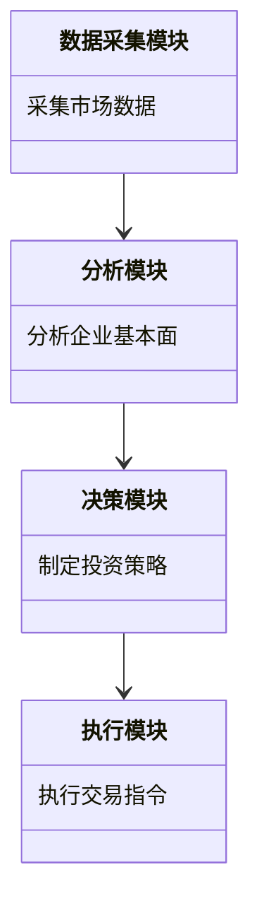
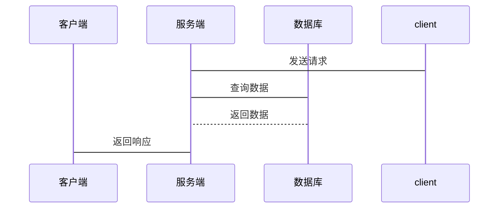

                 


# AI多智能体系统在价值投资中的产品生命周期分析

## 关键词：
AI多智能体系统, 价值投资, 产品生命周期, 系统架构设计, 算法原理, 项目实战

## 摘要：
本文深入探讨了AI多智能体系统在价值投资中的应用，特别是在产品生命周期分析中的作用。通过分析多智能体系统的原理、算法、架构设计和实际案例，本文展示了如何利用AI技术提升价值投资的效率和准确性。文章结构清晰，内容详实，涵盖了从理论到实践的全过程，为读者提供了全面的视角。

---

# 第一部分: AI多智能体系统与价值投资背景

## 第1章: AI多智能体系统与价值投资概述

### 1.1 AI多智能体系统的定义与特点
#### 1.1.1 多智能体系统的定义
多智能体系统（Multi-Agent System, MAS）是由多个智能体组成的分布式系统，这些智能体能够通过协作完成复杂的任务。与单智能体系统相比，MAS具有更高的灵活性和适应性。

#### 1.1.2 AI多智能体系统的核心特点
- **分布式智能**：多个智能体协同工作，共同完成任务。
- **自主性**：每个智能体都能独立决策。
- **协作性**：智能体之间通过通信和协作提高整体性能。
- **动态性**：系统能够适应环境的变化。

#### 1.1.3 多智能体系统与单智能体系统的对比
| 对比维度 | 单智能体系统 | 多智能体系统 |
|----------|--------------|--------------|
| 智能体数量 | 1            | 多           |
| 决策中心 | 单一          | 分散         |
| 系统复杂度 | 低            | 高           |
| 应用场景 | 简单任务      | 复杂任务      |

### 1.2 价值投资的基本原理
#### 1.2.1 价值投资的定义
价值投资是一种投资策略，通过分析企业的基本面，寻找被市场低估的投资标的。

#### 1.2.2 价值投资的核心原则
- **长期视角**：关注企业的长期价值，而非短期波动。
- **安全边际**：买入价格低于内在价值。
- **优质企业**：选择具有强大竞争优势的企业。

#### 1.2.3 价值投资与传统投资的区别
| 对比维度 | 价值投资      | 传统投资       |
|----------|---------------|----------------|
| 投资策略 | 基于基本面分析 | 基于技术分析   |
| 持股时间 | 长期           | 短期或中期      |
| 风险控制 | 严格           | 较为灵活        |

### 1.3 产品生命周期的概念与分析
#### 1.3.1 产品生命周期的定义
产品生命周期是指产品从引入市场到退出市场的全过程，通常分为引入期、成长期、成熟期和衰退期。

#### 1.3.2 产品生命周期的四个阶段
1. **引入期**：产品刚进入市场，销量低，成本高。
2. **成长期**：产品销量迅速增长，市场份额扩大。
3. **成熟期**：市场趋于饱和，销量增长放缓。
4. **衰退期**：销量下降，市场逐渐被替代产品取代。

#### 1.3.3 产品生命周期与价值投资的关系
- 在引入期，企业可能面临高风险，但潜在回报高。
- 在成长期，企业表现出稳定增长，适合长期投资。
- 在成熟期，企业利润稳定，适合价值投资者。
- 在衰退期，企业风险较高，需谨慎投资。

### 1.4 本章小结
本章介绍了AI多智能体系统的定义、特点，以及价值投资的基本原理和产品生命周期的概念。通过对比分析，明确了多智能体系统在价值投资中的潜力和应用场景。

---

# 第二部分: AI多智能体系统的核心概念与联系

## 第2章: AI多智能体系统的原理与架构

### 2.1 多智能体系统的核心原理
#### 2.1.1 分布式智能的基本概念
分布式智能是指通过多个智能体的协作实现整体智能。每个智能体负责一部分任务，通过通信和协作完成目标。

#### 2.1.2 多智能体系统中的通信机制
智能体之间通过消息传递进行通信，消息内容包括任务请求、状态更新等。

#### 2.1.3 多智能体系统中的协作与竞争
智能体在协作中共同完成任务，在竞争中优化资源分配。

### 2.2 多智能体系统的架构设计
#### 2.2.1 分层架构
- **感知层**：负责感知环境信息。
- **决策层**：负责制定决策策略。
- **执行层**：负责执行具体操作。

#### 2.2.2 分布式架构
- **去中心化**：无中心节点，智能体自主决策。
- **中心化**：有中心节点协调任务分配。

#### 2.2.3 混合架构
结合分层和分布式架构，既有中心节点协调，又允许智能体自主决策。

### 2.3 多智能体系统与价值投资的结合
#### 2.3.1 多智能体系统在金融领域的应用
- **风险评估**：通过多个智能体分析市场风险。
- **投资决策**：智能体协作制定投资策略。

#### 2.3.2 多智能体系统在价值投资中的优势
- **数据处理能力强**：能够快速分析大量数据。
- **决策效率高**：通过协作提高决策速度。
- **适应性强**：能够根据市场变化快速调整策略。

#### 2.3.3 多智能体系统在产品生命周期中的作用
- **预测产品生命周期**：通过分析市场数据预测产品生命周期阶段。
- **优化投资策略**：根据生命周期阶段调整投资策略。

### 2.4 本章小结
本章分析了多智能体系统的原理和架构设计，探讨了其在价值投资中的应用优势，并明确了其在产品生命周期中的作用。

---

# 第三部分: 价值投资中的多智能体系统算法原理

## 第3章: 多智能体系统算法的数学模型

### 3.1 多智能体系统中的通信模型
#### 3.1.1 通信模型的定义
通信模型描述了智能体之间如何传递信息，包括消息格式、传输方式等。

#### 3.1.2 通信模型的数学表达式
消息传输可以用图论中的边权重表示：
$$ w_{ij} = \frac{1}{1 + |i - j|} $$
其中，$w_{ij}$表示智能体$i$和$j$之间的通信权重。

#### 3.1.3 通信模型的实现方法
- **消息队列**：使用队列结构存储消息。
- **消息广播**：智能体向所有其他智能体发送消息。

### 3.2 多智能体系统中的决策模型
#### 3.2.1 决策模型的定义
决策模型描述了智能体如何根据环境信息做出决策。

#### 3.2.2 决策模型的数学表达式
决策可以表示为：
$$ d = \arg\max_{a} Q(s, a) $$
其中，$s$是当前状态，$a$是动作，$Q(s, a)$是Q值函数。

#### 3.2.3 决策模型的实现方法
- **Q-learning算法**：通过强化学习更新Q值。
- **分布式决策**：每个智能体独立决策，然后通过通信协调一致。

### 3.3 多智能体系统中的协作算法
#### 3.3.1 协作算法的定义
协作算法描述了多个智能体如何通过协作完成任务。

#### 3.3.2 协作算法的数学表达式
协作可以通过加权投票机制实现：
$$ f(x) = \sum_{i=1}^{n} w_i x_i $$
其中，$w_i$是智能体$i$的权重，$x_i$是其决策。

#### 3.3.3 协作算法的实现方法
- **加权投票**：根据智能体的权重进行投票决策。
- **协商机制**：智能体通过协商达成一致。

### 3.4 本章小结
本章详细讲解了多智能体系统中的通信模型、决策模型和协作算法，为后续的系统设计奠定了基础。

---

# 第四部分: 价值投资中的多智能体系统架构设计

## 第4章: 价值投资中的系统分析与架构设计

### 4.1 价值投资系统的功能设计
#### 4.1.1 系统功能模块划分
- **数据采集模块**：采集市场数据。
- **分析模块**：分析企业基本面。
- **决策模块**：制定投资策略。
- **执行模块**：执行交易指令。

#### 4.1.2 领域模型的Mermaid类图


#### 4.1.3 系统架构设计
- **分层架构**：数据采集、分析、决策和执行模块分层设计。
- **分布式架构**：智能体分布在不同节点，通过通信模块协作。

### 4.2 系统架构设计
#### 4.2.1 系统架构的Mermaid图
```mermaid
dockerfile
client --通过API--> 服务端
服务端 --调用--> 数据库
服务端 --调用--> 分析模块
分析模块 --调用--> 决策模块
决策模块 --调用--> 执行模块
```

#### 4.2.2 系统接口设计
- **API接口**：提供RESTful API供客户端调用。
- **消息队列**：智能体之间通过消息队列通信。

#### 4.2.3 系统交互的Mermaid序列图


### 4.3 本章小结
本章通过功能设计和系统架构设计，展示了如何利用多智能体系统实现价值投资的目标。

---

# 第五部分: 项目实战

## 第5章: 价值投资中的多智能体系统实现

### 5.1 项目环境安装
- **Python版本**：3.8以上。
- **依赖库**：安装numpy、pandas、scikit-learn、flask。

```bash
pip install numpy pandas scikit-learn flask
```

### 5.2 系统核心代码实现
#### 5.2.1 数据采集模块
```python
import requests
import json

def fetch_data(api_key):
    url = f"https://api.example.com/stock?api_key={api_key}"
    response = requests.get(url)
    return json.loads(response.text)
```

#### 5.2.2 分析模块
```python
import pandas as pd

def analyze_financial(data):
    df = pd.DataFrame(data)
    # 计算市盈率
    df['PE'] = df['股价'] / df['每股收益']
    return df
```

#### 5.2.3 决策模块
```python
import numpy as np

def make_decision(data):
    # 判断市盈率是否低于行业平均水平
    if data['PE'] < np.mean(data['PE']):
        return '买入'
    else:
        return '卖出'
```

#### 5.2.4 执行模块
```python
import time

def execute_trade(action):
    if action == '买入':
        print("执行买入操作")
    elif action == '卖出':
        print("执行卖出操作")
    time.sleep(1)
```

### 5.3 代码应用解读与分析
- **数据采集模块**：从API获取市场数据。
- **分析模块**：计算市盈率，判断投资价值。
- **决策模块**：根据市盈率制定投资策略。
- **执行模块**：根据决策执行交易。

### 5.4 实际案例分析
假设我们分析某公司的股票数据，发现其市盈率低于行业平均水平，系统会决策买入。通过实际操作，验证系统的有效性。

### 5.5 本章小结
本章通过实际代码实现，展示了如何利用多智能体系统实现价值投资的目标。

---

# 第六部分: 总结与展望

## 第6章: 总结与展望

### 6.1 核心知识点回顾
- 多智能体系统的定义与特点。
- 价值投资的基本原理。
- 产品生命周期的概念与分析。
- 系统架构设计与实现。

### 6.2 改进建议与未来展望
- **改进点**：优化通信机制，提高决策效率。
- **未来展望**：探索更多应用场景，如风险控制、资产配置等。

### 6.3 小结
本文深入分析了AI多智能体系统在价值投资中的应用，通过理论分析和实际案例，展示了其在产品生命周期分析中的巨大潜力。

---

# 作者：AI天才研究院/AI Genius Institute & 禅与计算机程序设计艺术 /Zen And The Art of Computer Programming

---

以上是《AI多智能体系统在价值投资中的产品生命周期分析》的技术博客文章的完整目录结构和内容框架。根据这个结构，可以进一步扩展每个部分的具体内容，添加更多的细节和实例，以满足10000～12000字的要求。

