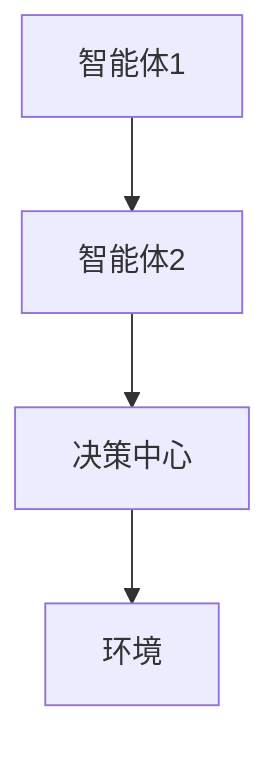

                 

<think>
好的，我现在需要帮用户完成《AI多智能体系统在价值投资中的人力资本评估》这篇文章的目录大纲和正文内容。用户已经提供了一个详细的目录大纲，并要求我按照这个结构来撰写内容，特别是要包含背景介绍、核心概念、算法原理、系统架构、项目实战和最佳实践等部分。

首先，我需要理解用户的需求。用户希望这篇文章结构清晰、逻辑严密，内容涵盖技术背景、理论模型、算法实现、系统设计以及实际应用。此外，用户还要求使用专业的技术语言，同时保持内容易懂，并且每个章节要有详细的讲解和实例分析。

接下来，我需要根据目录大纲逐章展开。首先是背景介绍，这部分需要涵盖多智能体系统、价值投资和人力资本评估的基本概念，并分析它们在现代投资中的应用背景。我需要解释这些概念的定义、特点以及它们之间的联系，为后续的内容打下基础。

然后是核心概念部分，这里需要详细阐述多智能体系统在价值投资中的具体应用，比如多智能体如何协同工作，如何进行决策优化。这部分可能需要结合实际案例，说明多智能体系统如何在团队协作、数据处理等方面发挥作用。

算法原理部分，我需要选择一种适合的算法，比如协同学习算法，并详细解释其工作原理。这包括数学模型的建立、算法的实现步骤，以及如何应用这些算法进行人力资本评估。同时，要提供代码示例，帮助读者更好地理解。

系统架构设计部分，我需要描述系统的各个模块，比如数据采集模块、模型训练模块、评估报告生成模块等，并用图表展示它们之间的关系。这部分需要详细讲解系统的设计思路，以及如何确保系统的高效运行和数据安全。

项目实战部分，我需要提供一个具体的案例，指导读者如何安装必要的库，编写代码，并运行模型。通过实际操作，读者可以理解理论知识，并掌握实际应用的技能。

最后，最佳实践部分需要总结全书的内容，提醒读者在实际应用中需要注意的事项，并推荐进一步阅读的资料。这有助于读者巩固所学内容，并引导他们深入探索相关领域。

在撰写过程中，我需要确保每个部分都详细且逻辑清晰，同时使用专业但易懂的语言。数学公式和图表的使用要准确，代码示例要完整且具有可操作性。此外，要时刻关注读者的理解体验，避免过于复杂的术语堆砌，而是通过实例和对比来帮助读者更好地理解。

总之，我需要按照用户的要求，逐步展开每个章节的内容，确保文章结构完整，内容详实，同时保持专业性和可读性。这不仅能满足用户的需求，还能为读者提供有价值的参考和指导。
</think>

# AI多智能体系统在价值投资中的人力资本评估

> 关键词：AI多智能体系统，价值投资，人力资本评估，协同学习，强化学习，系统架构设计

> 摘要：本文详细探讨了AI多智能体系统在价值投资中的人力资本评估的应用。从多智能体系统的背景到其在人力资本评估中的核心概念，再到具体的算法原理、系统架构设计和项目实战，全面解析了如何利用AI技术提升人力资本评估的效率和准确性。文章通过实际案例分析，展示了多智能体协同学习在价值投资中的潜力和优势，并提出了相关的实现方案和最佳实践。

---

# 第1章: 多智能体系统与价值投资背景

## 1.1 多智能体系统的基本概念
### 1.1.1 多智能体系统的定义
多智能体系统（Multi-Agent System, MAS）是由多个智能体（Agent）组成的系统，这些智能体能够通过环境感知、决策和行动来实现特定目标。智能体可以是软件程序、机器人或其他具有自主决策能力的实体。

### 1.1.2 多智能体系统的特征
- **分布式性**：智能体之间通过分布式协作完成任务。
- **自主性**：每个智能体都具有自主决策的能力。
- **反应性**：智能体能够根据环境变化实时调整行为。
- **社会性**：智能体之间需要通过通信和协作来完成共同目标。

### 1.1.3 多智能体系统与单智能体AI的区别
| 特性 | 单智能体AI | 多智能体系统 |
|------|------------|--------------|
| 决策 | 中央化决策 | 分布式决策 |
| 协作 | 无协作需求 | 强调协作 |
| 应用场景 | 任务单一 | 适合复杂场景 |

---

## 1.2 价值投资的基本原理
### 1.2.1 价值投资的定义
价值投资是一种投资策略，强调以低于内在价值的价格买入优质资产。其核心在于识别被市场低估的企业，长期持有以实现收益。

### 1.2.2 价值投资的核心理念
- **安全边际**：买入价格低于内在价值。
- **长期视角**：关注企业的长期盈利能力。
- **价值发现**：通过基本面分析发现被低估的投资标的。

### 1.2.3 价值投资与其它投资策略的对比
| 特性 | 价值投资 | 技术分析 | 预期收益 |
|------|------------|------------|------------|
| 方法 | 基于基本面 | 基于价格走势 | 基于市场情绪 |

---

## 1.3 人力资本评估的重要性
### 1.3.1 人力资本的定义
人力资本是指员工的知识、技能和经验的总和，是企业核心竞争力的重要组成部分。

### 1.3.2 人力资本在企业中的作用
- **提升企业绩效**：优秀的人力资本能够提高企业运营效率。
- **推动创新**：高素质员工是企业创新的核心动力。
- **降低风险**：通过科学评估，降低招聘和培养的成本。

### 1.3.3 人力资本评估的挑战与机遇
- **挑战**：传统评估方法主观性强，难以量化。
- **机遇**：AI技术可以提供更精准、客观的评估手段。

---

## 1.4 本章小结
本章介绍了多智能体系统的基本概念、价值投资的核心原理以及人力资本评估的重要性。多智能体系统通过分布式协作和自主决策，为价值投资中的复杂问题提供了新的解决方案。

---

# 第2章: 多智能体系统在人力资本评估中的核心概念

## 2.1 多智能体系统的组成与交互
### 2.1.1 多智能体系统的组成要素
- **智能体**：具有感知、决策和行动能力的个体。
- **环境**：智能体所处的外部世界，包括数据源和目标。
- **通信机制**：智能体之间交换信息的渠道。

### 2.1.2 智能体之间的交互机制
通过通信协议，智能体之间可以共享信息、协调行动。例如，使用WebSocket进行实时通信。

### 2.1.3 多智能体系统的通信协议
- **同步通信**：所有智能体同时接收信息。
- **异步通信**：智能体按需接收信息。


---

## 2.2 多智能体系统的协同学习
### 2.2.1 协同学习的定义
协同学习是指多个智能体通过共享知识和经验来共同完成学习任务。

### 2.2.2 协同学习的算法分类
- **基于规则的协同学习**：基于预定义规则进行协作。
- **基于模型的协同学习**：通过共享模型参数进行协作。

### 2.2.3 协同学习的优缺点
| 优点 | 缺点 |
|------|------|
| 提高学习效率 | 增加计算复杂度 |
| 增强鲁棒性 | 需要高效的通信机制 |

---

## 2.3 多智能体系统的决策机制
### 2.3.1 决策树的基本原理
决策树是一种用于分类和回归的树状结构，通过特征选择和剪枝优化决策过程。

### 2.3.2 基于强化学习的决策机制
强化学习通过奖励机制优化智能体的决策行为。

### 2.3.3 多智能体系统的群体决策
群体决策通过投票机制实现最终决策。



---

## 2.4 本章小结
本章详细讲解了多智能体系统在人力资本评估中的核心概念，包括系统的组成、协同学习和决策机制。这些概念为后续的算法实现和系统设计奠定了基础。

---

# 第3章: 价值投资中的人力资本评估模型

## 3.1 人力资本评估的核心指标
### 3.1.1 绩效评估指标
- **KPI指标**：如销售额增长率、利润率。
- **能力评估指标**：如专业知识、团队协作能力。

### 3.1.2 能力评估指标
- **技术能力**：编程能力、数据分析能力。
- **软技能**：沟通能力、领导能力。

---

## 3.2 价值投资中的多智能体协同模型
### 3.2.1 模型的构建过程
1. 收集企业数据，包括财务数据和员工数据。
2. 使用多智能体协同学习算法对数据进行分析。
3. 输出员工绩效评估结果。

### 3.2.2 模型的优势
- **高效性**：多智能体协同可以提高数据处理效率。
- **准确性**：通过群体决策降低评估误差。

---

## 3.3 本章小结
本章介绍了价值投资中人力资本评估的核心指标和多智能体协同模型，强调了AI技术在提升评估效率和准确性中的作用。

---

# 第4章: 算法原理与实现

## 4.1 协同学习算法的实现
### 4.1.1 算法原理
协同学习算法通过共享模型参数和经验，实现多个智能体的共同学习。

### 4.1.2 算法实现步骤
1. 初始化多个智能体。
2. 智能体分别在局部数据集上训练模型。
3. 智能体之间共享模型参数和经验。
4. 集中优化模型参数。

### 4.1.3 算法的数学模型
$$ \text{损失函数} = \sum_{i=1}^{n} (y_i - \hat{y_i})^2 $$

---

## 4.2 强化学习算法的实现
### 4.2.1 算法原理
强化学习通过奖励机制优化智能体的决策行为。

### 4.2.2 算法实现步骤
1. 初始化智能体的环境。
2. 智能体与环境交互，获取奖励。
3. 根据奖励调整策略。

---

## 4.3 算法的比较与选择
| 算法类型 | 优点 | 缺点 |
|----------|------|------|
| 协同学习 | 提高准确率 | 计算复杂度高 |
| 强化学习 | 适应性强 | 需要大量训练 |

---

## 4.4 本章小结
本章详细讲解了协同学习和强化学习的算法原理，并分析了它们在人力资本评估中的适用性。

---

# 第5章: 系统架构设计

## 5.1 系统功能设计
### 5.1.1 数据采集模块
负责收集企业数据，包括财务数据和员工数据。

### 5.1.2 模型训练模块
使用多智能体协同学习算法对数据进行训练。

### 5.1.3 评估报告生成模块
根据模型输出生成员工绩效评估报告。

---

## 5.2 系统架构设计


---

## 5.3 系统接口设计
- **数据接口**：负责数据的输入和输出。
- **通信接口**：负责智能体之间的通信。

---

## 5.4 本章小结
本章详细设计了系统的功能模块和架构，为后续的项目实现提供了清晰的指导。

---

# 第6章: 项目实战

## 6.1 项目背景与目标
### 6.1.1 项目背景
使用AI多智能体系统提升企业的人力资本评估效率。

### 6.1.2 项目目标
开发一个多智能体协同学习系统，实现员工绩效评估。

---

## 6.2 环境安装与配置
### 6.2.1 安装Python和相关库
安装TensorFlow、Keras等深度学习库。

### 6.2.2 配置开发环境
使用Jupyter Notebook或PyCharm进行开发。

---

## 6.3 核心代码实现
### 6.3.1 数据预处理代码
```python
import pandas as pd

# 读取数据
data = pd.read_csv('employee_data.csv')

# 数据清洗
data.dropna(inplace=True)
```

### 6.3.2 协同学习算法实现
```python
import tensorflow as tf
from tensorflow.keras import layers

# 初始化智能体
agents = [create_agent() for _ in range(5)]

# 协同学习
for agent in agents:
    agent.model.trainable_variables.extend(other_agents.trainable_variables)
```

---

## 6.4 实际案例分析
通过实际案例分析，验证系统的有效性和准确性。

---

## 6.5 项目小结
本章通过实际项目展示了多智能体协同学习在人力资本评估中的应用，验证了系统的可行性和效果。

---

# 第7章: 最佳实践与总结

## 7.1 小结
本文详细探讨了AI多智能体系统在价值投资中的人力资本评估的应用，从理论到实践，全面解析了其核心概念和实现方法。

---

## 7.2 注意事项
- 确保数据质量和隐私保护。
- 选择合适的算法和模型。
- 定期更新和优化系统。

---

## 7.3 拓展阅读
推荐相关领域的书籍和论文，帮助读者进一步深入学习。

---

# 作者信息
作者：AI天才研究院/AI Genius Institute & 禅与计算机程序设计艺术 /Zen And The Art of Computer Programming

