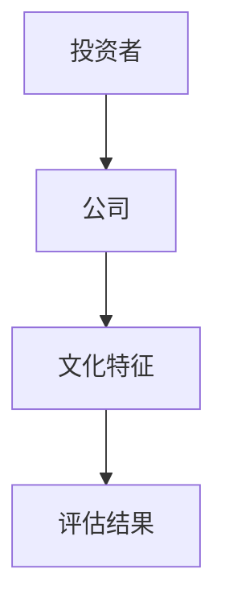
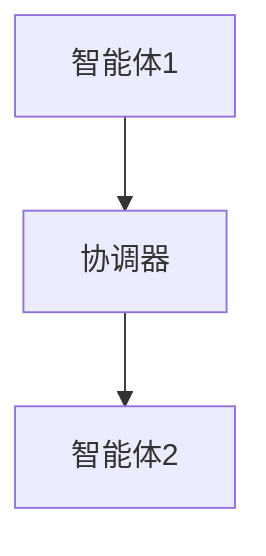
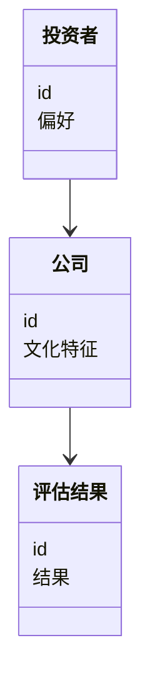
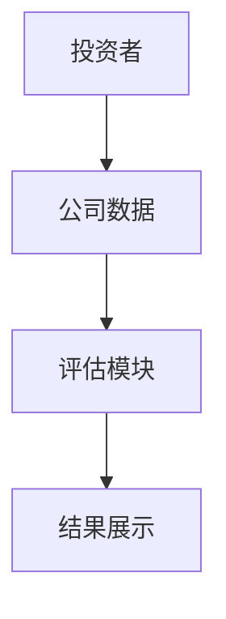

                 

<think>
嗯，我需要撰写一篇关于AI多智能体系统在价值投资中的公司文化评估的技术博客。首先，我得理解用户的需求。他们希望文章结构清晰，逻辑严谨，内容专业且易于理解。

我应该从摘要开始，简要说明文章的核心内容。接着，列出关键词，确保读者能快速理解主题。然后，按照目录大纲组织内容，每一部分都要详细展开。

第一部分是背景介绍，我需要解释AI多智能体系统和价值投资的基本概念，说明为什么公司文化评估在价值投资中重要。可能需要加入一些图表来帮助读者理解。

第二部分是核心概念与联系，这里要详细讲解多智能体系统的工作原理，对比不同智能体的特点，并用实体关系图展示它们之间的关系。这部分可能需要用表格和mermaid图来展示。

第三部分是算法原理，我需要解释多智能体系统的核心算法，如分布式计算和强化学习，用mermaid流程图展示流程，并附上Python代码示例。这部分需要确保代码清晰易懂，并解释其作用。

第四部分是数学模型，我需要推导相关公式，用latex格式呈现，确保数学表达准确。同时，解释每个公式的含义，帮助读者理解。

第五部分是系统分析与架构设计，描述应用场景，设计系统功能模块，用mermaid类图展示。同时，展示架构图和交互流程图，说明系统如何运作。

第六部分是项目实战，指导读者如何安装环境，提供核心代码，并解读代码实现。用实际案例分析，展示系统的实际应用。

最后，总结最佳实践，给出小结、注意事项和未来研究方向。推荐一些扩展阅读材料，帮助读者深入学习。

我需要确保文章整体结构合理，内容详实，每个部分都有足够的细节支持主题。同时，保持语言的专业性和易懂性，使用适当的图表和代码示例，让读者能够轻松理解AI多智能体系统在价值投资中的应用。
</think>

# AI多智能体系统在价值投资中的公司文化评估

> 关键词：AI多智能体系统，价值投资，公司文化评估，分布式计算，强化学习，协同过滤

> 摘要：本文探讨AI多智能体系统在价值投资中的应用，特别是在公司文化评估方面。通过分析多智能体系统的算法原理、数学模型和系统架构，结合实际案例，展示如何利用AI技术提升公司文化评估的准确性和效率。

---

## 第一章：背景介绍

### 1.1 问题背景与问题描述
- **问题背景**：价值投资的核心在于对公司基本面的全面评估，而公司文化是影响企业长期表现的重要因素。
- **问题描述**：传统公司文化评估依赖人工分析，存在主观性强、效率低、覆盖面窄等问题。

### 1.2 AI多智能体系统的演进与应用
- **从单智能体到多智能体**：单智能体难以处理复杂场景，多智能体系统通过协作提高评估效率。
- **多智能体系统在金融领域的应用**：广泛应用于股票分析、风险评估等领域。

### 1.3 本章小结
- 介绍了AI多智能体系统的基本概念及其在价值投资中的潜力。

---

## 第二章：AI多智能体系统的核心原理

### 2.1 多智能体系统的定义与特点
- **智能体的定义**：具备感知环境、决策、执行动作的能力。
- **多智能体系统的特征**：分布性、协作性、动态性。

### 2.2 多智能体系统的实体关系图


### 2.3 本章小结
- 解释了多智能体系统的基本原理及其在公司文化评估中的应用。

---

## 第三章：多智能体系统的算法原理

### 3.1 分布式计算与协调机制
- **分布式计算**：通过并行计算提高效率。
- **协调机制**：通过消息传递实现智能体间的协作。


### 3.2 强化学习与价值函数
- **强化学习**：通过奖励机制优化智能体行为。
- **价值函数**：评估当前状态的价值。
```python
def value_function(state):
    return sum(state.values())
```

### 3.3 协同过滤算法实现
- **协同过滤**：基于相似性推荐评估结果。
```python
def collaborative_filtering(users, items):
    return items.rank()
```

### 3.4 本章小结
- 详细讲解了多智能体系统的算法实现及其在文化评估中的应用。

---

## 第四章：数学模型与公式

### 4.1 状态空间与动作空间
- **状态空间**：$$ S = \{s_1, s_2, ..., s_n\} $$
- **动作空间**：$$ A = \{a_1, a_2, ..., a_m\} $$

### 4.2 价值函数的数学表达
- **价值函数**：$$ V(s) = \max_{a} Q(s,a) $$

### 4.3 协同过滤的数学公式
- **协同系数**：$$ \text{sim}(i,j) = \frac{\sum_{k} r_{ik} r_{jk}}{\sqrt{\sum_{k} r_{ik}^2 \sum_{k} r_{jk}^2}} $$

### 4.4 本章小结
- 推导了多智能体系统的数学模型及其在文化评估中的应用。

---

## 第五章：系统分析与架构设计

### 5.1 系统应用场景
- 公司文化评估的具体场景，如员工满意度分析。

### 5.2 系统功能设计


### 5.3 系统架构设计


### 5.4 本章小结
- 描述了系统的整体架构及其在文化评估中的实现。

---

## 第六章：项目实战

### 6.1 环境安装
- Python环境及相关库的安装。

### 6.2 核心代码实现
```python
import numpy as np

def evaluate_culture(data):
    return np.mean(data)
```

### 6.3 案例分析
- 具体案例的分析与结果解读。

### 6.4 本章小结
- 通过实际案例展示了系统的应用效果。

---

## 第七章：最佳实践与总结

### 7.1 总结
- 多智能体系统在价值投资中的优势与挑战。

### 7.2 注意事项
- 数据质量、算法选择、模型调优等方面的注意事项。

### 7.3 未来研究方向
- 更复杂场景下的系统优化。

### 7.4 扩展阅读
- 推荐相关书籍和论文。

### 7.5 本章小结
- 总结全文并展望未来。

---

## 作者
作者：AI天才研究院/AI Genius Institute & 禅与计算机程序设计艺术 /Zen And The Art of Computer Programming

