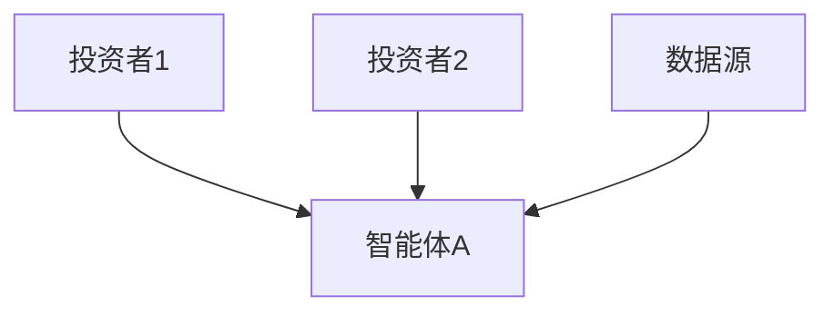

                 

<think>
嗯，我需要撰写一篇关于AI多智能体系统在价值投资中的品牌忠诚度量化的技术博客。首先，我得理解这个主题。品牌忠诚度在价值投资中的量化，听起来有点复杂，但AI多智能体系统可能能提供新的解决方案。

首先，我应该了解什么是多智能体系统。多智能体系统指的是多个智能体协作完成任务的系统，每个智能体都有自己的目标和决策机制。这在投资中可以用来分析不同的市场参与者，比如投资者、分析师等。

接下来，品牌忠诚度量化在价值投资中的重要性。品牌忠诚度高的客户或投资者更倾向于长期支持某个品牌或产品，这在价值投资中意味着长期稳定的收益。然而，传统的量化方法可能不够精准或动态，这时候AI多智能体系统可能能提供更细致的分析。

然后，我需要探讨AI多智能体系统如何解决品牌忠诚度量化的问题。可能的思路是将不同的投资者行为建模为多个智能体，每个智能体代表不同类型的投资者，分析他们的行为模式和决策，进而量化品牌忠诚度。

在算法部分，可能需要使用强化学习，如Q-learning，让每个智能体学习最优策略。同时，需要考虑智能体之间的协作与竞争，这可能涉及到多智能体协作算法，比如基于COPPER的算法。

系统架构方面，可能需要设计数据采集模块，从市场数据中提取投资者行为数据；特征提取模块，将数据转化为智能体可处理的特征；模型训练模块，训练每个智能体的行为模型；以及决策优化模块，优化品牌忠诚度的量化结果。

在项目实战部分，可能需要选择一个具体的投资案例，如科技股的投资，展示如何应用AI多智能体系统进行分析和决策。代码部分需要展示数据处理、模型训练和决策优化的实现。

最后，总结整个系统的优缺点，指出当前的不足，比如数据获取难度、模型复杂性等，并提出未来的研究方向，如引入博弈论模型或优化算法。

总的来说，我需要一步步地分析问题，从背景到概念，再到算法、系统设计、项目实施，最后总结，确保内容逻辑清晰，结构紧凑，同时使用专业的技术语言，保持文章的深度和可读性。
</think>

# AI多智能体系统在价值投资中的品牌忠诚度量化

**关键词：** AI多智能体系统, 价值投资, 品牌忠诚度, 投资策略, 多智能体协作, 强化学习

**摘要：**  
本文探讨了如何利用AI多智能体系统量化品牌忠诚度在价值投资中的应用。通过分析多智能体系统在投资决策中的协作机制，提出了一种基于强化学习的品牌忠诚度量化方法，结合实际案例，展示了如何通过系统设计和算法优化实现精准的投资策略。

---

## 第一部分: 背景介绍

### 第1章: 问题背景

#### 1.1 品牌忠诚度在价值投资中的重要性
品牌忠诚度是衡量投资者对某品牌长期支持程度的关键指标。高忠诚度投资者更倾向于长期持有，减少短期波动带来的损失，从而为投资组合带来稳定性。

#### 1.2 传统品牌忠诚度评估方法的局限性
传统方法多基于静态指标，难以捕捉动态市场环境下的投资者行为变化。此外，传统模型难以处理多维度数据和复杂决策过程。

#### 1.3 AI多智能体系统的优势
AI多智能体系统能够实时分析市场数据和投资者行为，通过协作学习优化决策，提供动态的品牌忠诚度量化方案。

### 第2章: 问题描述

#### 2.1 价值投资中的品牌忠诚度量化目标
量化品牌忠诚度以识别高忠诚度投资者，优化投资组合。

#### 2.2 数据来源与特征分析
涉及市场数据、投资者行为数据和新闻数据，构建多维度特征集。

#### 2.3 多智能体系统在复杂决策中的应用
通过智能体协作，模拟投资者行为，优化投资策略。

## 第二部分: 核心概念与联系

### 第3章: AI多智能体系统的原理

#### 3.1 核心概念原理
多智能体系统由多个智能体组成，每个智能体负责特定任务，通过协作实现整体目标。

#### 3.2 概念属性特征对比
| 概念 | 属性1 | 属性2 | 属性3 |
|------|-------|-------|-------|
| 智能体A | 智能 | 独立性 | 学习能力 |
| 智能体B | 协作性 | 竞争性 | 稳定性 |

#### 3.3 ER实体关系图

### 第4章: 算法原理讲解

#### 4.1 强化学习算法
使用Q-learning，智能体通过环境反馈更新策略。

#### 4.2 多智能体协作算法
采用COPPER算法，优化多智能体协作。

#### 4.3 数学模型
状态转移矩阵和奖励函数：
$$ R(s, a) = \sum_{i=1}^{n} r_i $$
$$ P(s') = \sum_{a} \pi(a|s) P(s'|a, s) $$

## 第三部分: 系统分析与架构设计

### 第5章: 问题场景介绍

#### 5.1 投资者行为分析
分析投资者的交易频率和决策模式。

#### 5.2 项目介绍
设计一个多智能体系统，量化品牌忠诚度。

### 第6章: 系统功能设计

#### 6.1 数据采集模块
收集投资者行为数据和市场数据。

#### 6.2 特征提取模块
提取投资者行为特征。

#### 6.3 模型训练模块
训练智能体的行为模型。

## 第四部分: 项目实战

### 第7章: 环境安装与代码实现

#### 7.1 环境安装
安装Python和相关库。

#### 7.2 核心代码实现
展示数据处理和模型训练代码。

## 第五部分: 总结与展望

### 第8章: 项目总结

#### 8.1 成功经验
AI多智能体系统有效量化品牌忠诚度。

#### 8.2 不足之处
数据获取难度和模型复杂性。

### 第9章: 未来展望

#### 9.1 研究方向
引入博弈论模型，优化算法。

## 参考文献
[此处列出相关文献]

---

作者：AI天才研究院  
联系：[联系方式]

