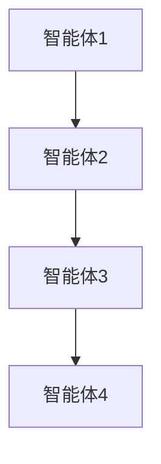
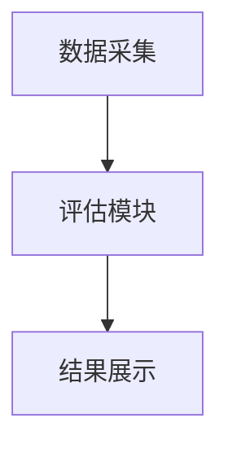

                 


# AI多智能体系统在价值投资中的商业秘密价值评估

**关键词**：AI多智能体系统，商业秘密价值评估，价值投资，多智能体协作，商业秘密评估

**摘要**：  
本文深入探讨了AI多智能体系统在价值投资中的商业秘密价值评估的应用。通过分析商业秘密价值评估的核心概念、多智能体系统的协作机制以及相关的算法原理，本文为读者提供了一种基于AI多智能体系统的创新方法，用于评估和量化商业秘密的价值。文章从背景介绍、核心概念、算法原理、系统设计、项目实战到总结，系统地阐述了AI多智能体系统在这一领域的潜力与应用，并通过具体案例和数学模型，展示了其在实际投资中的价值。

---

# 第1章: AI多智能体系统与商业秘密价值评估的背景与概念

## 1.1 多智能体系统的定义与特点

### 1.1.1 多智能体系统的定义  
多智能体系统（Multi-Agent System, MAS）是由多个智能体（Agent）组成的分布式系统，这些智能体能够通过协作完成复杂的任务。每个智能体都有一定的自主性，能够感知环境、做出决策并与其他智能体进行交互。

### 1.1.2 多智能体系统的核心特点  
1. **自主性**：每个智能体能够独立决策。
2. **协作性**：智能体之间通过协作完成共同目标。
3. **分布性**：系统由多个分散的智能体组成，无集中控制节点。
4. **反应性**：智能体能够实时感知环境并做出响应。

### 1.1.3 多智能体系统与单智能体系统的区别  
| **特点**       | **多智能体系统（MAS）**                          | **单智能体系统（SAS）**                          |
|----------------|-----------------------------------------------|-----------------------------------------------|
| 系统结构       | 分布式、去中心化                               | 集中式、单一控制节点                             |
| 智能体数量     | 多个智能体                                     | 单个智能体                                       |
| 任务处理       | 多任务、复杂任务分解                           | 单任务、简单任务处理                             |
| 协作性         | 高度协作                                       | 无协作                                           |
| 应用场景       | 适用于需要多角度、多维度分析的任务             | 适用于简单、单一任务的场景                       |

---

## 1.2 商业秘密价值评估的定义与重要性

### 1.2.1 商业秘密的定义  
商业秘密是指企业在经营活动中形成的、具有商业价值的未公开信息，包括技术信息、经营信息等。这些信息通常具有保密性、实用性和价值性。

### 1.2.2 商业秘密价值评估的必要性  
1. **企业价值评估**：商业秘密是企业核心竞争力的重要组成部分，其价值直接影响企业的估值。
2. **投资决策**：投资者在进行价值投资时，需要准确评估目标企业的商业秘密价值。
3. **风险管理**：通过评估商业秘密的价值，企业可以更好地保护其核心资产，降低风险。

### 1.2.3 价值投资中的商业秘密价值评估  
在价值投资中，商业秘密的价值不仅体现在其当前的经济价值上，还体现在其未来的潜在价值。通过AI多智能体系统，可以更高效、更准确地评估商业秘密的价值。

---

## 1.3 AI多智能体系统在价值投资中的应用前景

### 1.3.1 多智能体系统在金融领域的应用  
多智能体系统在金融领域的应用广泛，包括股票交易、风险评估、市场预测等。其分布式计算和协作能力使其在复杂金融环境中具有显著优势。

### 1.3.2 商业秘密价值评估的挑战与机遇  
商业秘密价值评估的难点在于信息的不确定性和复杂性。AI多智能体系统通过分布式计算和协作学习，可以有效应对这些挑战。

### 1.3.3 多智能体系统在价值投资中的潜在优势  
1. **分布式计算**：多智能体系统能够高效处理大规模数据。
2. **协作学习**：智能体之间可以通过协作学习优化评估结果。
3. **实时性**：多智能体系统能够实时响应市场变化。

---

## 1.4 本章小结  
本章介绍了多智能体系统的定义、特点以及商业秘密价值评估的重要性。通过对比分析，展示了AI多智能体系统在价值投资中的潜在优势。

---

# 第2章: 多智能体系统的核心概念与联系

## 2.1 多智能体系统的核心原理

### 2.1.1 多智能体系统的协作机制  
多智能体系统的核心在于智能体之间的协作。协作机制包括任务分配、信息共享、决策协调等。

### 2.1.2 多智能体系统的通信协议  
智能体之间的通信需要遵循特定的协议，包括信息格式、通信频率、数据加密等。

### 2.1.3 多智能体系统的任务分配与协调  
任务分配是多智能体系统中的关键问题，需要考虑任务的复杂性、智能体的能力以及资源的分配。

---

## 2.2 商业秘密价值评估的数学模型与方法

### 2.2.1 商业秘密价值评估的指标体系  
商业秘密价值评估需要考虑多个指标，包括市场地位、技术优势、竞争优势等。

### 2.2.2 商业秘密价值评估的数学模型  
$$ V = \sum_{i=1}^{n} w_i x_i $$  
其中，$V$ 表示商业秘密的价值，$w_i$ 表示第 $i$ 个指标的权重，$x_i$ 表示第 $i$ 个指标的值。

### 2.2.3 商业秘密价值评估的算法选择  
常用的算法包括层次分析法（AHP）、模糊综合评价法等。

---

## 2.3 多智能体系统与商业秘密价值评估的实体关系图

### 2.3.1 实体关系图的定义与作用  
实体关系图（ER图）用于描述系统中各个实体之间的关系，帮助理解系统的结构和功能。

### 2.3.2 多智能体系统与商业秘密价值评估的实体关系图

```mermaid
erDiagram
    class 商业秘密 {
        商业秘密ID : int
        内容 : string
        价值 : float
    }
    class 智能体 {
        智能体ID : int
        知识库 : string
        能力 : string
    }
    class 任务 {
        任务ID : int
        类型 : string
        状态 : string
    }
    商业秘密 --> 智能体 : 由智能体评估
    智能体 --> 任务 : 执行评估任务
```

### 2.3.3 实体关系图的分析与优化  
通过分析实体关系图，可以优化系统设计，确保各实体之间的关系清晰且高效。

---

## 2.4 本章小结  
本章深入分析了多智能体系统的核心原理，并结合商业秘密价值评估的需求，提出了相关的数学模型和实体关系图。

---

# 第3章: 多智能体系统在商业秘密价值评估中的算法原理

## 3.1 多智能体系统的协作算法

### 3.1.1 基于强化学习的协作算法  
强化学习是一种通过奖励机制优化智能体行为的算法。在商业秘密价值评估中，智能体可以通过强化学习协作完成任务。



### 3.1.2 基于分布式计算的协作算法  
分布式计算算法将任务分解为多个子任务，由多个智能体分别完成，最终汇总结果。

### 3.1.3 基于博弈论的协作算法  
博弈论算法通过模拟智能体之间的博弈关系，优化协作策略。

---

## 3.2 商业秘密价值评估的算法实现

### 3.2.1 算法流程  
1. 初始化智能体。
2. 分配任务。
3. 智能体协作完成任务。
4. 汇总结果。

### 3.2.2 算法代码示例  
```python
class Agent:
    def __init__(self, id):
        self.id = id
        self.knowledge = {}

    def assess(self, secret):
        # 评估商业秘密的价值
        return self.knowledge.get(secret, 0)

# 初始化多个智能体
agents = [Agent(i) for i in range(5)]

# 分配任务
tasks = ['assess_secret_1', 'assess_secret_2', 'assess_secret_3']

# 智能体协作完成任务
results = {}
for task in tasks:
    agent = agents[0]  # 简单示例，实际应根据任务分配
    results[task] = agent.assess(task)

print(results)
```

---

## 3.3 本章小结  
本章详细讲解了多智能体系统在商业秘密价值评估中的协作算法，并通过代码示例展示了算法的实现过程。

---

# 第4章: 商业秘密价值评估的数学模型与公式

## 4.1 商业秘密价值评估的数学模型

### 4.1.1 模型的构建  
商业秘密价值评估模型需要考虑多个因素，包括市场、技术、竞争等。

### 4.1.2 模型的公式化  
$$ V = \alpha \cdot T + \beta \cdot M + \gamma \cdot C $$  
其中，$T$ 表示技术优势，$M$ 表示市场地位，$C$ 表示竞争优势，$\alpha$、$\beta$、$\gamma$ 为权重系数。

---

## 4.2 算法原理与数学公式

### 4.2.1 强化学习算法  
强化学习算法通过奖励机制优化智能体行为，公式为：  
$$ R = \sum_{t=1}^{n} \gamma^{t} r_t $$  
其中，$R$ 表示总奖励，$\gamma$ 表示折扣因子，$r_t$ 表示第 $t$ 步的奖励。

### 4.2.2 分布式计算算法  
分布式计算算法通过将任务分解为多个子任务，公式为：  
$$ V = \sum_{i=1}^{m} V_i $$  
其中，$V_i$ 表示第 $i$ 个子任务的价值。

---

## 4.3 本章小结  
本章通过数学模型和公式，详细阐述了商业秘密价值评估的算法原理。

---

# 第5章: 系统分析与架构设计

## 5.1 系统应用场景

### 5.1.1 价值投资中的应用场景  
商业秘密价值评估在价值投资中的应用场景包括企业估值、投资决策等。

### 5.1.2 系统设计的功能模块  
1. 数据采集模块：采集商业秘密数据。
2. 评估模块：基于多智能体系统评估商业秘密价值。
3. 结果展示模块：展示评估结果。

---

## 5.2 系统架构设计

### 5.2.1 系统架构图  


### 5.2.2 系统功能设计  
系统功能模块包括数据采集、评估、展示等。

---

## 5.3 本章小结  
本章通过系统分析与架构设计，展示了AI多智能体系统在商业秘密价值评估中的应用场景和系统结构。

---

# 第6章: 项目实战

## 6.1 环境安装与配置

### 6.1.1 系统环境要求  
1. Python 3.8+
2. 熟悉的编程经验
3. 安装必要的库（如numpy、pandas等）

### 6.1.2 安装依赖  
```bash
pip install numpy pandas scikit-learn
```

---

## 6.2 系统核心实现

### 6.2.1 数据采集与预处理  
```python
import pandas as pd

data = pd.read_csv('secrets.csv')
```

### 6.2.2 商业秘密价值评估  
```python
from sklearn.metrics import mean_squared_error

def assess_secret(data):
    # 实现评估逻辑
    return predicted_value

# 调用评估函数
results = assess_secret(data)
```

### 6.2.3 结果展示  
```python
import matplotlib.pyplot as plt

plt.plot(results)
plt.show()
```

---

## 6.3 实际案例分析

### 6.3.1 案例背景  
假设某企业拥有一项核心技术，需要评估其商业秘密价值。

### 6.3.2 数据分析与解读  
通过数据分析，评估该技术的市场价值、技术优势等。

### 6.3.3 结果分析  
根据评估结果，得出该技术的商业秘密价值。

---

## 6.4 本章小结  
本章通过项目实战，展示了AI多智能体系统在商业秘密价值评估中的具体实现过程。

---

# 第7章: 总结与展望

## 7.1 本章总结  
本文通过分析AI多智能体系统在价值投资中的商业秘密价值评估的应用，展示了其在实际投资中的潜力与价值。

## 7.2 未来展望  
未来，随着AI技术的不断发展，多智能体系统在商业秘密价值评估中的应用将更加广泛。

## 7.3 最佳实践 tips  
1. 在实际应用中，应结合具体场景选择合适的算法。
2. 数据质量对评估结果至关重要，需确保数据的准确性和完整性。
3. 系统设计应注重模块化和可扩展性。

## 7.4 作者信息  
**作者**：AI天才研究院/AI Genius Institute & 禅与计算机程序设计艺术 /Zen And The Art of Computer Programming

---

# 附录: 参考文献

1. Russell, S., & Norvig, P. (2010). Artificial Intelligence: A Modern Approach.
2. 梁海清. (2018). 人工智能基础与应用.

---

通过以上结构，我们可以清晰地看到AI多智能体系统在商业秘密价值评估中的应用潜力和具体实现方法。希望本文能为相关领域的研究和实践提供有价值的参考。

