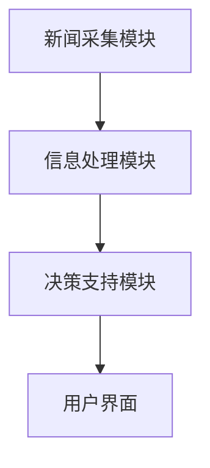
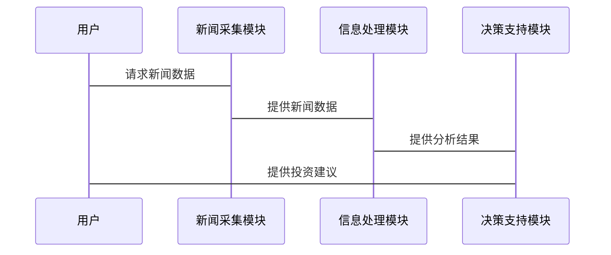

                 


# AI多智能体系统在价值投资中的实时新闻分析应用

> 关键词：AI多智能体系统，价值投资，实时新闻分析，金融数据挖掘，自然语言处理，强化学习

> 摘要：本文探讨了AI多智能体系统在价值投资中的应用，特别是在实时新闻分析方面。通过结合多智能体系统的协同机制与自然语言处理、强化学习等技术，本文详细分析了如何利用AI技术从海量金融新闻中提取价值信息，辅助投资决策。文章从背景、核心概念、算法原理、系统设计到项目实战，全面阐述了这一领域的最新进展。

---

## 第一部分: AI多智能体系统与价值投资的背景介绍

### 第1章: AI多智能体系统概述

#### 1.1 多智能体系统的定义与特点
多智能体系统（Multi-Agent System, MAS）是由多个智能体（Agent）组成的复杂系统，这些智能体能够通过交互协作完成特定任务。智能体具有自主性、反应性、目标导向和协作性等特征，能够在动态环境中做出决策并执行任务。

- **自主性**：智能体能够独立感知环境并自主决策。
- **反应性**：智能体能够实时响应环境变化。
- **目标导向**：智能体的行为由明确的目标驱动。
- **协作性**：多个智能体通过协同完成复杂任务。

#### 1.2 多智能体系统的核心要素
多智能体系统由以下核心要素组成：

- **智能体**：具有感知、决策和行动能力的实体。
- **通信机制**：智能体之间的信息交换方式。
- **协同策略**：智能体协作完成任务的规则和方法。
- **环境**：智能体所处的外部世界，包括任务目标和约束条件。

#### 1.3 多智能体系统的应用领域
多智能体系统广泛应用于金融、交通、物流、游戏开发等领域。在金融领域，多智能体系统可以用于投资决策、风险控制和市场预测。

### 第2章: 价值投资的基本原理

#### 2.1 价值投资的定义
价值投资是一种投资策略，强调以低于内在价值的价格购买优质资产。其核心在于识别市场低估的股票，并长期持有，等待其价值回归。

#### 2.2 价值投资的核心要素
价值投资的关键要素包括：

- **内在价值**：资产的真正价值，通常通过基本面分析确定。
- **市场情绪**：投资者的心理和行为对市场的影响。
- **长期视角**：价值投资强调长期持有的策略。

#### 2.3 价值投资的背景
随着金融市场日益复杂，传统的基本面分析难以应对海量信息的挑战。如何利用技术手段提升分析效率，成为价值投资者的重要课题。

### 第3章: 实时新闻分析在金融中的应用

#### 3.1 实时新闻分析的定义
实时新闻分析是指对金融市场中的新闻事件进行即时分析，以评估其对市场的影响。

#### 3.2 金融领域的实时新闻分析
金融领域的实时新闻分析涉及以下内容：

- **新闻分类**：将新闻分为市场新闻、公司新闻、经济政策等类别。
- **情感分析**：分析新闻文本的情感倾向，判断市场情绪。
- **影响评估**：评估新闻事件对资产价格的影响。

#### 3.3 实时新闻分析的价值
实时新闻分析能够帮助投资者快速捕捉市场信息，预测价格波动，从而做出更明智的投资决策。

---

## 第二部分: AI多智能体系统的核心概念与联系

### 第4章: 多智能体系统的协同机制

#### 4.1 多智能体系统的协同原理
多智能体系统的协同机制包括以下步骤：

1. **任务分解**：将整体任务分解为多个子任务。
2. **协同规划**：智能体根据子任务制定协作计划。
3. **通信与协调**：智能体通过通信机制共享信息，协调行动。
4. **动态调整**：根据环境变化实时调整协同策略。

#### 4.2 多智能体系统的通信协议
多智能体系统的通信协议需要满足以下要求：

- **实时性**：保证信息的及时传递。
- **可靠性**：确保信息的准确性和完整性。
- **安全性**：防止信息泄露和篡改。

### 第5章: 价值投资与多智能体系统的结合

#### 5.1 价值投资中的信息处理
价值投资依赖于对市场信息的全面分析，包括财务报表、行业趋势和新闻事件等。多智能体系统可以通过分工合作，高效处理海量信息。

#### 5.2 多智能体系统在价值投资中的应用
多智能体系统可以用于以下任务：

- **信息收集**：智能体负责收集相关金融新闻。
- **信息分析**：智能体对新闻进行自然语言处理，提取关键信息。
- **决策支持**：智能体根据分析结果提供投资建议。

---

## 第三部分: AI多智能体系统的算法原理

### 第6章: 自然语言处理在新闻分析中的应用

#### 6.1 自然语言处理的定义
自然语言处理（Natural Language Processing, NLP）是研究人机交互中自然语言的处理技术，包括文本分析、语义理解和生成。

#### 6.2 基于NLP的新闻分类
新闻分类是将新闻文本分为不同类别（如市场、经济、公司等）的过程。常用算法包括支持向量机（SVM）和长短期记忆网络（LSTM）。

#### 6.3 基于NLP的情感分析
情感分析旨在判断新闻文本的情感倾向。常用方法包括词袋模型和词嵌入技术（如Word2Vec）。

### 第7章: 强化学习在投资决策中的应用

#### 7.1 强化学习的定义
强化学习是一种机器学习方法，通过智能体与环境的交互，学习最优策略。

#### 7.2 基于强化学习的投资决策
强化学习可以用于投资组合优化和交易策略制定。智能体通过不断试错，学习最佳的投资决策。

#### 7.3 强化学习的挑战
强化学习在投资决策中的挑战包括环境的不确定性、策略的复杂性和计算的高成本。

---

## 第四部分: 系统分析与架构设计

### 第8章: 系统功能设计

#### 8.1 领域模型
领域模型是系统功能设计的核心，包括以下模块：

- **新闻采集模块**：负责采集金融新闻。
- **信息处理模块**：对新闻进行分类和情感分析。
- **决策支持模块**：根据分析结果提供投资建议。

#### 8.2 功能模块的协同
功能模块之间需要通过通信机制协同工作，确保信息的高效传递和处理。

### 第9章: 系统架构设计

#### 9.1 系统架构图
系统架构设计需要考虑模块之间的依赖关系和通信方式。以下是一个简单的系统架构图：



#### 9.2 接口设计
系统需要设计合理的接口，确保模块之间的通信和数据交换。常用接口包括REST API和消息队列。

#### 9.3 交互流程图
以下是一个交互流程图：



---

## 第五部分: 项目实战

### 第10章: 环境安装与配置

#### 10.1 环境安装
安装必要的开发工具和库，如Python、TensorFlow、Keras和NLTK。

#### 10.2 系统核心实现
实现多智能体系统的各个模块，包括新闻采集、信息处理和决策支持。

### 第11章: 代码实现与分析

#### 11.1 核心代码实现
以下是新闻分类的代码示例：

```python
from sklearn.feature_extraction.text import TfidfVectorizer
from sklearn.svm import SVC

# 数据预处理
vectorizer = TfidfVectorizer()
X = vectorizer.fit_transform(news_data)
y = news_labels

# 模型训练
model = SVC()
model.fit(X, y)

# 模型预测
new_news = ["Apple introduces new product"]
new_X = vectorizer.transform([new_news])
predicted_label = model.predict(new_X)
```

#### 11.2 代码分析
上述代码展示了如何使用TF-IDF和SVM进行新闻分类。数据预处理、模型训练和预测是实现新闻分类的关键步骤。

---

## 第六部分: 最佳实践与总结

### 第12章: 最佳实践

#### 12.1 小结
本文详细探讨了AI多智能体系统在价值投资中的实时新闻分析应用，从理论到实践，全面阐述了系统的实现过程。

#### 12.2 注意事项
在实际应用中，需要注意数据质量、模型泛化能力和系统可扩展性等问题。

#### 12.3 拓展阅读
建议进一步学习多智能体系统的协同优化和强化学习的高级应用。

---

## 结语

AI多智能体系统在价值投资中的应用前景广阔，通过实时新闻分析，投资者可以更高效地做出决策。然而，这一领域仍面临诸多挑战，需要进一步研究和实践。

---

## 作者信息

作者：AI天才研究院/AI Genius Institute & 禅与计算机程序设计艺术 /Zen And The Art of Computer Programming

---

以上内容涵盖了从背景介绍到项目实战的各个方面，通过详细的章节和代码示例，全面解析了AI多智能体系统在价值投资中的实时新闻分析应用。希望对读者有所帮助！

