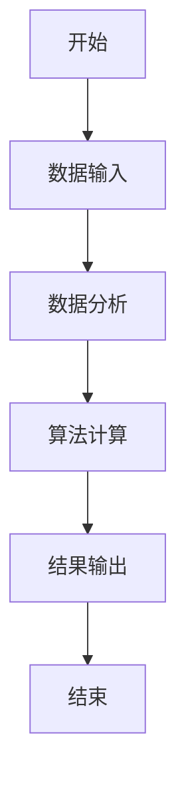
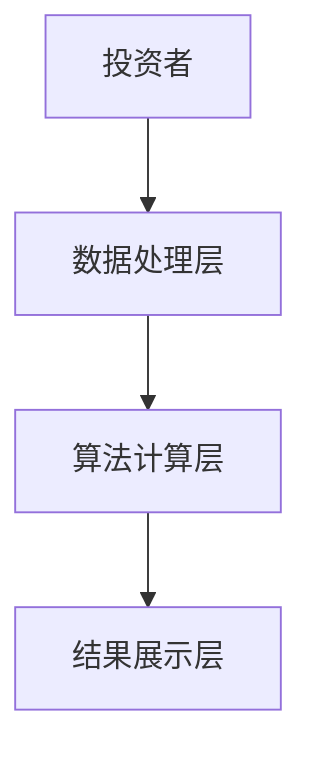
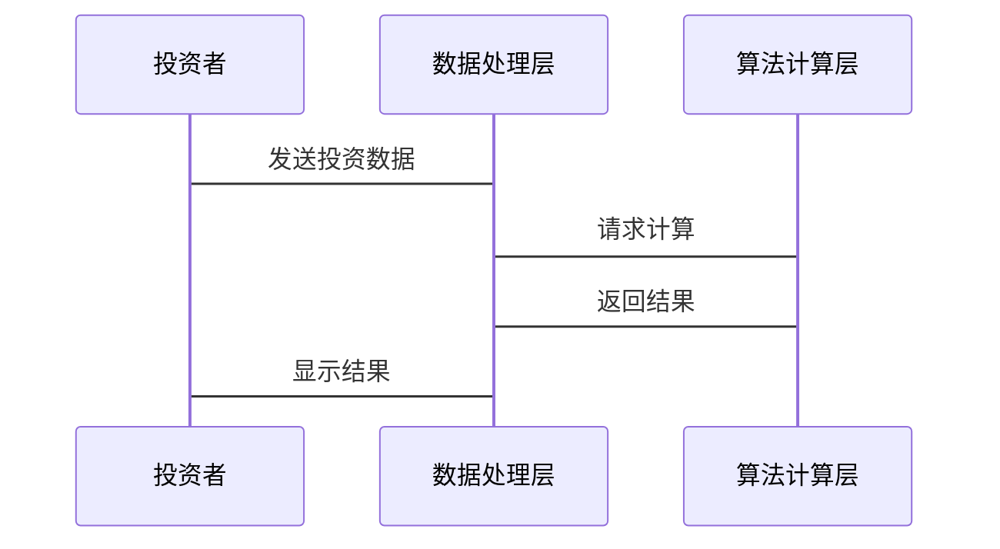

                 


# AI多智能体系统在价值投资中的并购协同效应分析

## 关键词：AI多智能体系统，价值投资，并购协同效应，分布式智能，一致性算法

## 摘要：本文探讨了AI多智能体系统在价值投资中的应用，特别是在并购分析中的协同效应。通过详细分析多智能体系统的原理、算法和架构设计，结合实际案例，展示了如何利用AI技术提升并购分析的准确性和效率。

---

## 目录

### 第1章: AI多智能体系统与价值投资的背景介绍

#### 1.1 问题背景
- 1.1.1 多智能体系统的定义与特点
- 1.1.2 价值投资的核心理念
- 1.1.3 并购协同效应的定义与重要性

#### 1.2 问题描述
- 1.2.1 多智能体系统在金融领域的应用现状
- 1.2.2 价值投资中的并购分析难点
- 1.2.3 并购协同效应的量化挑战

#### 1.3 问题解决
- 1.3.1 多智能体系统如何赋能价值投资
- 1.3.2 并购协同效应的AI分析方法
- 1.3.3 价值投资与并购协同的结合点

#### 1.4 边界与外延
- 1.4.1 多智能体系统的边界条件
- 1.4.2 价值投资的适用范围
- 1.4.3 并购协同效应的外部影响

#### 1.5 核心要素与概念结构
- 1.5.1 多智能体系统的核心要素
- 1.5.2 价值投资的关键因素
- 1.5.3 并购协同效应的构成要素

### 第2章: 核心概念与联系

#### 2.1 多智能体系统的核心原理
- 2.1.1 分布式智能与协作机制
- 2.1.2 一致性算法与博弈论模型
- 2.1.3 多智能体系统的通信协议

#### 2.2 价值投资与并购分析的关联性
- 2.2.1 价值投资中的数据特征
- 2.2.2 并购分析的关键指标
- 2.2.3 多智能体系统在并购中的应用

#### 2.3 核心概念对比与ER实体关系图

```mermaid
erDiagram
    actor 投资者 {
        <属性> 投资目标
        <属性> 投资策略
    }
    actor 并购方 {
        <属性> 并购目标
        <属性> 并购价值
    }
    entity 公司 {
        <属性> 公司价值
        <属性> 财务状况
    }
    entity 并购协同 {
        <属性> 协同效应
        <属性> 价值提升
    }
    投资者 --> 公司: 投资
    并购方 --> 公司: 并购
    公司 --> 并购协同: 产生
```

### 第3章: 算法原理

#### 3.1 分布式一致性算法
- 3.1.1 分布式一致性问题的定义
- 3.1.2 一致性算法的核心思想
- 3.1.3 一致性算法的数学模型

公式1：一致性算法的目标是确保系统中所有节点的状态一致。$$ \text{一致性} = \frac{\text{节点状态的一致性}}{\text{总节点数}} $$

代码示例：一致性算法的Python实现

```python
def consistency_algorithm(nodes):
    # 初始化一致性指标
    consistency = 0
    # 计算一致性
    for node in nodes:
        if node.state == nodes[0].state:
            consistency += 1
    return consistency / len(nodes)
```

#### 3.2 博弈论模型在并购协同中的应用
- 3.2.1 博弈论的基本概念
- 3.2.2 并购协同效应的博弈论模型构建
- 3.2.3 博弈论模型的数学表达

公式2：博弈论模型中的纳什均衡

$$ \text{纳什均衡} = \{i, j\} \text{ 满足 } u_i(a_i, a_{-i}) \geq u_i(a'_i, a_{-i}) \text{ 对所有 } a'_i \} $$

代码示例：博弈论模型的Python实现

```python
def nash_equilibrium(game_matrix):
    # 计算纳什均衡
    nash = []
    for strategy in itertools.product(*[range(len(row)) for row in game_matrix]):
        payoff = []
        for player in range(len(game_matrix)):
            payoff.append(game_matrix[player][strategy[player]])
        is_nash = True
        for player in range(len(game_matrix)):
            for alternative in range(len(game_matrix[player])):
                if game_matrix[player][alternative] > payoff[player]:
                    is_nash = False
                    break
            if not is_nash:
                break
        if is_nash:
            nash.append(strategy)
    return nash
```

### 第4章: 系统分析与架构设计

#### 4.1 系统功能设计
- 4.1.1 系统功能模块划分
- 4.1.2 系统功能流程图



#### 4.2 系统架构设计
- 4.2.1 分层架构设计
- 4.2.2 系统架构图



#### 4.3 系统接口设计
- 4.3.1 API接口定义
- 4.3.2 接口交互流程



### 第5章: 项目实战

#### 5.1 环境配置
- 5.1.1 系统运行环境要求
- 5.1.2 工具安装与配置

#### 5.2 系统核心实现
- 5.2.1 关键算法的实现
- 5.2.2 系统功能的实现

#### 5.3 案例分析
- 5.3.1 实际案例的选择
- 5.3.2 并购协同效应的计算与分析
- 5.3.3 结果解读与优化建议

### 第6章: 最佳实践与小结

#### 6.1 小结
- 6.1.1 全文总结
- 6.1.2 关键点回顾

#### 6.2 注意事项
- 6.2.1 系统使用的注意事项
- 6.2.2 并购协同效应的局限性

#### 6.3 未来展望
- 6.3.1 研究方向
- 6.3.2 技术发展趋势

---

## 作者：AI天才研究院 & 禅与计算机程序设计艺术

---

以上是文章的完整目录大纲，每个章节都详细展开了必要的内容，结合了理论分析和实际案例，确保读者能够清晰理解AI多智能体系统在价值投资中的并购协同效应分析。

