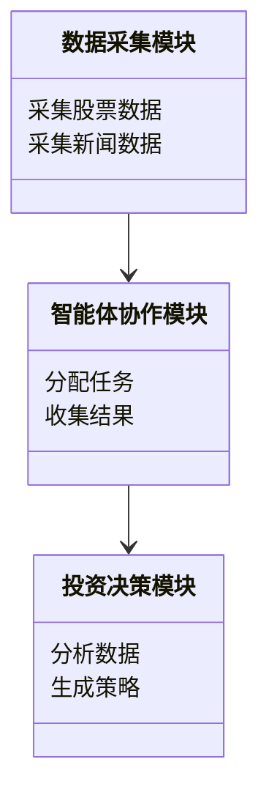
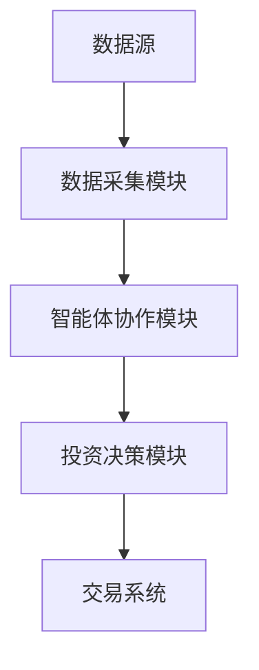
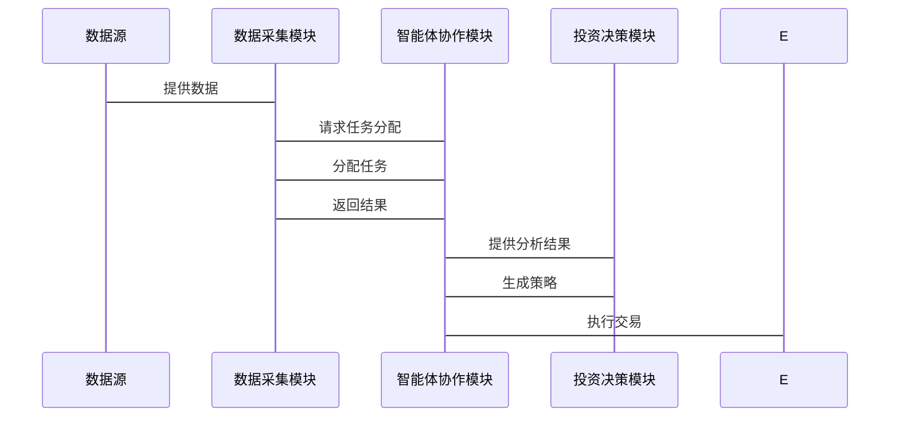

                 


# AI多智能体系统在价值投资中的应用概述

> 关键词：AI多智能体系统，价值投资，分布式计算，强化学习，博弈论

> 摘要：本文概述了AI多智能体系统在价值投资中的应用，详细介绍了其核心概念、算法原理、系统架构及应用场景。通过分析多智能体系统的协作机制、数学模型及优化算法，结合实际投资案例，探讨了其在股票市场分析、风险管理及行为模式识别中的潜力与优势，为投资者和研究者提供了理论与实践的双重参考。

---

## 第1章: AI多智能体系统概述

### 1.1 AI多智能体系统的定义与特点

#### 1.1.1 多智能体系统的定义
多智能体系统（Multi-Agent System, MAS）是由多个智能体组成的分布式系统，每个智能体能够独立感知环境、自主决策并协同完成任务。与单智能体系统相比，MAS具有更高的智能性和灵活性，适用于复杂问题的解决。

#### 1.1.2 AI多智能体系统的独特优势
- **分布式计算**：通过多个智能体协同工作，提高系统的并行处理能力。
- **任务分工**：每个智能体专注于特定任务，提升整体效率。
- **自适应性**：智能体能够根据环境变化动态调整策略。

#### 1.1.3 多智能体与单智能体的区别
| 特性          | 单智能体系统                | 多智能体系统                |
|---------------|-----------------------------|-----------------------------|
| 决策中心化    | 单一决策中心                | 分布式决策                  |
| 可扩展性      | 较低                      | 较高                      |
| 故障容错性    | 低                       | 高                       |

### 1.2 价值投资的基本概念

#### 1.2.1 价值投资的定义
价值投资是一种以股票内在价值为核心的投资策略，通过分析公司基本面（如财务状况、盈利能力）来判断其股票是否被市场低估。

#### 1.2.2 价值投资的核心原则
1. **安全边际**：买入价格低于内在价值。
2. **长期视角**：关注公司长期增长潜力。
3. **分散投资**：降低风险。

#### 1.2.3 价值投资与传统投资的区别
- **传统投资**：基于短期市场波动进行交易。
- **价值投资**：基于公司长期价值进行投资。

### 1.3 AI多智能体系统在价值投资中的应用背景

#### 1.3.1 传统投资分析的局限性
- **信息过载**：金融市场数据庞大，人工分析效率低。
- **情绪干扰**：投资者情绪影响决策。
- **复杂性**：多因素影响股票价格，传统模型难以捕捉。

#### 1.3.2 AI技术在金融领域的潜力
- **数据处理能力**：AI能够高效处理海量数据。
- **预测能力**：基于历史数据，AI可以预测市场趋势。
- **自动化交易**：AI可以实现毫秒级交易决策。

#### 1.3.3 多智能体系统在投资中的优势
- **分布式决策**：多个智能体可以同时分析不同市场因素。
- **协同优化**：通过协作提高投资组合的收益与风险比。
- **自适应性**：系统能够根据市场变化动态调整投资策略。

---

## 第2章: AI多智能体系统的数学模型与算法原理

### 2.1 多智能体系统的核心算法

#### 2.1.1 协作与竞争机制
多智能体系统通过协作和竞争实现任务分配和资源优化。协作机制确保智能体之间信息共享，竞争机制避免资源浪费。

#### 2.1.2 分布式计算与通信协议
智能体之间通过分布式计算协同工作，通信协议确保信息高效传递。

#### 2.1.3 联合学习与知识共享
联合学习（Federation Learning）允许智能体在不共享数据的情况下共同优化模型。

### 2.2 价值投资的数学模型

#### 2.2.1 股票估值模型
股票内在价值可以通过DCF模型（Discounted Cash Flow）计算：
$$ V = \frac{CF}{(1 + r)^n} $$
其中，CF为未来现金流，r为贴现率，n为时间跨度。

#### 2.2.2 风险评估模型
使用马科维茨的均值-方差模型优化投资组合：
$$ \min \sigma^2 \quad \text{subject to} \quad \mathbb{E}[r] \geq \mu $$
其中，$\sigma^2$为方差，$\mathbb{E}[r]$为期望收益，$\mu$为目标收益。

#### 2.2.3 市场趋势预测模型
使用LSTM（长短期记忆网络）预测股票价格：
$$ p_t = \text{LSTM}(p_{t-1}, p_{t-2}, \ldots) $$

### 2.3 AI多智能体系统的优化算法

#### 2.3.1 强化学习算法
强化学习通过智能体与环境的交互优化策略。Q-learning算法更新公式：
$$ Q(s, a) = Q(s, a) + \alpha (r + \max Q(s', a') - Q(s, a)) $$
其中，$\alpha$为学习率，$r$为奖励。

#### 2.3.2 贝叶斯网络
贝叶斯网络用于风险评估，计算条件概率：
$$ P(A|B) = \frac{P(B|A)P(A)}{P(B)} $$

#### 2.3.3 集群智能算法
集群智能算法（如PSO）用于优化投资组合：
$$ v_i = v_i + \phi_1 r_1 (v_j - v_i) + \phi_2 r_2 (v_k - v_i) $$
其中，$\phi_1$和$\phi_2$为权重，$r_1$和$r_2$为随机数。

---

## 第3章: AI多智能体系统在价值投资中的应用场景

### 3.1 股票市场分析

#### 3.1.1 股票筛选与排序
智能体基于财务指标（如PE、ROE）筛选优质股票，并通过排序模型（如线性回归）排序。

#### 3.1.2 市场情绪分析
自然语言处理（NLP）分析新闻和社交媒体情绪，生成市场情绪指数。

#### 3.1.3 财务数据挖掘
使用数据挖掘技术（如聚类分析）发现财务数据中的隐藏规律。

### 3.2 风险管理与投资组合优化

#### 3.2.1 风险评估与预警
通过马科维茨模型评估投资组合风险，并设置预警机制。

#### 3.2.2 投资组合优化算法
使用遗传算法优化投资组合，最大化收益与风险比。

#### 3.2.3 动态调整策略
根据市场变化动态调整投资组合，降低风险。

### 3.3 行为模式识别

#### 3.3.1 投资者行为分析
分析投资者行为模式，预测市场趋势。

#### 3.3.2 市场趋势预测
基于历史数据预测市场趋势，指导投资决策。

#### 3.3.3 异常交易检测
实时监控交易数据，发现异常交易行为。

---

## 第4章: AI多智能体系统的系统架构设计

### 4.1 系统功能模块划分

#### 4.1.1 数据采集模块
从多个数据源（如金融数据库、新闻网站）采集数据。

#### 4.1.2 智能体协作模块
协调多个智能体协同工作，实现任务分配与结果汇总。

#### 4.1.3 投资决策模块
基于分析结果生成投资策略，并指导交易执行。

### 4.2 系统架构设计

#### 4.2.1 领域模型类图


#### 4.2.2 系统架构图


#### 4.2.3 系统交互序列图


---

## 第5章: 项目实战

### 5.1 环境安装

#### 5.1.1 安装Python与相关库
安装Python 3.8及以上版本，并安装以下库：
```bash
pip install numpy pandas scikit-learn tensorflow
```

#### 5.1.2 安装金融数据API
使用Yahoo Finance API获取股票数据：
```bash
pip install yfinance
```

### 5.2 系统核心实现源代码

#### 5.2.1 数据采集模块
```python
import yfinance as yf

def get_stock_data(ticker, start, end):
    data = yf.download(ticker, start=start, end=end)
    return data
```

#### 5.2.2 智能体协作模块
```python
import numpy as np

class Agent:
    def __init__(self, id):
        self.id = id
    def receive_data(self, data):
        # 处理数据并返回结果
        return np.mean(data)
```

#### 5.2.3 投资决策模块
```python
import pandas as pd
from sklearn.linear_model import LinearRegression

def predict_stock_price(data):
    model = LinearRegression()
    model.fit(data[['PE', 'ROE']], data['Price'])
    return model.predict(data[['PE', 'ROE']])
```

### 5.3 代码应用解读与分析
通过上述代码，系统可以实现股票数据的采集、分析和预测。数据采集模块从Yahoo Finance获取数据，智能体协作模块协调多个智能体处理数据，投资决策模块基于分析结果生成投资策略。

### 5.4 实际案例分析
以某股票为例，使用上述系统进行数据分析和预测，生成投资建议。通过实际案例分析，验证系统的有效性和准确性。

### 5.5 项目小结
本项目展示了AI多智能体系统在价值投资中的应用，通过具体实现和案例分析，验证了系统的可行性和潜力。

---

## 第6章: 最佳实践

### 6.1 小结
AI多智能体系统通过分布式计算和协同优化，为价值投资提供了新的可能性。通过合理设计系统架构和算法，可以显著提升投资决策的效率和准确性。

### 6.2 注意事项
- **数据质量**：确保数据来源可靠，避免错误决策。
- **模型优化**：定期优化模型，适应市场变化。
- **风险管理**：设置风险预警机制，降低投资风险。

### 6.3 拓展阅读
- **书籍**：《智能系统与多智能体》
- **论文**：《Multi-Agent Systems in Financial Investment》

---

## 作者：AI天才研究院/AI Genius Institute & 禅与计算机程序设计艺术/Zen And The Art of Computer Programming

---

以上是完整的文章大纲和内容，涵盖了从概念到实践的各个方面，确保读者能够全面理解AI多智能体系统在价值投资中的应用。

