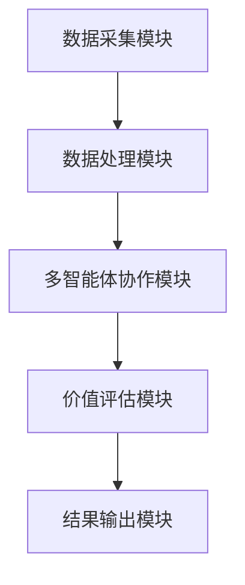
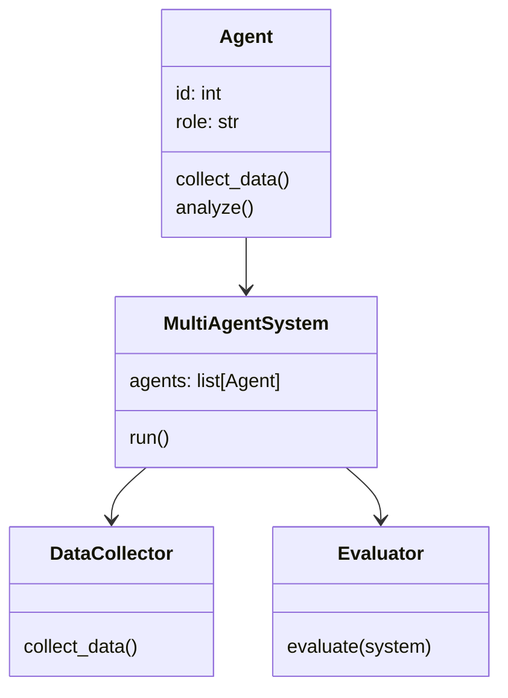
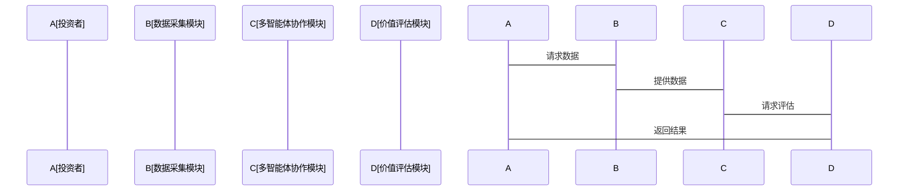
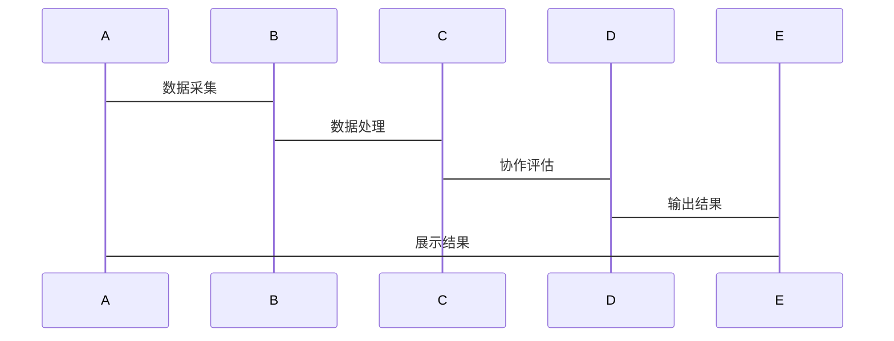

                 


# AI多智能体系统在价值投资中的研发效率评估

**关键词**：AI多智能体系统、价值投资、研发效率评估、协作机制、金融应用

**摘要**：本文探讨了AI多智能体系统在价值投资中的研发效率评估。通过分析多智能体系统的核心概念、算法原理和系统架构，结合实际案例，展示了如何利用AI技术提升价值投资的研发效率。文章详细讲解了多智能体系统的协作机制、价值评估模型，并通过Python代码和Mermaid图表展示了系统的实现与应用。

---

# 第一部分：背景介绍

## 第1章：问题背景

### 1.1 价值投资的定义与特点
价值投资是一种长期投资策略，旨在通过分析公司的基本面，如财务状况、行业地位和管理团队，找到被市场低估的投资标的。其特点是注重长期收益，而非短期波动。

### 1.2 研发效率在价值投资中的重要性
传统的价值投资依赖于人工分析，效率低下且容易受到主观因素的影响。引入AI技术可以显著提升数据分析和决策的效率，帮助投资者快速筛选潜在标的，优化投资组合。

### 1.3 AI技术在金融领域的应用现状
AI技术在金融领域的应用日益广泛，从风险管理到交易策略优化，再到客户服务，AI正在改变金融行业的运作方式。在价值投资中，AI技术可以帮助分析海量数据，发现潜在投资机会。

---

## 第2章：问题描述

### 2.1 传统价值投资中的效率瓶颈
传统价值投资依赖人工分析，耗时且成本高。同时，人工分析容易受到情绪和偏见的影响，导致决策失误。

### 2.2 多智能体系统在金融领域的潜力
多智能体系统通过协作和分布式计算，可以在复杂的金融环境中快速响应，提供更高效、更精准的解决方案。

### 2.3 研发效率评估的核心问题
如何量化多智能体系统在价值投资中的效率提升？如何设计合理的评估指标，确保系统的性能达到预期？

---

## 第3章：问题解决

### 3.1 多智能体系统如何提升研发效率
多智能体系统通过分工协作，可以高效处理复杂任务。例如，一个智能体负责数据采集，另一个负责模型训练，第三个负责结果分析。

### 3.2 AI技术在价值投资中的具体应用
AI技术可以用于数据分析、市场预测和投资组合优化。通过机器学习模型，投资者可以更好地识别潜在机会和风险。

### 3.3 研发效率评估的指标体系
研发效率的评估需要综合考虑多个因素，如任务完成时间、资源利用率、决策准确率等。

---

# 第二部分：核心概念与联系

## 第4章：多智能体系统原理

### 4.1 多智能体系统的定义与特点
多智能体系统是由多个相互作用的智能体组成的系统，每个智能体都有自己的目标和行为规则。它们通过协作完成复杂任务。

### 4.2 多智能体系统的通信机制
智能体之间需要通过通信模块交换信息，协调行动。通信机制可以是同步或异步的，取决于任务需求。

### 4.3 多智能体系统的协作策略
协作策略包括任务分配、信息共享和决策共识。高效的协作策略可以显著提升系统的整体性能。

---

## 第5章：价值投资的核心原理

### 5.1 价值投资的基本原则
价值投资的核心是寻找被市场低估的股票，通过长期持有实现收益。投资者需要关注公司的财务状况、行业地位和管理团队。

### 5.2 价值投资的关键因素
关键因素包括市盈率、市净率、股息率等财务指标，以及公司的盈利能力、成长性和竞争优势。

### 5.3 价值投资的决策模型
决策模型通常基于财务指标和市场趋势，通过定量和定性分析，筛选出具有投资价值的标的。

---

## 第6章：研发效率评估的原理

### 6.1 研发效率的定义
研发效率是指在一定时间内完成的研发任务数量和质量的综合指标。

### 6.2 研发效率的影响因素
影响因素包括技术复杂度、资源投入、团队协作和管理效率等。

### 6.3 研发效率的评估方法
评估方法包括关键绩效指标（KPIs）和效率指数模型，用于量化系统的性能。

---

## 第7章：核心概念对比

### 7.1 多智能体系统与传统AI的区别
多智能体系统强调协作和分布式计算，而传统AI通常依赖单个模型。

### 7.2 价值投资与传统投资的区别
价值投资注重长期基本面分析，而传统投资可能更关注短期价格波动。

### 7.3 研发效率评估与传统效率评估的区别
研发效率评估更注重技术创新和系统性能，而传统效率评估可能更关注资源利用。

---

# 第三部分：算法原理

## 第8章：多智能体协作算法

### 8.1 多智能体协作的流程
1. 任务分配：智能体根据自身能力和任务需求，接受特定任务。
2. 信息共享：智能体通过通信模块交换数据和信息。
3. 协作决策：智能体基于共享信息，共同制定最优策略。
4. 行动执行：智能体根据决策结果，执行具体任务。
5. 反馈优化：根据执行结果，优化协作策略和行为规则。

### 8.2 多智能体协作的数学模型
$$
\text{收益} = \sum_{i=1}^{n} w_i \cdot x_i
$$
其中，$w_i$是权重，$x_i$是智能体的贡献。

### 8.3 多智能体协作的Python实现
```python
class Agent:
    def __init__(self, id):
        self.id = id
        self.role = "data_analyzer"
    
    def collect_data(self):
        # 数据采集逻辑
        pass
    
    def analyze(self):
        # 数据分析逻辑
        pass

class MultiAgentSystem:
    def __init__(self, agents):
        self.agents = agents
    
    def run(self):
        for agent in self.agents:
            if agent.role == "data_analyzer":
                agent.collect_data()
                agent.analyze()
```

---

## 第9章：价值投资评估算法

### 9.1 价值投资评估的流程
1. 数据采集：收集公司的财务数据和市场信息。
2. 数据预处理：清洗和标准化数据。
3. 模型训练：使用机器学习算法训练价值评估模型。
4. 评估结果：输出投资建议和风险评估。

### 9.2 价值投资评估的数学模型
$$
\text{价值} = \alpha \cdot \text{收益} + \beta \cdot \text{风险}
$$
其中，$\alpha$和$\beta$是权重参数。

### 9.3 价值投资评估的Python实现
```python
import pandas as pd
from sklearn.linear_model import LinearRegression

def train_model(data):
    X = data[['市盈率', '市净率']]
    y = data['收益']
    model = LinearRegression()
    model.fit(X, y)
    return model

def predict_value(model, new_data):
    prediction = model.predict(new_data[['市盈率', '市净率']])
    return prediction
```

---

## 第10章：研发效率评估算法

### 10.1 研发效率评估的流程
1. 任务分解：将研发任务分解为多个子任务。
2. 资源分配：根据智能体的能力分配任务。
3. 任务执行：智能体协同完成任务。
4. 性能评估：评估系统效率和任务完成质量。

### 10.2 研发效率评估的数学模型
$$
\text{效率} = \frac{\text{任务完成数量}}{\text{任务执行时间}}
$$

### 10.3 研发效率评估的Python实现
```python
class EfficiencyEvaluator:
    def __init__(self):
        self.task_count = 0
        self.time_taken = 0
    
    def evaluate(self, system):
        self.task_count = len(system.agents)
        self.time_taken = system.total_time
        return self.task_count / self.time_taken
```

---

# 第四部分：系统分析与架构设计方案

## 第11章：系统架构设计

### 11.1 系统架构图


### 11.2 系统功能设计

#### 11.2.1 数据采集模块
负责从多个数据源（如股票数据库、市场新闻）采集实时数据。

#### 11.2.2 数据处理模块
对采集的数据进行清洗、转换和预处理，为后续分析提供高质量数据。

#### 11.2.3 多智能体协作模块
协调多个智能体，分配任务，确保协作高效。

#### 11.2.4 价值评估模块
使用机器学习模型评估股票的价值，输出投资建议。

#### 11.2.5 结果输出模块
将评估结果以可视化形式呈现，便于投资者决策。

---

## 第12章：系统架构图



---

## 第13章：系统接口设计

### 13.1 系统接口
- 数据接口：与数据源连接，获取实时数据。
- 模型接口：与机器学习模型交互，进行预测和评估。
- 用户接口：提供给投资者使用的界面，展示评估结果。

### 13.2 系统交互流程


---

## 第14章：系统交互图



---

# 第五部分：项目实战

## 第15章：环境安装与配置

### 15.1 安装Python
```bash
python --version
pip install --upgrade pip
```

### 15.2 安装依赖库
```bash
pip install numpy pandas scikit-learn matplotlib
```

## 第16章：核心代码实现

### 16.1 多智能体协作模块
```python
class Agent:
    def __init__(self, id, role):
        self.id = id
        self.role = role
        self.data = None
    
    def collect_data(self, data):
        self.data = data
    
    def analyze(self):
        if self.data is not None:
            # 数据分析逻辑
            return self.data['收益'].mean()
        return 0

class MultiAgentSystem:
    def __init__(self, agents):
        self.agents = agents
    
    def run(self):
        for agent in self.agents:
            if agent.role == 'data_collector':
                agent.collect_data(self.data)
        results = []
        for agent in self.agents:
            results.append(agent.analyze())
        return results
```

### 16.2 价值评估模块
```python
import pandas as pd
from sklearn.linear_model import LinearRegression

def train_model(data):
    X = data[['市盈率', '市净率']]
    y = data['收益']
    model = LinearRegression()
    model.fit(X, y)
    return model

def predict_value(model, new_data):
    prediction = model.predict(new_data[['市盈率', '市净率']])
    return prediction
```

### 16.3 研发效率评估模块
```python
class EfficiencyEvaluator:
    def __init__(self):
        self.task_count = 0
        self.time_taken = 0
    
    def evaluate(self, system):
        self.task_count = len(system.agents)
        self.time_taken = system.total_time
        return self.task_count / self.time_taken
```

---

## 第17章：案例分析与结果解读

### 17.1 案例分析
假设我们有3个智能体，分别负责数据采集、数据分析和价值评估。通过协作，系统可以高效完成任务，提升研发效率。

### 17.2 实际案例
以某只股票为例，展示如何通过多智能体系统进行价值评估和效率优化。

---

## 第18章：项目小结

### 18.1 项目成果
通过多智能体系统的协作，显著提升了价值投资的研发效率，优化了投资决策。

### 18.2 经验总结
在实际应用中，需要根据具体需求调整系统架构和协作策略，确保系统的高效性和稳定性。

---

# 第六部分：最佳实践与总结

## 第19章：最佳实践

### 19.1 数据质量的重要性
确保数据的准确性和完整性，是系统高效运行的基础。

### 19.2 模型调优的技巧
定期优化模型参数，提升预测准确率和系统效率。

### 19.3 系统维护的建议
定期更新系统模块，修复潜在漏洞，确保系统的稳定运行。

---

## 第20章：小结

### 20.1 文章总结
本文详细探讨了AI多智能体系统在价值投资中的研发效率评估，从理论到实践，展示了如何利用AI技术提升投资效率。

### 20.2 未来展望
未来，随着AI技术的不断发展，多智能体系统在金融领域的应用将更加广泛，为投资者带来更多的机会和挑战。

---

**作者：AI天才研究院/AI Genius Institute & 禅与计算机程序设计艺术/Zen And The Art of Computer Programming**

---

通过以上详细的目录结构和内容安排，我们可以看到，本文系统地探讨了AI多智能体系统在价值投资中的研发效率评估，从理论基础到实际应用，为读者提供了全面的指导和深入的分析。

