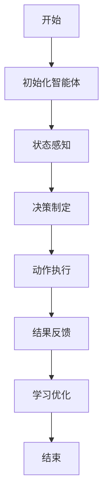
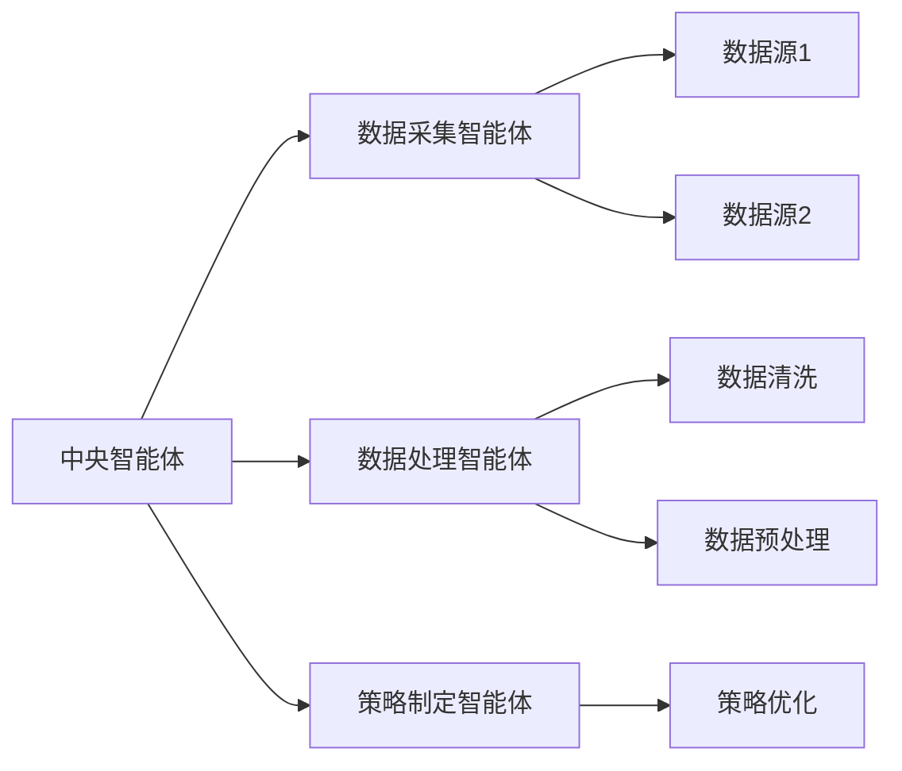
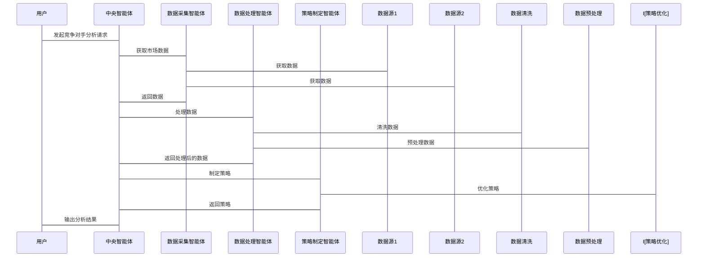

                 


# AI多智能体系统在价值投资中的竞争对手分析

> 关键词：AI多智能体系统、价值投资、竞争对手分析、强化学习、博弈论、金融分析

> 摘要：本文深入探讨了AI多智能体系统在价值投资中的应用，特别是如何利用多智能体系统进行竞争对手分析。文章从背景、核心概念、算法原理、系统架构到实际案例，全面分析了AI多智能体系统在金融领域的优势和实现方法。

---

# 第一部分: AI多智能体系统与价值投资概述

## 第1章: AI多智能体系统与价值投资的背景

### 1.1 AI多智能体系统的基本概念
#### 1.1.1 多智能体系统的定义与特点
多智能体系统（Multi-Agent System, MAS）是由多个智能体（Agent）组成的复杂系统，这些智能体能够通过协作或竞争完成特定任务。每个智能体都有自己的目标、知识和决策机制，能够感知环境并采取行动。

**多智能体系统的特点：**
- **分布性**：智能体是分布式的，每个智能体独立运行。
- **协作性**：智能体之间可以协作完成复杂任务。
- **动态性**：系统环境和智能体状态是动态变化的。
- **自主性**：智能体能够自主决策，无需外部干预。

#### 1.1.2 价值投资中的多智能体系统应用
价值投资是一种以公司基本面分析为基础的投资策略，通过分析公司的财务状况、行业地位等因素来判断其投资价值。AI多智能体系统可以通过分析多个维度的数据，帮助投资者更全面地评估竞争对手的优劣势。

### 1.2 价值投资与竞争对手分析的背景
#### 1.2.1 价值投资的核心理念
价值投资的核心理念是寻找被市场低估的优质公司进行长期投资。这种投资策略强调对公司基本面的深入分析，包括财务状况、管理团队、行业地位等。

#### 1.2.2 竞争对手分析在投资中的重要性
竞争对手分析是价值投资的重要组成部分。通过对竞争对手的分析，投资者可以更好地理解行业格局、公司的市场地位以及公司的竞争优势和劣势。

#### 1.2.3 AI技术在金融分析中的应用现状
AI技术在金融领域的应用越来越广泛，特别是在数据分析、风险评估、投资决策等方面。AI多智能体系统通过分布式计算和协作学习，能够处理海量数据，提供更精准的投资分析。

---

## 第2章: 多智能体系统的核心概念

### 2.1 多智能体系统的构成要素
#### 2.1.1 智能体的定义与属性
智能体是一个能够感知环境、做出决策并采取行动的实体。智能体的核心属性包括：
- **感知能力**：能够感知环境中的信息。
- **决策能力**：能够基于感知信息做出决策。
- **行动能力**：能够根据决策采取行动。

#### 2.1.2 多智能体系统的层次结构
多智能体系统可以分为以下层次：
1. **智能体层**：由多个智能体组成，每个智能体负责特定的任务。
2. **协作层**：智能体之间通过协作完成复杂任务。
3. **环境层**：系统的外部环境，包括数据源、市场信息等。

#### 2.1.3 竞争对手分析的智能体模型
在价值投资中，竞争对手分析可以通过多个智能体协同完成。每个智能体负责分析不同的数据源，例如财务数据、市场数据、新闻数据等，并将结果汇总到中央智能体进行综合分析。

### 2.2 多智能体系统与竞争对手分析的关系
#### 2.2.1 竞争对手分析的复杂性
竞争对手分析涉及多个维度的信息，包括财务数据、市场数据、管理团队等。传统的单智能体系统难以处理如此复杂的数据。

#### 2.2.2 多智能体系统在分析中的优势
多智能体系统通过分布式的计算和协作学习，能够更高效地处理海量数据，并提供更精准的分析结果。

#### 2.2.3 系统的可扩展性和适应性
多智能体系统具有良好的扩展性，可以通过增加智能体的数量来提高系统的处理能力。同时，系统具有较强的适应性，能够根据市场变化动态调整分析策略。

### 2.3 核心概念对比分析
#### 2.3.1 竞争对手分析的特征对比
| 特征 | 单智能体系统 | 多智能体系统 |
|------|--------------|--------------|
| 数据处理能力 | 有限 | 强大 |
| 决策效率 | 低 | 高 |
| 可扩展性 | 差 | 好 |

#### 2.3.2 多智能体系统的属性对比
| 属性 | 独立性 | 协作性 | 动态性 |
|------|--------|--------|--------|
| 程度 | 高 | 高 | 高 |

#### 2.3.3 竞争对手分析与传统金融分析的对比
| 维度 | 传统金融分析 | 基于多智能体系统的竞争对手分析 |
|------|----------------|------------------------------------|
| 数据来源 | 单一 | 多源 |
| 分析深度 | 浅 | 深 |
| 分析效率 | 低 | 高 |

### 2.4 实体关系图（ER图）分析
```mermaid
erd
  customer_order
    customer_id (PK)
    order_id (PK)
    product_id (FK)
    order_date
    order_quantity

  product
    product_id (PK)
    product_name
    product_price
    product_stock
```

---

## 第3章: 多智能体系统的核心算法

### 3.1 强化学习在多智能体系统中的应用
#### 3.1.1 强化学习的基本原理
强化学习是一种机器学习方法，通过智能体与环境的交互，学习最优策略。智能体通过试错的方式，不断优化自己的决策，以获得最大的奖励。

#### 3.1.2 多智能体强化学习的挑战
多智能体强化学习面临以下挑战：
1. **协作问题**：多个智能体需要协作完成任务，如何协调各方的决策是难点。
2. **通信问题**：智能体之间需要有效通信，但信息传递可能受到限制。
3. **博弈问题**：智能体之间可能存在竞争关系，如何平衡各方利益是关键。

#### 3.1.3 基于强化学习的竞争对手分析模型
竞争对手分析模型可以通过多个智能体协同工作，每个智能体负责分析不同的数据源，并将结果汇总到中央智能体进行综合分析。中央智能体根据分析结果，制定投资策略。

### 3.2 博弈论模型在多智能体系统中的应用
#### 3.2.1 博弈论的基本概念
博弈论是研究决策主体在 strategic 情况下的理性行为以及互动关系的数学理论。博弈论模型可以用来描述智能体之间的竞争关系。

#### 3.2.2 竞争对手分析中的博弈模型
在竞争对手分析中，博弈论模型可以用来预测竞争对手的可能行为。例如，可以通过纳什均衡理论，分析竞争对手在不同策略下的最优选择。

#### 3.2.3 基于博弈论的策略优化
通过博弈论模型，可以优化多智能体系统的策略，使其在竞争中更具优势。例如，可以通过博弈论模型，预测竞争对手的可能动作，并制定应对策略。

### 3.3 算法流程图（mermaid）


### 3.4 算法实现代码
```python
import numpy as np
from collections import deque

class MultiAgentSystem:
    def __init__(self, num_agents):
        self.num_agents = num_agents
        self.states = deque()
        self.actions = deque()
    
    def perceive(self, state):
        self.states.append(state)
    
    def decide(self):
        for _ in range(self.num_agents):
            action = self.actions.popleft()
            print(f"智能体 {_} 执行动作: {action}")
    
    def execute(self, action):
        # 执行动作，例如：调整投资策略
        pass

# 示例用法
if __name__ == "__main__":
    num_agents = 5
    mas = MultiAgentSystem(num_agents)
    
    # 初始化状态
    initial_state = "市场数据"
    mas.perceive(initial_state)
    
    # 设置动作
    actions = ["分析财务数据", "分析市场趋势", "评估管理团队"]
    for action in actions:
        mas.actions.append(action)
    
    # 执行决策
    mas.decide()
```

### 3.5 算法的数学模型和公式
#### 3.5.1 强化学习的数学模型
强化学习的数学模型可以表示为：
$$ Q(s, a) = Q(s, a) + \alpha (r + \gamma \max Q(s', a') - Q(s, a)) $$
其中：
- $Q(s, a)$ 是当前状态和动作的值函数。
- $\alpha$ 是学习率。
- $r$ 是奖励。
- $\gamma$ 是折扣因子。
- $s'$ 是下一个状态。

#### 3.5.2 博弈论模型的数学公式
纳什均衡的定义是：
$$ \text{如果每个玩家的策略都是最优反应，那么这个策略组合就是一个纳什均衡。} $$
即，对于每个玩家，给定其他玩家的策略，这个玩家的策略是最佳选择。

---

## 第4章: 系统分析与架构设计

### 4.1 问题场景介绍
价值投资中的竞争对手分析需要处理海量数据，包括财务数据、市场数据、新闻数据等。传统的单智能体系统难以高效处理这些数据，因此需要构建一个多智能体系统来完成任务。

### 4.2 系统功能设计
系统功能设计包括以下部分：
1. **数据采集**：从多个数据源采集数据。
2. **数据处理**：对数据进行清洗和预处理。
3. **智能体协作**：多个智能体协同工作，完成数据分析和策略制定。
4. **结果输出**：输出分析结果，指导投资决策。

### 4.3 系统架构设计


### 4.4 系统接口设计
系统接口设计包括：
1. **数据接口**：与数据源的接口。
2. **智能体接口**：智能体之间的通信接口。
3. **用户接口**：与用户的交互接口。

### 4.5 系统交互序列图


---

## 第5章: 项目实战

### 5.1 环境安装
需要安装以下环境和工具：
1. **Python**：3.8+
2. **库依赖**：numpy, pandas, scikit-learn
3. **开发工具**：VS Code, PyCharm

### 5.2 系统核心实现源代码
```python
import numpy as np
import pandas as pd
from sklearn.metrics import accuracy_score

class CompetitorAnalyzer:
    def __init__(self):
        self.data = None
        self.feat

---

**作者：AI天才研究院 & 禅与计算机程序设计艺术**

