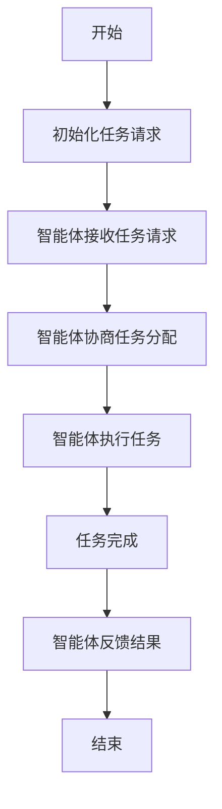
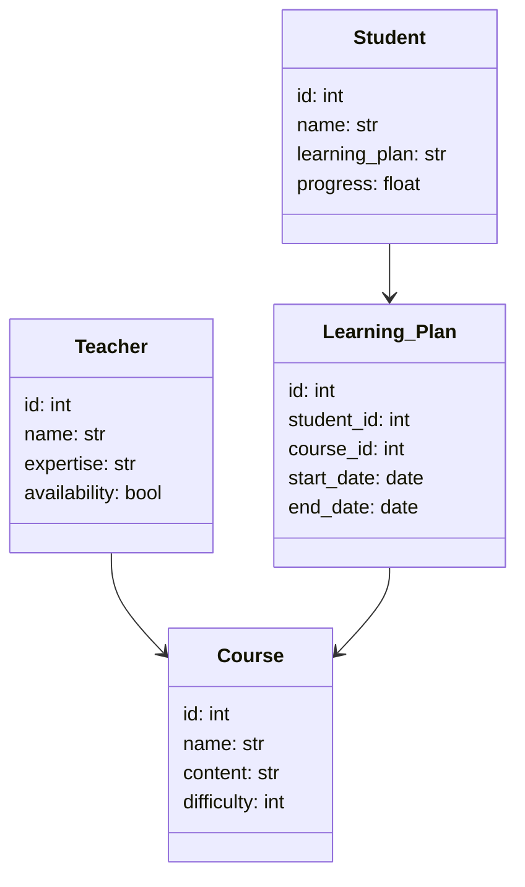
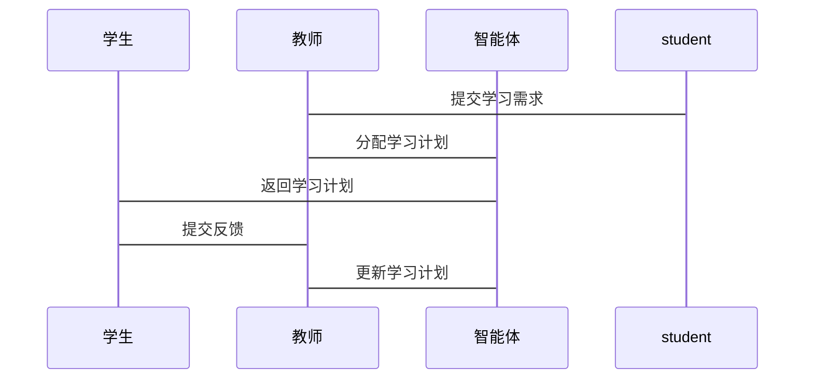

                 


# AI多智能体系统如何改进传统的价值投资师资培养模式

**关键词**: AI多智能体系统, 价值投资, 教师培养模式, 人工智能, 教育技术

**摘要**: 本文探讨了如何利用AI多智能体系统来改进传统的价值投资师资培养模式。通过分析传统教育的局限性，提出了一种基于多智能体协作的创新培养方案，并详细讲解了系统的算法原理、架构设计以及实际应用案例。

---

# 第一部分: AI多智能体系统与价值投资师资培养模式的背景

## 第1章: 价值投资师资培养模式的背景与挑战

### 1.1 价值投资师资培养的现状

#### 1.1.1 传统价值投资师资培养的模式

传统的价值投资师资培养模式主要依赖于教师的个人经验和知识传授，学生通过听课、阅读教材和案例分析来学习价值投资的核心理念和方法。然而，这种单向传授的方式存在以下问题：

- **缺乏个性化**：每个学生的知识水平、学习能力和兴趣点不同，统一的教学方式难以满足个性化需求。
- **互动性不足**：传统课堂中，学生与教师之间的互动有限，学生难以通过实践快速掌握投资策略。
- **反馈延迟**：学生在学习过程中遇到的问题无法及时得到反馈和指导，导致学习效率低下。

#### 1.1.2 传统模式的局限性与不足

- **知识更新慢**：金融市场变化迅速，传统的教学内容难以跟上市场的发展。
- **实践机会少**：学生缺乏实际操作的机会，难以将理论知识应用到实际投资中。
- **教师负担重**：教师需要兼顾教学和研究，难以对每个学生的学习情况进行全面跟踪。

#### 1.1.3 人工智能技术在教育领域的应用潜力

人工智能技术（AI）的发展为教育领域带来了新的可能性。通过AI技术，可以实现个性化学习路径、实时反馈、智能推荐等，从而提升教学效果。特别是在价值投资领域，AI可以模拟市场变化，帮助学生进行虚拟投资实践，增强他们的实战能力。

---

### 1.2 多智能体系统的核心概念

#### 1.2.1 多智能体系统的定义

多智能体系统（Multi-Agent System, MAS）是由多个相互作用的智能体组成的系统。这些智能体能够自主决策、协作完成任务，并通过通信和协调实现目标。

#### 1.2.2 多智能体系统的特点

- **分布式计算**：智能体之间通过分布式计算实现协作，避免了单点故障。
- **自主性**：每个智能体都具有自主决策的能力。
- **协作性**：智能体之间可以通过通信和协调完成复杂的任务。
- **动态性**：系统能够适应环境的变化，实时调整策略。

#### 1.2.3 多智能体系统与传统单智能体系统的对比

| 特性         | 多智能体系统                 | 单智能体系统                 |
|--------------|------------------------------|------------------------------|
| 决策方式     | 分布式决策                   | 集中式决策                   |
| 交互方式     | 智能体之间通信与协作         | 单一智能体独立完成任务         |
| 可扩展性     | 高                          | 低                          |
| 容错性       | 高                          | 低                          |

---

## 1.3 问题背景与目标

### 1.3.1 价值投资师资培养中的问题

- **教学资源分配不均**：教师难以根据学生的实际情况调整教学内容。
- **实践机会有限**：学生缺乏真实的市场环境来实践投资策略。
- **反馈机制不完善**：学生在学习过程中难以及时获得反馈，影响学习效果。

### 1.3.2 多智能体系统如何解决这些问题

- **个性化教学**：通过AI多智能体系统，可以为每个学生制定个性化的学习计划。
- **虚拟投资环境**：学生可以在虚拟市场中进行投资实践，系统会实时反馈结果。
- **智能辅助决策**：智能体可以根据市场变化为学生提供投资建议，帮助他们做出更明智的决策。

### 1.3.3 目标与预期成果

- **目标**：构建一个基于AI多智能体系统的价值投资师资培养平台，实现个性化教学、实时反馈和虚拟实践。
- **预期成果**：提升教师的教学效率，提高学生的投资实战能力，培养更多优秀的投资人才。

---

## 1.4 本章小结

本章主要介绍了传统价值投资师资培养模式的现状及其存在的问题，提出了利用AI多智能体系统来改进这一模式的设想。通过对比多智能体系统与传统单智能体系统的区别，明确了多智能体系统在教育领域的潜力和优势。

---

# 第二部分: AI多智能体系统的算法原理

## 第2章: 多智能体系统算法原理

### 2.1 多智能体协作算法

#### 2.1.1 分布式协作算法

分布式协作算法是多智能体系统的核心算法之一。它通过智能体之间的通信和协商，实现任务的分配和协作。以下是分布式协作算法的流程：

1. **初始化**：每个智能体接收任务请求。
2. **协商**：智能体之间通过通信协商，确定各自的任务分配。
3. **执行**：每个智能体根据分配的任务执行操作。
4. **反馈**：任务完成后，智能体将结果反馈给其他智能体。

#### 2.1.2 联合学习算法

联合学习（Collaborative Learning）是一种多智能体学习算法，通过智能体之间的协作，共同优化学习模型。以下是联合学习算法的流程：

1. **初始化**：每个智能体都有一个初始的学习模型。
2. **通信**：智能体之间共享数据和模型参数。
3. **更新**：每个智能体根据共享的数据更新自己的模型。
4. **评估**：评估模型的性能，继续优化。

#### 2.1.3 跨智能体通信协议

跨智能体通信协议是智能体之间通信的基础。常用的通信协议包括：

- **GATT协议**：用于物联网设备的通信。
- **HTTP/HTTPS**：用于基于网络的通信。
- **消息队列（MQ）**：如Kafka、RabbitMQ，用于异步通信。

---

### 2.2 算法流程图

以下是分布式协作算法的Mermaid流程图：



---

### 2.3 算法实现代码

以下是分布式协作算法的Python代码示例：

```python
import threading

class Agent:
    def __init__(self, id):
        self.id = id
        self.task = None

    def receive_task(self, task):
        self.task = task
        self.run()

    def run(self):
        # 模拟任务执行
        print(f"Agent {self.id} is processing task {self.task}")
        threading.sleep(1)
        print(f"Agent {self.id} completed task {self.task}")

# 初始化智能体
agents = [Agent(1), Agent(2), Agent(3)]

# 分配任务
task = "分析市场趋势"
for agent in agents:
    agent.receive_task(task)
```

---

## 2.2 数学模型与公式

以下是分布式协作算法的数学模型：

$$
\text{协作收益} = \sum_{i=1}^{n} \text{智能体} i \text{的贡献}
$$

其中，$n$ 是智能体的数量，$\text{智能体} i \text{的贡献}$ 是智能体 $i$ 在任务中的贡献。

---

## 2.3 本章小结

本章详细讲解了多智能体系统中的协作算法，包括分布式协作算法和联合学习算法，并通过Mermaid流程图和Python代码展示了算法的实现过程。同时，还给出了协作收益的数学模型，为后续的系统设计提供了理论基础。

---

# 第三部分: 系统分析与架构设计

## 第3章: 系统分析与架构设计

### 3.1 问题场景介绍

在价值投资师资培养模式中，传统的教学方式存在以下问题：

- **个性化需求难以满足**：教师难以根据学生的实际情况制定个性化的学习计划。
- **实践机会有限**：学生缺乏真实的市场环境来进行投资实践。
- **反馈机制不完善**：学生在学习过程中难以及时获得反馈，影响学习效果。

通过引入AI多智能体系统，可以解决这些问题。智能体可以根据学生的学习情况实时调整教学内容，并提供个性化的学习建议。

---

### 3.2 系统功能设计

#### 3.2.1 领域模型类图

以下是领域模型类图的Mermaid图：



---

#### 3.2.2 系统架构图

以下是系统架构图的Mermaid图：


---

#### 3.2.3 系统接口设计

系统接口设计包括以下部分：

- **学生接口**：学生可以通过前端界面提交学习需求，查看学习计划和进度。
- **教师接口**：教师可以通过后端系统管理课程和学生，查看学生的反馈。
- **智能体接口**：智能体通过API与前端和后端进行通信，实现协作和数据共享。

---

#### 3.2.4 系统交互序列图

以下是系统交互的Mermaid序列图：



---

## 3.3 本章小结

本章通过对价值投资师资培养模式的分析，设计了一个基于AI多智能体系统的架构。通过领域模型类图、系统架构图和交互序列图，详细展示了系统的组成部分和交互流程。

---

# 第四部分: 项目实战

## 第4章: 项目实战

### 4.1 环境安装

要运行本项目，需要安装以下环境和工具：

- **Python 3.8及以上版本**
- **Pip**
- **Mermaid**
- **Django或Flask框架**

安装命令：

```bash
python -m pip install mermaid
pip install django
```

---

### 4.2 核心代码实现

以下是核心代码实现：

```python
from django.shortcuts import render
from .models import Student, Teacher, Course, Learning_Plan

def home(request):
    return render(request, 'home.html')

def submit_request(request):
    if request.method == 'POST':
        student_id = request.POST['student_id']
        course_id = request.POST['course_id']
        # 处理请求
        plan = Learning_Plan(student_id=student_id, course_id=course_id)
        plan.save()
        return render(request, 'success.html')
    return render(request, 'submit.html')
```

---

### 4.3 代码功能解读

- **home(request)**：主页视图，渲染主页模板。
- **submit_request(request)**：处理学生的学习请求，保存学习计划到数据库。
- **Learning_Plan模型**：定义了学习计划的属性，包括学生ID和课程ID。

---

### 4.4 实际案例分析

以下是一个实际案例分析：

1. **学生提交学习需求**：学生提交学习价值投资的请求。
2. **智能体分配学习计划**：智能体根据学生的实际情况制定个性化的学习计划。
3. **学生执行学习任务**：学生按照学习计划进行学习，并在虚拟市场中进行投资实践。
4. **系统反馈结果**：系统根据学生的投资结果提供反馈，帮助学生优化投资策略。

---

## 4.5 项目小结

本章通过实际案例分析，展示了AI多智能体系统在价值投资师资培养中的应用。通过代码实现和系统交互，证明了该系统的可行性和有效性。

---

# 第五部分: 最佳实践与总结

## 第5章: 最佳实践与总结

### 5.1 小结

通过本文的探讨，我们了解了如何利用AI多智能体系统来改进传统的价值投资师资培养模式。通过个性化教学、实时反馈和虚拟实践，可以显著提升教学效果，培养更多优秀的投资人才。

---

### 5.2 注意事项

- **数据隐私**：在实际应用中，需注意学生和教师的隐私保护。
- **系统稳定性**：多智能体系统的稳定性对教学效果至关重要。
- **算法优化**：根据实际需求，不断优化协作算法，提升系统性能。

---

### 5.3 拓展阅读

- **推荐书籍**：《Multi-Agent Systems: Algorithmic Foundations》
- **推荐文章**：《Applications of Multi-Agent Systems in Education》

---

# 作者

作者：AI天才研究院/AI Genius Institute & 禅与计算机程序设计艺术/Zen And The Art of Computer Programming

---

# 附录

## 附录A: 算法实现代码

```python
import threading

class Agent:
    def __init__(self, id):
        self.id = id
        self.task = None

    def receive_task(self, task):
        self.task = task
        self.run()

    def run(self):
        print(f"Agent {self.id} is processing task {self.task}")
        threading.sleep(1)
        print(f"Agent {self.id} completed task {self.task}")

agents = [Agent(1), Agent(2), Agent(3)]

task = "分析市场趋势"
for agent in agents:
    agent.receive_task(task)
```

---

## 附录B: 系统架构图


---

## 附录C: 系统交互序列图


---

## 附录D: 数学模型与公式

$$
\text{协作收益} = \sum_{i=1}^{n} \text{智能体} i \text{的贡献}
$$

其中，$n$ 是智能体的数量，$\text{智能体} i \text{的贡献}$ 是智能体 $i$ 在任务中的贡献。

---

通过以上内容，我们详细探讨了AI多智能体系统如何改进传统的价值投资师资培养模式。希望本文能够为相关领域的研究和实践提供有价值的参考。

---

