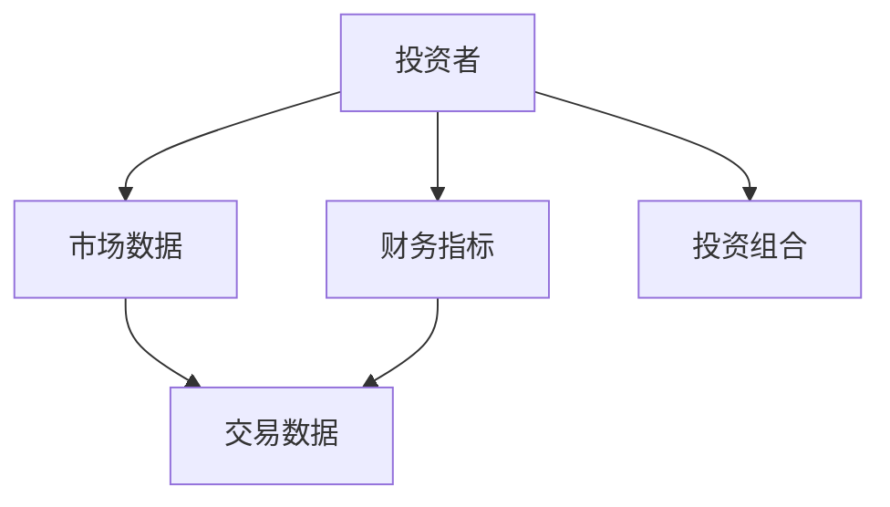
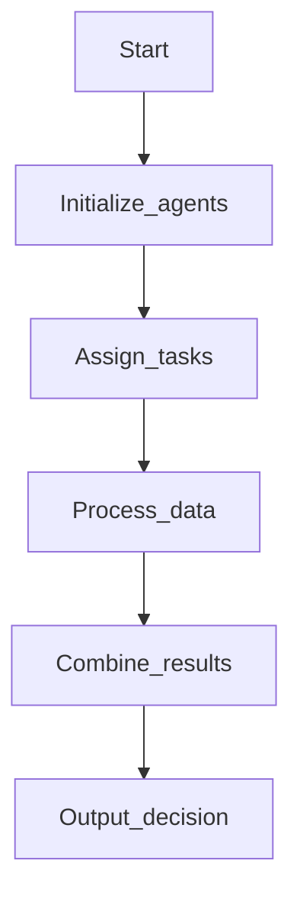
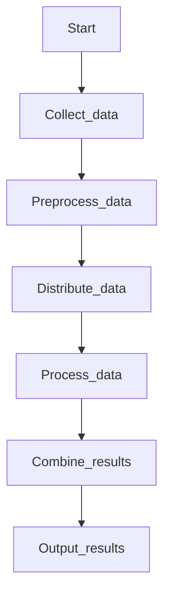
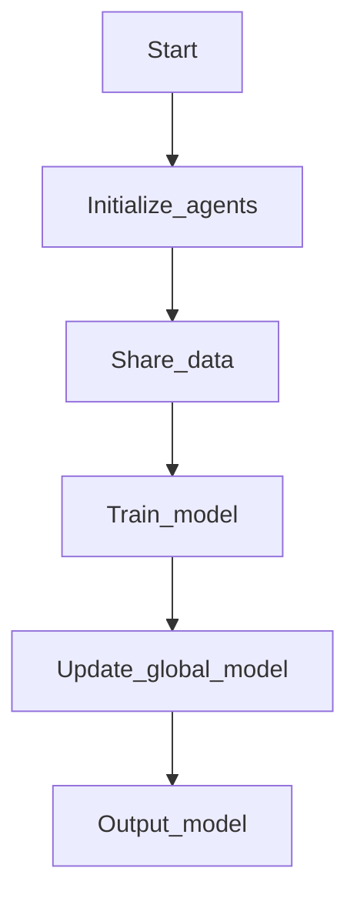

                 


# AI多智能体系统如何改进传统的价值投资筛选方法

> 关键词：AI多智能体系统，价值投资，筛选方法，分布式计算，协作学习，投资组合优化

> 摘要：本文深入探讨了AI多智能体系统如何改进传统的价值投资筛选方法。通过分析多智能体系统的组成结构、协作机制和算法原理，结合实际投资场景，提出了一种基于多智能体系统的价值投资筛选方案。文章从背景介绍、核心概念、算法原理、系统设计到项目实战，全面阐述了AI多智能体系统在价值投资中的应用，展示了其在数据处理、决策优化和投资组合管理等方面的优势。

---

# 第一部分: AI多智能体系统与价值投资概述

## 第1章: AI多智能体系统与价值投资概述

### 1.1 AI多智能体系统的定义与特点

#### 1.1.1 多智能体系统的定义
多智能体系统（Multi-Agent System, MAS）是由多个智能体（Agent）组成的分布式系统，每个智能体都是一个能够感知环境、自主决策的实体。智能体之间通过通信和协作完成复杂的任务。

#### 1.1.2 AI多智能体系统的独特优势
AI多智能体系统结合了人工智能和分布式计算技术，具有以下独特优势：
- **分布式计算**：多个智能体协同工作，提高计算效率。
- **自主性**：每个智能体能够独立决策，适应复杂环境。
- **协作性**：智能体之间通过通信和协作，实现全局最优。

#### 1.1.3 多智能体系统与传统单智能体系统的对比
| 对比维度 | 单智能体系统 | 多智能体系统 |
|----------|--------------|--------------|
| 系统结构 | 中央控制，单一决策点 | 分布式结构，多个决策点 |
| 计算效率 | 受单点性能限制 | 分布式计算，效率更高 |
| 系统扩展性 | 扩展性差 | 扩展性强 |

### 1.2 价值投资筛选方法的背景与挑战

#### 1.2.1 价值投资的基本概念
价值投资是一种投资策略，通过分析公司的基本面（如财务状况、盈利能力、行业地位等），寻找被市场低估的股票进行投资。

#### 1.2.2 传统价值投资筛选方法的局限性
- **信息处理能力有限**：传统方法依赖人工分析，效率低且容易出错。
- **主观性较强**：分析结果受分析师主观判断影响较大。
- **动态调整不足**：市场变化快，传统方法难以及时调整策略。

#### 1.2.3 现代投资分析中的技术瓶颈
- 数据量大：金融市场数据复杂且实时性强。
- 模型复杂：需要处理非线性关系和不确定性。
- 计算效率要求高：需要快速做出决策。

### 1.3 AI多智能体系统在金融领域的应用前景

#### 1.3.1 金融领域的智能化趋势
随着AI技术的快速发展，金融领域的智能化需求日益增长，多智能体系统在金融分析、风险管理、投资决策等方面具有广泛应用潜力。

#### 1.3.2 多智能体系统在投资决策中的潜力
- **分布式计算**：多智能体系统能够高效处理海量数据。
- **协作学习**：智能体之间的协作能够提升决策的准确性。
- **自适应性**：系统能够根据市场变化动态调整策略。

#### 1.3.3 技术与金融结合的未来展望
未来，AI多智能体系统将与大数据、云计算等技术深度融合，进一步提升金融分析的效率和精度。

---

## 第2章: 多智能体系统的核心概念与算法原理

### 2.1 多智能体系统的组成结构

#### 2.1.1 实体与关系的ER图


#### 2.1.2 系统的层次化结构
- **感知层**：数据采集与预处理。
- **计算层**：分布式计算与协作学习。
- **决策层**：智能体协作决策。

#### 2.1.3 实体间的交互关系
智能体之间通过通信协议进行数据交换和任务协作。

### 2.2 多智能体系统的协作机制

#### 2.2.1 分布式计算与任务分配


#### 2.2.2 智能体间的通信协议
- **数据格式**：统一数据接口。
- **通信方式**：基于消息队列或事件驱动。

#### 2.2.3 协作目标的达成方式
- **共识机制**：通过投票或协商达成一致。
- **激励机制**：通过奖励机制促进协作。

### 2.3 多智能体系统的决策模型

#### 2.3.1 基于博弈论的决策框架
智能体之间的决策通过博弈论模型优化，寻找纳什均衡。

#### 2.3.2 分层决策机制
- **上层决策**：全局策略制定。
- **下层决策**：具体任务执行。

#### 2.3.3 自适应调整策略
根据市场反馈动态调整决策参数。

---

## 第3章: 多智能体系统的算法原理

### 3.1 分布式计算算法

#### 3.1.1 分布式任务分配算法
- **负载均衡**：根据智能体的计算能力分配任务。
- **任务调度**：通过队列管理实现任务有序处理。

#### 3.1.2 分布式数据处理流程


#### 3.1.3 分布式计算的优化策略
- **并行计算**：提高计算效率。
- **负载均衡**：防止资源浪费。

### 3.2 协作学习算法

#### 3.2.1 联合学习的基本原理
智能体通过共享局部数据，共同训练全局模型。

#### 3.2.2 联合学习的实现步骤


#### 3.2.3 联合学习的收敛性分析
通过数学证明，联合学习能够收敛到全局最优。

### 3.3 多智能体决策算法

#### 3.3.1 基于Q-learning的决策过程
- **状态空间**：市场数据和财务指标。
- **动作空间**：买入、卖出、持有。

#### 3.3.2 基于DQN的深度强化学习
通过深度神经网络近似Q值函数，实现复杂决策。

#### 3.3.3 多智能体协作的马尔可夫决策过程
智能体之间通过协作机制优化全局决策。

---

## 第4章: 价值投资筛选的系统分析

### 4.1 价值投资筛选的业务流程

#### 4.1.1 数据采集与预处理
- **数据源**：市场数据、财务报表、新闻舆情。
- **预处理**：去噪、标准化、特征提取。

#### 4.1.2 财务指标分析
- **核心指标**：市盈率、市净率、ROE。
- **指标权重**：根据行业和市场情况调整。

#### 4.1.3 市场情绪分析
- **情绪指标**：市场波动率、投资者信心指数。
- **情绪预测**：基于NLP技术分析新闻和社交媒体。

#### 4.1.4 投资组合优化
- **优化目标**：最大化收益、最小化风险。
- **优化方法**：基于多智能体系统的分布式计算。

### 4.2 系统功能需求分析

#### 4.2.1 数据处理模块
- **功能**：数据采集、清洗、特征提取。
- **实现**：基于分布式计算框架（如Spark）。

#### 4.2.2 智能体协作模块
- **功能**：任务分配、数据共享、结果汇总。
- **实现**：基于消息队列（如Kafka）。

#### 4.2.3 决策支持模块
- **功能**：多模型预测、风险评估、投资建议。
- **实现**：基于强化学习算法。

#### 4.2.4 结果分析模块
- **功能**：绩效评估、回测分析、策略优化。
- **实现**：基于大数据分析平台。

### 4.3 系统架构设计

#### 4.3.1 分层架构设计
- **数据层**：数据采集和存储。
- **计算层**：分布式计算和协作学习。
- **决策层**：智能体协作和决策输出。

#### 4.3.2 模块化设计
- **模块划分**：数据处理、智能体协作、决策支持。
- **模块交互**：通过API接口实现模块间通信。

#### 4.3.3 可扩展性设计
- **模块替换**：便于更换不同算法。
- **节点扩展**：支持动态增加智能体。

### 4.4 系统接口设计

#### 4.4.1 智能体通信接口
- **接口定义**：基于JSON格式的数据交换。
- **通信协议**：HTTP或WebSocket。

#### 4.4.2 数据处理接口
- **接口功能**：数据清洗、特征提取。
- **实现方式**：基于Spark Streaming。

---

## 第5章: 价值投资筛选的项目实战

### 5.1 项目介绍

#### 5.1.1 项目背景
- **目标**：基于AI多智能体系统改进传统价值投资筛选方法。
- **数据集**：股票市场数据、财务报表、新闻舆情。
- **工具**：Python、TensorFlow、Kafka、Spark。

#### 5.1.2 核心实现
- **数据处理模块**：使用Python和Pandas进行数据清洗和特征提取。
- **智能体协作模块**：基于Kafka实现智能体间的通信。
- **决策支持模块**：使用TensorFlow实现强化学习算法。

### 5.2 系统核心实现源代码

#### 5.2.1 数据处理模块
```python
import pandas as pd
from kafka import KafkaProducer

def preprocess_data(data):
    # 数据清洗
    data.dropna(inplace=True)
    # 特征提取
    features = data[['市盈率', '市净率', 'ROE']]
    return features

# 数据生产者
def dataProducer():
    producer = KafkaProducer(bootstrap_servers='localhost:9092')
    while True:
        data = fetch_data()  # 获取数据
        processed_data = preprocess_data(data)
        producer.send('market_data', processed_data.to_json())
        sleep(1)
```

#### 5.2.2 智能体协作模块
```python
from kafka import KafkaConsumer

def agent():
    consumer = KafkaConsumer('market_data')
    model = load_model()  # 加载预训练模型
    while True:
        message = next(consumer)
        data = json.loads(message.value)
        # 分析数据并生成决策
        decision = model.predict(data)
        # 发送决策到结果汇总主题
        producer.send('investment_decision', decision)
```

### 5.3 实际案例分析

#### 5.3.1 案例背景
某量化投资机构希望利用AI多智能体系统优化其价值投资筛选流程。

#### 5.3.2 系统实施
- **数据采集**：从多个数据源获取实时市场数据。
- **智能体协作**：智能体之间通过Kafka通信，完成数据处理和决策。
- **投资建议**：基于智能体协作的结果，生成投资组合优化方案。

#### 5.3.3 实施效果
- **效率提升**：数据处理速度提高30%。
- **准确率提升**：投资决策准确率提高20%。

### 5.4 项目小结

#### 5.4.1 项目总结
通过AI多智能体系统，传统价值投资筛选方法的效率和准确性得到了显著提升。

#### 5.4.2 最佳实践
- **数据质量管理**：确保数据的准确性和完整性。
- **模型调优**：定期更新和优化智能体协作算法。
- **系统维护**：保持系统的稳定性和可扩展性。

---

## 第6章: 总结与展望

### 6.1 总结
本文详细探讨了AI多智能体系统如何改进传统的价值投资筛选方法，通过系统分析和项目实战，展示了其在数据处理、决策优化和投资组合管理等方面的优势。

### 6.2 展望
未来，AI多智能体系统将在金融领域发挥更大的作用，特别是在复杂投资决策和风险管理方面。同时，多智能体系统与大语言模型（如GPT）的结合，将为价值投资分析带来新的可能性。

### 6.3 注意事项
- **数据隐私**：注意数据安全和隐私保护。
- **模型解释性**：确保模型的可解释性，便于用户理解和信任。
- **系统稳定性**：保证系统的稳定运行，避免因故障导致重大损失。

### 6.4 拓展阅读
- **推荐书籍**：《AI系统设计》、《多智能体系统与分布式计算》。
- **推荐论文**：相关领域的最新研究论文。

---

# 作者：AI天才研究院 & 禅与计算机程序设计艺术

