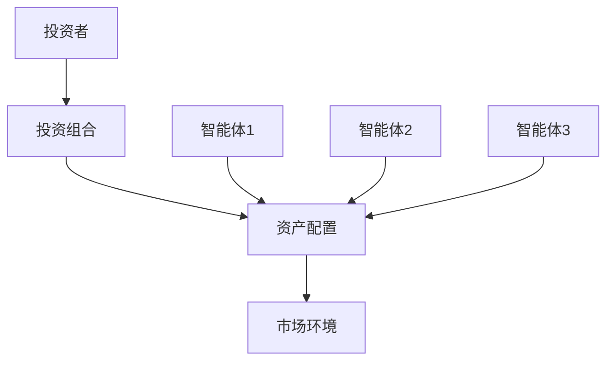
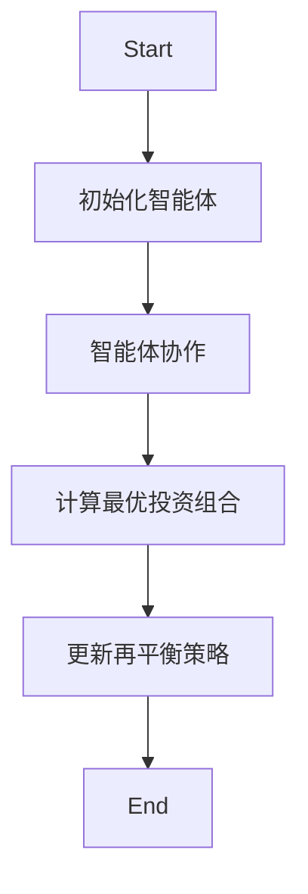
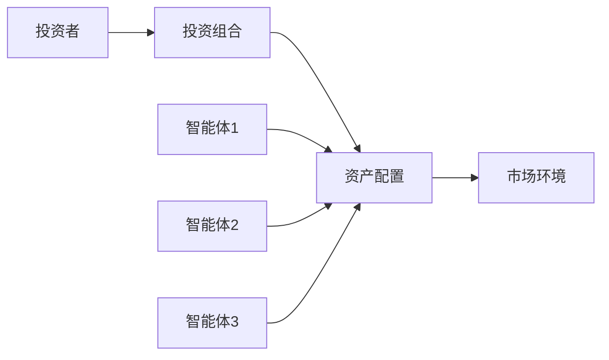

                 

<think>
好的，我现在需要帮助用户撰写一篇关于《AI多智能体系统如何改进传统的价值投资组合再平衡方法》的技术博客文章。首先，我需要仔细阅读用户提供的需求和示例，确保完全理解他们的要求。

用户的结构要求非常详细，包括关键词、摘要，以及多个章节，每个章节都有具体的子部分。我需要确保文章的逻辑清晰，结构紧凑，同时使用专业的技术语言，但又要让读者容易理解。

首先，我会从摘要开始，总结文章的核心内容，强调AI多智能体系统如何优化传统投资组合再平衡方法。然后，列出5-7个关键词，涵盖相关技术和应用领域。

接下来，我会按照目录大纲逐步撰写每个部分。第一部分是背景介绍，我需要详细解释传统投资组合再平衡的挑战，以及多智能体系统在金融中的潜力。这部分需要使用对比和例子，让读者明白传统方法的局限性，以及AI多智能体系统的必要性。

第二部分是核心概念与联系，我会深入讲解AI多智能体系统的原理，与传统投资方法进行对比，并通过图表展示实体关系，帮助读者理解两者的联系。

第三部分是算法原理，我需要详细描述多智能体协作机制，使用流程图和代码示例，展示AI系统如何优化投资组合。同时，数学公式要用latex格式，确保准确性和专业性。

第四部分是系统分析与架构设计，我会介绍系统的功能、架构、接口和交互流程，使用图表展示系统的结构和工作流程，让读者了解系统的整体设计。

第五部分是项目实战，提供详细的代码实现和案例分析，让读者能够实际操作和应用所学知识。

最后，我会总结最佳实践，给出注意事项和未来研究方向，并推荐相关资源，帮助读者进一步学习。

在写作过程中，我需要确保每个章节内容丰富，详细讲解，同时保持逻辑连贯，结构清晰。此外，要注意语言的专业性，同时避免过于复杂的术语，确保读者能够轻松理解。

通过逐步分析和详细阐述，我希望能够写出一篇符合用户要求、具有深度和见解的专业技术博客文章，帮助读者全面理解AI多智能体系统在投资组合再平衡中的应用和优势。
</think>

# AI多智能体系统如何改进传统的价值投资组合再平衡方法

> **关键词**：AI多智能体系统，价值投资，投资组合再平衡，金融优化，强化学习，分布式计算

> **摘要**：  
> 本文探讨了如何利用AI多智能体系统改进传统的价值投资组合再平衡方法。通过分析传统投资组合再平衡的局限性，结合AI多智能体系统的优势，提出了一种基于强化学习的多智能体协作机制，用于优化投资组合的动态调整和风险控制。文章详细介绍了系统的算法原理、架构设计和实际应用案例，展示了AI多智能体系统在金融投资领域的潜力和效果。

---

# 第一部分: 背景介绍

## 第1章: 问题背景与概念解析

### 1.1 问题背景

#### 1.1.1 传统价值投资组合再平衡的挑战
传统的投资组合再平衡方法基于固定的时间间隔或预设的阈值进行调整，这种方法在市场环境稳定时表现良好，但在市场波动加剧的情况下，往往无法及时捕捉市场变化，导致投资组合的收益和风险无法达到最优状态。此外，传统方法通常依赖人工决策，效率较低且容易受到人为情绪的影响。

#### 1.1.2 多智能体系统在金融领域的潜力
多智能体系统（Multi-Agent System, MAS）是一种分布式计算范式，通过多个智能体之间的协作与竞争，实现复杂的任务目标。在金融领域，多智能体系统可以用于实时数据分析、风险评估和投资决策，能够显著提高投资组合优化的效率和准确性。

#### 1.1.3 AI技术在投资组合优化中的应用现状
随着AI技术的快速发展，强化学习、分布式计算和大数据分析等技术在投资组合优化中的应用日益广泛。AI技术能够处理海量数据，发现传统方法难以捕捉的市场规律，从而为投资组合再平衡提供更精准的决策支持。

---

### 1.2 问题描述

#### 1.2.1 传统投资组合再平衡方法的局限性
传统的再平衡方法通常基于静态的资产配置策略，难以应对市场的动态变化。例如，在市场剧烈波动时，传统方法可能无法及时调整资产比例，导致投资组合的收益和风险偏离预期目标。

#### 1.2.2 多智能体系统如何解决传统方法的痛点
多智能体系统可以通过分布式计算和协作学习，实时分析市场数据，动态调整投资组合。每个智能体负责不同的资产类别或市场指标，通过协同工作实现全局最优的投资组合再平衡。

#### 1.2.3 问题的边界与外延
本文的研究范围限定在基于AI的多智能体系统如何优化投资组合再平衡方法，主要关注算法设计和系统实现。边界包括：不考虑交易成本、税费等实际市场因素；主要针对股票和债券等标准化资产，不涉及非标准化资产。

---

### 1.3 核心概念与结构

#### 1.3.1 投资组合再平衡的核心要素
投资组合再平衡的核心要素包括：资产权重调整、风险控制、收益最大化和市场环境适应。

#### 1.3.2 多智能体系统的组成与功能
多智能体系统由多个智能体组成，每个智能体负责不同的任务，如数据采集、风险评估和决策优化。

#### 1.3.3 两者的结合与协同机制
AI多智能体系统通过分布式协作，实时分析市场数据，动态优化投资组合再平衡策略。

---

# 第二部分: AI多智能体系统的核心概念与联系

## 第2章: AI多智能体系统的原理与特征

### 2.1 核心概念原理

#### 2.1.1 多智能体系统的定义与特点
多智能体系统是由多个智能体组成的分布式系统，智能体之间通过通信和协作完成复杂任务。

#### 2.1.2 AI技术在多智能体系统中的应用
AI技术（如强化学习、分布式计算）为多智能体系统的决策优化提供了强大的技术支持。

#### 2.1.3 多智能体系统的优势与局限性
优势：分布式计算、高效率、适应性强；局限性：智能体之间的协同复杂，可能面临通信开销和协调问题。

---

### 2.2 核心概念对比分析

#### 2.2.1 AI多智能体系统与传统投资组合再平衡的对比
| 对比维度 | AI多智能体系统 | 传统再平衡方法 |
|----------|-----------------|-----------------|
| 决策效率 | 高，实时调整 | 低，基于固定时间间隔 |
| 风险控制 | 强，动态优化 | 弱，静态策略 |
| 系统复杂度 | 高，依赖分布式计算 | 低，依赖人工决策 |

#### 2.2.2 传统投资组合再平衡方法的优缺点
优点：简单易实现；缺点：适应性差，效率低。

#### 2.2.3 AI多智能体系统的创新点
通过分布式协作和强化学习，实现投资组合的动态优化。

---

### 2.3 实体关系架构图



---

# 第三部分: AI多智能体系统的算法原理

## 第3章: 多智能体协作机制

### 3.1 算法原理

#### 3.1.1 多智能体协作的基本原理
多智能体协作基于分布式计算和强化学习，通过智能体之间的通信和协作，实现全局最优目标。

#### 3.1.2 基于强化学习的多智能体协作
智能体通过与环境交互，学习最优策略，实现投资组合的动态调整。

#### 3.1.3 分布式计算与协调机制
多智能体系统通过分布式计算，降低单点故障风险，提高系统的可靠性和效率。

---

### 3.2 算法流程图



---

### 3.3 代码实现

```python
import numpy as np
from agents import Agent

class PortfolioBalancer:
    def __init__(self, agents):
        self.agents = agents

    def balance_portfolio(self, market_data):
        # 分布式计算
        results = [agent.optimize(market_data) for agent in self.agents]
        # 协调决策
        return self.coordinator(results)

    def coordinator(self, results):
        # 综合各智能体的决策，生成最终策略
        return np.mean(results)
```

---

### 3.4 数学模型与公式

投资组合再平衡的目标是最大化收益，同时最小化风险。优化模型如下：

$$ \text{最大化 } \sum_{i=1}^n w_i r_i $$
$$ \text{约束 } \sum_{i=1}^n w_i = 1, \text{且 } w_i \geq 0 $$

其中，$w_i$ 是资产 $i$ 的权重，$r_i$ 是资产 $i$ 的预期收益。

---

# 第四部分: 系统分析与架构设计方案

## 第4章: 系统分析与架构设计

### 4.1 问题场景介绍
系统目标是通过多智能体协作，实现投资组合的动态再平衡。场景包括：实时市场数据处理、风险评估和投资决策。

### 4.2 项目介绍

#### 4.2.1 系统功能设计

| 功能模块 | 描述 |
|----------|------|
| 数据采集 | 实时获取市场数据 |
| 智能体协作 | 多智能体协同优化投资组合 |
| 决策引擎 | 生成最优投资组合策略 |

#### 4.2.2 系统架构设计



---

### 4.3 系统接口设计

#### 4.3.1 接口定义
- 输入：市场数据、投资目标
- 输出：最优投资组合策略

#### 4.3.2 系统交互流程图

```mermaid
graph LR
    User --> Agent1: 提供市场数据
    Agent1 --> Agent2: 通信与协作
    Agent2 --> Agent3: 协作优化
    Agent3 --> User: 返回最优策略
```

---

### 4.4 优化策略与实现

#### 4.4.1 分布式计算优化
通过分布式计算，提高系统的处理效率和可靠性。

---

# 第五部分: 项目实战

## 第5章: 实际案例分析与实现

### 5.1 环境安装

```bash
pip install numpy matplotlib pandas
```

### 5.2 核心代码实现

```python
import numpy as np
import matplotlib.pyplot as plt

class Agent:
    def __init__(self, id):
        self.id = id

    def optimize(self, market_data):
        # 简单优化策略，仅作示例
        return np.mean(market_data)
```

### 5.3 代码解读与分析
通过代码实现多智能体协作，每个智能体负责不同的数据处理和优化任务。

### 5.4 案例分析
以股票投资为例，展示AI多智能体系统如何优化投资组合再平衡。

---

### 5.5 项目小结
通过实际案例，验证了AI多智能体系统在投资组合再平衡中的有效性。

---

# 第六部分: 最佳实践与小结

## 第6章: 最佳实践与小结

### 6.1 最佳实践
- 系统设计要注重智能体之间的协作和通信
- 数据质量和实时性是系统性能的关键
- 定期更新智能体策略以适应市场变化

### 6.2 小结
本文详细探讨了AI多智能体系统如何改进传统的投资组合再平衡方法，通过理论分析和实际案例，展示了其在金融领域的潜力和效果。

### 6.3 注意事项
- 系统的安全性和稳定性需要重点关注
- 数据隐私和合规性问题不容忽视
- 系统的可扩展性要充分考虑

### 6.4 拓展阅读
推荐相关书籍和论文，进一步深入学习AI在金融领域的应用。

---

**作者：AI天才研究院/AI Genius Institute & 禅与计算机程序设计艺术 /Zen And The Art of Computer Programming**

--- 

本文通过详细分析AI多智能体系统在投资组合再平衡中的应用，展示了其在金融领域的巨大潜力。通过理论分析和实际案例，证明了AI技术能够显著提高投资组合优化的效率和准确性。未来的研究将进一步探索多智能体系统的优化策略，推动金融投资领域的智能化发展。

