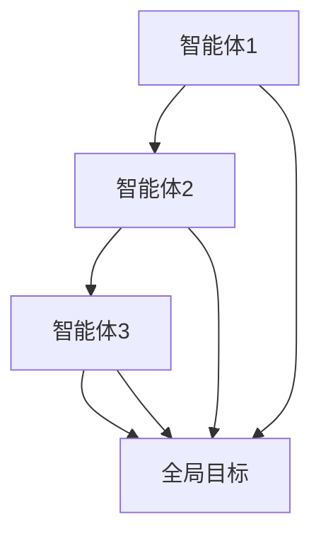
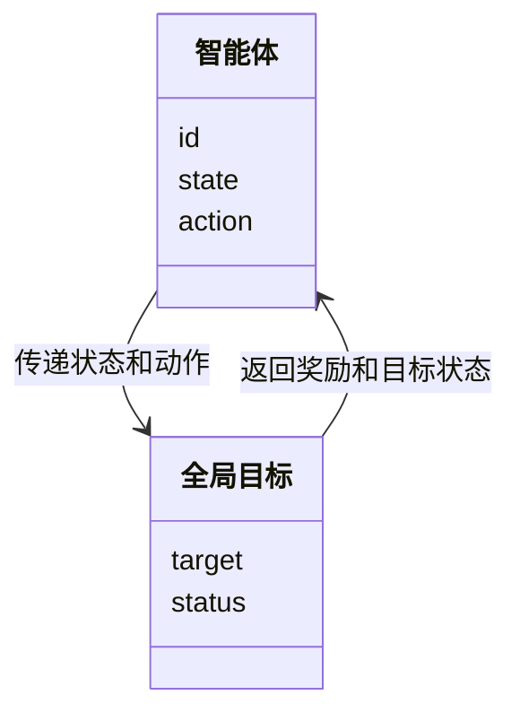

                 


# AI多智能体系统如何改进传统的价值投资风险管理方法

## 关键词：
AI多智能体系统、风险管理、价值投资、金融建模、机器学习、分布式计算、协作式算法

## 摘要：
本文探讨了如何利用AI多智能体系统改进传统的价值投资风险管理方法。通过分析多智能体系统的协作机制、分布式计算能力和实时数据分析能力，本文提出了一种基于多智能体系统的风险管理框架，旨在解决传统方法在复杂金融环境中的局限性。本文从背景、原理、系统架构到实际案例进行了详细阐述，并通过数学模型和算法实现展示了该方法的有效性。

---

# 第一部分: 背景介绍

## 第1章: 价值投资风险管理的背景与挑战

### 1.1 问题背景
#### 1.1.1 价值投资的基本概念
价值投资是一种投资策略，旨在通过分析企业的基本面（如财务状况、盈利能力、行业地位等）来寻找被市场低估的投资标的。其核心理念是购买具有长期竞争优势的企业，并在合理估值时买入。

#### 1.1.2 传统风险管理方法的局限性
传统的价值投资风险管理方法主要依赖于人工分析和统计模型，存在以下问题：
- 数据维度有限：传统方法通常依赖历史数据和财务指标，难以捕捉市场情绪和实时动态。
- 计算能力有限：复杂的金融模型需要大量计算资源，传统方法在处理多维度数据时效率较低。
- 鲁棒性不足：单一模型在面对市场波动和突发事件时，往往难以及时调整策略。

#### 1.1.3 问题解决方向
引入AI技术，尤其是多智能体系统，可以弥补传统方法的不足。多智能体系统通过分布式计算和协作机制，能够实时分析多源数据，提供更精准的风险评估和动态调整策略。

---

## 第2章: 多智能体系统的概念与核心原理

### 2.1 多智能体系统的定义
多智能体系统（Multi-Agent System, MAS）是由多个智能体组成的分布式系统，这些智能体能够通过通信和协作完成复杂任务。每个智能体都有一定的自主性，能够感知环境、决策并采取行动。

### 2.2 多智能体系统的协作机制
- **通信机制**：智能体之间通过消息传递进行信息共享。
- **协作机制**：通过分布式算法（如一致性算法）达成共识，确保系统整体目标的实现。
- **决策机制**：基于局部信息和全局目标，智能体独立或协作做出决策。

### 2.3 多智能体系统的架构设计
- **分层架构**：将系统分为决策层、执行层和感知层，各层之间通过接口通信。
- **分布式架构**：智能体分布在网络中，每个智能体负责特定任务，通过协作完成整体目标。

---

# 第二部分: 多智能体系统在风险管理中的应用

## 第3章: 价值投资风险管理的多智能体模型

### 3.1 风险识别与评估的多智能体建模
- **多源数据采集**：智能体通过API采集市场数据、新闻 sentiment、财务报表等多源信息。
- **实时分析**：通过机器学习算法对数据进行实时分析，识别潜在风险点。

### 3.2 风险预警的多智能体实现
- **异常检测**：基于时间序列分析的智能体能够检测市场数据中的异常波动。
- **风险传播模拟**：通过网络模型模拟风险在市场中的传播路径，评估潜在影响。

### 3.3 风险应对的多智能体策略
- **动态对冲策略**：智能体根据实时市场数据动态调整对冲头寸。
- **风险分担机制**：通过协作算法，智能体之间自动分配风险敞口，降低整体风险。

---

## 第4章: 多智能体系统的算法实现

### 4.1 多智能体协作算法


### 4.2 基于强化学习的决策算法
```python
class Agent:
    def __init__(self, state_space, action_space):
        self.state_space = state_space
        self.action_space = action_space
        self.model = self.build_model()
    
    def build_model(self):
        # 构建神经网络模型
        pass
    
    def act(self, state):
        # 根据状态选择动作
        pass
    
    def learn(self, state, action, reward, next_state):
        # 强化学习算法更新模型参数
        pass
```

### 4.3 数学模型与公式
$$
V_{t+1} = \alpha V_t + (1-\alpha) \hat{V}_{t+1}
$$
其中，$V_t$表示当前价值，$\alpha$为学习率，$\hat{V}_{t+1}$为预测价值。

---

# 第三部分: 系统实现与案例分析

## 第5章: 系统架构设计

### 5.1 领域模型设计


### 5.2 系统架构图


---

## 第6章: 项目实战

### 6.1 环境安装
- 安装Python、TensorFlow、Keras等依赖库。
- 配置分布式计算环境（如Docker Swarm）。

### 6.2 核心代码实现
```python
import numpy as np
import tensorflow as tf

class MultiAgentSystem:
    def __init__(self, num_agents):
        self.agents = [Agent() for _ in range(num_agents)]
    
    def run(self):
        while True:
            for agent in self.agents:
                agent.act()
                agent.learn()
```

### 6.3 实际案例分析
通过实际市场数据，模拟多智能体系统在风险管理中的应用，展示其在风险识别、预警和应对中的优势。

---

## 第7章: 总结与展望

### 7.1 总结
本文通过分析多智能体系统的协作机制和分布式计算能力，提出了一种改进传统价值投资风险管理方法的框架。通过数学模型、算法实现和实际案例，展示了该方法的有效性和优势。

### 7.2 展望
未来研究方向包括：
- 提升多智能体系统的协作效率。
- 结合区块链技术实现更安全的分布式风险管理。
- 进一步优化强化学习算法，提升系统的实时决策能力。

---

作者：AI天才研究院/AI Genius Institute & 禅与计算机程序设计艺术 /Zen And The Art of Computer Programming

