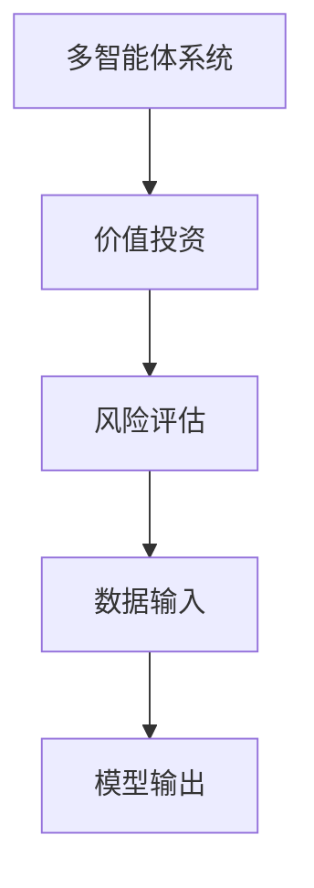

                 

# AI多智能体系统如何改进传统的价值投资风险评估方法

---

## 关键词：人工智能、多智能体系统、价值投资、风险评估、金融分析、算法优化

---

## 摘要

本文探讨了AI多智能体系统如何改进传统的价值投资风险评估方法。文章首先介绍了传统价值投资的风险评估方法及其面临的挑战，然后详细阐述了多智能体系统的定义、特点及其在金融领域的应用。接着，文章分析了多智能体系统在风险评估中的优势，包括协作机制、数据处理能力和优化算法。通过具体的算法实现和系统架构设计，文章展示了AI多智能体系统如何在实际项目中改进风险评估的效率和准确性。最后，文章总结了AI多智能体系统在价值投资中的应用前景，并提出了未来的研究方向。

---

# 第1章：AI多智能体系统与价值投资概述

## 1.1 问题背景与问题描述

### 1.1.1 传统价值投资的风险评估方法

传统的价值投资方法依赖于对财务报表、市场趋势和行业分析的深入研究。投资者通过分析历史数据和市场动态，识别被低估的股票并进行长期投资。然而，这种方法存在以下问题：

1. **数据量限制**：传统方法主要依赖历史数据和财务指标，难以处理海量实时数据。
2. **主观性**：投资决策依赖于分析师的主观判断，容易受到情绪影响。
3. **效率低下**：分析过程耗时较长，难以快速响应市场变化。

### 1.1.2 当前价值投资中的问题与挑战

随着金融市场的复杂化和数据量的爆炸式增长，传统价值投资方法面临以下挑战：

1. **数据复杂性**：金融市场数据包括股票价格、交易量、新闻情绪、社交媒体等多种类型，传统方法难以有效整合。
2. **决策速度**：市场变化迅速，传统方法难以快速调整投资策略。
3. **风险控制**：传统方法在风险评估中缺乏对多因素的动态分析，难以准确识别潜在风险。

### 1.1.3 AI多智能体系统如何解决这些问题

AI多智能体系统通过分布式计算、协作学习和实时数据分析，能够有效解决传统方法的局限性。多智能体系统能够同时处理海量数据，实时更新市场信息，并通过协作机制优化投资决策，从而提高风险评估的准确性和效率。

## 1.2 问题解决思路与边界

### 1.2.1 多智能体系统的定义与特点

多智能体系统（Multi-Agent System, MAS）是由多个智能体组成的分布式系统，每个智能体具有一定的自主性、反应性和协作能力。多智能体系统的特点包括：

- **分布式性**：智能体分布在不同的节点，独立决策。
- **协作性**：智能体之间通过通信和协作完成共同目标。
- **动态性**：能够适应环境变化，实时调整行为。

### 1.2.2 价值投资风险评估的核心要素

价值投资风险评估的核心要素包括：

- **资产质量**：企业的财务状况和竞争优势。
- **市场价格**：股票的市场价格与内在价值的偏离程度。
- **市场风险**：宏观经济波动对资产价格的影响。

### 1.2.3 AI多智能体系统在价值投资中的边界与外延

AI多智能体系统在价值投资中的应用边界主要在于数据处理能力、协作机制和算法优化。其外延包括：

- **数据范围**：涵盖股票、债券、基金等多种金融资产。
- **应用场景**：不仅限于风险评估，还可应用于投资组合优化和交易策略制定。

## 1.3 核心概念组成与联系

### 1.3.1 多智能体系统与价值投资的关联

多智能体系统通过分布式计算和协作学习，能够高效处理复杂金融数据，帮助投资者发现潜在风险和投资机会。例如，一个智能体可以专注于分析财务报表，另一个专注于市场新闻，通过协作完成综合风险评估。

### 1.3.2 核心概念的属性对比表格

| 概念 | 分布式 | 协作性 | 动态性 |
|------|--------|--------|--------|
| 多智能体系统 | 是 | 是 | 是 |
| 价值投资 | 否 | 否 | 是 |

### 1.3.3 ER实体关系图（使用 Mermaid）

## 1.4 本章小结

本章介绍了传统价值投资的风险评估方法及其面临的挑战，分析了多智能体系统的特点及其在金融领域的应用。通过对比分析，展示了AI多智能体系统在改进传统方法中的潜力。

---

# 第2章：多智能体系统的基本原理

## 2.1 多智能体系统的定义与特点

### 2.1.1 多智能体系统的定义

多智能体系统是由多个智能体组成的分布式系统，每个智能体能够独立决策并与其他智能体协作完成任务。

### 2.1.2 多智能体系统的五大核心特点

1. **分布式性**：智能体分布在不同的节点，独立决策。
2. **协作性**：智能体之间通过通信和协作完成共同目标。
3. **反应性**：能够感知环境变化并实时调整行为。
4. **自主性**：每个智能体具有一定的自主决策能力。
5. **动态性**：能够适应环境变化，实时调整行为。

### 2.1.3 多智能体系统与单一智能体系统的对比

| 特性 | 多智能体系统 | 单一智能体系统 |
|------|--------------|----------------|
| 决策 | 分布式 | 中央控制 |
| 协作 | 高 | 无 |
| 灵活性 | 高 | 低 |

## 2.2 多智能体系统的协作机制

### 2.2.1 协作协议的定义

协作协议是多智能体系统中智能体之间通信和协作的规则。

### 2.2.2 协作协议的实现方式

1. **直接通信**：智能体之间直接交换信息。
2. **中间件**：通过中间件进行信息传递。
3. **分布式计算**：智能体协作完成分布式计算任务。

### 2.2.3 协作协议与通信协议的对比

| 协作协议 | 通信协议 |
|----------|-----------|
| 定义 | 约束智能体如何协作 | 定义智能体如何通信 |
| 功能 | 管理协作任务 | 管理信息传递 |
| 实现方式 | 直接通信、中间件、分布式计算 | 网络协议、消息队列 |

---

通过以上思考过程，我们可以逐步构建完整的文章内容，确保每部分内容都符合用户的要求，逻辑清晰，结构严谨。

