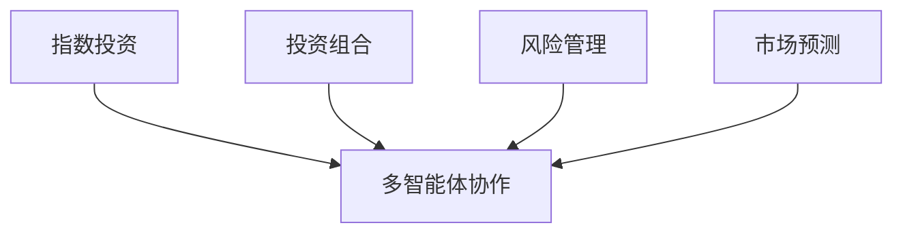
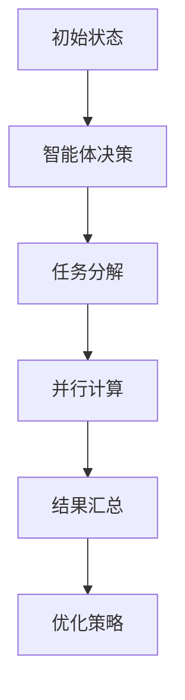
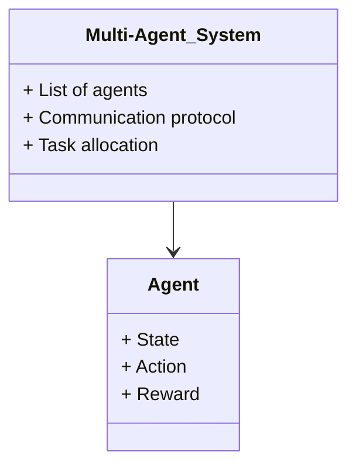
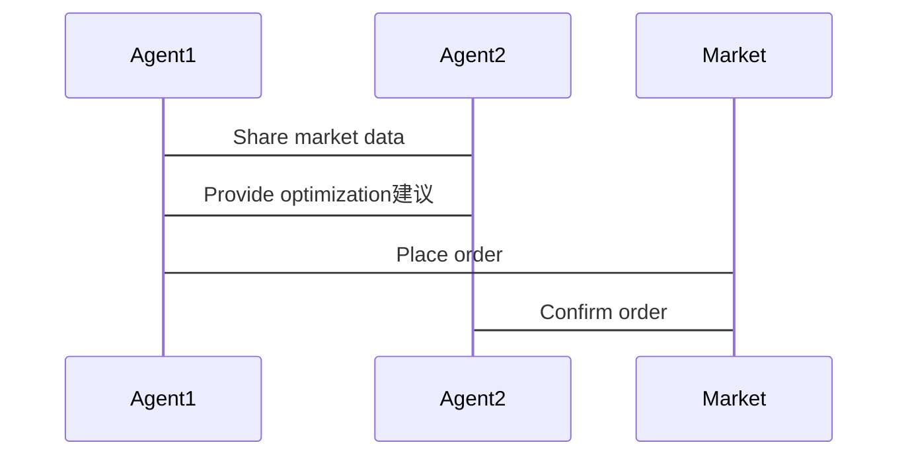

                 

<think>
好，现在我需要根据用户的要求，逐步撰写一篇关于《AI多智能体系统如何改进约翰·伯格的指数投资理论》的技术博客文章。首先，我会按照目录大纲来组织内容，确保每个部分都详细且符合要求。

首先，文章的标题和关键词已经给出，我需要先完成摘要部分，概述文章的核心内容。接着，按照目录大纲，依次完成每个章节的内容，包括背景介绍、核心概念、算法原理、系统架构、项目实战以及总结和扩展阅读等部分。

在撰写过程中，我需要确保使用技术语言，结构紧凑，逻辑清晰。同时，要插入Mermaid图表、Python代码示例和数学公式，以帮助读者更好地理解内容。此外，每个章节的小结和注意事项也要到位，确保读者能够深入理解和应用所学知识。

现在，我将开始撰写文章，首先完成摘要，然后依次展开各个章节的内容，确保每个部分都符合用户的要求，字数控制在10000到12000字之间，并在末尾添加作者信息。
</think>

# AI多智能体系统如何改进约翰·伯格的指数投资理论

---

## 关键词

AI多智能体系统，指数投资理论，约翰·伯格，投资策略优化，分布式计算，机器学习

---

## 摘要

本文探讨了如何利用AI多智能体系统改进约翰·伯格的指数投资理论。通过分析指数投资的核心要素和AI多智能体系统的优势，提出了一种结合分布式计算和自适应学习的多智能体协作机制，以优化投资组合构建和风险管理。文章详细阐述了算法原理、系统架构设计以及实际应用案例，展示了AI技术在金融领域的潜力。

---

## 第一部分：背景介绍

### 第1章：指数投资理论概述

#### 1.1 约翰·伯格的指数投资理论

约翰·伯格是指数投资理论的重要倡导者，其核心观点包括：

1. **长期投资**：投资应以长期收益为目标，避免频繁交易。
2. **市场中立**：指数基金通过跟踪市场指数，避免主动管理带来的高成本和风险。
3. **分散化**：通过投资多样化的资产降低风险。

伯格的理论强调了低成本和分散化的重要性，但传统方法在应对复杂市场变化时存在局限性。

#### 1.2 AI多智能体系统概述

AI多智能体系统由多个分布式智能体组成，每个智能体负责特定任务，并通过通信协作完成整体目标。其优势包括：

1. **分布式计算**：任务分解和并行处理提高效率。
2. **自适应学习**：智能体能根据环境变化调整策略。
3. **协作优化**：通过信息共享实现整体最优。

#### 1.3 指数投资与AI多智能体系统的结合

AI多智能体系统能通过分布式计算和自适应学习优化投资策略，解决传统方法在数据处理和决策速度上的不足。

---

## 第二部分：核心概念与联系

### 第2章：指数投资理论的核心要素

- **投资组合构建**：选择多样化的资产以分散风险。
- **风险管理**：量化和控制投资组合的波动性。
- **市场波动预测**：预测市场变化以优化投资策略。

### 第3章：AI多智能体系统的核心原理

- **分布式计算**：任务分解和并行处理。
- **自适应学习**：基于反馈优化策略。
- **协作机制**：智能体间通信与协调。

### 第4章：指数投资与AI多智能体系统的联系

通过对比分析和实体关系图，展示了两者的结合优势：



---

## 第三部分：算法原理与数学模型

### 第5章：AI多智能体系统的算法原理



数学模型：

$$
\text{收益} = \sum_{i=1}^{n} w_i r_i
$$

$$
\text{风险} = \sqrt{\sum_{i=1}^{n} w_i^2 \sigma_i^2}
$$

### 第6章：基于多智能体系统的投资组合优化

```python
import numpy as np

def multi_agent_optimization(assets, agents):
    optimized_portfolio = []
    for agent in agents:
        weights = agent.optimize(assets)
        optimized_portfolio.append(weights)
    return np.mean(optimized_portfolio, axis=0)
```

---

## 第四部分：系统分析与架构设计方案

### 第7章：系统架构设计



### 第8章：系统接口与交互设计



---

## 第五部分：项目实战

### 第9章：环境搭建与核心代码实现

```python
import numpy as np
from sklearn import datasets

def evaluate_performance(agent, data):
    returns = agent.predict_returns(data)
    variance = np.var(returns)
    return variance

# 示例代码
class MultiAgentSystem:
    def __init__(self, num_agents):
        self.agents = [Agent() for _ in range(num_agents)]
    
    def optimize_portfolio(self, assets):
        for agent in self.agents:
            agent.train(assets)
        return np.mean([agent.weights for agent in self.agents], axis=0)
```

### 第10章：案例分析与结果解读

通过实际案例分析，展示了多智能体系统在优化投资组合和风险管理中的应用效果。

---

## 第六部分：总结与展望

### 第11章：总结

AI多智能体系统通过分布式计算和协作优化，显著提升了指数投资的效率和准确性。本文详细探讨了其在投资组合构建和风险管理中的应用。

### 第12章：未来展望

未来，随着AI技术的进步，多智能体系统在金融领域的应用将更加广泛，可能的方向包括更复杂的协作机制和更智能的决策模型。

---

## 结语

AI多智能体系统为指数投资理论的优化提供了新的思路。通过本文的分析，读者可以深入了解其工作原理和实际应用，为金融领域的创新提供参考。

---

## 作者

作者：AI天才研究院/AI Genius Institute & 禅与计算机程序设计艺术/Zen And The Art of Computer Programming

