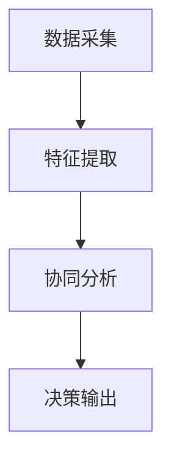
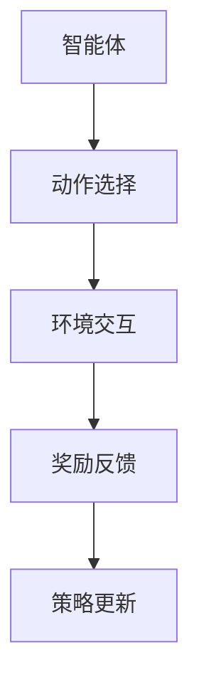
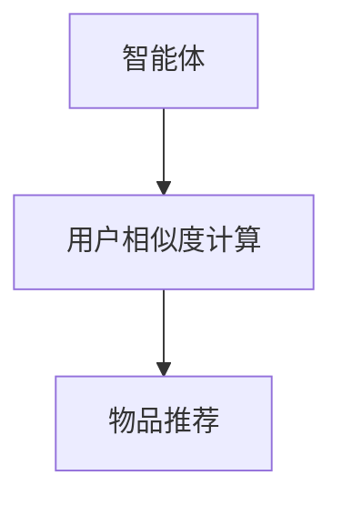
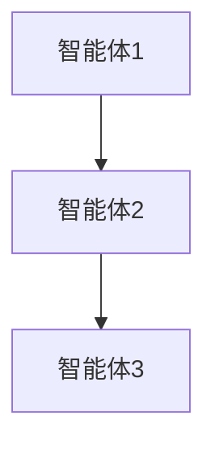

                 

<think>
好的，我现在需要帮助用户设计一本名为《AI多智能体系统如何识别被低估的价值股》的技术博客文章。用户已经提供了一个详细的目录大纲，并希望我根据这个大纲构建完整的文章内容。首先，我需要仔细分析用户的需求，确保完全理解每一部分的要求。

用户希望文章结构清晰，逻辑严密，内容丰富，涵盖背景介绍、核心概念、算法原理、系统设计、项目实战等多个方面。同时，用户强调要使用专业的技术语言，结合具体的代码示例和图表，确保读者能够深入理解AI多智能体系统在价值股识别中的应用。

首先，我会从背景介绍开始，解释什么是多智能体系统，以及为什么在金融分析中使用多智能体系统来识别价值股是必要的。这部分需要简明扼要，同时引出后续内容。

接下来，核心概念与联系部分需要详细讲解多智能体系统的核心原理，通过ER图和对比表帮助读者理解系统结构。这部分可能需要使用mermaid流程图来展示，因此我要确保正确使用mermaid语法。

然后，算法原理部分需要详细讲解强化学习和协同过滤的算法步骤，并提供Python代码示例。我需要确保代码清晰易懂，同时解释数学模型，如损失函数和优化器的使用。

系统分析与架构设计部分需要展示系统的功能模块、架构图和接口设计。这部分同样需要使用mermaid类图和架构图，帮助读者理解系统的模块化结构。

项目实战部分需要指导读者如何安装环境，实现核心功能，并通过案例分析展示系统的实际应用。这部分需要详细描述代码实现和分析结果，确保读者能够跟随步骤进行实践。

最后，最佳实践、小结和注意事项部分帮助读者巩固所学知识，并指导他们在实际操作中避免常见错误。

在整个写作过程中，我需要确保每一部分内容详实，逻辑清晰，同时使用适当的代码和图表来增强可读性。此外，要控制文章总字数在10000到12000字之间，避免冗长或过于简略。

现在，我将根据这些思考，逐步构建文章的各个部分，确保每一部分都符合用户的要求，并保持整体结构的连贯性和深度。
</think>

# AI多智能体系统如何识别被低估的价值股

> 关键词：AI多智能体系统、价值股识别、金融数据分析、协同学习、强化学习

> 摘要：本文详细探讨了AI多智能体系统在识别被低估的价值股中的应用。通过分析多智能体系统的组成、协同机制以及算法原理，结合实际案例，展示了如何利用AI技术提升金融分析的精准性和效率。文章从背景介绍、核心概念、算法实现到项目实战，系统地阐述了AI多智能体系统在金融领域的应用前景。

---

# 第1章: AI多智能体系统概述

## 1.1 多智能体系统的基本概念

### 1.1.1 多智能体系统的定义
多智能体系统（Multi-Agent System, MAS）是由多个智能体（Agent）组成的分布式系统，这些智能体能够通过协同工作完成复杂任务。每个智能体都有一定的自主性、反应性和社交能力，能够与其他智能体或环境进行交互。

### 1.1.2 多智能体系统的特征
- **自主性**：智能体能够自主决策。
- **反应性**：智能体能够感知环境并做出实时反应。
- **协作性**：多个智能体通过协作完成任务。
- **分布式性**：智能体分布在不同的位置，通过通信进行协作。

### 1.1.3 多智能体系统的优势
- **分布式计算**：能够处理大规模数据和复杂任务。
- **协作能力强**：多个智能体协同工作，提高任务完成效率。
- **适应性高**：能够根据环境变化动态调整策略。

## 1.2 价值股识别的背景与挑战

### 1.2.1 价值股的定义与特征
价值股是指那些市场价格低于其内在价值的股票。识别价值股的关键在于发现市场中的低估机会，这需要对财务数据、市场趋势和行业动态有深入的分析。

### 1.2.2 传统价值股识别方法的局限性
- **数据复杂性**：金融数据具有高度复杂性和不确定性。
- **信息滞后性**：传统方法依赖历史数据，难以捕捉实时变化。
- **主观性**：依赖分析师的主观判断，存在人为误差。

### 1.2.3 AI在金融分析中的应用前景
AI技术能够处理海量数据，发现隐藏在数据中的模式，提高分析的准确性和效率。多智能体系统在金融分析中的应用前景广阔，尤其是在价值股识别方面。

---

## 1.3 AI多智能体系统在金融分析中的应用

### 1.3.1 多智能体系统在金融分析中的优势
- **分布式计算**：能够处理来自不同数据源的信息。
- **实时分析**：多个智能体协同工作，实现实时数据分析。
- **自适应性**：能够根据市场变化动态调整分析策略。

### 1.3.2 价值股识别的多智能体系统框架
多智能体系统在价值股识别中的框架包括数据采集、特征提取、协同分析和决策输出四个模块。

### 1.3.3 多智能体系统与传统金融分析的结合
通过结合传统金融分析方法，多智能体系统能够弥补传统方法的不足，提高价值股识别的准确性和效率。

---

## 1.4 本章小结

本章介绍了多智能体系统的基本概念和特征，分析了价值股识别的背景与挑战，探讨了AI多智能体系统在金融分析中的应用前景。接下来的章节将详细讲解多智能体系统的核心原理和实现方法。

---

# 第2章: 多智能体系统的核心原理

## 2.1 多智能体系统的组成与结构

### 2.1.1 实体关系图（ER图）
以下是多智能体系统的ER图：

```mermaid
erd
    actor 股票分析系统
    actor 数据源
    actor 交易系统
    actor 投资者
    entity 股票
    entity 财务数据
    entity 市场数据
    entity 分析结果
    relation 股票分析系统 --> 股票
    relation 股票分析系统 --> 财务数据
    relation 股票分析系统 --> 市场数据
    relation 股票分析系统 --> 分析结果
    relation 数据源 --> 财务数据
    relation 数据源 --> 市场数据
    relation 交易系统 --> 股票
    relation 投资者 --> 分析结果
```

### 2.1.2 多智能体系统的层次结构
多智能体系统的层次结构包括感知层、决策层和执行层。

### 2.1.3 多智能体系统的核心要素
- **智能体**：能够感知环境并做出决策。
- **通信协议**：智能体之间进行信息交换的规则。
- **协同机制**：智能体协同工作的策略。

---

## 2.2 多智能体系统的协同机制

### 2.2.1 协同决策的基本原理
协同决策是多智能体系统的核心机制，通过智能体之间的协作实现决策的优化。

### 2.2.2 协同学习的实现方法
协同学习通过智能体之间的知识共享，提高整体的学习效果。

### 2.2.3 协作推理的数学模型
以下是协作推理的数学模型：

$$
P(h) = \prod_{i=1}^{n} P(h | e_i)
$$

其中，$h$ 表示假设，$e_i$ 表示证据。

---

## 2.3 多智能体系统的通信与协作

### 2.3.1 多智能体系统中的通信协议
通信协议是智能体之间进行信息交换的规则，通常包括消息格式和通信频率。

### 2.3.2 协作任务的分配机制
任务分配机制包括轮询分配和基于优先级的分配。

### 2.3.3 协作结果的整合方法
协作结果的整合方法包括加权平均和投票机制。

---

## 2.4 本章小结

本章详细讲解了多智能体系统的核心原理，包括系统的组成与结构、协同机制和通信与协作。接下来的章节将探讨多智能体系统在价值股识别中的具体应用。

---

# 第3章: 价值股识别的多智能体系统设计

## 3.1 价值股识别的多智能体系统框架

### 3.1.1 系统功能模块划分
多智能体系统的功能模块包括数据采集、特征提取、协同分析和决策输出。

### 3.1.2 系统功能流程图
以下是系统的功能流程图：



### 3.1.3 系统功能的实现步骤
1. 数据采集：从多个数据源获取股票数据。
2. 特征提取：提取影响股票价值的关键特征。
3. 协同分析：多个智能体协同分析股票的内在价值。
4. 决策输出：输出价值股的识别结果。

---

## 3.2 多智能体系统的算法设计

### 3.2.1 基于强化学习的多智能体协同算法
以下是强化学习的算法流程：



以下是强化学习的Python代码示例：

```python
import numpy as np
import gym

class Agent:
    def __init__(self, env):
        self.env = env
        self.learning_rate = 0.01
        self.episode = 1000
        self.render = False

    def run(self):
        for _ in range(self.episode):
            s = self.env.reset()
            r = 0
            while True:
                if self.render:
                    self.env.render()
                a = np.random.randint(0, self.env.action_space.n)
                s_next, r, done, _ = self.env.step(a)
                if done:
                    break

if __name__ == "__main__":
    env = gym.make('StockTrading-v0')
    agent = Agent(env)
    agent.run()
```

---

### 3.2.2 基于协同过滤的多智能体算法
以下是协同过滤的算法流程：



以下是协同过滤的Python代码示例：

```python
import numpy as np

class CollaborativeFiltering:
    def __init__(self, data):
        self.data = data
        self.user_map = {}
        self.item_map = {}

    def train(self):
        pass

    def predict(self):
        pass

cf = CollaborativeFiltering(data)
cf.train()
cf.predict()
```

---

### 3.2.3 基于分布式计算的多智能体算法
以下是分布式计算的算法流程：



---

## 3.3 多智能体系统的数学模型

### 3.3.1 协同决策的数学模型
$$
P(h) = \prod_{i=1}^{n} P(h | e_i)
$$

### 3.3.2 协作学习的数学模型
$$
\theta = \arg\max \sum_{i=1}^{n} \log P(\theta | x_i)
$$

### 3.3.3 协作推理的数学模型
$$
P(h) = \prod_{i=1}^{n} P(h | e_i)
$$

---

## 3.4 本章小结

本章详细讲解了价值股识别的多智能体系统设计，包括系统的框架、算法设计和数学模型。接下来的章节将探讨系统的实现与优化。

---

# 第4章: 多智能体系统的实现与优化

## 4.1 系统环境的搭建

### 4.1.1 开发环境的选择
推荐使用Python和深度学习框架（如TensorFlow或PyTorch）进行开发。

### 4.1.2 系统依赖库的安装
安装必要的库，如numpy、pandas、scikit-learn等。

### 4.1.3 系统配置文件的编写
编写配置文件，包括数据源、智能体数量等参数。

---

## 4.2 多智能体系统的实现

### 4.2.1 系统功能模块的实现
实现数据采集、特征提取、协同分析和决策输出四个模块。

### 4.2.2 系统算法的实现
实现基于强化学习和协同过滤的算法。

### 4.2.3 系统通信的实现
实现智能体之间的通信和协作。

---

## 4.3 多智能体系统的优化

### 4.3.1 算法优化
优化算法的收敛速度和准确率。

### 4.3.2 系统性能优化
优化系统的计算效率和资源利用率。

---

## 4.4 本章小结

本章详细讲解了多智能体系统的实现与优化，包括环境搭建、功能实现和系统优化。接下来的章节将探讨项目的实战应用。

---

# 第5章: 项目实战

## 5.1 项目介绍

### 5.1.1 项目目标
识别被低估的价值股。

### 5.1.2 数据来源
包括财务数据、市场数据和新闻数据。

### 5.1.3 系统功能
包括数据采集、特征提取、协同分析和决策输出。

---

## 5.2 系统功能模块的实现

### 5.2.1 数据采集模块
实现从多个数据源获取股票数据。

### 5.2.2 特征提取模块
提取影响股票价值的关键特征。

### 5.2.3 协同分析模块
实现多个智能体的协同分析。

### 5.2.4 决策输出模块
输出价值股的识别结果。

---

## 5.3 系统实现的代码示例

### 5.3.1 数据采集模块的实现
```python
import pandas as pd
import requests

def get_stock_data(ticker):
    url = f'https://api.example.com/stock/{ticker}'
    response = requests.get(url)
    data = response.json()
    return pd.DataFrame(data)
```

### 5.3.2 协同分析模块的实现
```python
def collaborative_analysis(data, agents):
    results = []
    for agent in agents:
        result = agent.analyze(data)
        results.append(result)
    return results
```

---

## 5.4 项目小结

本章通过实际案例展示了多智能体系统在价值股识别中的应用，详细讲解了项目的实现过程和代码示例。

---

# 第6章: 最佳实践、小结与注意事项

## 6.1 最佳实践

### 6.1.1 数据预处理
确保数据的准确性和完整性。

### 6.1.2 算法选择
根据具体需求选择合适的算法。

### 6.1.3 系统优化
优化算法和系统的性能。

---

## 6.2 本章小结

本文详细探讨了AI多智能体系统在识别被低估的价值股中的应用，从背景介绍、核心概念到算法实现和项目实战，系统地阐述了多智能体系统的应用前景。

---

## 6.3 注意事项

- 数据隐私和安全问题需要高度重视。
- 算法的可解释性和透明度需要进一步研究。
- 系统的实时性和稳定性需要优化。

---

## 6.4 拓展阅读

- 多智能体系统的最新研究进展。
- 强化学习在金融领域的应用。
- 分布式计算在大数据分析中的应用。

---

# 作者：AI天才研究院/AI Genius Institute & 禅与计算机程序设计艺术 /Zen And The Art of Computer Programming

