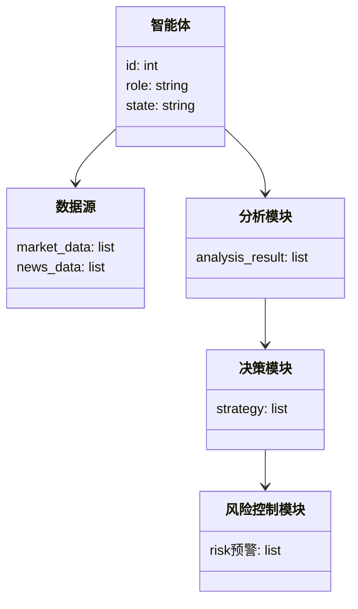
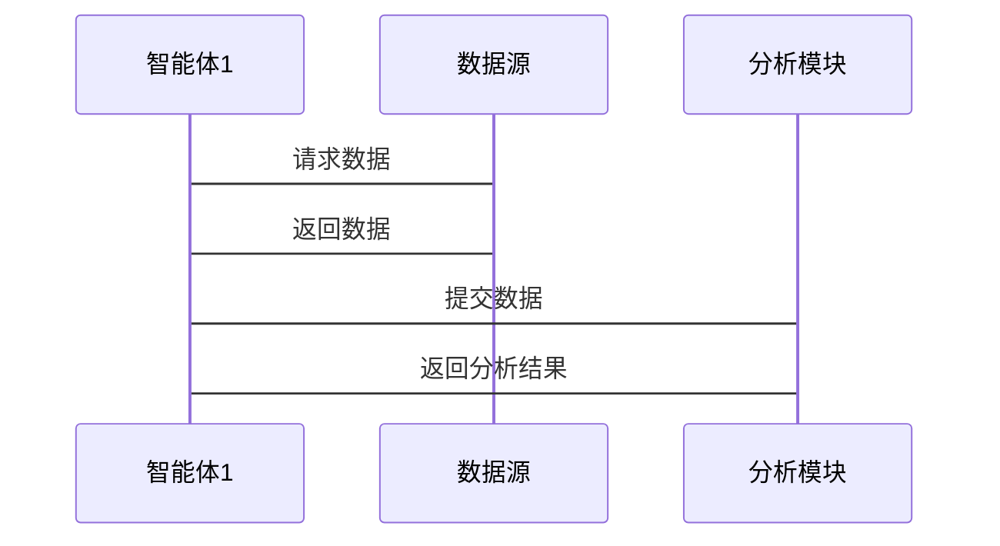

                 

<think>
好，我现在需要帮用户撰写一篇关于AI多智能体系统革新价值投资分析流程的技术博客。首先，我得理解用户的需求。用户希望文章结构清晰，内容专业，涵盖背景、核心概念、算法、系统设计、项目实战和小结等部分。关键词包括AI多智能体系统、价值投资、金融分析、算法革新、系统架构。

首先，我会先写摘要，简要概述文章内容。然后按照目录大纲一步步展开，确保每个章节都详细且逻辑清晰。在背景部分，我需要解释多智能体系统的定义和价值投资分析的现状，说明为什么需要引入AI多智能体系统来革新现有流程。

接下来，在核心概念部分，我会详细讨论多智能体系统的原理、通信机制，以及它们如何应用于金融领域。通过对比表格和ER图，帮助读者理解这些概念。然后，我会讲解相关算法，如Q-learning，用mermaid流程图展示算法流程，并附上Python代码示例。

在系统架构设计部分，我需要介绍系统功能，用类图展示领域模型，架构图展示系统结构，并设计接口和交互流程。项目实战部分，我会指导读者如何安装环境，实现核心代码，并分析实际案例。

最后，我会总结最佳实践，给出小结、注意事项和拓展阅读建议。整个过程需要保持语言的专业性和逻辑性，确保文章结构完整，内容详实。
</think>

# AI多智能体系统革新价值投资分析流程

> 关键词：AI多智能体系统，价值投资分析，金融数据分析，算法革新，系统架构设计

> 摘要：本文深入探讨了AI多智能体系统如何革新传统的价值投资分析流程。通过分析多智能体系统的原理、算法革新以及系统架构设计，结合实际案例，展示了如何利用AI多智能体系统提升金融投资的效率和准确性。

---

# 第一部分: AI多智能体系统与价值投资分析流程的背景与概念

## 第1章: AI多智能体系统概述

### 1.1 AI多智能体系统的定义与特点

#### 1.1.1 多智能体系统的定义  
多智能体系统（Multi-Agent System, MAS）是由多个相互作用的智能体组成的系统，这些智能体通过协作或竞争完成特定任务。与单智能体系统相比，MAS能够更好地处理复杂问题，尤其是在需要分布式决策和协作的场景中。

#### 1.1.2 AI多智能体系统的核心特点  
- **分布式计算**：智能体独立运行，通过通信协作完成任务。
- **自主性**：每个智能体都有一定的决策能力，能够自主行动。
- **协作性**：智能体之间通过通信和协商完成共同目标。
- **动态性**：系统能够适应环境的变化，实时调整策略。

#### 1.1.3 多智能体系统与单智能体系统的区别  
| 特性                | 单智能体系统          | 多智能体系统          |
|---------------------|----------------------|----------------------|
| 决策中心化          | 是                   | 否                   |
| 任务处理方式        | 单一决策              | 分布式决策            |
| 系统复杂性          | 较低                 | 较高                 |
| 应用场景            | 简单任务              | 复杂任务              |

### 1.2 价值投资分析流程的现状与挑战

#### 1.2.1 传统价值投资分析流程的局限性  
- 数据处理能力有限，难以应对海量数据。
- 投资决策依赖人工经验，主观性较强。
- 风险控制能力不足，难以实时调整策略。

#### 1.2.2 数据量与复杂性对传统流程的挑战  
- 金融市场数据复杂，包括价格、成交量、新闻等多维度信息。
- 投资决策需要考虑多种因素，传统方法难以高效处理。
- 风险因素动态变化，传统模型难以实时调整。

#### 1.2.3 价值投资分析流程的数字化转型需求  
- 利用AI技术提升数据分析效率。
- 通过自动化工具增强投资决策的客观性。
- 实现实时监控和动态调整，提升风险控制能力。

---

## 第2章: AI多智能体系统在金融领域的应用

### 2.1 金融领域的多智能体系统应用现状

#### 2.1.1 多智能体系统在金融分析中的优势  
- **分布式计算能力**：能够同时处理海量数据。
- **协作能力**：智能体之间可以分工协作，提升分析效率。
- **实时性**：能够快速响应市场变化。

#### 2.1.2 当前金融领域的AI多智能体应用案例  
- **智能投顾**：通过多个智能体协作，为用户提供个性化投资建议。
- **风险预警系统**：利用多智能体实时监控市场风险，提前发出预警。
- **量化交易系统**：通过智能体协作优化交易策略，提升收益。

### 2.2 多智能体系统如何革新价值投资分析流程

#### 2.2.1 多智能体系统对投资决策的支持  
- **数据处理**：多个智能体协同处理不同类型数据，提升分析效率。
- **决策支持**：通过协作，提供更全面的投资建议。
- **动态调整**：根据市场变化实时调整投资策略。

#### 2.2.2 多智能体系统在风险控制中的应用  
- **实时监控**：智能体实时监控市场动态，识别潜在风险。
- **风险预警**：通过协作分析，提前发现并预警风险。
- **风险分散**：利用多智能体协作，优化投资组合，分散风险。

#### 2.2.3 多智能体系统对投资组合优化的贡献  
- **资产分配**：通过协作，优化资产分配，提升投资回报。
- **风险控制**：智能体实时调整投资组合，降低风险。
- **动态优化**：根据市场变化，动态优化投资组合。

---

## 第3章: 多智能体系统的核心概念与联系

### 3.1 多智能体系统的原理与机制

#### 3.1.1 多智能体系统的通信机制  
- **通信方式**：通过消息传递、共享内存等方式进行通信。
- **通信协议**：定义消息格式和交互规则，确保智能体之间高效协作。

#### 3.1.2 多智能体系统的协作机制  
- **任务分配**：智能体根据自身能力和任务需求，分工协作。
- **协作协议**：定义协作规则和流程，确保协作顺利进行。
- **协调机制**：通过协调者或其他机制，解决协作中的冲突。

#### 3.1.3 多智能体系统的决策机制  
- **分布式决策**：每个智能体根据自身信息做出决策。
- **协作决策**：通过通信和协商，形成集体决策。
- **动态调整**：根据环境变化，实时调整决策。

### 3.2 多智能体系统与价值投资分析的关联

#### 3.2.1 多智能体系统在数据处理中的作用  
- **数据采集**：智能体负责采集不同来源的金融数据。
- **数据分析**：通过协作，对数据进行深度分析。
- **数据整合**：整合多来源数据，提供全面的市场分析。

#### 3.2.2 多智能体系统在投资决策中的角色  
- **信息整合**：智能体协作分析市场信息，提供决策支持。
- **策略优化**：通过协作，优化投资策略，提升收益。
- **风险评估**：智能体协同评估投资风险，制定风险控制措施。

#### 3.2.3 多智能体系统在风险预警中的应用  
- **实时监控**：智能体实时监控市场动态，识别潜在风险。
- **预警机制**：通过协作分析，提前发出风险预警。
- **风险应对**：智能体协同制定应对策略，降低风险影响。

---

## 第4章: 多智能体系统的算法原理

### 4.1 多智能体系统的算法基础

#### 4.1.1 分布式计算与并行处理  
- **分布式计算**：任务分解为多个部分，分布在不同智能体上执行。
- **并行处理**：多个智能体同时处理不同任务，提升计算效率。

#### 4.1.2 多智能体系统的通信与协作算法  
- **通信协议**：定义智能体之间的消息传递规则。
- **协作算法**：如分布式一致性算法、任务分配算法等。
- **协商机制**：智能体之间通过协商确定协作方式。

### 4.2 多智能体系统的决策算法

#### 4.2.1 分布式决策算法  
- **分布式投票算法**：通过投票机制达成共识。
- **分布式一致性算法**：如Paxos、Raft等，用于保证系统一致性。

#### 4.2.2 协作决策算法  
- **协商算法**：智能体通过协商达成一致决策。
- **博弈论算法**：通过博弈论模型，模拟智能体之间的决策过程。
- **分布式优化算法**：如分布式梯度下降，用于协作优化。

#### 4.2.3 动态调整算法  
- **自适应算法**：根据环境变化，动态调整系统参数。
- **反馈机制**：通过反馈信息，实时调整决策策略。

---

## 第5章: 系统分析与架构设计方案

### 5.1 问题场景介绍

#### 5.1.1 项目介绍  
本项目旨在利用AI多智能体系统革新传统价值投资分析流程，通过智能化、协作化的方式提升金融投资的效率和准确性。

#### 5.1.2 系统功能设计  
- **数据采集模块**：采集金融市场数据，包括价格、成交量、新闻等。
- **数据分析模块**：对数据进行深度分析，识别投资机会和风险。
- **投资决策模块**：基于分析结果，制定投资策略。
- **风险控制模块**：实时监控市场动态，制定风险控制措施。

### 5.2 系统架构设计

#### 5.2.1 领域模型设计  


#### 5.2.2 系统架构设计  


#### 5.2.3 系统接口设计  
- **数据接口**：与数据源对接，获取金融数据。
- **分析接口**：与分析模块对接，提供分析结果。
- **决策接口**：与决策模块对接，制定投资策略。
- **风险控制接口**：与风险控制模块对接，实时监控风险。

#### 5.2.4 系统交互设计  


---

## 第6章: 项目实战

### 6.1 环境安装与配置

#### 6.1.1 环境要求  
- **操作系统**：Linux/Windows/MacOS
- **编程语言**：Python 3.8+
- **框架与库**：如Django、Flask、TensorFlow等

#### 6.1.2 安装依赖  
```bash
pip install numpy pandas matplotlib scikit-learn
```

### 6.2 系统核心实现

#### 6.2.1 数据采集模块  
```python
import pandas as pd

def get_market_data():
    # 从数据源获取市场数据
    data = pd.read_csv('market_data.csv')
    return data
```

#### 6.2.2 数据分析模块  
```python
from sklearn import linear_model

def analyze_data(data):
    # 使用线性回归模型进行数据分析
    model = linear_model.LinearRegression()
    model.fit(data[['price', 'volume']], data['target'])
    return model.predict(data[['price', 'volume']])
```

#### 6.2.3 投资决策模块  
```python
def make_decision(analyze_result):
    # 根据分析结果制定投资策略
    if analyze_result > 0.5:
        return '买入'
    else:
        return '卖出'
```

#### 6.2.4 风险控制模块  
```python
def risk_control():
    # 实时监控市场动态，制定风险控制措施
    pass
```

### 6.3 实际案例分析

#### 6.3.1 数据分析案例  
- **数据来源**：某股票的历史价格和成交量数据。
- **分析结果**：预测未来价格走势。
- **投资决策**：根据预测结果，制定买入或卖出策略。

#### 6.3.2 投资组合优化案例  
- **输入**：多个股票的历史数据。
- **输出**：优化的投资组合，最大化收益，最小化风险。

### 6.4 项目小结  
通过实际案例分析，展示了AI多智能体系统在价值投资分析中的应用。通过协作和分工，智能体能够高效处理数据，制定科学的投资策略，提升投资收益。

---

## 第7章: 最佳实践与小结

### 7.1 小结  
本文详细探讨了AI多智能体系统如何革新传统的价值投资分析流程。通过分析多智能体系统的原理、算法革新以及系统架构设计，结合实际案例，展示了如何利用AI多智能体系统提升金融投资的效率和准确性。

### 7.2 注意事项  
- **数据质量**：确保数据的准确性和完整性。
- **系统安全**：加强系统安全性，防止数据泄露和攻击。
- **算法优化**：持续优化算法，提升系统性能。

### 7.3 拓展阅读  
- **推荐书籍**：《Multi-Agent Systems: Algorithmic, Complexity Theoretic, and Game Theoretic Foundations》
- **推荐论文**：《A survey on multi-agent systems》
- **推荐网站**：[Multi-Agent Systems Resources](https://www.mas.com)

---

作者：AI天才研究院/AI Genius Institute & 禅与计算机程序设计艺术/Zen And The Art of Computer Programming

