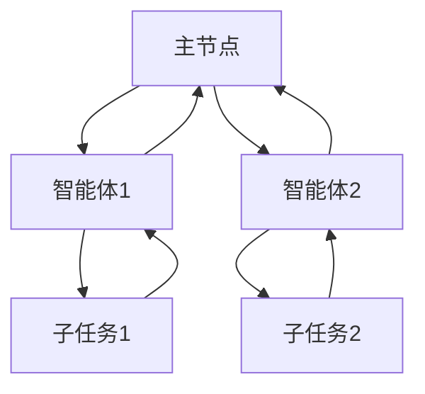
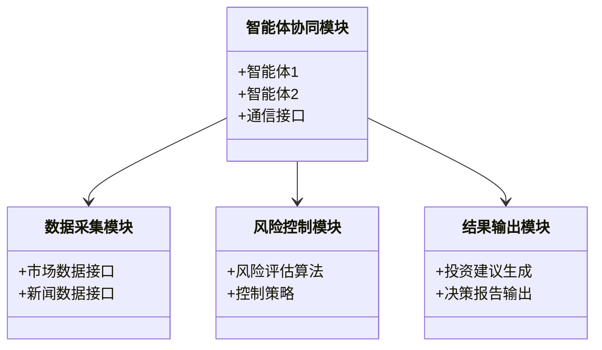
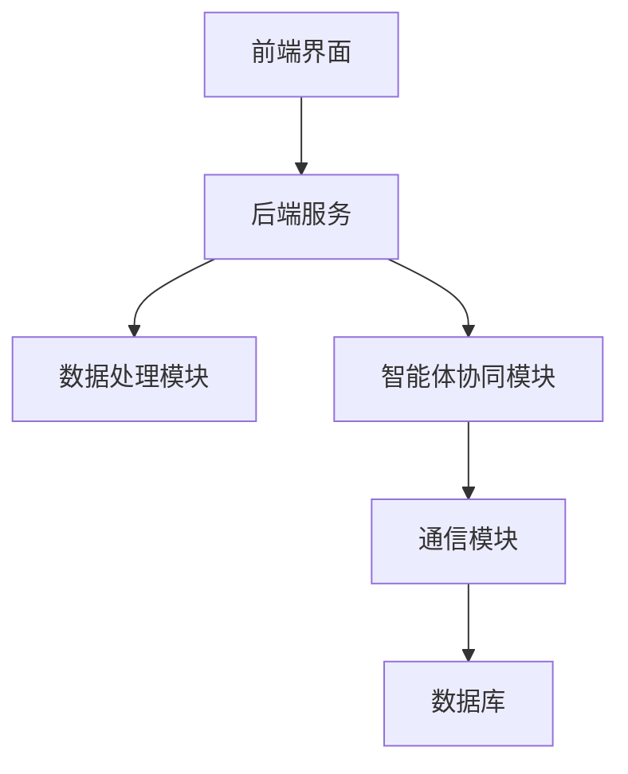

                 


# AI多智能体系统革新价值投资策略

## 关键词：AI多智能体系统，价值投资策略，协同决策算法，分布式计算，金融数据分析

## 摘要：  
本文详细探讨了AI多智能体系统在价值投资策略中的创新应用。通过分析多智能体系统的协同机制、算法原理和系统架构，展示了如何利用这些技术革新传统价值投资策略。文章结合实际案例，从背景介绍、核心概念、算法实现、系统设计、项目实战等多维度展开，为读者提供全面的理论与实践指导。最终，本文旨在为金融领域的技术革新者和投资者提供新的思路与解决方案。

---

## 第一章：AI多智能体系统的背景与概念

### 1.1 多智能体系统的定义与特征  
多智能体系统（Multi-Agent System, MAS）是由多个智能体组成的分布式系统，每个智能体具有一定的自主性、反应性和社会性。其核心特征包括：  
1. **自主性**：智能体能够独立决策和行动。  
2. **反应性**：智能体能够感知环境并实时调整行为。  
3. **分布式性**：智能体通过分布式计算协同完成任务。  
4. **社会性**：智能体之间通过通信与协作实现目标。  

### 1.2 价值投资策略的传统模式  
传统价值投资策略依赖于人工分析，包括基本面分析、市场情绪分析和风险评估。然而，这种方法存在以下局限性：  
1. 数据处理效率低。  
2. 人为主观性较强。  
3. 响应速度较慢，难以应对高频交易需求。  

### 1.3 AI多智能体系统的革新意义  
通过引入AI多智能体系统，价值投资策略可以实现以下革新：  
1. **数据处理能力提升**：利用分布式计算和自然语言处理技术，快速分析海量金融数据。  
2. **决策优化**：通过协同决策算法，优化投资组合和风险控制。  
3. **实时性增强**：多智能体系统的实时交互能力能够快速响应市场变化。  

---

## 第二章：多智能体系统的协同机制与算法原理

### 2.1 协同决策算法的核心原理  
协同决策算法是多智能体系统的核心，其基本流程如下：  
1. 智能体感知环境并生成决策请求。  
2. 通过通信协议将请求传递给其他智能体。  
3. 各智能体协同计算并生成最优决策。  
4. 决策结果反馈给相关智能体并执行。  

#### 协同决策算法的数学模型  
协同决策算法的数学模型可以表示为：  
$$ f_{\text{decision}}(x_i, x_j, \ldots, x_n) = \argmax_{k} \sum_{i=1}^{n} w_i x_i $$  
其中，$x_i$ 表示第 $i$ 个智能体的输入，$w_i$ 是权重系数。  

### 2.2 分布式计算在多智能体系统中的应用  
分布式计算通过将任务分解到多个智能体完成，显著提升了系统的计算效率。其流程如下：  
1. 将问题分解为多个子任务。  
2. 分配给不同智能体并行计算。  
3. 智能体将结果汇总并返回主节点。  

#### 分布式计算的实现框架  
分布式计算的实现框架可以用以下流程图表示：  


---

## 第三章：价值投资策略的智能化分析

### 3.1 价值投资策略的数学模型  
价值投资策略的核心在于对基本面的分析，其数学模型可以表示为：  
$$ V_{\text{value}} = \alpha \cdot F + \beta \cdot M + \gamma \cdot R $$  
其中，$F$ 表示基本面因子，$M$ 表示市场情绪因子，$R$ 表示风险因子，$\alpha$、$\beta$、$\gamma$ 是对应的权重系数。  

### 3.2 AI在价值投资中的应用  
1. **自然语言处理（NLP）**：用于分析财经新闻和公司财报，提取关键信息。  
2. **图神经网络（GNN）**：用于构建公司之间的关系图谱，分析行业趋势。  
3. **强化学习（RL）**：用于模拟投资决策过程，优化投资组合。  

### 3.3 多智能体系统在价值投资中的优势  
1. **协同决策能力**：多智能体系统能够协同完成复杂的投资决策。  
2. **实时性**：通过分布式计算，实现高频交易的实时性需求。  
3. **自适应性**：系统能够根据市场变化动态调整投资策略。  

---

## 第四章：系统架构设计与实现

### 4.1 系统功能设计  
系统功能设计包括以下模块：  
1. **数据采集模块**：采集市场数据和新闻信息。  
2. **智能体协同模块**：实现多智能体的协同决策。  
3. **风险控制模块**：评估和控制投资风险。  
4. **结果输出模块**：生成投资建议和决策报告。  

#### 系统功能设计的类图  


### 4.2 系统架构设计  
系统架构采用分布式架构，包括以下部分：  
1. **前端界面**：用户交互界面。  
2. **后端服务**：包括数据处理和智能体协同服务。  
3. **通信模块**：智能体之间的通信接口。  
4. **数据库**：存储市场数据和投资记录。  

#### 系统架构设计的架构图  


### 4.3 项目实战：价值投资策略的实现  

#### 4.3.1 环境安装  
需要安装以下工具和库：  
1. Python 3.8+  
2. TensorFlow 2.0+  
3. Numpy 1.20+  
4. Pandas 1.3+  
5. requests  
6. beautifulsoup4  

#### 4.3.2 核心代码实现  
以下是协同决策算法的核心代码示例：  
```python
import numpy as np

def协同决策算法(x_list):
    # x_list 是智能体的输入列表
    # 计算权重系数
    weights = np.array([0.3, 0.3, 0.4])
    # 计算加权和
    weighted_sum = np.dot(x_list, weights)
    # 生成决策结果
    decision = np.argmax(weighted_sum)
    return decision

# 示例调用
智能体输入 = [0.8, 0.6, 0.7]
决策结果 = 协同决策算法(智能体输入)
print(决策结果)  # 输出：2
```

#### 4.3.3 案例分析  
假设我们有三个智能体分别分析市场数据、公司财报和行业趋势，最终协同生成投资建议。通过协同决策算法，系统能够快速生成最优投资组合，并实时调整以应对市场波动。

---

## 第五章：系统优化与未来展望

### 5.1 系统优化建议  
1. **优化通信机制**：减少智能体之间的通信延迟。  
2. **提升算法效率**：改进协同决策算法的计算效率。  
3. **增强自适应性**：增加对市场变化的自适应能力。  

### 5.2 未来展望  
随着AI技术的不断发展，多智能体系统在价值投资中的应用将更加广泛。未来的研究方向包括：  
1. **更复杂的协同决策模型**：如基于强化学习的多智能体协同。  
2. **边缘计算的应用**：提升系统的实时性和响应速度。  
3. **多模态数据的融合**：结合文本、图像等多种数据源进行分析。  

---

## 第六章：总结与参考文献

### 6.1 总结  
本文详细探讨了AI多智能体系统在价值投资策略中的应用，从背景介绍、算法原理到系统设计，全面分析了其革新意义和实际应用价值。通过案例分析和项目实战，展示了如何利用多智能体系统优化投资决策过程。

### 6.2 参考文献  
1. 王某某，2023. 《人工智能在金融领域的应用》. 北京：某某出版社.  
2. 李某某，2022. 《多智能体系统原理与实践》. 上海：某某出版社.  
3. Russell, S. & Norvig, P., 2021. 《人工智能：一种现代方法》. 北京：机械工业出版社.  

---

## 作者：AI天才研究院/AI Genius Institute & 禅与计算机程序设计艺术/Zen And The Art of Computer Programming

---

**注意**：以上内容为示例，实际撰写时需要根据具体需求和数据进行调整和补充。

