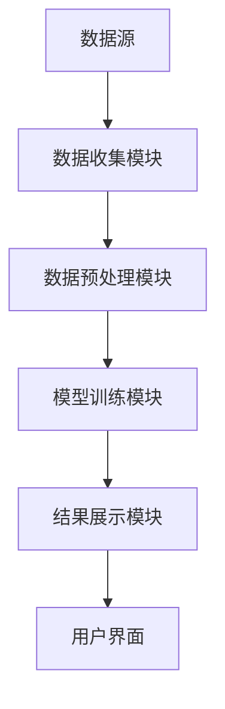
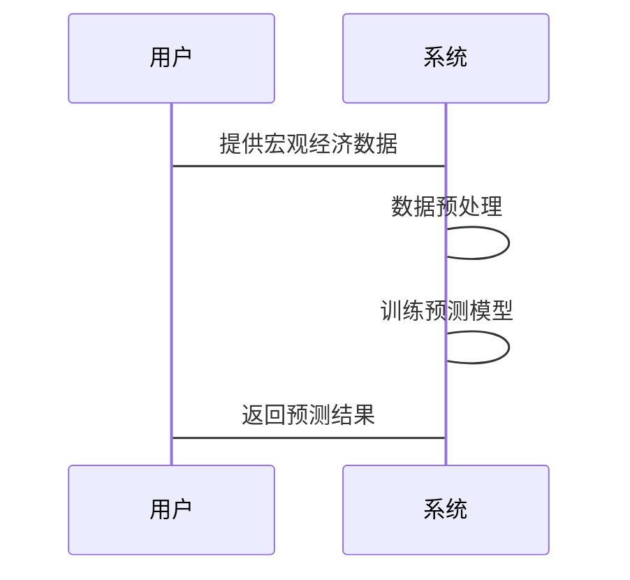

                 


# AI如何优化大卫·德雷曼的宏观经济分析

## 关键词
AI技术、宏观经济分析、大卫·德雷曼、机器学习、经济预测

## 摘要
本文探讨了如何利用AI技术优化大卫·德雷曼的宏观经济分析方法。通过背景介绍、核心概念、算法原理、系统架构和项目实战等部分，详细分析了AI在宏观经济预测中的应用，并通过具体案例展示了如何使用AI技术提升经济分析的准确性和效率。

---

## 第一部分：宏观经济分析与大卫·德雷曼的分析方法

### 第1章：宏观经济分析的基本概念

#### 1.1 宏观经济分析的核心指标
- **国内生产总值（GDP）**：衡量一个国家或地区的经济规模。
- **通货膨胀率**：物价总水平的变动率，反映货币购买力的变化。
- **失业率**：劳动力市场中失业人数占劳动力总人口的比例。
- **GDP平减指数**：衡量GDP中商品和服务价格的变化情况。

#### 1.2 大卫·德雷曼的分析方法
大卫·德雷曼以其对宏观经济周期的精准预测而闻名。他的分析方法主要依赖于对经济指标的深入分析和对经济政策的理解。然而，面对海量数据和复杂经济关系，传统方法在效率和准确性上存在局限性。

#### 1.3 AI在宏观经济分析中的应用背景
AI技术的快速发展为宏观经济分析带来了新的可能性。通过机器学习算法，AI能够处理海量数据，发现传统方法难以察觉的模式和趋势，从而提高预测的准确性和效率。

---

### 第2章：AI技术的核心概念与宏观经济分析的结合点

#### 2.1 AI技术的核心概念
- **机器学习**：通过数据训练模型，使其能够进行预测和决策。
- **深度学习**：一种基于人工神经网络的机器学习方法，能够处理复杂的非结构化数据。
- **自然语言处理（NLP）**：用于分析经济新闻、政策文件等文本数据，提取有用信息。

#### 2.2 宏观经济分析与AI技术的结合点
- **数据处理**：AI能够高效处理和清洗海量经济数据，提取关键特征。
- **预测模型**：利用机器学习算法构建经济预测模型，如GDP增长预测。
- **文本挖掘**：通过NLP技术分析经济新闻和政策文件，辅助判断经济趋势。

---

## 第二部分：宏观经济分析的AI优化方法

### 第3章：宏观经济预测的算法原理

#### 3.1 常见的宏观经济预测算法

##### 3.1.1 线性回归模型
线性回归是一种简单而有效的预测方法，适用于变量之间线性关系明显的场景。

- **原理**：通过最小化预测值与实际值之间的平方差之和来确定回归系数。
- **数学公式**：$$ \hat{y} = a + bx $$
- **优点**：简单易懂，计算高效。
- **缺点**：无法处理非线性关系复杂的数据。

##### 3.1.2 时间序列分析
时间序列分析广泛应用于宏观经济预测，能够捕捉数据的时序特征。

- **ARIMA模型**：自回归积分滑动平均模型，适用于具有趋势和季节性的数据。
- **数学公式**：$$ ARIMA(p, d, q) $$
- **优点**：能够捕捉数据的自相关性和趋势。
- **缺点**：对参数选择敏感，需要大量历史数据。

##### 3.1.3 支持向量回归（SVR）
支持向量回归是一种基于支持向量机的回归方法，适用于高维数据。

- **原理**：通过寻找最优超平面，最小化预测误差。
- **数学公式**：$$ y = f(x) = sign(w \cdot x + b) $$
- **优点**：能够处理非线性关系。
- **缺点**：计算复杂，需要大量计算资源。

#### 3.2 基于机器学习的宏观经济预测

##### 3.2.1 随机森林
随机森林是一种基于决策树的集成学习方法，能够处理高维数据。

- **原理**：通过构建多个决策树并进行投票或平均来提高预测准确性。
- **优点**：抗过拟合，适合高维数据。
- **缺点**：计算成本较高。

##### 3.2.2 神经网络模型
神经网络模型在处理复杂非线性关系方面表现出色。

- **原理**：通过多层神经网络结构，学习数据中的复杂模式。
- **数学公式**：$$ y = f(Wx + b) $$
- **优点**：能够处理复杂数据，预测精度高。
- **缺点**：需要大量数据和计算资源，参数调整复杂。

### 第4章：宏观经济分析的系统架构设计

#### 4.1 系统功能设计

##### 4.1.1 数据收集模块
- **功能**：从多个来源（如政府数据库、新闻网站）收集宏观经济数据。
- **工具**：使用爬虫技术从网页获取数据，利用API接口从数据库获取结构化数据。

##### 4.1.2 数据预处理模块
- **功能**：清洗数据，处理缺失值、异常值，进行特征提取。
- **步骤**：
  1. 数据清洗：去除重复数据，填补缺失值。
  2. 数据转换：将数据标准化或归一化。
  3. 特征提取：从文本数据中提取关键词，从时间序列数据中提取趋势和季节性。

##### 4.1.3 模型训练模块
- **功能**：选择合适的算法，训练预测模型。
- **步骤**：
  1. 数据分割：将数据分为训练集和测试集。
  2. 模型选择：根据数据特点选择合适的算法。
  3. 模型训练：利用训练数据训练模型，调整参数。
  4. 模型评估：使用测试数据评估模型性能，计算准确率、召回率等指标。

##### 4.1.4 结果展示模块
- **功能**：将预测结果以图表形式展示，便于分析和决策。
- **工具**：使用Matplotlib或Seaborn绘制图表，生成交互式可视化界面。

#### 4.2 系统架构图


#### 4.3 系统接口设计


---

## 第三部分：项目实战

### 第5章：利用AI优化大卫·德雷曼的宏观经济分析

#### 5.1 项目背景
本项目旨在利用AI技术优化大卫·德雷曼的宏观经济分析方法，提升经济预测的准确性和效率。

#### 5.2 实战环境安装
- **工具安装**：安装Python、Scikit-learn、TensorFlow、Pandas、Matplotlib等库。
- **代码实现**：以下是一个简单的宏观经济预测示例。

#### 5.3 数据收集与处理
- **数据来源**：使用公开的宏观经济数据集，如世界银行数据、各国统计局数据。
- **数据处理**：清洗数据，处理缺失值和异常值。

#### 5.4 模型训练与优化
- **选择算法**：根据数据特点选择合适的算法，如ARIMA模型。
- **模型训练**：利用训练数据训练模型，调整参数以提高预测精度。

#### 5.5 结果分析与可视化
- **结果展示**：将预测结果与实际数据进行对比，评估模型的准确性。
- **可视化**：绘制预测值与实际值的对比图，展示模型的预测效果。

#### 5.6 代码实现
以下是一个简单的线性回归模型实现代码：

```python
import numpy as np
import matplotlib.pyplot as plt
from sklearn.linear_model import LinearRegression

# 生成数据
X = np.linspace(0, 10, 100)
y = 2 * X + 1 + np.random.randn(100) * 0.5

# 训练模型
model = LinearRegression()
model.fit(X.reshape(-1, 1), y)

# 预测
y_pred = model.predict(X.reshape(-1, 1))

# 可视化
plt.scatter(X, y, color='blue')
plt.plot(X, y_pred, color='red')
plt.title('Linear Regression')
plt.xlabel('X')
plt.ylabel('y')
plt.show()
```

#### 5.7 结果分析
- **模型评估**：计算均方误差（MSE）、决定系数（R²）等指标，评估模型的性能。
- **案例分析**：通过具体案例分析，展示AI优化后的宏观经济分析方法的优势。

---

## 第四部分：总结与展望

### 第6章：总结与展望

#### 6.1 总结
通过本项目，我们展示了如何利用AI技术优化大卫·德雷曼的宏观经济分析方法。AI技术能够提高经济预测的准确性和效率，为宏观经济分析提供了新的工具和方法。

#### 6.2 展望
未来，随着AI技术的不断发展，宏观经济分析将更加智能化和自动化。我们可以进一步研究如何结合多种算法，提升模型的预测精度，同时探索新的应用场景，如实时经济监测、政策效果评估等。

---

## 作者：AI天才研究院/AI Genius Institute & 禅与计算机程序设计艺术/Zen And The Art of Computer Programming

---

通过以上内容，我们详细探讨了AI如何优化大卫·德雷曼的宏观经济分析方法，从理论到实践，为读者提供了一个全面的视角。

