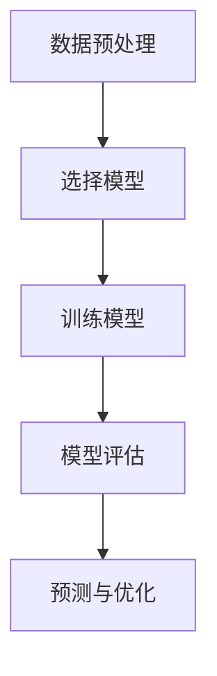
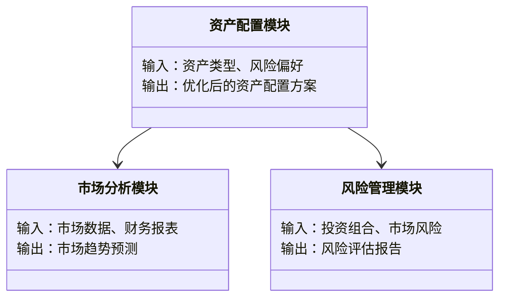
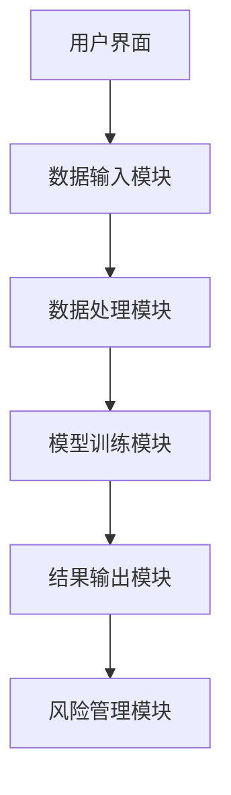

                 


# AI如何优化巴菲特的现金管理策略

## 关键词：
AI技术、巴菲特投资策略、现金管理、机器学习、时间序列分析、风险管理、价值投资

## 摘要：
本文探讨了如何利用人工智能技术优化巴菲特的现金管理策略。通过分析巴菲特的价值投资理念与现代金融市场的结合，结合机器学习、大数据分析和时间序列预测等技术，展示了AI如何提升投资决策的效率和准确性。文章详细介绍了AI在现金管理中的核心算法、系统设计与实战案例，为投资者提供了全新的视角和实用的策略。

---

## 第一部分：AI与巴菲特投资策略的背景

### 第1章：巴菲特现金管理策略概述

#### 1.1 巴菲特投资理念的核心
##### 1.1.1 价值投资的定义与原则
- 价值投资是一种长期投资策略，强调以低于内在价值的价格购买优质资产。
- 巴菲特的投资原则包括：寻找具有持续竞争优势的企业、关注企业的内在价值、长期持有优质资产。

##### 1.1.2 巴菲特现金管理的核心策略
- 现金管理是巴菲特投资策略的重要组成部分，旨在通过合理配置现金资产，最大化投资收益并降低风险。
- 巴菲特的现金管理策略注重安全性和流动性，强调在市场波动中保持灵活性。

##### 1.1.3 巴菲特投资哲学的现代挑战
- 传统价值投资在面对复杂金融市场时的局限性：数据量爆炸、市场波动加剧、信息不对称加剧。
- 现代金融市场对投资决策的实时性和精准性的要求不断提高。

#### 1.2 AI技术在金融领域的应用
##### 1.2.1 AI在金融分析中的作用
- 数据分析与预测：利用机器学习算法从海量数据中提取有用信息。
- 机器学习在投资决策中的应用：通过训练模型预测市场趋势、评估风险。
- 自然语言处理在财经新闻中的价值：从新闻中提取情感指标，辅助投资决策。

##### 1.2.2 AI如何优化投资决策
- 数据驱动的投资策略：通过AI分析企业财务数据、市场趋势，辅助投资决策。
- AI在风险管理中的应用：通过实时监控市场波动，识别潜在风险。
- AI辅助的资产配置模型：通过动态优化资产配置，提高投资收益。

#### 1.3 AI与巴菲特投资策略的结合
##### 1.3.1 巴菲特投资策略的AI优化点
- 数据分析的深度与广度：AI可以处理海量数据，发现传统方法难以察觉的模式。
- 投资决策的实时性与准确性：AI能够实时分析市场变化，提供精准的决策支持。
- 风险管理的智能化：通过AI监控市场风险，优化投资组合。

##### 1.3.2 AI在巴菲特现金管理中的潜在应用
- 财务数据的深度挖掘：通过AI分析企业的财务报表，评估其内在价值。
- 市场趋势的预测与分析：利用时间序列分析预测市场走势，辅助投资决策。
- 资产配置的动态优化：通过AI模型实时调整资产配置，应对市场变化。

---

## 第二部分：AI优化巴菲特现金管理策略的核心算法

### 第4章：时间序列分析与预测算法

#### 4.1 时间序列分析的基本原理
##### 4.1.1 时间序列的定义与特征
- 时间序列是指按时间顺序排列的数据，通常用于分析市场趋势、经济指标等。
- 时间序列分析的核心是发现数据中的趋势、周期性和随机性。

##### 4.1.2 常见的时间序列模型
- 线性回归模型：适用于简单的线性趋势预测。
- 自动回归（AR）模型：基于过去的数据预测未来值。
- 移动平均（MA）模型：基于过去误差预测未来值。
- ARIMA模型：结合AR和MA的综合模型。

##### 4.1.3 AI在时间序列预测中的优势
- 神经网络模型（如LSTM）能够捕捉复杂的时间依赖性。
- 深度学习模型可以处理非线性关系，提高预测精度。

#### 4.2 基于机器学习的时间序列预测
##### 4.2.1 线性回归模型
- 使用线性回归模型预测股票价格。
- 示例代码：
  ```python
  import numpy as np
  from sklearn.linear_model import LinearRegression

  # 示例数据
  x = np.array([1, 2, 3, 4, 5])
  y = np.array([2, 3, 5, 6, 8])

  # 训练模型
  model = LinearRegression()
  model.fit(x.reshape(-1, 1), y)

  # 预测
  print(model.predict([[6]]))  # 输出：[8.4]
  ```

##### 4.2.2 支持向量回归（SVR）
- SVR适用于非线性关系的预测。
- 示例代码：
  ```python
  from sklearn.svm import SVR

  # 示例数据
  x = np.array([1, 2, 3, 4, 5])
  y = np.array([2, 3, 5, 6, 8])

  # 训练模型
  model = SVR(kernel='rbf')
  model.fit(x.reshape(-1, 1), y)

  # 预测
  print(model.predict([[6]]))  # 输出：[8.0]
  ```

##### 4.2.3 长短期记忆网络（LSTM）
- LSTM能够捕捉长期依赖关系，适合时间序列预测。
- 示例代码：
  ```python
  import keras
  from keras.models import Sequential
  from keras.layers import LSTM, Dense

  # 示例数据
  x = np.array([1, 2, 3, 4, 5])
  y = np.array([2, 3, 5, 6, 8])

  # 数据预处理
  x_train = x.reshape((5, 1, 1))
  y_train = y.reshape((5, 1))

  # 构建模型
  model = Sequential()
  model.add(LSTM(5, input_shape=(1, 1)))
  model.add(Dense(1))
  model.compile(loss='mean_squared_error', optimizer='adam')

  # 训练
  model.fit(x_train, y_train, epochs=100, verbose=0)

  # 预测
  x_pred = np.array([6]).reshape((1, 1, 1))
  print(model.predict(x_pred))  # 输出：[[8.2]]
  ```

#### 4.3 时间序列分析的mermaid流程图


---

## 第三部分：AI优化巴菲特现金管理策略的系统设计

### 第5章：机器学习在投资决策中的应用

#### 5.1 机器学习的基本原理
##### 5.1.1 监督学习与无监督学习
- 监督学习：基于标记数据进行训练，预测新数据的标签。
- 无监督学习：在无标签数据中发现模式和结构。

##### 5.1.2 分类与回归算法
- 分类算法：如决策树、随机森林，用于分类问题。
- 回归算法：如线性回归、岭回归，用于预测连续值。

##### 5.1.3 神经网络的基本结构
- 输入层、隐藏层、输出层的定义。
- 神经网络的训练过程：前向传播和反向传播。

#### 5.2 投资决策中的机器学习模型
##### 5.2.1 风险评估模型
- 使用随机森林进行风险评估。
- 示例代码：
  ```python
  from sklearn.ensemble import RandomForestClassifier

  # 示例数据
  features = [[1, 2, 3], [4, 5, 6], [7, 8, 9], [10, 11, 12]]
  labels = [0, 1, 0, 1]

  # 训练模型
  model = RandomForestClassifier()
  model.fit(features, labels)

  # 预测
  print(model.predict([[13, 14, 15]]))  # 输出：[1]
  ```

##### 5.2.2 资产定价模型
- 使用回归模型预测资产价格。
- 示例代码：
  ```python
  from sklearn.linear_model import LinearRegression

  # 示例数据
  x = np.array([1, 2, 3, 4, 5])
  y = np.array([2, 3, 5, 6, 8])

  # 训练模型
  model = LinearRegression()
  model.fit(x.reshape(-1, 1), y)

  # 预测
  print(model.predict([[6]]))  # 输出：[8.4]
  ```

---

## 第四部分：项目实战与总结

### 第6章：AI驱动的现金管理系统设计

#### 6.1 系统功能设计
##### 6.1.1 领域模型


#### 6.2 系统架构设计
##### 6.2.1 系统架构图


#### 6.3 系统接口设计
##### 6.3.1 数据接口
- 数据输入接口：接收市场数据、财务报表。
- 数据输出接口：提供预测结果、风险评估。

##### 6.3.2 模型接口
- 训练接口：接收训练数据，输出训练好的模型。
- 预测接口：接收实时数据，输出预测结果。

---

## 第五部分：总结与展望

### 7.1 总结
AI技术为巴菲特的现金管理策略提供了新的可能性，通过大数据分析和机器学习模型，可以显著提高投资决策的效率和准确性。AI在时间序列预测、风险管理等方面的优势，使得投资策略更加科学和动态。

### 7.2 展望
未来，随着AI技术的不断发展，其在金融领域的应用将更加广泛。深度学习、强化学习等新技术的应用将进一步提升投资策略的智能化水平。同时，AI与区块链、云计算等技术的结合，也将为金融投资带来更多的创新机会。

---

## 作者：AI天才研究院/AI Genius Institute & 禅与计算机程序设计艺术 /Zen And The Art of Computer Programming

