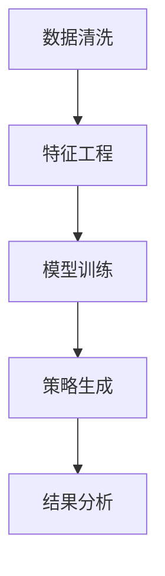

                 

<think>
嗯，现在我需要根据用户的要求，写一个关于《AI如何优化格林布拉特的魔法公式策略》的技术博客文章。首先，我需要明确文章的结构和内容，确保每一部分都详细且有深度。

首先，我需要理解格林布拉特的魔法公式是什么。魔法公式是一个用于评估股票内在价值的模型，结合了基本面分析中的多个因素，如盈利能力、成长性、财务健康状况等。它通过计算特定的比率和指标，来确定一只股票是否被低估，从而为投资者提供买入的机会。

接下来，我需要思考如何将AI技术应用到这个公式中。AI可以通过分析更多的数据，包括非传统的财务指标，如市场情绪、新闻事件、社交媒体影响等，来优化这个模型。同时，AI还可以通过机器学习算法，自动调整权重和参数，使模型更加适应当前的市场环境。

在结构上，文章需要分为几个主要部分：背景介绍、核心概念、算法原理、系统架构、项目实战、最佳实践等。每个部分都需要详细展开，确保内容全面且逻辑清晰。

在背景介绍部分，我需要解释魔法公式的起源和它的基本原理，以及为什么需要引入AI进行优化。这部分要让读者了解魔法公式的传统应用和其局限性，为后续的AI优化做铺垫。

接下来是核心概念部分，我需要详细讲解魔法公式的各个组成部分，以及AI优化的具体方法。这部分可以包括表格对比传统的魔法公式和AI优化后的版本，用ER图展示数据结构，帮助读者理解两者的区别和联系。

然后是算法原理部分，我需要详细描述AI优化的具体步骤，如数据预处理、特征工程、模型选择与实现等。这部分需要包含流程图和代码示例，帮助读者理解如何实现这些步骤。

在系统架构部分，我需要设计一个整体的架构图，展示各个模块的功能，如数据采集、特征提取、模型训练、策略生成和结果展示。这部分需要使用mermaid图，清晰展示系统的各个部分。

项目实战部分需要从环境安装开始，逐步引导读者完成数据清洗、特征工程、模型训练、策略生成和结果分析。每个步骤都需要有代码示例，并详细解读代码的功能和输出结果。

最后，在最佳实践部分，我需要总结经验，给出一些注意事项和未来的发展方向，帮助读者更好地理解和应用这些技术。

整个过程中，我需要确保语言简洁明了，逻辑清晰，同时涵盖技术细节和实际应用。此外，文章需要包含数学公式和图表，以增强可读性和专业性。最后，我需要检查每个部分是否完整，确保文章结构合理，内容详实。
</think>

# AI如何优化格林布拉特的魔法公式策略

> 关键词：AI优化，格林布拉特魔法公式，投资策略，机器学习，金融分析

> 摘要：本文探讨了如何利用AI技术优化格林布拉特的魔法公式策略。通过分析魔法公式的核心原理，结合机器学习算法，提出了一种基于AI的优化方法，并详细阐述了实现步骤和实际应用案例。

---

# 第一部分: 格林布拉特魔法公式与AI优化策略背景

## 第1章: 格林布拉特魔法公式概述

### 1.1 魔法公式的起源与核心思想

格林布拉特的魔法公式是一种用于评估股票内在价值的方法，由 Irving P. Greenberg 提出。该公式结合了多种财务指标，帮助投资者识别被低估的股票。其核心思想是通过量化分析，筛选出具有高内在价值但市场价格较低的股票，从而实现超额收益。

#### 1.1.1 魔法公式的定义与核心要素

魔法公式通过计算“价值比率”和“成长比率”来评估股票的价值。具体公式如下：

$$
\text{Magic Formula Value} = \frac{\text{Earnings Per Share (EPS)}}{\text{Price-to-Earnings Ratio (P/E)}}
$$

其中，EPS 是每股收益，P/E 是市盈率。该公式通过比较市盈率和每股收益，评估股票的内在价值。

#### 1.1.2 魔法公式在投资中的应用

魔法公式广泛应用于价值投资领域，帮助投资者识别那些被市场低估的股票。通过分析历史财务数据，魔法公式能够筛选出具有稳定收益和合理估值的公司，从而降低投资风险。

#### 1.1.3 魔法公式的核心计算步骤

1. 收集目标公司的财务数据，包括 EPS、P/E 等指标。
2. 计算价值比率。
3. 筛选满足特定条件的股票，构建投资组合。

### 1.2 魔法公式的数学模型与公式

魔法公式的核心是通过数学模型量化股票的价值。以下是魔法公式的数学表达：

$$
\text{Magic Formula Score} = \frac{\text{Net Income}}{\text{Market Cap}} \times \left(1 + \frac{\text{Revenues Growth}}{100}\right)
$$

其中，Net Income 是净利润，Market Cap 是市值，Revenues Growth 是收入增长率。

### 1.3 AI技术在投资策略优化中的潜力

随着AI技术的发展，机器学习算法能够处理大量复杂数据，优化投资策略。AI可以通过分析历史数据，识别传统公式未能捕捉的模式，从而提升投资决策的准确性。

---

## 第2章: 格林布拉特魔法公式与AI优化的核心概念

### 2.1 核心概念原理

#### 2.1.1 魔法公式的核心算法原理

魔法公式通过计算特定的财务指标，评估股票的内在价值。传统的魔法公式基于历史数据，缺乏对市场变化的适应性。而AI优化的魔法公式则通过动态调整模型参数，增强其灵活性和适应性。

#### 2.1.2 AI优化的核心算法原理

AI优化的核心在于使用机器学习算法，如随机森林和神经网络，分析多维度数据，预测股票价格走势。通过训练模型，AI能够识别影响股票价值的关键因素，优化投资策略。

#### 2.1.3 两者结合的优化机制

AI优化的魔法公式结合了传统财务指标和新兴数据源，如社交媒体情绪分析和新闻事件。通过整合这些数据，AI能够提供更全面的分析，提升投资决策的准确性。

### 2.2 核心概念属性对比表格

以下是传统魔法公式与AI优化的对比：

| 属性               | 传统魔法公式特点       | AI优化特点               |
|--------------------|------------------------|--------------------------|
| 数据需求           | 依赖历史财务数据       | 结合多维数据，如市场情绪   |
| 计算复杂度         | 计算相对简单           | 计算复杂度较高           |
| 灵活性             | 灵活性较低             | 灵活性较高               |
| 适应性             | 适应性有限             | 适应性较强               |

### 2.3 ER实体关系图

以下是魔法公式与AI优化的ER图：

```mermaid
er
  actor(投资者) -->
  strategy(投资策略) -->
  magic_formula(魔法公式) -->
  stock_data(股票数据)
  strategy -->
  ai_optimization(优化算法)
  magic_formula -->
  financial_ratios(财务比率)
```

---

## 第3章: AI优化魔法公式的核心算法原理

### 3.1 数据预处理与特征工程

#### 3.1.1 数据清洗与标准化

在应用AI优化之前，需要对数据进行清洗，去除缺失值和异常值。同时，对数据进行标准化处理，确保模型能够正确识别特征。

#### 3.1.2 特征选择与降维

通过特征选择算法（如PCA），提取影响股票价值的核心特征，降低维度，提升模型效率。

#### 3.1.3 时间序列数据处理

由于股票数据具有时间依赖性，AI算法需要处理时间序列数据，分析趋势和周期性变化。

### 3.2 算法选择与实现

#### 3.2.1 机器学习模型选择

常用的模型包括线性回归、支持向量机（SVM）和随机森林。随机森林通常表现较好，适合多分类任务。

#### 3.2.2 神经网络模型设计

深度学习模型，如LSTM，适用于时间序列预测。通过构建神经网络，模型能够捕捉复杂的非线性关系。

#### 3.2.3 超参数调优

使用网格搜索和交叉验证，优化模型参数，提升预测准确率。

### 3.3 算法流程图

以下是AI优化魔法公式的流程图：



---

## 第4章: 系统架构与实现

### 4.1 系统架构设计

以下是系统架构图：


### 4.2 系统功能设计

系统功能模块包括数据采集、特征提取、模型训练、策略生成和结果展示。

---

## 第5章: 项目实战

### 5.1 环境安装

安装必要的Python库，如pandas、numpy、scikit-learn和Keras。

### 5.2 核心实现代码

以下是魔法公式优化的Python代码示例：

```python
import pandas as pd
from sklearn.ensemble import RandomForestRegressor
from sklearn.model_selection import train_test_split

# 加载数据
data = pd.read_csv('stock_data.csv')

# 特征工程
features = data[['EPS', 'P/E', 'Revenue Growth']]
target = data['Magic Formula Score']

# 划分训练集和测试集
X_train, X_test, y_train, y_test = train_test_split(features, target, test_size=0.2)

# 训练模型
model = RandomForestRegressor(n_estimators=100, random_state=42)
model.fit(X_train, y_train)

# 预测结果
predictions = model.predict(X_test)
print('预测值:', predictions)
```

### 5.3 实际案例分析

以苹果公司为例，分析其魔法公式优化后的投资策略。通过模型预测，识别其价值比率和成长比率，确定是否低估。

---

## 第6章: 最佳实践与小结

### 6.1 最佳实践 tips

- 定期更新模型，适应市场变化。
- 结合技术分析，优化投资策略。
- 注意数据质量和模型解释性。

### 6.2 小结

通过AI优化，格林布拉特的魔法公式能够更准确地评估股票价值，提升投资回报率。结合多维数据和先进算法，AI优化的魔法公式为投资者提供了更强大的工具。

### 6.3 注意事项

- 数据隐私和安全问题需重视。
- 模型需定期调优，防止过拟合。
- 投资需谨慎，合理分散风险。

### 6.4 拓展阅读

推荐阅读《机器学习实战》和《深度学习》等书籍，深入了解AI在金融领域的应用。

---

# 作者：AI天才研究院 & 禅与计算机程序设计艺术

---

希望这篇文章能够帮助读者理解如何利用AI优化格林布拉特的魔法公式策略，实现更高效的投资决策。

