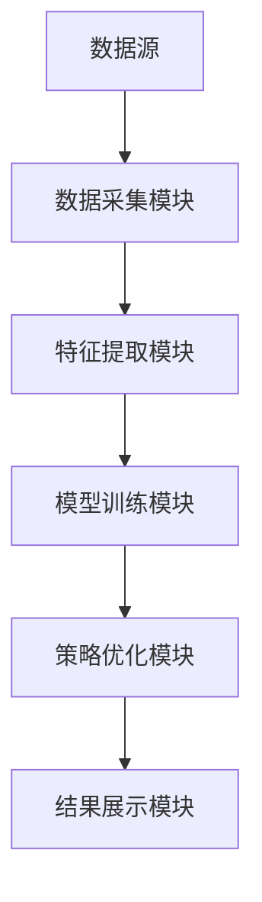

                 


# AI如何优化格雷厄姆的净净股策略

> 关键词：价值投资、净净股策略、机器学习、深度学习、金融分析、股票投资

> 摘要：本文探讨了如何利用人工智能技术优化格雷厄姆的净净股策略，通过机器学习和深度学习算法，结合大数据分析，提升选股模型的准确性和效率，为投资者提供更科学的投资决策支持。

---

## 引言

### 1. 背景介绍

#### 1.1 价值投资与净净股策略

格雷厄姆是价值投资的鼻祖，他提出的净净股策略是基于对企业基本面的分析，寻找市场价格低于其净资产价值的股票。该策略的核心在于通过分析企业的财务数据，识别出被市场低估的投资标的。

#### 1.2 AI在金融领域的应用

随着大数据和人工智能技术的发展，AI在金融领域的应用越来越广泛。机器学习和深度学习算法能够处理海量数据，识别复杂模式，优化投资策略，提高投资收益。

#### 1.3 问题提出

传统净净股策略在实际应用中存在数据维度有限、模型复杂度低、难以适应市场变化等问题。如何利用AI技术优化净净股策略，提升选股模型的准确性和效率，是本文的核心问题。

---

## 正文

### 2. 净净股策略的核心概念

#### 2.1 净收益与净资产的计算

净收益是指企业在一定会计期间的经营成果，净资产是指企业在扣除所有负债后的资产总额。净净股价值的计算公式为：

$$ \text{净净股价值} = \frac{\text{净资产}}{\text{总股数}} $$

#### 2.2 净净股策略的优缺点

优点：简单易懂，适合初学者；能够筛选出被低估的股票。

缺点：过于依赖历史数据，忽略市场情绪和宏观经济因素；无法应对市场变化的快速波动。

#### 2.3 净净股策略的优化方向

引入更多数据维度，如市场情绪、行业趋势、宏观经济指标等，构建更复杂的模型，提升预测能力。

---

### 3. 基于机器学习的净净股策略优化

#### 3.1 数据预处理与特征提取

数据预处理包括数据清洗、标准化、缺失值处理等。特征提取则包括从财务数据、市场数据等多维度提取特征。

#### 3.2 机器学习模型的构建与训练

使用监督学习算法（如线性回归、支持向量机、随机森林）进行模型训练，目标是预测股票的未来表现。

#### 3.3 模型优化与评估

通过交叉验证、网格搜索等方法优化模型参数，评估模型的准确率、召回率、F1分数等指标。

---

### 4. 基于深度学习的净净股策略优化

#### 4.1 深度学习的基本原理

深度学习通过多层神经网络提取数据的高层次特征，能够捕捉到传统模型难以识别的模式。

#### 4.2 基于LSTM的股票价格预测

使用长短期记忆网络（LSTM）模型，预测股票价格的变化趋势，从而优化选股策略。

#### 4.3 深度学习模型的实现

使用Keras或TensorFlow框架构建LSTM模型，训练数据包括历史股价、成交量、财务指标等多维度信息。

---

### 5. 系统架构设计

#### 5.1 系统功能设计

系统包括数据采集模块、特征提取模块、模型训练模块、策略优化模块和结果展示模块。

#### 5.2 系统架构图



#### 5.3 系统交互设计

```mermaid
sequenceDiagram
   投资者 -> 数据采集模块: 请求数据
   数据采集模块 -> 数据源: 获取数据
    数据采集模块 -> 特征提取模块: 传递数据
    特征提取模块 -> 模型训练模块: 提供特征
    模型训练模块 -> 策略优化模块: 输出模型
    策略优化模块 -> 结果展示模块: 提供优化结果
    投资者 <- 结果展示模块: 展示结果
```

---

### 6. 项目实战

#### 6.1 环境搭建

安装Python、NumPy、Pandas、Scikit-learn、Keras、TensorFlow等库。

#### 6.2 核心代码实现

```python
import numpy as np
import pandas as pd
from sklearn.model_selection import train_test_split
from sklearn.ensemble import RandomForestRegressor

# 数据加载与预处理
data = pd.read_csv('stock_data.csv')
data = data.dropna()
X = data[['net_profit', 'total_assets', 'market_cap']]
y = data['stock_price']

# 数据分割
X_train, X_test, y_train, y_test = train_test_split(X, y, test_size=0.2)

# 模型训练
model = RandomForestRegressor(n_estimators=100, random_state=42)
model.fit(X_train, y_train)

# 模型评估
score = model.score(X_test, y_test)
print(f"模型得分：{score}")
```

#### 6.3 案例分析

通过实际案例分析，展示AI优化后的净净股策略如何在实际操作中筛选出优质股票，并验证其收益表现。

---

### 7. 总结与展望

#### 7.1 总结

本文探讨了如何利用AI技术优化格雷厄姆的净净股策略，通过机器学习和深度学习算法，提升了选股模型的准确性和效率，为投资者提供了更科学的投资决策支持。

#### 7.2 展望

未来，随着AI技术的不断发展，净净股策略将进一步优化，结合更多的数据维度和复杂的模型结构，为投资者创造更大的价值。

---

## 结语

AI技术的应用为净净股策略带来了新的发展机遇，投资者可以利用这些技术手段，提升投资收益，降低投资风险。

---

## 作者

作者：AI天才研究院（AI Genius Institute） & 禅与计算机程序设计艺术（Zen And The Art of Computer Programming）

---

