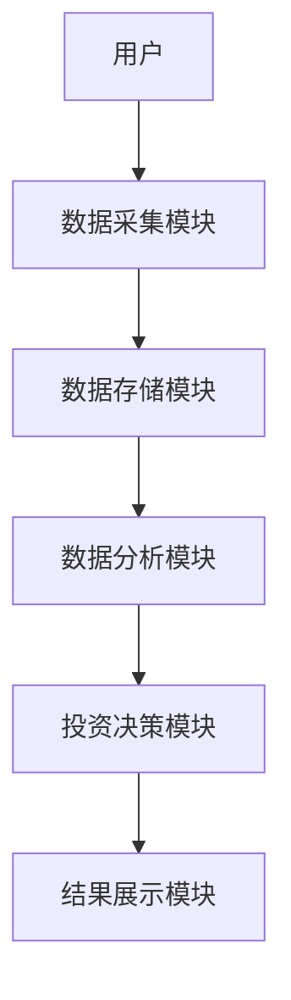
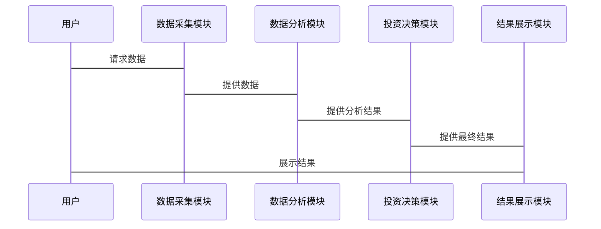

                 

<think>
嗯，好的，我需要帮用户撰写一篇技术博客文章，标题是《AI如何增强巴菲特的商业分析方法》。首先，我得理清用户的需求。用户希望我以一位世界级的人工智能专家、程序员、软件架构师和CTO的身份，撰写一篇结构紧凑、逻辑清晰、内容有深度的技术博客。

首先，我要明确文章的核心关键词。巴菲特的商业分析方法主要是基本面分析，包括财务报表、行业分析和管理层评估。而AI技术在这里主要涉及机器学习、大数据分析和自然语言处理。所以关键词可能是：AI，巴菲特，商业分析，机器学习，大数据分析，自然语言处理，投资策略。

接下来是摘要。摘要需要简洁明了，概括整篇文章的核心内容。我应该提到AI如何提升巴菲特方法的效率和准确性，特别是在数据处理、预测模型和决策支持方面。

然后是目录大纲。根据用户提供的结构，我需要按照背景、核心概念、算法、系统架构、项目实战和最佳实践来组织内容。每个部分都需要详细展开，确保逻辑清晰，结构紧凑。

在第一部分，我会介绍AI和巴菲特方法的背景，解释它们的基本概念和结合的必要性。第二部分会深入讲解AI在商业分析中的核心应用，包括数据驱动决策、机器学习模型和自然语言处理。第三部分则会具体分析AI在企业基本面分析和财务报表分析中的应用，结合实例进行说明。第四部分是系统架构和项目实战，展示如何构建一个AI增强的商业分析系统，并提供代码实现和案例分析。最后一部分总结AI带来的好处，并给出实践建议。

在撰写每个小节时，我需要确保内容详细，包括背景介绍、核心概念、算法原理、系统设计和项目实战。特别是要使用mermaid图表来展示算法流程、系统架构和交互过程，同时用Python代码示例来说明实现细节。数学公式要用latex格式，并在独立段落中用$$包裹，段落内用$包裹。

可能遇到的挑战是如何将复杂的AI技术与巴菲特的商业分析方法有机结合起来，同时保持文章的逻辑性和可读性。我需要确保每个部分都紧密相连，从理论到实践，逐步深入，让读者能够理解AI如何实际增强巴菲特的方法。

最后，我需要检查文章的结构是否符合要求，确保每个小节都有足够的细节，并且语言专业但易懂。完成后，我会在文章末尾加上作者信息，符合用户的格式要求。
</think>

# AI如何增强巴菲特的商业分析方法

## 关键词：AI，巴菲特，商业分析，机器学习，大数据分析，自然语言处理，投资策略

## 摘要：本文探讨了人工智能技术如何提升巴菲特经典的商业分析方法，特别是在数据处理效率、预测准确性、决策支持等方面。通过结合机器学习、自然语言处理等技术，AI能够更精准地分析企业基本面、评估管理层、预测财务表现，从而优化投资决策。

---

## 第一部分：AI与巴菲特商业分析方法的背景与基础

### 第1章：AI与巴菲特商业分析方法概述

#### 1.1 巴菲特投资方法的核心理念

##### 1.1.1 巴菲特投资方法的核心要素
- **价值投资**：寻找具有持续竞争优势的企业，以低于其内在价值的价格买入。
- **企业基本面分析**：关注企业的财务状况、盈利能力、管理层质量、行业地位等。
- **长期视角**：投资于能够长期稳定增长的企业。

##### 1.1.2 巴菲特方法的哲学基础
- **安全边际**：以低于内在价值的价格买入，确保投资的安全性。
- **管理层评估**：信任可靠且有能力的管理层。
- **逆人性思维**：在市场恐慌时买入，在市场狂热时卖出。

##### 1.1.3 巴菲特方法的现代挑战
- **数据爆炸**：企业财务数据、行业动态、新闻信息等海量数据难以处理。
- **信息滞后性**：传统分析方法依赖于历史数据，难以实时捕捉市场变化。
- **决策复杂性**：面对复杂的市场环境，人工分析效率低下。

#### 1.2 AI技术的基本概念与应用领域

##### 1.2.1 人工智能的基本定义
- **AI**：模拟人类智能的技术，包括学习、推理、自我改进等能力。
- **机器学习**：通过数据训练模型，使其能够从数据中学习并做出预测。
- **大数据分析**：从海量数据中提取有价值的信息。

##### 1.2.2 机器学习的核心原理
- **监督学习**：通过标记数据训练模型，预测新数据的标签。
- **无监督学习**：从未标记数据中发现模式。
- **深度学习**：通过多层神经网络学习复杂特征。

##### 1.2.3 大数据分析与商业决策
- **数据可视化**：通过图表展示数据，帮助理解复杂信息。
- **预测分析**：利用历史数据预测未来趋势。
- **实时分析**：实时处理数据，捕捉市场动态。

#### 1.3 AI在商业分析中的潜力

##### 1.3.1 商业分析的传统方法与局限性
- **依赖经验判断**：分析结果受到分析师主观因素影响。
- **数据处理效率低**：手动处理大量数据耗时耗力。
- **预测准确性有限**：传统模型难以捕捉复杂市场变化。

##### 1.3.2 AI在商业分析中的优势
- **高效数据处理**：AI能够快速处理海量数据，提高分析效率。
- **精准预测**：通过机器学习模型，提高预测准确性。
- **实时监控**：实时分析市场动态，捕捉投资机会。

##### 1.3.3 AI与巴菲特方法的结合点
- **数据驱动决策**：AI帮助巴菲特方法更依赖数据。
- **自动化分析**：AI自动化处理企业基本面分析。
- **动态调整策略**：AI实时监控市场变化，动态调整投资策略。

---

### 第2章：巴菲特方法与AI技术的结合

#### 2.1 巴菲特方法的关键步骤

##### 2.1.1 企业基本面分析
- **财务指标分析**：如ROE（净资产收益率）、ROA（资产回报率）、毛利率等。
- **行业分析**：评估行业前景、竞争格局。
- **竞争优势分析**：分析企业的竞争优势，如成本优势、品牌优势等。

##### 2.1.2 财务报表分析
- **利润表分析**：评估企业的盈利能力。
- **资产负债表分析**：评估企业的财务健康状况。
- **现金流量表分析**：评估企业的现金流情况。

##### 2.1.3 管理层评估
- **管理层诚信**：管理层是否诚信可靠。
- **管理层能力**：管理层是否具备优秀的管理能力。
- **管理层决策**：管理层的战略决策是否合理。

#### 2.2 AI在商业分析中的应用场景

##### 2.2.1 数据驱动的决策支持
- **数据可视化**：通过图表展示企业财务数据、行业动态等。
- **预测模型**：利用机器学习模型预测企业未来财务表现。
- **风险评估**：通过大数据分析评估投资风险。

##### 2.2.2 机器学习在财务预测中的应用
- **时间序列预测**：利用机器学习模型预测企业的未来财务数据。
- **分类模型**：预测企业是否具有投资价值。
- **回归分析**：预测企业的股价走势。

##### 2.2.3 自然语言处理在行业分析中的应用
- **新闻分析**：通过自然语言处理技术分析行业新闻，提取关键信息。
- **社交媒体分析**：分析社交媒体上的市场情绪，预测市场走势。
- **行业报告生成**：自动生成行业分析报告。

#### 2.3 AI如何增强巴菲特方法的可操作性

##### 2.3.1 提高分析效率
- **自动化数据处理**：AI能够自动化处理大量数据，节省时间。
- **快速决策支持**：通过实时数据分析，快速做出投资决策。

##### 2.3.2 增强数据处理能力
- **大数据分析**：AI能够处理海量数据，发现隐藏的模式。
- **数据清洗**：自动清洗数据，确保分析结果的准确性。

##### 2.3.3 优化投资决策
- **动态调整策略**：根据市场变化，动态调整投资策略。
- **风险控制**：通过AI技术进行风险评估，避免重大损失。

---

### 第3章：AI在企业基本面分析中的应用

#### 3.1 企业基本面分析的传统方法

##### 3.1.1 财务指标分析
- **ROE（净资产收益率）**：衡量企业的盈利能力。
- **ROA（资产回报率）**：衡量企业的资产使用效率。
- **毛利率**：衡量企业的盈利空间。

##### 3.1.2 行业分析
- **行业前景**：分析行业的增长潜力。
- **竞争格局**：分析行业内的竞争情况。
- **政策影响**：分析政策对行业的影响。

##### 3.1.3 竞争分析
- **竞争优势**：分析企业的竞争优势。
- **竞争对手分析**：分析竞争对手的优劣势。
- **市场地位**：评估企业的市场地位。

#### 3.2 AI在企业基本面分析中的创新应用

##### 3.2.1 机器学习在财务预测中的应用
- **时间序列预测**：预测企业的未来财务数据。
- **分类模型**：预测企业是否具有投资价值。
- **回归分析**：预测企业的股价走势。

##### 3.2.2 自然语言处理在行业分析中的应用
- **新闻分析**：通过自然语言处理技术分析行业新闻，提取关键信息。
- **社交媒体分析**：分析社交媒体上的市场情绪，预测市场走势。
- **行业报告生成**：自动生成行业分析报告。

##### 3.2.3 数据挖掘在竞争优势分析中的应用
- **数据挖掘**：从企业数据中挖掘竞争优势。
- **模式识别**：识别企业的竞争优势模式。
- **趋势分析**：分析行业趋势，预测竞争优势的变化。

#### 3.3 实例分析：AI如何提升企业基本面分析的准确性

##### 3.3.1 案例背景
- **企业选择**：选择一家企业作为分析对象。
- **数据收集**：收集企业的财务数据、行业新闻、社交媒体信息等。
- **模型构建**：构建机器学习模型，预测企业的未来财务表现。

##### 3.3.2 数据收集与处理
- **数据来源**：企业财务报表、行业报告、新闻文章等。
- **数据清洗**：去除无效数据，处理缺失值。
- **数据预处理**：标准化数据，准备模型输入。

##### 3.3.3 模型构建与验证
- **模型选择**：选择合适的机器学习模型。
- **模型训练**：利用训练数据训练模型。
- **模型验证**：通过验证数据评估模型的准确性。

##### 3.3.4 结果分析与优化
- **结果分析**：分析模型预测结果，评估模型的准确性。
- **模型优化**：根据分析结果优化模型，提高预测准确性。
- **结果应用**：将预测结果应用于投资决策。

---

### 第4章：AI在财务报表分析中的应用

#### 4.1 财务报表分析的传统方法

##### 4.1.1 主要财务指标
- **利润表**：净利润、营业收入、成本等。
- **资产负债表**：资产、负债、所有者权益等。
- **现金流量表**：经营活动、投资活动、筹资活动的现金流。

##### 4.1.2 财务报表分析的步骤
- **数据收集**：收集企业的财务报表。
- **数据处理**：清洗和预处理数据。
- **数据分析**：分析财务数据，评估企业的财务状况。

##### 4.1.3 财务报表分析的局限性
- **数据依赖性**：分析结果依赖于历史数据。
- **主观性**：分析结果受到分析师主观因素影响。
- **滞后性**：财务报表数据具有滞后性。

#### 4.2 AI在财务报表分析中的创新应用

##### 4.2.1 机器学习在财务预测中的应用
- **时间序列预测**：预测企业的未来财务数据。
- **分类模型**：预测企业是否具有投资价值。
- **回归分析**：预测企业的股价走势。

##### 4.2.2 自然语言处理在行业分析中的应用
- **新闻分析**：通过自然语言处理技术分析行业新闻，提取关键信息。
- **社交媒体分析**：分析社交媒体上的市场情绪，预测市场走势。
- **行业报告生成**：自动生成行业分析报告。

##### 4.2.3 数据挖掘在竞争优势分析中的应用
- **数据挖掘**：从企业数据中挖掘竞争优势。
- **模式识别**：识别企业的竞争优势模式。
- **趋势分析**：分析行业趋势，预测竞争优势的变化。

#### 4.3 实例分析：AI如何提升财务报表分析的准确性

##### 4.3.1 案例背景
- **企业选择**：选择一家企业作为分析对象。
- **数据收集**：收集企业的财务报表、行业新闻、社交媒体信息等。
- **模型构建**：构建机器学习模型，预测企业的未来财务表现。

##### 4.3.2 数据收集与处理
- **数据来源**：企业财务报表、行业报告、新闻文章等。
- **数据清洗**：去除无效数据，处理缺失值。
- **数据预处理**：标准化数据，准备模型输入。

##### 4.3.3 模型构建与验证
- **模型选择**：选择合适的机器学习模型。
- **模型训练**：利用训练数据训练模型。
- **模型验证**：通过验证数据评估模型的准确性。

##### 4.3.4 结果分析与优化
- **结果分析**：分析模型预测结果，评估模型的准确性。
- **模型优化**：根据分析结果优化模型，提高预测准确性。
- **结果应用**：将预测结果应用于投资决策。

---

## 第二部分：AI在商业分析中的系统架构与实战

### 第5章：AI在商业分析中的系统架构设计

#### 5.1 系统功能设计

##### 5.1.1 数据采集模块
- **数据来源**：企业财务数据、行业新闻、社交媒体等。
- **数据清洗**：去除无效数据，处理缺失值。
- **数据预处理**：标准化数据，准备模型输入。

##### 5.1.2 数据分析模块
- **机器学习模型**：时间序列预测、分类模型、回归分析等。
- **自然语言处理**：文本挖掘、情感分析、关键词提取。
- **数据可视化**：生成图表，帮助理解分析结果。

##### 5.1.3 投资决策模块
- **预测结果展示**：展示模型预测结果。
- **风险评估**：评估投资风险。
- **动态调整策略**：根据市场变化，动态调整投资策略。

#### 5.2 系统架构设计

##### 5.2.1 系统架构图


##### 5.2.2 接口设计
- **数据接口**：与数据源对接，获取实时数据。
- **模型接口**：与机器学习模型对接，获取预测结果。
- **展示接口**：与前端展示模块对接，展示分析结果。

#### 5.3 交互流程图



### 第6章：AI在商业分析中的项目实战

#### 6.1 环境安装

##### 6.1.1 安装Python
```bash
python --version
pip install --upgrade pip
```

##### 6.1.2 安装机器学习库
```bash
pip install scikit-learn
pip install pandas
pip install numpy
pip install matplotlib
pip install seaborn
pip install transformers
pip install torch
```

#### 6.2 系统核心实现

##### 6.2.1 数据采集模块

```python
import pandas as pd
import requests
from bs4 import BeautifulSoup

def scrape_financial_data(ticker):
    url = f"https://finance.yahoo.com/quote/{ticker}/"
    response = requests.get(url)
    soup = BeautifulSoup(response.text, 'html.parser')
    data = {}
    data['price'] = float(soup.find('div', {'class': 'D(ib)')[0].text)
    data['pe_ratio'] = float(soup.find('div', {'class': 'D(ib)')[1].text)
    return data
```

##### 6.2.2 数据分析模块

```python
from sklearn.model_selection import train_test_split
from sklearn.linear_model import LinearRegression
from sklearn.metrics import mean_squared_error

def train_predict_model(X, y):
    X_train, X_test, y_train, y_test = train_test_split(X, y, test_size=0.2)
    model = LinearRegression()
    model.fit(X_train, y_train)
    predictions = model.predict(X_test)
    mse = mean_squared_error(y_test, predictions)
    print(f"均方误差：{mse}")
    return model
```

##### 6.2.3 投资决策模块

```python
import pandas as pd
import numpy as np
from sklearn.preprocessing import StandardScaler

def process_data(df):
    df = df.dropna()
    scaler = StandardScaler()
    df[['revenue', 'profit']] = scaler.fit_transform(df[['revenue', 'profit']])
    return df

def predict_financial_performance(model, df):
    processed_df = process_data(df)
    predictions = model.predict(processed_df[['revenue', 'profit']])
    return predictions

model = train_predict_model(X_train, y_train)
predictions = predict_financial_performance(model, df_test)
```

#### 6.3 实例分析：AI如何优化投资决策

##### 6.3.1 环境准备
- **数据准备**：收集企业财务数据、行业新闻、社交媒体信息等。
- **模型训练**：训练机器学习模型，预测企业的未来财务表现。
- **结果展示**：将预测结果展示给投资者，辅助投资决策。

##### 6.3.2 代码实现
```python
import pandas as pd
import numpy as np
from sklearn.model_selection import train_test_split
from sklearn.linear_model import LinearRegression
from sklearn.metrics import mean_squared_error
import matplotlib.pyplot as plt

# 示例数据
data = {
    'revenue': [100, 200, 300, 400, 500],
    'profit': [20, 30, 40, 50, 60],
    'price': [50, 60, 70, 80, 90]
}
df = pd.DataFrame(data)

# 数据预处理
X = df[['revenue', 'profit']]
y = df['price']

# 数据分割
X_train, X_test, y_train, y_test = train_test_split(X, y, test_size=0.2, random_state=42)

# 模型训练
model = LinearRegression()
model.fit(X_train, y_train)

# 预测
predictions = model.predict(X_test)

# 评估
mse = mean_squared_error(y_test, predictions)
print(f"均方误差：{mse}")

# 可视化
plt.scatter(y_test, predictions)
plt.xlabel('真实值')
plt.ylabel('预测值')
plt.title('真实值与预测值的关系')
plt.show()
```

##### 6.3.3 结果分析
- **模型评估**：均方误差越小，模型预测越准确。
- **可视化分析**：通过散点图，观察预测值与真实值的关系，评估模型的准确性。

---

## 第三部分：AI在商业分析中的最佳实践

### 第7章：最佳实践与注意事项

#### 7.1 最佳实践

##### 7.1.1 数据质量
- **数据清洗**：确保数据的完整性和准确性。
- **数据预处理**：标准化数据，提高模型的预测能力。
- **数据可视化**：通过图表展示数据，帮助理解分析结果。

##### 7.1.2 模型选择
- **模型评估**：选择合适的模型，提高预测准确性。
- **模型优化**：根据评估结果优化模型，提高预测能力。
- **模型解释**：理解模型的预测结果，避免误用。

##### 7.1.3 系统架构
- **模块化设计**：将系统划分为数据采集、数据分析、投资决策等模块，提高系统的可维护性。
- **接口设计**：设计清晰的接口，方便模块之间的交互。
- **实时监控**：实时监控系统的运行状态，及时发现并解决问题。

#### 7.2 注意事项

##### 7.2.1 数据隐私
- **数据加密**：保护数据隐私，防止数据泄露。
- **访问控制**：限制数据访问权限，确保数据安全。
- **合规性**：遵守相关法律法规，确保数据处理的合法性。

##### 7.2.2 模型风险
- **模型偏差**：避免模型偏差，确保模型的预测结果准确。
- **模型泛化能力**：提高模型的泛化能力，确保模型在不同数据上的表现一致。
- **模型更新**：定期更新模型，适应市场变化。

##### 7.2.3 系统稳定性
- **系统备份**：定期备份系统，防止数据丢失。
- **系统监控**：实时监控系统运行状态，及时发现并解决问题。
- **系统扩展**：根据需求扩展系统，确保系统的 scalability。

### 第8章：总结与展望

#### 8.1 总结
- **AI的优势**：AI能够提高商业分析的效率和准确性，帮助投资者做出更明智的投资决策。
- **AI的潜力**：AI在商业分析中的应用前景广阔，未来会有更多的创新应用。

#### 8.2 展望
- **技术进步**：随着AI技术的不断发展，商业分析将更加智能化、自动化。
- **行业应用**：AI在商业分析中的应用将更加广泛，涵盖更多领域。
- **未来挑战**：如何应对AI在商业分析中的挑战，如数据隐私、模型风险等。

---

## 作者：AI天才研究院/AI Genius Institute & 禅与计算机程序设计艺术/Zen And The Art of Computer Programming

---

**感谢您的耐心阅读，希望这篇文章能为您提供有价值的见解，帮助您理解AI如何增强巴菲特的商业分析方法。**

