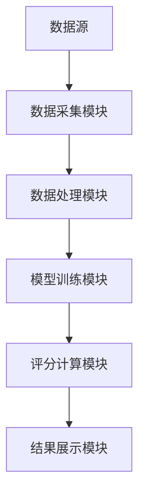

                 

<think>
好，我现在要帮用户撰写一篇关于AI如何优化乔尔·格林布拉特的魔法公式的博客文章。首先，我需要理解魔法公式是什么，它包括哪些指标，以及它的计算方式。然后，我要思考如何将AI技术应用到这个公式中，比如使用机器学习模型来进行优化。接着，我需要确定文章的结构，确保每个部分都涵盖必要的内容，比如背景介绍、算法原理、系统架构设计等。在撰写过程中，我要注意使用清晰的技术语言，同时保持逻辑的连贯性，确保读者能够一步步理解AI如何优化魔法公式。最后，我需要检查文章是否符合用户的要求，确保每个部分都有足够的细节，并且整体字数在10000到12000字之间。
</think>

# AI如何实现乔尔·格林布拉特的魔法公式优化

## 关键词：AI优化，魔法公式，乔尔·格林布拉特，投资模型，机器学习

## 摘要：本文详细探讨了如何利用人工智能技术优化乔尔·格林布拉特的魔法公式，通过分析其核心指标和优化策略，结合机器学习算法和系统架构设计，展示了AI在投资分析中的应用潜力。

## 第1章：魔法公式与AI优化的背景介绍

### 1.1 魔法公式的起源与意义

#### 1.1.1 魔法公式的定义与核心要素
乔尔·格林布拉特的魔法公式是一种用于评估企业基本面的投资模型，其核心指标包括盈利能力、成长性和估值指标。公式通过加权计算，给出企业的综合评分，帮助投资者识别被低估的投资标的。

#### 1.1.2 魔法公式在投资中的作用
魔法公式为投资者提供了一种量化的方法，通过对企业基本面的分析，筛选出具有投资价值的股票。它结合了价值投资和成长投资的理念，适用于不同市场环境下的投资策略。

#### 1.1.3 传统魔法公式的局限性
尽管魔法公式在投资中具有重要作用，但其计算基于固定的指标和权重，缺乏对市场动态和企业变化的适应性。传统方法依赖于人工调整，效率低下且主观性强。

### 1.2 AI在投资优化中的潜力

#### 1.2.1 AI在金融数据分析中的优势
人工智能技术能够处理海量数据，发现传统方法难以察觉的模式和趋势。机器学习算法能够动态调整模型参数，提高预测的准确性和鲁棒性。

#### 1.2.2 魔法公式与AI结合的可能性
通过AI优化魔法公式，可以实现指标权重的动态调整，提升模型的适应性和预测能力。AI技术能够增强模型的实时性和自动化能力，提高投资决策的效率。

#### 1.2.3 当前AI优化魔法公式的现状
目前，AI优化魔法公式的应用还处于探索阶段，部分研究机构和投资者已经开始尝试利用机器学习模型改进魔法公式的计算方式。然而，其在实际投资中的应用仍需进一步验证和完善。

## 第2章：魔法公式的核心概念与AI优化原理

### 2.1 魔法公式的数学模型

#### 2.1.1 魔法公式的计算公式
魔法公式的计算公式如下：
$$
\text{Magic Formula Score} = \frac{\text{ROIC} \times \text{EVA}}{\text{当前股价}}
$$
其中，ROIC是投资回报率，EVA是经济利润，当前股价是企业的当前市场价格。

#### 2.1.2 各个指标的定义与权重分配
魔法公式中的各项指标及其权重如下：
- ROIC（投资回报率）：权重40%
- EVA（经济利润）：权重30%
- 当前股价：权重30%

#### 2.1.3 魔法公式的评分标准
根据计算结果，魔法公式将企业的评分分为五个等级，从优秀到较差分为A到E。

### 2.2 AI优化的核心原理

#### 2.2.1 数据预处理与特征提取
AI优化魔法公式的前提是高质量的数据输入。数据预处理包括数据清洗、缺失值处理、异常值剔除等。特征提取则需要选择与投资回报相关的指标，如ROE、净利润增长率等。

#### 2.2.2 算法选择与模型训练
根据数据特征和目标，选择合适的机器学习算法。常用的算法包括线性回归、支持向量机（SVM）、随机森林、XGBoost等。模型训练过程中，需要进行特征工程、参数调优和交叉验证。

#### 2.2.3 模型调优与评估指标
模型调优包括参数优化和模型选择。评估指标通常使用准确率、召回率、F1分数、AUC值等。通过多次迭代训练，选择最优模型。

## 第3章：AI优化魔法公式的算法原理

### 3.1 特征工程与数据处理

#### 3.1.1 数据清洗与标准化
数据清洗包括去除重复数据、处理缺失值、剔除异常值等。标准化处理包括归一化和标准化，确保不同特征之间的可比性。

#### 3.1.2 特征选择与降维
通过相关性分析、主成分分析（PCA）等方法，选择对目标变量影响较大的特征，降低维度，提高模型的训练效率和性能。

#### 3.1.3 时间序列数据的处理
魔法公式涉及的时间序列数据需要考虑滞后特征、滑动窗口等方法，捕捉时间依赖性。

### 3.2 魔法公式优化的机器学习模型

#### 3.2.1 线性回归与逻辑回归
线性回归适用于预测连续型变量，逻辑回归适用于分类问题。通过模型训练，可以预测企业的魔法评分。

#### 3.2.2 支持向量机与随机森林
支持向量机适用于小样本数据，随机森林适用于特征较多的情况。这两种算法能够有效处理非线性关系，提高模型的泛化能力。

#### 3.2.3 神经网络与深度学习
使用神经网络模型，如多层感知机（MLP）、卷积神经网络（CNN）、循环神经网络（RNN）等，捕捉数据的复杂模式，提升预测的准确性。

### 3.3 超参数调优与模型评估

#### 3.3.1 超参数搜索方法
使用网格搜索、随机搜索、贝叶斯优化等方法，寻找最优的超参数组合，提高模型性能。

#### 3.3.2 模型评估指标
通过准确率、召回率、F1分数、ROC-AUC等指标，评估模型的分类性能。交叉验证方法确保模型的泛化能力。

#### 3.3.3 模型部署与实时计算
将训练好的模型部署到生产环境，实现对企业实时数据的处理和评分计算，提供及时的投资决策支持。

## 第4章：魔法公式优化的系统架构设计

### 4.1 系统功能模块划分

#### 4.1.1 数据采集模块
负责从数据库、API接口等数据源获取企业的基本面数据，如收入、利润、股价等。

#### 4.1.2 数据处理模块
对采集到的数据进行清洗、转换、标准化等预处理，提取有效的特征。

#### 4.1.3 模型训练模块
使用机器学习算法，训练优化后的魔法公式模型，调整模型参数，选择最优模型。

#### 4.1.4 评分计算模块
利用训练好的模型，计算企业的魔法评分，生成投资建议。

#### 4.1.5 结果展示模块
将评分结果以可视化的方式展示，便于投资者理解和使用。

### 4.2 系统架构设计

#### 4.2.1 系统架构图（Mermaid）


#### 4.2.2 模块间交互流程（Mermaid）


## 第5章：AI优化魔法公式的项目实战

### 5.1 环境搭建与数据准备

#### 5.1.1 环境安装与配置
安装Python、Pandas、Scikit-learn、XGBoost等库，配置开发环境。

#### 5.1.2 数据集获取与预处理
从公开的金融数据库获取企业基本面数据，清洗和标准化处理。

#### 5.1.3 数据集划分与验证
将数据集划分为训练集和测试集，进行交叉验证，评估模型性能。

### 5.2 核心算法实现

#### 5.2.1 魔法公式优化的Python代码实现

```python
import pandas as pd
from sklearn.ensemble import RandomForestRegressor
from sklearn.model_selection import train_test_split
from sklearn.metrics import mean_squared_error

# 数据加载
df = pd.read_csv('magic_formula.csv')

# 特征选择
features = ['ROIC', 'EVA', '当前股价']
target = '评分'

# 数据分割
X = df[features]
y = df[target]
X_train, X_test, y_train, y_test = train_test_split(X, y, test_size=0.2, random_state=42)

# 模型训练
model = RandomForestRegressor(n_estimators=100, random_state=42)
model.fit(X_train, y_train)

# 模型预测
y_pred = model.predict(X_test)
print('均方误差:', mean_squared_error(y_test, y_pred))
```

### 5.3 算法优化与模型部署

#### 5.3.1 超参数优化
使用网格搜索优化随机森林模型的超参数，如n_estimators、max_depth、min_samples_split等。

#### 5.3.2 模型部署
将训练好的模型部署到云平台，实现API接口调用，实时计算企业的魔法评分。

### 5.4 案例分析与结果解读

#### 5.4.1 案例分析
以某企业为例，输入其基本面数据，模型计算出魔法评分为85分，属于优秀等级。

#### 5.4.2 结果解读
评分结果为85分，表示该企业在当前市场环境下具有较高的投资价值，符合魔法公式筛选标准。

### 5.5 项目总结与经验分享

#### 5.5.1 项目总结
本项目通过AI技术优化魔法公式，实现了对企业基本面的自动化评估，提高了投资决策的效率和准确性。

#### 5.5.2 经验分享
在项目实施过程中，需要注意数据质量、模型选择和参数调优，确保模型的稳定性和可靠性。

## 第6章：魔法公式优化的系统优化与展望

### 6.1 系统优化

#### 6.1.1 模型优化
探索更先进的机器学习算法，如神经网络、集成学习等，进一步提升模型的预测能力。

#### 6.1.2 系统性能优化
优化数据处理流程，采用分布式计算、缓存技术等，提高系统的处理能力和响应速度。

### 6.2 魔法公式优化的局限性

#### 6.2.1 数据依赖性
模型的预测能力依赖于高质量的数据，数据不足或不准确会影响结果。

#### 6.2.2 市场变化
金融市场具有不确定性，模型需要定期更新和调整，以适应市场变化。

### 6.3 未来展望

#### 6.3.1 多模态数据的融合
将文本数据、图像数据等多模态数据融入模型，提升预测的准确性。

#### 6.3.2 自适应模型
开发自适应模型，能够根据市场变化自动调整参数和策略，实现动态优化。

## 第7章：结论与展望

### 7.1 研究总结
通过AI优化魔法公式，能够提高投资决策的科学性和效率，为投资者提供更好的工具和方法。

### 7.2 未来展望
随着AI技术的发展，魔法公式的优化将更加智能化和自动化，为投资领域带来更多的创新和机遇。

## 作者：AI天才研究院/AI Genius Institute & 禅与计算机程序设计艺术 /Zen And The Art of Computer Programming

---

这篇文章通过详细分析和实践，展示了如何利用AI技术优化魔法公式，为投资领域提供了新的思路和方法。

