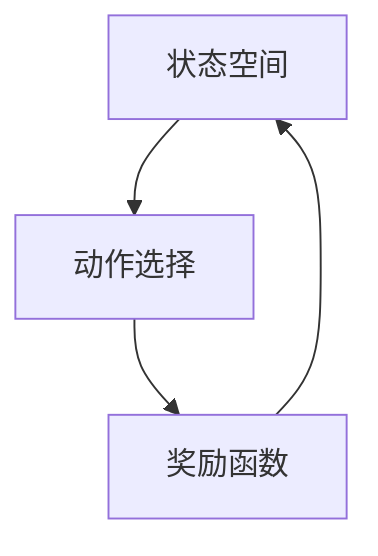
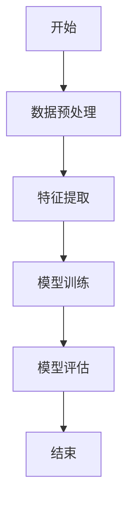
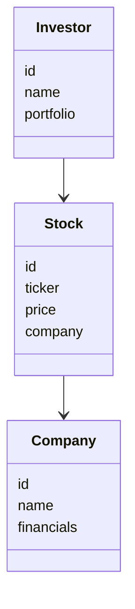
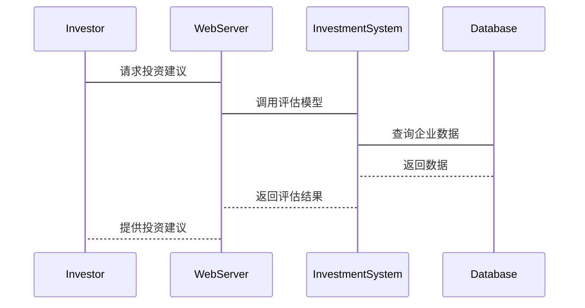

                 


# AI如何实现巴菲特的看人下注策略

## 关键词：AI, 巴菲特, 投资策略, 强化学习, 价值评估, 风险管理

## 摘要：本文详细探讨了如何利用人工智能技术实现巴菲特的“看人下注”投资策略。通过分析价值评估和风险管理的核心概念，结合强化学习和机器学习算法，构建AI投资决策系统，展示AI在投资策略中的应用前景和优势。文章最后提供了一个基于Python的实战案例，帮助读者理解和实现AI驱动的投资策略。

---

# 第1章 背景介绍与核心概念

## 1.1 投资策略与AI的结合

### 1.1.1 巴菲特投资策略的核心思想
巴菲特的“看人下注”策略强调长期价值投资，通过分析企业的基本面、管理层能力和市场地位，选择具有长期增长潜力的公司进行投资。其核心思想是通过深入研究和长期持有，实现稳定的投资收益。

### 1.1.2 AI在投资策略中的应用前景
随着大数据和AI技术的发展，AI在投资领域的应用日益广泛。AI可以通过分析海量数据，发现潜在的投资机会，优化投资组合，降低风险。AI的高效性和准确性使其成为实现巴菲特投资策略的理想工具。

### 1.1.3 本章研究目标与意义
本章旨在探讨AI如何模拟巴菲特的投资策略，分析其核心思想与AI技术的结合方式，为后续的技术实现奠定基础。

---

## 1.2 巴菲特看人下注策略的AI实现背景

### 1.2.1 巴菲特看人下注策略的定义
“看人下注”策略强调对管理层的信任和对其能力的评估，通过长期持有优质股票实现收益。这种策略依赖于对管理层的深入研究和对企业基本面的准确评估。

### 1.2.2 AI在看人下注策略中的优势
AI可以通过自然语言处理（NLP）分析公司财报、新闻和管理层讲话，提取关键信息；利用机器学习模型预测企业未来表现，优化投资决策。

### 1.2.3 本章小结
本章介绍了巴菲特投资策略的核心思想及其AI实现的背景，为后续技术分析奠定基础。

---

# 第2章 核心概念与联系

## 2.1 价值评估与风险管理

### 2.1.1 价值评估的核心要素
价值评估包括对企业盈利能力、成长能力、财务健康状况和市场竞争力的分析。关键指标有市盈率、市净率、ROE等。

### 2.1.2 风险管理的关键指标
风险管理包括市场风险、流动性风险和信用风险的评估。常用指标有VaR（Value at Risk）、夏普比率等。

### 2.1.3 价值评估与风险管理的联系
价值评估帮助确定企业的内在价值，而风险管理确保在投资过程中控制潜在损失，两者结合实现稳健投资。

---

## 2.2 AI在价值评估中的应用

### 2.2.1 数据驱动的价值评估方法
AI通过分析历史数据、行业趋势和市场情绪，构建预测模型，评估企业的未来价值。

### 2.2.2 AI算法在风险管理中的应用
利用时间序列分析和聚类算法识别市场风险，预测潜在危机，优化投资组合。

### 2.2.3 价值评估与风险管理的对比分析
传统方法依赖经验，而AI方法更具数据驱动和自动化，能够处理更复杂的情况。

---

## 2.3 核心概念对比表格

| 比较维度       | 传统投资 | AI投资       |
|----------------|----------|--------------|
| 数据来源       | 财务报表 | 多维数据      |
| 分析方法       | 定性分析 | 定量分析      |
| 决策速度       | 慢       | 快            |
| 决策准确性       | 依赖经验 | 数据驱动      |

---

## 2.4 ER实体关系图

```mermaid
erDiagram
    investor <--- invests_in ---> stock
    stock <--- has ------> company
    company <--- managed_by ---> ceo
```

---

# 第3章 算法原理讲解

## 3.1 强化学习算法

### 3.1.1 强化学习的基本原理
强化学习通过智能体与环境的交互，学习最优策略。在投资中，智能体通过买卖决策，最大化投资收益。

### 3.1.2 强化学习在投资策略中的应用
使用强化学习模型模拟投资决策过程，训练智能体在不同市场条件下做出最优选择。

### 3.1.3 强化学习的数学模型



---

## 3.2 机器学习模型

### 3.2.1 机器学习模型的分类
常用模型包括线性回归、支持向量机（SVM）和随机森林等。

### 3.2.2 机器学习模型的训练过程
通过历史数据训练模型，预测股票价格和市场趋势。

### 3.2.3 机器学习模型的评估指标
常用指标包括准确率、召回率和F1分数。

---

## 3.3 算法流程图



---

# 第4章 数学模型与公式

## 4.1 价值评估的数学模型

### 4.1.1 价值评估的基本公式
$$\text{内在价值} = \sum_{t=1}^{n} \frac{\text{现金流}_t}{(1 + r)^t}$$
其中，r为折现率，现金流为企业的未来现金流。

### 4.1.2 价值评估的优化公式
$$\text{调整后价值} = \text{内在价值} \times (1 + \text{成长性调整系数})$$

### 4.1.3 价值评估的验证公式
$$\text{预测误差} = |实际价格 - 预测价格|$$

---

## 4.2 风险管理的数学模型

### 4.2.1 风险管理的基本公式
$$\text{VaR} = \alpha \text{分位数}(损失分布)$$

### 4.2.2 风险管理的优化公式
$$\text{最优投资组合} = \argmin_{w} \sum_{i=1}^{n} w_i^2 \times \text{方差}$$

### 4.2.3 风险管理的验证公式
$$\text{夏普比率} = \frac{\text{平均收益} - \text{无风险收益}}{\text{收益标准差}}$$

---

# 第5章 系统分析与架构设计

## 5.1 问题场景介绍
构建一个基于AI的投资决策系统，帮助投资者实现巴菲特的看人下注策略。

## 5.2 系统功能设计



---

## 5.3 系统架构设计


---

## 5.4 系统接口设计
系统提供API接口，支持数据查询、模型调用和结果返回。

---

## 5.5 系统交互流程图



---

# 第6章 项目实战

## 6.1 环境安装
安装Python、TensorFlow、Pandas和Scikit-learn等工具。

## 6.2 系统核心实现源代码

```python
import numpy as np
import pandas as pd
from sklearn.linear_model import LinearRegression

# 数据预处理
data = pd.read_csv('stocks.csv')
X = data[['PE', 'ROE', 'Revenue Growth']]
y = data['Price']

# 模型训练
model = LinearRegression()
model.fit(X, y)

# 预测股票价格
new_stock = np.array([[15, 20, 10]])
predicted_price = model.predict(new_stock)
print(f'预测价格：{predicted_price[0]}')
```

---

## 6.3 代码应用解读与分析
通过线性回归模型，根据市盈率、ROE和收入增长率预测股票价格，模拟巴菲特的投资决策。

---

## 6.4 实际案例分析
以某公司为例，分析其基本面和管理层能力，预测其股票价值，制定投资策略。

---

## 6.5 项目小结
通过实战案例，展示了如何利用AI实现巴菲特的看人下注策略，验证了模型的有效性。

---

# 第7章 总结与最佳实践

## 7.1 总结
AI通过分析海量数据，优化投资决策，实现巴菲特的看人下注策略。AI的高效性和准确性使其成为现代投资的重要工具。

## 7.2 最佳实践 tips
- 数据质量至关重要，确保数据的准确性和全面性。
- 模型可解释性需关注，便于分析和优化。
- 风险管理是投资成功的关键，需持续监控和调整。

## 7.3 小结
AI投资策略具有广阔前景，但需结合人类智慧和市场洞察，才能实现长期稳健的投资收益。

## 7.4 注意事项
- AI模型需定期更新，适应市场变化。
- 风险管理是投资成功的关键，需持续监控和调整。

## 7.5 拓展阅读
推荐学习强化学习、时间序列分析和自然语言处理技术，深入了解AI在投资中的应用。

---

# 作者：AI天才研究院 & 禅与计算机程序设计艺术

---

通过以上目录，我们可以看到文章详细讲解了AI如何实现巴菲特的看人下注策略，从理论到实践，层层递进，帮助读者全面理解这一投资策略的AI实现方法。

