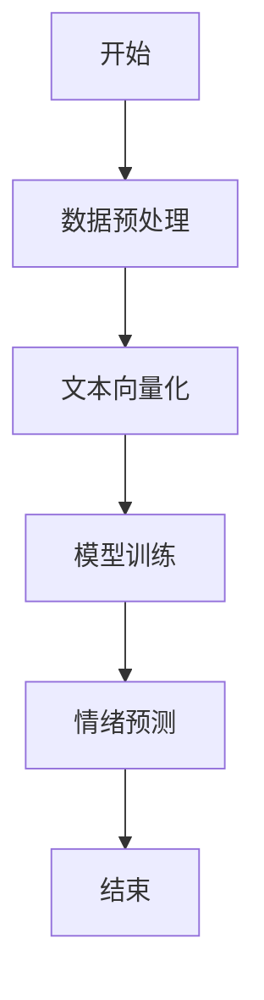
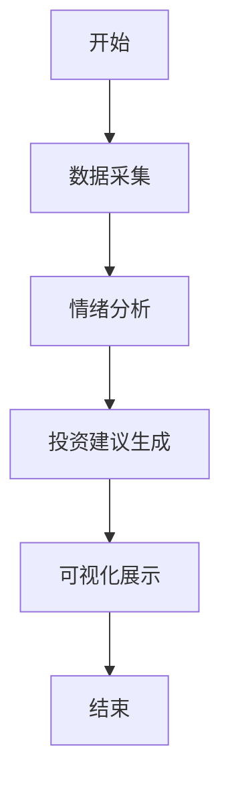
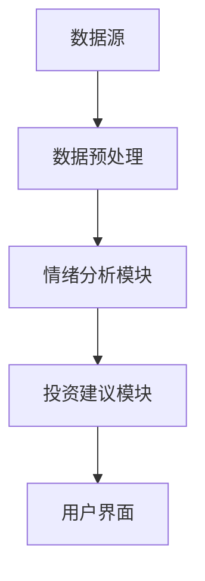
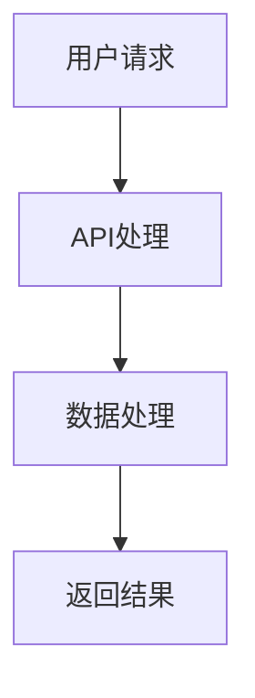

                 


# AI如何实现格雷厄姆的Mr. Market理论

## 关键词：人工智能，投资理论，市场情绪，机器学习，投资决策

## 摘要：
本文深入探讨了如何利用人工智能技术实现格雷厄姆的Mr. Market理论。通过分析市场情绪、构建AI驱动的投资决策系统，并结合具体项目实战，展示了AI在投资领域的潜力与应用。文章从理论到实践，详细阐述了AI如何模拟市场情绪，提供投资建议，帮助投资者在市场波动中做出更明智的决策。

---

# 第一部分：背景介绍与核心概念

## 第1章：Mr. Market理论概述

### 1.1 Mr. Market理论的起源与核心思想

#### 1.1.1 格雷厄姆投资理论的背景
Benjamin Graham 是价值投资的鼻祖，他的投资理念强调以低于内在价值的价格买入优质股票，并长期持有。他的理论奠定了现代投资学的基础，尤其是他的“Mr. Market”概念，将市场情绪波动与投资者决策联系起来。

#### 1.1.2 Mr. Market的定义与核心理念
Mr. Market 是一个拟人化的概念，代表市场情绪的变化。当市场情绪乐观时，Mr. Market 可能会高估资产价值；当市场情绪悲观时，他可能低估资产价值。投资者的任务是识别这些情绪偏差，并据此做出理性决策。

#### 1.1.3 理论在现代投资中的应用
随着金融市场的复杂化，投资者需要更精确地分析市场情绪。Mr. Market 理论为投资者提供了一种框架，通过分析市场情绪来优化投资组合。

---

## 第2章：AI在投资领域的应用现状

### 2.1 AI在投资中的优势
AI通过分析大量数据，识别市场趋势和情绪变化。机器学习算法可以预测市场波动，帮助投资者做出更明智的决策。

### 2.2 AI在市场分析中的应用
AI可以实时监控新闻、社交媒体和投资者情绪，生成市场情绪指数，辅助投资决策。

### 2.3 当前AI投资工具的局限性
尽管AI在投资中表现出色，但其预测能力受限于数据质量和模型假设。市场情绪的复杂性也增加了AI的挑战。

---

# 第二部分：核心概念与原理

## 第3章：Mr. Market理论的核心要素

### 3.1 理论的核心要素分析
市场情绪由投资者心理驱动，涉及恐惧和贪婪。AI可以通过自然语言处理分析情绪，生成情绪指数，帮助投资者识别市场趋势。

### 3.2 AI在模拟市场情绪中的作用
AI通过情绪分析算法，分析新闻和社交媒体，模拟市场情绪的变化，为投资者提供实时反馈。

### 3.3 理论的边界与外延
Mr. Market 理论的局限性在于情绪的不可预测性和市场的复杂性。AI需要结合其他因素，如基本面分析，才能做出更全面的投资决策。

---

# 第三部分：算法原理与数学模型

## 第4章：基于AI的情绪分析算法

### 4.1 情绪分析算法的实现
情绪分析算法通过自然语言处理技术，分析文本中的情感倾向。例如，使用词袋模型或词嵌入技术，将文本转换为向量，再通过分类器预测情绪。

#### 4.1.1 算法流程图


### 4.2 情感分析的数学模型
情感分析模型可以使用深度学习模型，如LSTM或Transformer。模型通过训练数据学习情感特征，输出情感得分。

#### 4.2.1 情感得分计算公式
$$ \text{情感得分} = \sum_{i=1}^{n} w_i \cdot x_i $$
其中，\( w_i \) 是词语权重，\( x_i \) 是词语情感值。

### 4.3 情感分析的准确性与稳定性
模型的准确性和稳定性受数据质量和算法选择的影响。需要通过交叉验证和超参数调优来提高性能。

---

# 第四部分：系统架构与设计

## 第5章：AI驱动的投资决策支持系统

### 5.1 系统功能设计

#### 5.1.1 功能模块划分
系统包括数据采集、情绪分析、投资建议生成和可视化展示四个模块。

#### 5.1.2 系统功能流程图


### 5.2 系统架构设计

#### 5.2.1 系统架构图


### 5.3 系统接口设计

#### 5.3.1 API接口设计
系统提供RESTful API，支持数据查询和投资建议请求。

#### 5.3.2 接口交互流程图


---

# 第五部分：项目实战与案例分析

## 第6章：AI模拟Mr. Market的实现

### 6.1 环境安装与配置

#### 6.1.1 开发环境搭建
安装Python、Jupyter Notebook和相关库（如NLTK、TensorFlow）。

### 6.2 系统核心实现

#### 6.2.1 核心算法实现
使用Python编写情绪分析代码，如下所示：
```python
import nltk
from sklearn.feature_extraction.text import TfidfVectorizer
from sklearn.svm import SVC

# 数据预处理
corpus = [...]  # 文本数据
labels = [...]  # 情感标签

# 特征提取
vectorizer = TfidfVectorizer()
X = vectorizer.fit_transform(corpus)

# 模型训练
model = SVC()
model.fit(X, labels)

# 情绪预测
def predict_emotion(text):
    X_test = vectorizer.transform([text])
    return model.predict(X_test)[0]
```

### 6.3 案例分析与详细解读

#### 6.3.1 典型案例分析
分析某段时间的市场情绪变化，生成投资建议。

#### 6.3.2 案例实现步骤
1. 收集市场数据。
2. 进行情感分析。
3. 生成投资建议。
4. 可视化结果。

---

# 第六部分：最佳实践与总结

## 第7章：AI实现Mr. Market理论的总结

### 7.1 最佳实践 tips
- 数据质量是关键，确保数据来源可靠。
- 定期更新模型，适应市场变化。
- 结合基本面分析，提高决策准确性。

### 7.2 小结
通过AI模拟Mr. Market理论，投资者可以更好地识别市场情绪，做出更明智的投资决策。然而，AI工具需要不断优化，以应对市场的复杂性。

### 7.3 注意事项
- 情绪分析模型的准确性受数据质量和算法选择影响。
- 投资者需具备基本的金融知识，结合AI工具做出决策。

### 7.4 拓展阅读
推荐阅读《AI in Finance》和《机器学习实战》。

---

# 作者：AI天才研究院 & 禅与计算机程序设计艺术

---

这篇文章系统地介绍了AI如何实现格雷厄姆的Mr. Market理论，从理论到实践，详细阐述了AI在模拟市场情绪、构建投资决策系统中的应用。通过具体的代码实现和案例分析，为读者提供了深入的指导和实践价值。

