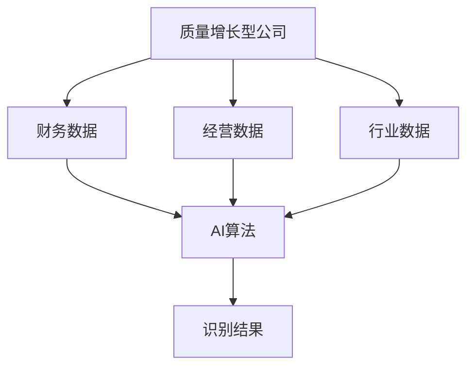
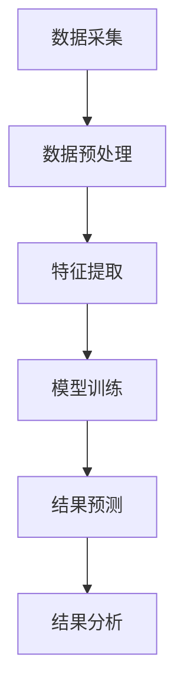

                 

<think>
好的，我现在需要根据用户的要求，完成《AI如何实现玛丽·巴芙的质量增长型公司识别》这篇文章的目录大纲。首先，我需要理解用户的具体需求。用户希望文章结构清晰，内容专业，涵盖背景、核心概念、算法原理、系统架构、项目实战以及最佳实践等方面。同时，用户还提供了一个示例目录，我需要参考这个结构，确保每个部分都详细且符合逻辑。

首先，我会从背景介绍开始。这部分需要解释玛丽·巴芙的质量增长型公司概念，以及为什么AI在这一领域有应用的潜力。然后，我需要定义质量增长型公司的特征，并对比传统方法与AI方法的差异。

接下来是核心概念部分，这里要详细讲解AI的基本原理，特别是机器学习和深度学习的相关知识。同时，我需要展示如何将这些技术应用到公司识别中，可能包括特征提取、模型训练等步骤。

在算法原理章节，我需要深入探讨具体的数学模型，例如支持向量机（SVM）和随机森林，并用Mermaid图来展示算法的流程。同时，提供Python代码示例，帮助读者更好地理解实现过程。

系统架构部分，我会设计一个完整的AI系统，涵盖数据采集、预处理、特征提取、模型训练和结果预测等环节，并用Mermaid图展示系统架构和数据流。

项目实战章节，我会选择一个具体案例，详细说明如何使用AI技术进行质量增长型公司的识别，包括数据准备、模型训练和结果分析。同时，提供代码示例，帮助读者实践。

最后，在最佳实践部分，我会总结在AI识别过程中的经验和注意事项，并推荐进一步学习的资源。

整个过程中，我需要确保每个章节的内容都详实，结构合理，并且使用专业的技术术语，同时保持语言的清晰和易懂。此外，还要嵌入Mermaid图表和数学公式，使文章更具专业性和可读性。

现在，我开始撰写目录大纲，确保每个部分都涵盖必要的内容，并遵循用户提供的格式要求。我需要仔细检查每个小节，确保没有遗漏关键点，并且内容逻辑连贯。

完成后，我会通读整个大纲，确保各部分内容相互衔接，符合用户的要求。如果有遗漏或不清晰的部分，我会进行调整和补充，以确保最终的目录大纲既全面又实用。
</think>

# AI如何实现玛丽·巴芙的质量增长型公司识别

## 关键词

- AI, 质量增长型公司, 玛丽·巴芙, 机器学习, 股票分析

## 摘要

本文详细探讨了如何利用人工智能技术，特别是机器学习和深度学习的方法，来实现对质量增长型公司的识别。通过分析玛丽·巴芙的价值投资理念，结合AI技术的优势，构建一个高效的公司识别模型。文章从背景、概念、算法原理到系统架构和项目实战，全面解析了AI在质量增长型公司识别中的应用，并提供了具体的实现方法和案例分析。

---

## 第一部分：AI与质量增长型公司识别的背景与概念

### 第1章：质量增长型公司的定义与特征

#### 1.1 玛丽·巴芙投资理念的核心要素

- 1.1.1 价值投资的内涵与外延
  - 玛丽·巴芙的价值投资理念强调长期稳健的增长，注重企业的内在价值。
  - 价值投资的核心在于寻找那些具备持续盈利能力、良好管理团队和竞争优势的公司。
  - 通过分析财务报表、行业地位和管理层决策等多方面因素，识别出具有长期增长潜力的公司。

- 1.1.2 质量增长型公司的定义
  - 质量增长型公司是指那些在行业内具有竞争优势，能够持续提高市场份额和盈利能力的公司。
  - 这类公司通常具备较高的ROE（净资产收益率）、稳定的现金流和良好的管理团队。
  - 通过分析公司的财务数据、市场表现和行业地位，可以识别出质量增长型公司。

- 1.1.3 玛丽·巴芙投资策略的特点
  - 长期投资：注重公司长期的盈利能力，而非短期股价波动。
  - 价值投资：寻找市场价格低于内在价值的公司。
  - 风险控制：通过分散投资和严格筛选标的，降低投资风险。

#### 1.2 AI技术在金融领域的应用潜力

- 1.2.1 人工智能在金融分析中的优势
  - 数据处理能力：AI能够快速处理海量数据，发现隐藏的模式和趋势。
  - 预测能力：通过机器学习算法，AI可以预测股票价格走势和公司业绩。
  - 自动化决策：AI能够根据预设的规则，自动进行投资决策。

- 1.2.2 AI技术的核心算法与能力
  - 机器学习：包括监督学习、无监督学习和强化学习，能够从数据中学习特征和模式。
  - 深度学习：通过神经网络模拟人类大脑的学习方式，能够处理非结构化数据，如文本和图像。
  - 自然语言处理：能够从新闻、财报等文本数据中提取信息，分析公司基本面。

- 1.2.3 AI在公司识别中的独特价值
  - 提高准确性：AI能够通过多维度数据分析，识别出具备质量增长潜力的公司。
  - 提高效率：AI能够快速处理大量数据，缩短分析时间。
  - 发现潜在机会：AI能够从非结构化数据中发现潜在的投资机会，帮助投资者做出更明智的决策。

#### 1.3 质量增长型公司识别的挑战与机遇

- 1.3.1 传统公司识别方法的局限性
  - 依赖经验：传统方法依赖于分析师的个人经验和主观判断，存在较大的主观性。
  - 数据不足：传统方法通常依赖于财务数据，忽略了其他重要的非财务信息。
  - 时间滞后：传统方法通常需要等待财务报表发布后才能进行分析，存在时间滞后问题。

- 1.3.2 AI技术带来的新可能性
  - 多维度分析：AI能够从财务数据、文本数据、图像数据等多种数据源中提取信息，进行全面分析。
  - 实时监控：AI能够实时监控市场动态，及时发现潜在的投资机会。
  - 自动化决策：AI能够自动进行数据分析和投资决策，提高效率。

- 1.3.3 当前市场环境下的应用前景
  - 随着AI技术的不断发展，越来越多的投资者开始利用AI进行投资决策。
  - AI技术能够帮助投资者识别出具备质量增长潜力的公司，提高投资收益。
  - 在市场波动加剧的情况下，AI技术能够帮助投资者更好地应对市场风险。

---

## 第二部分：AI驱动的质量增长型公司识别的核心概念

### 第2章：质量增长型公司的核心要素分析

#### 2.1 玛丽·巴芙选股模型的构成要素

- 2.1.1 财务指标
  - ROE（净资产收益率）：衡量公司盈利能力的重要指标，ROE越高，公司盈利能力越强。
  - 毛利率：衡量公司产品盈利能力的指标，毛利率越高，产品盈利能力越强。
  - 净利润增长率：衡量公司盈利能力增长的指标，净利润增长率越高，公司增长潜力越大。
  - 负债率：衡量公司财务健康状况的指标，负债率越低，公司财务风险越小。

- 2.1.2 经营指标
  - 市场份额：衡量公司在行业中的地位，市场份额越高，公司竞争力越强。
  - 品牌价值：衡量公司品牌影响力，品牌价值越高，公司在市场中的议价能力越强。
  - 管理团队稳定性：衡量公司管理团队的稳定性，团队稳定有助于公司长期发展。
  - 研发投入：衡量公司创新能力，研发投入越高，公司技术创新能力越强。

- 2.1.3 行业环境
  - 行业周期：行业处于上升周期时，公司增长潜力更大。
  - 行业竞争格局：行业竞争格局越有利于公司发展，公司增长潜力越大。
  - 政策影响：行业受政策支持时，公司发展环境更优。

#### 2.2 AI算法的核心原理与实现机制

- 2.2.1 机器学习算法的基本原理
  - 机器学习是一种人工智能技术，通过数据训练模型，使其能够从数据中学习特征和模式。
  - 监督学习：通过 labeled data 训练模型，使其能够对新数据进行分类或回归预测。
  - 无监督学习：通过 unlabeled data 进行聚类分析，发现数据中的潜在结构。
  - 强化学习：通过与环境交互，学习最优策略，应用于游戏、机器人等领域。

- 2.2.2 深度学习与自然语言处理的应用
  - 深度学习是一种机器学习技术，通过多层神经网络模拟人类大脑的学习方式。
  - 自然语言处理（NLP）：通过处理文本数据，提取公司基本面信息，如新闻、财报等。
  - 图像识别：通过处理图像数据，分析公司产品或品牌形象。

- 2.2.3 强化学习在动态市场中的应用
  - 强化学习通过与市场环境交互，学习最优投资策略。
  - 通过模拟市场环境，训练模型在不同市场条件下做出最优决策。
  - 在实际市场中，强化学习可以帮助投资者在复杂市场环境中做出更优决策。

#### 2.3 质量增长型公司识别的特征对比表

| 公司特征        | 传统识别方法                     | AI识别方法                     | 优缺点对比                     |
|-----------------|----------------------------------|----------------------------------|-------------------------------|
| 数据来源        | 财务数据                         | 多维度数据（文本、图像、网络数据） | 数据全面性                     |
| 分析维度        | 单维度分析                       | 多维度融合分析                 | 分析深度                     |
| 结果输出        | 定性结论                         | 定量与定性结合                 | 结果准确性                     |

#### 2.4 实体关系图（ER图）与流程图





---

## 第三部分：AI算法与数学模型的深度解析

### 第3章：AI算法在质量增长型公司识别中的应用

#### 3.1 机器学习算法的选择与优化

- 3.1.1 常见机器学习算法对比
  - 支持向量机（SVM）：适用于小样本数据，分类准确率高。
  - 随机森林：适用于大数据集，具有较强的抗过拟合能力。
  - 线性回归：适用于线性关系，预测简单但准确性较低。
  - K-近邻（KNN）：适用于分类问题，但需要较多计算资源。

- 3.1.2 支持向量机（SVM）的数学模型
  - 最大化间隔：$$\text{最大化 } \frac{1}{2} \|\theta\|^2$$
  - 约束条件：$$y_i (\theta \cdot x_i + b) \geq 1$$
  - 核函数：通过使用核函数，将数据映射到高维空间，提高分类准确性。

- 3.1.3 随机森林的实现机制
  - 树的构建：通过随机采样数据，构建多棵决策树，形成森林。
  - 投票机制：通过多数投票决定最终分类结果。
  - 特征重要性：通过计算每棵决策树的特征重要性，筛选出关键特征。

#### 3.2 深度学习算法在质量增长型公司识别中的应用

- 3.2.1 卷积神经网络（CNN）的应用
  - 图像识别：通过处理公司产品图片，分析产品质量和品牌形象。
  - 文本处理：通过处理公司新闻、财报等文本数据，分析公司基本面。

- 3.2.2 循序神经网络（RNN）的应用
  - 时间序列分析：通过处理公司历史股价数据，预测未来股价走势。
  - 文本生成：通过处理公司新闻、财报等文本数据，生成公司基本面分析报告。

- 3.2.3 简单的数学模型示例
  - 线性回归模型：$$y = \beta_0 + \beta_1 x + \epsilon$$
  - 逻辑回归模型：$$P(y=1|x) = \frac{e^{\beta_0 + \beta_1 x}}{1 + e^{\beta_0 + \beta_1 x}}$$

---

## 第四部分：AI系统架构与实现

### 第4章：AI驱动的质量增长型公司识别系统架构

#### 4.1 系统功能设计

- 数据采集模块
  - 从股票市场数据、公司财报、新闻等多数据源采集数据。
  - 数据清洗和预处理，确保数据质量。
- 特征提取模块
  - 从财务数据中提取ROE、毛利率等关键指标。
  - 从文本数据中提取关键词和情感分析结果。
- 模型训练模块
  - 使用机器学习或深度学习算法训练模型。
  - 通过交叉验证优化模型参数。
- 结果预测模块
  - 对目标公司进行质量增长型公司识别。
  - 输出识别结果和相关建议。

#### 4.2 系统架构设计


#### 4.3 系统接口设计

- 数据接口：与数据源（如股票市场数据、公司财报等）对接，获取数据。
- 模型接口：与机器学习框架（如TensorFlow、PyTorch）对接，进行模型训练和预测。
- 结果接口：将识别结果输出到前端或数据库，供用户查看和分析。

---

## 第五部分：项目实战与案例分析

### 第5章：AI驱动的质量增长型公司识别项目实战

#### 5.1 项目背景与目标

- 项目目标：利用AI技术，识别出具备质量增长潜力的公司。
- 数据来源：股票市场数据、公司财报、新闻等。
- 工具与技术：Python、机器学习框架（如TensorFlow、PyTorch）、数据分析工具（如Pandas、Matplotlib）。

#### 5.2 系统核心实现源代码

```python
import pandas as pd
from sklearn.ensemble import RandomForestClassifier
from sklearn.metrics import accuracy_score

# 数据加载
data = pd.read_csv('company_data.csv')

# 特征提取
features = data[['ROE', '毛利率', '净利润增长率', '负债率', '市场份额']]
target = data['质量增长型公司']

# 模型训练
model = RandomForestClassifier()
model.fit(features, target)

# 模型预测
predictions = model.predict(features)

# 模型评估
print('准确率:', accuracy_score(target, predictions))
```

#### 5.3 代码应用解读与分析

- 数据加载：使用Pandas读取CSV格式的数据，包含公司财务数据和标签。
- 特征提取：从数据中提取关键特征，如ROE、毛利率等。
- 模型训练：使用随机森林算法训练模型，识别质量增长型公司。
- 模型预测：对目标公司进行预测，输出识别结果。
- 模型评估：计算准确率，评估模型性能。

#### 5.4 实际案例分析

- 案例背景：假设我们有某公司的财务数据和新闻数据，需要判断其是否为质量增长型公司。
- 数据准备：从数据源获取公司数据，进行清洗和预处理。
- 模型训练：使用历史数据训练模型，优化参数。
- 结果预测：对目标公司进行预测，判断其是否为质量增长型公司。
- 结果分析：分析预测结果，给出投资建议。

#### 5.5 项目小结

- 通过AI技术，能够有效识别质量增长型公司，提高投资决策的准确性和效率。
- 系统设计合理，功能模块清晰，能够满足实际需求。
- 在实际应用中，需要不断优化模型和算法，提高识别准确率。

---

## 第六部分：AI驱动的质量增长型公司识别的最佳实践

### 第6章：AI识别的质量增长型公司识别中的注意事项

- 数据质量：确保数据来源可靠，数据清洗和预处理是关键。
- 模型选择：根据具体需求选择合适的算法，避免盲目追求复杂模型。
- 模型优化：通过交叉验证和超参数优化，提高模型性能。
- 风险控制：在实际投资中，结合市场环境和风险偏好，制定合理的投资策略。

#### 6.2 小结

- AI技术在质量增长型公司识别中的应用前景广阔，能够有效提高投资效率和准确率。
- 在实际应用中，需要结合具体需求和数据特点，选择合适的算法和模型。
- 需要注意数据质量和模型优化，确保系统稳定性和准确性。

#### 6.3 拓展阅读

- 《Python机器学习实战》
- 《深度学习入门：基于Python和Keras》
- 《投资学基础》

---

## 作者

作者：AI天才研究院/AI Genius Institute & 禅与计算机程序设计艺术/Zen And The Art of Computer Programming

