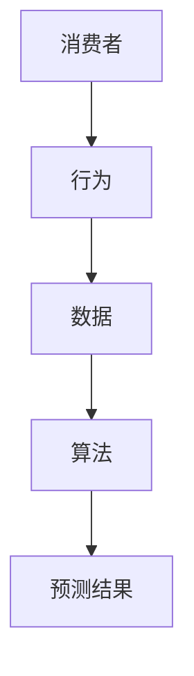
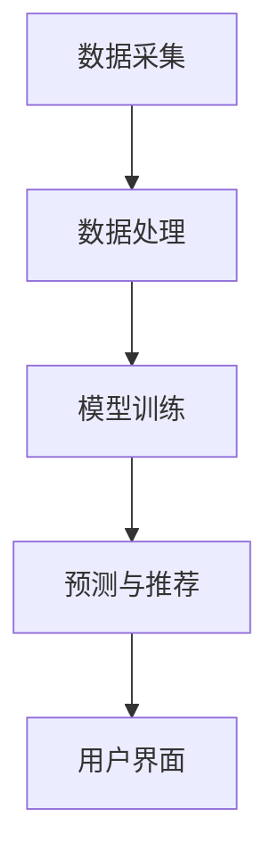
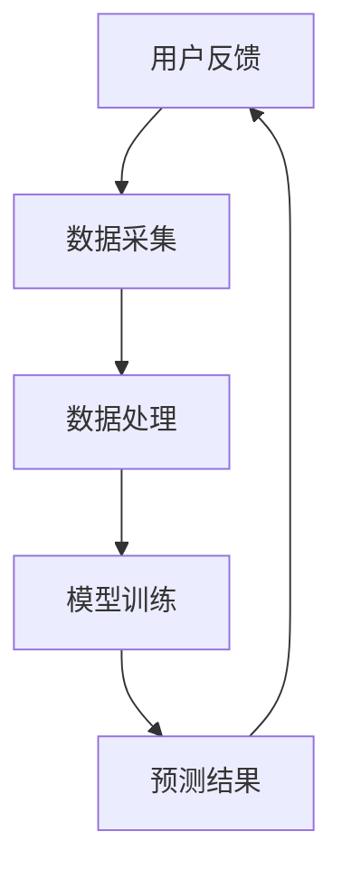

                 


# AI如何实现费雪的消费者行为研究

> 关键词：AI技术，消费者行为研究，费雪理论，数据驱动，机器学习，算法实现

> 摘要：本文探讨了如何利用人工智能技术实现费雪的消费者行为研究，通过分析消费者行为的核心概念、AI算法原理、系统架构设计、项目实战等多方面内容，详细阐述了AI在消费者行为研究中的应用及其优势。文章从理论到实践，结合实际案例，深入剖析了AI技术如何帮助我们更好地理解和预测消费者行为。

---

## 第一部分：背景介绍与核心概念

### 第1章：费雪的消费者行为研究概述

#### 1.1 费雪的消费者行为理论
消费者行为研究是理解消费者决策过程和行为模式的重要领域，而费雪的理论是其中的重要组成部分。费雪的消费者行为研究主要关注消费者的购买动机、决策过程以及行为特征。以下是从费雪理论中提取的核心概念：

- **消费者需求**：消费者购买产品的根本驱动力。
- **购买决策**：消费者在购买过程中做出的一系列选择。
- **行为特征**：消费者在实际购买中的行为表现。

#### 1.2 AI在消费者行为研究中的应用背景
传统的消费者行为研究主要依赖问卷调查、访谈和观察法等方法，这些方法在数据收集和分析上存在一定的局限性。AI技术的出现，为消费者行为研究提供了新的可能性。AI可以通过大数据分析、机器学习算法等技术手段，帮助我们更精准地预测消费者行为，优化市场策略。

#### 1.3 费雪理论与AI的结合
费雪的消费者行为理论为AI提供了研究框架，而AI技术则为费雪理论的实证研究提供了强大的工具。通过AI技术，我们可以更深入地分析消费者的隐性需求和行为模式，从而为市场决策提供更精准的支持。

---

### 第2章：AI与消费者行为研究的核心概念

#### 2.1 数据驱动的消费者行为分析
AI技术的核心是数据驱动的分析。通过收集和处理大量的消费者数据，我们可以提取出消费者的偏好、行为模式和需求特征。这些数据包括：

- **交易数据**：消费者的购买记录、订单金额等。
- **用户数据**：消费者的年龄、性别、职业等基本信息。
- **行为数据**：消费者的点击、浏览、收藏等行为记录。

#### 2.2 AI算法在消费者行为预测中的作用
AI算法可以通过对消费者数据的建模和分析，预测消费者的未来行为。例如：

- **需求预测**：通过时间序列分析预测消费者对某种产品的购买需求。
- **行为预测**：通过分类算法预测消费者是否会购买某种产品。
- **推荐系统**：通过协同过滤或深度学习算法推荐相关产品。

#### 2.3 核心概念对比分析
以下是传统消费者行为研究与AI驱动研究的核心概念对比：

| **核心概念** | **传统研究** | **AI驱动研究** |
|--------------|---------------|----------------|
| 数据来源     | 问卷、访谈    | 大数据、日志   |
| 分析方法     | 统计分析      | 机器学习、深度学习 |
| 预测能力     | 有限          | 更精准、更快速  |

#### 2.4 实体关系图
以下是一个简单的实体关系图，展示了消费者行为研究中的核心实体及其关系：



---

## 第二部分：AI算法原理与数学模型

### 第3章：AI算法原理

#### 3.1 监督学习算法
监督学习是AI技术的核心之一，广泛应用于消费者行为预测。

- **线性回归**：用于预测连续型变量，例如消费者对某种产品的购买金额。
  $$ y = \beta_0 + \beta_1x + \epsilon $$
- **逻辑回归**：用于分类问题，例如预测消费者是否会购买某种产品。
  $$ P(y=1|x) = \frac{e^{\beta_0 + \beta_1x}}{1 + e^{\beta_0 + \beta_1x}} $$
- **随机森林**：用于分类和回归问题，通过集成学习提高模型的准确性。

#### 3.2 无监督学习算法
无监督学习适用于消费者行为数据中未标注的情况。

- **K-means聚类**：用于将消费者分为不同的群体。
- **主成分分析（PCA）**：用于降维，提取数据的主要特征。

#### 3.3 强化学习算法
强化学习适用于动态环境中的消费者行为预测。

- **Q-learning**：通过奖励机制优化决策过程。
- **Deep Q-Network**：结合深度学习和强化学习，提高预测精度。

### 第4章：数学模型与公式

#### 4.1 线性回归模型
线性回归是监督学习的基础模型，用于预测连续型变量。

$$ y = \beta_0 + \beta_1x + \epsilon $$

其中，$y$ 是预测目标，$x$ 是输入特征，$\beta_0$ 和 $\beta_1$ 是模型参数，$\epsilon$ 是误差项。

#### 4.2 逻辑回归模型
逻辑回归用于分类问题，通过sigmoid函数将线性回归的输出映射到概率空间。

$$ P(y=1|x) = \frac{e^{\beta_0 + \beta_1x}}{1 + e^{\beta_0 + \beta_1x}} $$

---

## 第三部分：系统架构设计与项目实战

### 第5章：系统架构设计

#### 5.1 系统功能设计
一个完整的消费者行为分析系统应包含以下功能模块：

- 数据采集模块：负责收集消费者行为数据。
- 数据处理模块：对数据进行清洗和预处理。
- 模型训练模块：利用机器学习算法训练模型。
- 预测与推荐模块：基于模型预测结果生成推荐列表。

#### 5.2 系统架构图
以下是系统的整体架构图：



#### 5.3 接口设计
系统需要与外部数据源、数据库和用户界面进行交互。

- 数据接口：与第三方数据源对接。
- API接口：提供预测结果给上层应用。

#### 5.4 交互流程图
以下是系统的交互流程图：



---

### 第6章：项目实战

#### 6.1 环境安装
我们需要以下环境：

- Python 3.8+
- Jupyter Notebook
- Scikit-learn
- Pandas
- Numpy

#### 6.2 核心实现代码

```python
# 数据预处理
import pandas as pd
import numpy as np

data = pd.read_csv('consumer_data.csv')
data = data.dropna()
data['label'] = data['label'].astype(int)

# 划分训练集和测试集
from sklearn.model_selection import train_test_split

X_train, X_test, y_train, y_test = train_test_split(data.drop('label', axis=1), data['label'], test_size=0.2)

# 模型训练
from sklearn.linear_model import LogisticRegression

model = LogisticRegression()
model.fit(X_train, y_train)

# 模型预测
y_pred = model.predict(X_test)

# 模型评估
from sklearn.metrics import accuracy_score

print(f'Accuracy: {accuracy_score(y_test, y_pred)}')
```

#### 6.3 实际案例分析
以电商领域的消费者行为预测为例，我们可以利用逻辑回归模型预测消费者是否会购买某种产品。

---

## 第四部分：总结与展望

### 7.1 总结
本文详细探讨了AI技术在费雪消费者行为研究中的应用，从理论到实践，结合实际案例，深入剖析了AI技术如何帮助我们更好地理解和预测消费者行为。通过本文的分析，我们可以看到，AI技术为消费者行为研究提供了强大的工具，能够显著提高研究的准确性和效率。

### 7.2 未来展望
随着AI技术的不断发展，消费者行为研究将更加精准和智能化。未来，我们可以期待更多创新的算法和工具，帮助我们更好地理解消费者行为，优化市场策略。

---

## 最佳实践与小结

- **最佳实践**：在实际应用中，建议结合业务需求选择合适的AI算法，并确保数据质量和模型可解释性。
- **小结**：本文通过理论分析和实际案例，展示了AI技术在消费者行为研究中的巨大潜力。
- **注意事项**：在实际项目中，需注意数据隐私和模型解释性问题。
- **拓展阅读**：建议进一步学习深度学习在消费者行为研究中的应用。

---

作者：AI天才研究院/AI Genius Institute & 禅与计算机程序设计艺术/Zen And The Art of Computer Programming

