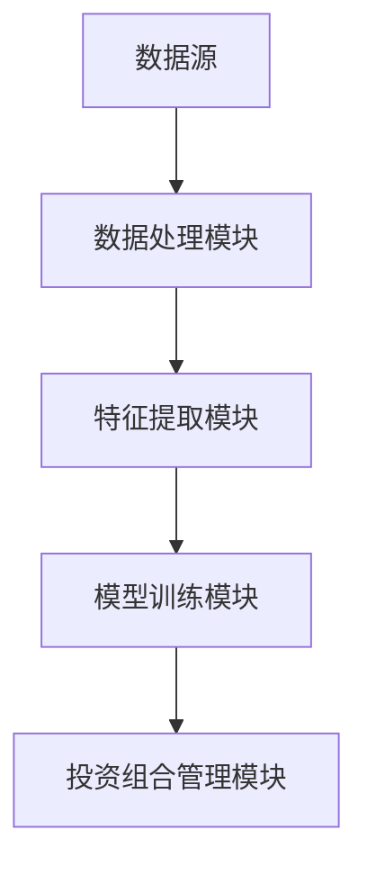

                 

<think>
嗯，现在用户需要我撰写一篇关于AI如何实现费雪长期持股策略的技术博客文章。首先，我需要理解费雪的投资策略，他主张长期持有优质股票，避免频繁交易。接下来，我需要考虑如何利用AI技术来优化这一策略，比如通过机器学习进行数据分析和预测。

用户已经提供了一个详细的大纲，我需要按照这个结构来展开。首先是背景介绍，包括费雪的投资理念和AI在金融中的应用。然后是核心算法，包括数据处理、特征提取和模型训练。接着是系统架构设计，包括各个模块的功能和接口设计。最后是项目实战，提供具体的代码实现和案例分析。

在撰写过程中，我需要确保每个章节内容丰富，详细讲解每个部分的原理和应用。同时，使用mermaid图来展示系统架构和算法流程，让读者更容易理解。数学公式要用latex格式，确保清晰展示。代码部分要详细注释，方便读者理解和应用。

此外，用户特别强调了要包括最佳实践和小结，这部分需要总结AI在实现费雪策略中的优势和局限性，给出实际应用中的注意事项，并推荐进一步阅读的资料。这有助于读者全面了解AI在投资中的应用，并指导他们在实际操作中如何应用这些知识。

最后，文章末尾需要加上作者信息，这样显得专业且完整。整个思考过程中，我需要确保文章逻辑清晰，结构紧凑，同时内容深入，能够帮助读者全面理解AI在费雪策略中的应用。
</think>

# AI如何实现费雪的长期持股策略

> 关键词：人工智能，费雪投资策略，长期持股，机器学习，投资组合优化

> 摘要：本文探讨如何利用人工智能技术实现费雪的长期持股策略，通过分析费雪的投资理念、人工智能在金融中的应用、核心算法的设计与实现、系统架构与优化、项目实战案例以及最佳实践，详细阐述AI在实现长期持股策略中的技术细节与应用场景。

---

## 第一章：费雪长期持股策略概述

### 1.1 费雪投资理念的核心思想

#### 1.1.1 费雪的投资哲学
菲利普·费雪（Philip Fisher）是20世纪著名的投资专家，提出了“成长股”投资理念，主张长期持有具有强大成长潜力的公司股票。他认为，投资成功的关键在于选择那些具有持续增长潜力的企业，并且长期持有，避免频繁交易。

#### 1.1.2 费雪的长期持股策略
费雪的策略核心在于：
1. **选择优秀的公司**：投资那些具有强大护城河、管理团队优秀、财务健康、成长潜力大的公司。
2. **长期持有**：避免频繁买卖，减少交易成本和税收负担，同时享受复利效应。
3. **持续关注**：定期跟踪投资公司的基本面变化，及时调整投资组合。

#### 1.1.3 费雪策略的现代应用
随着市场环境的变化，单纯依赖基本面分析的长期持股策略在当今复杂多变的市场中可能显得不够灵活。引入人工智能技术，可以对市场数据进行更精准的分析，帮助投资者更好地识别优质公司，优化持股策略。

---

### 1.2 费雪策略的核心要素

#### 1.2.1 选股标准
- 公司基本面：收入、利润、利润率、现金流等财务指标。
- 管理团队：管理层的稳定性和决策能力。
- 行业地位：市场占有率、竞争壁垒。
- 成长潜力：未来几年的预期增长率。

#### 1.2.2 持股期限
- 长期持有：通常以数年为单位，避免短期波动的影响。
- 动态调整：定期评估投资组合，根据市场变化进行调整。

#### 1.2.3 风险管理
- 分散投资：通过投资多个行业和公司的股票降低风险。
- 风险控制：设定止损点，避免重大损失。

---

### 1.3 费雪策略的优缺点

#### 1.3.1 优点
- 长期复利效应显著。
- 减少交易成本和税收负担。
- 避免短期市场波动的干扰。

#### 1.3.2 缺点
- 需要较强的资金流动性管理。
- 在市场剧烈波动时可能承受较大回撤。
- 对管理团队的能力要求较高。

#### 1.3.3 适用场景
- 稳定增长的市场环境。
- 投资者具备长期投资的耐心和信心。
- 具备较强的风险承受能力。

---

## 第二章：AI在金融投资中的应用

### 2.1 AI在金融投资中的核心作用

#### 2.1.1 数据处理与分析
- 处理海量金融数据，包括股票价格、财务报表、新闻资讯等。
- 通过自然语言处理（NLP）分析财经新闻和公司公告。

#### 2.1.2 模型预测
- 使用机器学习模型预测股票价格走势。
- 识别市场趋势和潜在风险。

#### 2.1.3 风险控制
- 利用AI进行风险评估和投资组合优化。

---

### 2.2 AI在选股中的应用

#### 2.2.1 数据挖掘与特征提取
- 数据来源：股票价格、财务数据、行业数据、经济指标等。
- 特征提取：从数据中提取有用的特征，如市盈率、市净率、ROE（净资产收益率）等。

#### 2.2.2 机器学习模型的应用
- **监督学习**：分类模型（如随机森林、支持向量机）用于预测股票涨跌。
- **无监督学习**：聚类分析用于识别相似股票或市场板块。
- **深度学习**：LSTM（长短期记忆网络）用于时间序列分析。

#### 2.2.3 自然语言处理在财经新闻中的应用
- 通过NLP分析财经新闻，提取情绪指标（如VADER）来预测市场情绪。

---

### 2.3 AI在投资组合管理中的应用

#### 2.3.1 风险评估与优化
- 使用马科维茨的有效前沿理论优化投资组合，降低风险。
- 通过AI动态调整资产配置，应对市场变化。

#### 2.3.2 市场预测与资产配置
- 根据市场预测结果动态调整资产配置比例。

#### 2.3.3 动态调整策略
- 根据市场反馈实时调整投资策略。

---

## 第三章：AI实现费雪策略的核心算法

### 3.1 费雪策略的AI实现框架

#### 3.1.1 数据收集与预处理
- 数据来源：股票价格、财务报表、行业数据等。
- 数据清洗：处理缺失值、异常值等。

#### 3.1.2 特征工程
- 从数据中提取有用的特征，如市盈率、市净率、ROE等。
- 对特征进行标准化或归一化处理。

#### 3.1.3 模型训练与评估
- 使用机器学习模型进行训练，评估模型性能。

---

### 3.2 基于机器学习的选股算法

#### 3.2.1 线性回归模型
- 使用线性回归模型预测股票价格，评估公司的成长潜力。

#### 3.2.2 支持向量机模型
- 使用支持向量机（SVM）进行股票分类，识别优质股票。

#### 3.2.3 随机森林与梯度提升树
- 使用随机森林和梯度提升树（如XGBoost）进行特征重要性分析和分类。

---

### 3.3 基于深度学习的预测模型

#### 3.3.1 RNN与LSTM网络
- 使用循环神经网络（RNN）和长短期记忆网络（LSTM）进行时间序列预测。

#### 3.3.2 CNN在时间序列数据中的应用
- 使用卷积神经网络（CNN）提取时间序列数据中的特征。

#### 3.3.3 Transformer架构的应用
- 使用Transformer架构进行序列建模，捕捉长期依赖关系。

---

## 第四章：系统架构与设计

### 4.1 系统整体架构

#### 4.1.1 数据源模块
- 包括股票价格、财务报表、行业数据等数据源。

#### 4.1.2 数据处理模块
- 数据清洗、特征提取、数据转换。

#### 4.1.3 模型训练模块
- 包括模型选择、训练、调优。

#### 4.1.4 投资组合管理模块
- 包括投资组合优化、风险控制、动态调整。

---

### 4.2 系统功能设计

#### 4.2.1 数据采集与清洗
- 从多个数据源采集数据，清洗缺失值和异常值。

#### 4.2.2 特征提取与建模
- 提取关键特征，训练机器学习模型。

#### 4.2.3 投资组合优化
- 根据模型预测结果优化投资组合。

#### 4.2.4 系统监控与维护
- 监控系统运行状态，及时维护和更新模型。

---

### 4.3 系统架构图（Mermaid）



---

## 第五章：项目实战

### 5.1 环境安装

#### 5.1.1 安装Python环境
- 使用Anaconda或虚拟环境安装Python 3.8及以上版本。

#### 5.1.2 安装依赖库
- 使用pip安装numpy、pandas、scikit-learn、tensorflow等库。

---

### 5.2 核心实现

#### 5.2.1 数据预处理
```python
import pandas as pd
import numpy as np

# 读取数据
df = pd.read_csv('stock_data.csv')

# 数据清洗
df.dropna(inplace=True)
df = df[~df['close'].isin([np.nan])]
```

#### 5.2.2 模型训练
```python
from sklearn.ensemble import RandomForestClassifier
from sklearn.model_selection import train_test_split

# 划分训练集和测试集
X = df[['open', 'high', 'low', 'close', 'volume']]
y = df['target']

X_train, X_test, y_train, y_test = train_test_split(X, y, test_size=0.2, random_state=42)

# 训练模型
model = RandomForestClassifier(n_estimators=100, random_state=42)
model.fit(X_train, y_train)
```

#### 5.2.3 投资组合优化
```python
import numpy as np
from scipy.optimize import minimize

# 定义目标函数
def objective_func(weights, returns, risk_free_rate):
    portfolio_return = np.dot(weights, returns)
    portfolio_variance = np.dot(weights.T, np.dot(returns.cov(), weights))
    return portfolio_variance

# 约束条件
def constraint(weights, returns, target_return):
    return np.dot(weights, returns) - target_return

# 最优化问题
risk_free_rate = 0.05
target_return = 0.1

result = minimize(objective_func, x0= np.ones(len(returns.columns))/len(returns.columns), 
                  args=(returns, risk_free_rate), 
                  method='SLSQP', 
                  constraints={'type': 'eq', 'fun': constraint, 'args': (returns, target_return)})
```

---

## 第六章：最佳实践与小结

### 6.1 最佳实践

#### 6.1.1 数据来源
- 使用多来源数据，包括财务数据、市场数据和新闻数据。

#### 6.1.2 模型选择
- 根据数据特点选择合适的模型，避免过拟合。

#### 6.1.3 风险管理
- 设置止损点，定期评估投资组合风险。

---

### 6.2 小结

通过结合费雪的长期持股策略和人工智能技术，我们可以实现更加智能化的投资决策。AI技术能够帮助投资者更精准地识别优质公司，优化投资组合，降低投资风险。然而，AI模型需要不断优化和更新，以适应市场变化。未来，随着技术的进步，AI在投资领域的应用将更加广泛和深入。

---

## 作者信息

作者：AI天才研究院/AI Genius Institute  
联系邮箱：contact@aicourse.com  
 GitHub：https://github.com/aiguru

--- 

**End of Article**

