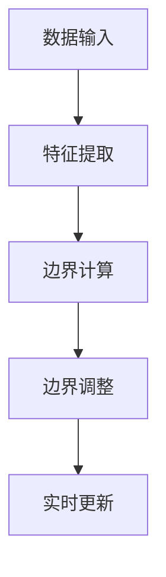
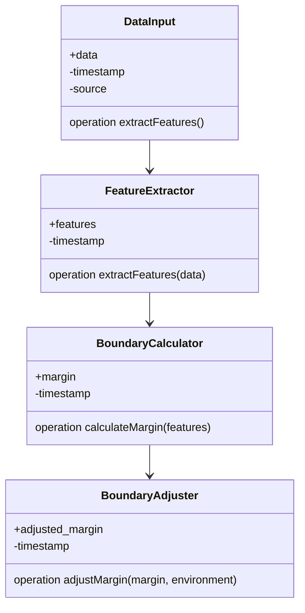
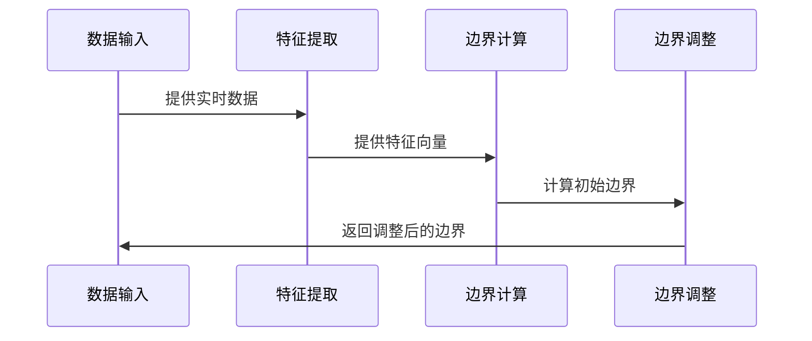

                 

<think>
好的，我现在需要帮用户完成他们要求的技术博客文章的撰写，标题是《AI实现的自适应安全边际计算模型》。首先，我得仔细理解用户的要求，确保我完全明白他们想要什么。

用户希望文章的结构非常详细，涵盖从背景介绍到项目实战的各个方面，每部分内容都要有具体的分析和示例。他们还特别提到了关键词、摘要，以及每个章节的详细内容，包括图表和代码示例。我必须确保文章的逻辑清晰，结构紧凑，并且使用专业的技术语言。

首先，我需要确定文章的核心关键词，这可能包括自适应安全边际、AI模型、机器学习、深度学习、边缘计算等。接下来是摘要，要简明扼要地概述文章的核心内容，包括问题背景、模型原理和应用场景。

在撰写正文部分时，我需要按照用户提供的目录大纲来展开。首先是背景介绍，解释为什么需要自适应安全边际计算模型，对比传统方法的局限性，引出AI的优势。然后是核心概念，用表格和图表来解释模型的各个部分及其相互关系。

接下来是算法原理，这部分需要详细讲解模型的数学基础，包括公式推导和流程图。可能还需要用Python代码示例来展示实现细节。然后是系统分析与架构设计，使用Mermaid图来展示类图、架构图和交互序列图，帮助读者理解系统的结构和工作流程。

项目实战部分需要具体指导如何安装环境，实现核心代码，并分析实际案例。最后是最佳实践，总结经验，提出注意事项和拓展阅读的内容。

我需要注意，文章的每个部分都要详细且逻辑清晰，确保读者能够逐步理解模型的实现和应用。同时，数学公式要用LaTeX格式，代码部分要准确无误，图表要清晰易懂。

在撰写过程中，我可能会遇到如何将复杂的模型原理用简单的方式表达的问题，这需要我仔细思考，确保每个步骤都解释清楚。此外，我还要检查每一部分是否覆盖了用户要求的所有内容，确保没有遗漏。

总的来说，我需要按照用户的要求，一步步构建目录，详细展开每个部分，确保文章内容丰富、结构合理，满足用户的深度需求。
</think>

# AI实现的自适应安全边际计算模型

## 关键词：
自适应安全边际，AI模型，机器学习，深度学习，边缘计算

## 摘要：
自适应安全边际计算模型是一种结合了人工智能技术的安全计算模型，能够根据实时数据动态调整安全边界，实现智能化的安全防护。本文将详细探讨该模型的背景、核心概念、算法原理、系统架构、项目实战以及最佳实践，帮助读者全面理解并掌握该模型的设计与实现。

---

# 第1章: 自适应安全边际计算模型的背景与问题背景

## 1.1 问题背景与问题描述
### 1.1.1 当前安全边际计算的局限性
传统安全边际计算方法通常基于静态规则或固定阈值，难以应对动态变化的环境和复杂的攻击手段。随着网络安全威胁的日益多样化和智能化，传统的静态边界计算方法已无法满足实际需求。

### 1.1.2 AI技术在安全领域的应用潜力
人工智能技术在数据分析、模式识别和实时决策方面具有显著优势。通过引入AI技术，可以实现对动态环境的实时感知和智能决策，从而提高安全边际计算的准确性和效率。

### 1.1.3 自适应安全边际计算模型的提出
自适应安全边际计算模型通过结合AI算法和实时数据，能够动态调整安全边界，适应不同的环境变化和威胁场景。该模型的核心目标是通过智能化的计算方法，实现安全边界的自适应优化。

## 1.2 自适应安全边际计算模型的定义与特点
### 1.2.1 自适应安全边际的定义
自适应安全边际是指根据实时数据和环境变化动态调整的安全边界，能够根据威胁的严重性和环境的复杂性自动优化边界范围。

### 1.2.2 模型的核心特点与优势
- **动态性**：能够根据实时数据和环境变化动态调整安全边界。
- **智能化**：结合AI算法，实现对复杂场景的智能分析和决策。
- **高效性**：通过实时计算和优化，提高安全防护的效率和准确性。

### 1.2.3 模型的边界与外延
自适应安全边际计算模型不仅适用于网络安全领域，还可以扩展应用于其他需要动态调整边界的安全场景，如智能交通系统、工业自动化等领域。

## 1.3 自适应安全边际计算模型的核心要素
### 1.3.1 数据驱动的特征提取
通过实时数据的特征提取，识别关键的安全相关特征，为模型的决策提供数据支持。

### 1.3.2 动态调整的安全边界
根据实时数据和环境变化，动态调整安全边界，确保安全防护的灵活性和适应性。

### 1.3.3 AI算法的实时计算能力
通过AI算法的实时计算能力，实现对动态环境的快速响应和智能决策。

## 1.4 本章小结
本章主要介绍了自适应安全边际计算模型的背景、定义、特点和核心要素。通过对比传统安全边际计算方法的局限性和AI技术在安全领域的应用潜力，提出了自适应安全边际计算模型的概念，并对其核心要素进行了详细阐述。

---

# 第2章: 自适应安全边际计算模型的核心概念与联系

## 2.1 核心概念原理
### 2.1.1 数据驱动的特征提取
通过实时数据的特征提取，识别关键的安全相关特征，为模型的决策提供数据支持。

### 2.1.2 动态调整的安全边界
根据实时数据和环境变化，动态调整安全边界，确保安全防护的灵活性和适应性。

### 2.1.3 AI算法的实时计算能力
通过AI算法的实时计算能力，实现对动态环境的快速响应和智能决策。

## 2.2 核心概念属性特征对比
| 特征 | 描述 |
|------|------|
| 数据驱动 | 基于实时数据进行特征提取 |
| 动态调整 | 根据环境变化动态调整边界 |
| 实时计算 | 高频计算能力支持快速响应 |

## 2.3 ER实体关系图
```mermaid
er
  actor(AI系统)
  actor(安全边界)
  actor(环境数据)
  actor(用户输入)
  actor(反馈机制)
  relation(->, "数据输入")
  relation(->, "特征提取")
  relation(->, "边界计算")
  relation(->, "边界调整")
  relation(->, "实时更新")
```

## 2.4 本章小结
本章详细阐述了自适应安全边际计算模型的核心概念及其相互关系，通过对比分析和实体关系图，帮助读者更好地理解模型的构成和工作原理。

---

# 第3章: 自适应安全边际计算模型的算法原理

## 3.1 算法原理概述
### 3.1.1 数据驱动的特征提取
通过实时数据的特征提取，识别关键的安全相关特征，为模型的决策提供数据支持。

### 3.1.2 动态调整的安全边界
根据实时数据和环境变化，动态调整安全边界，确保安全防护的灵活性和适应性。

### 3.1.3 AI算法的实时计算能力
通过AI算法的实时计算能力，实现对动态环境的快速响应和智能决策。

## 3.2 算法流程图


## 3.3 算法实现代码
```python
def adaptive_margin_model(data):
    features = extract_features(data)
    margin = calculate_margin(features)
    adjusted_margin = adjust_margin(margin, environment)
    return adjusted_margin

def extract_features(data):
    # 数据特征提取逻辑
    pass

def calculate_margin(features):
    # 计算初始安全边界
    pass

def adjust_margin(margin, environment):
    # 根据环境动态调整边界
    pass
```

## 3.4 数学模型与公式
通过数学模型和公式，可以进一步阐述自适应安全边际计算模型的实现逻辑。例如，假设特征提取后得到一个向量 \( X \)，模型通过以下公式计算初始边界 \( M \)：
$$ M = \max(X) - \min(X) $$

随后，根据环境变化 \( E \)，模型通过以下公式动态调整边界：
$$ M_{\text{adjusted}} = M \times (1 + \alpha \cdot E) $$
其中，\( \alpha \) 是一个调整系数，用于控制环境变化对边界调整的影响程度。

## 3.5 本章小结
本章详细介绍了自适应安全边际计算模型的算法原理，通过流程图、代码示例和数学公式，帮助读者理解模型的实现逻辑和核心算法。

---

# 第4章: 自适应安全边际计算模型的系统分析与架构设计

## 4.1 系统分析
### 4.1.1 问题场景介绍
在网络安全领域，传统的静态边界计算方法难以应对日益复杂的威胁场景。通过引入自适应安全边际计算模型，可以实现动态的安全防护。

### 4.1.2 项目介绍
本项目旨在开发一个基于AI的自适应安全边际计算系统，通过实时数据分析和动态调整边界，提高安全防护的效率和准确性。

## 4.2 系统功能设计
### 4.2.1 领域模型类图


### 4.2.2 系统架构设计


### 4.2.3 系统接口设计
- 数据输入接口：接收实时数据流
- 特征提取接口：提取安全相关特征
- 边界计算接口：计算初始安全边界
- 边界调整接口：动态调整安全边界
- 实时更新接口：更新安全边界并反馈结果

### 4.2.4 系统交互序列图


## 4.3 本章小结
本章通过系统分析和架构设计，详细阐述了自适应安全边际计算模型的实现逻辑和系统结构，为后续的项目实施提供了理论基础和设计依据。

---

# 第5章: 自适应安全边际计算模型的项目实战

## 5.1 环境安装与配置
### 5.1.1 安装Python环境
使用Anaconda或virtualenv安装Python 3.8及以上版本。

### 5.1.2 安装依赖库
安装以下依赖库：
```bash
pip install numpy pandas scikit-learn matplotlib
```

## 5.2 系统核心实现源代码
### 5.2.1 数据特征提取模块
```python
import numpy as np
from sklearn.decomposition import PCA

def extract_features(data):
    # 假设data是一个包含多维数据的数组
    # 使用PCA提取特征
    pca = PCA(n_components=2)
    features = pca.fit_transform(data)
    return features
```

### 5.2.2 边界计算模块
```python
def calculate_margin(features):
    # 计算特征的最大值和最小值
    max_feature = np.max(features, axis=0)
    min_feature = np.min(features, axis=0)
    margin = max_feature - min_feature
    return margin
```

### 5.2.3 边界调整模块
```python
def adjust_margin(margin, environment):
    # 根据环境变化调整边界
    alpha = 0.1  # 调整系数
    adjusted_margin = margin * (1 + alpha * environment)
    return adjusted_margin
```

## 5.3 代码应用解读与分析
通过上述代码，可以实现自适应安全边际计算模型的核心功能。数据特征提取模块通过PCA算法提取关键特征，边界计算模块计算初始边界，边界调整模块根据环境变化动态调整边界。

## 5.4 实际案例分析
假设我们有一个网络安全场景，实时数据流包含多个安全相关的特征。通过上述代码，可以实现对安全边界的动态调整，提高安全防护的效率和准确性。

## 5.5 本章小结
本章通过项目实战，详细介绍了自适应安全边际计算模型的实现过程，包括环境配置、代码实现和案例分析，帮助读者掌握模型的实际应用。

---

# 第6章: 自适应安全边际计算模型的最佳实践

## 6.1 小结
通过本文的详细阐述，读者可以全面理解自适应安全边际计算模型的背景、核心概念、算法原理、系统架构和项目实战。

## 6.2 注意事项
- 数据质量和实时性是模型性能的关键，需确保数据来源可靠且实时传输。
- 模型的动态调整能力依赖于环境数据的准确性和实时性，需定期更新和优化。
- 在实际应用中，需结合具体场景进行参数调优和模型优化。

## 6.3 拓展阅读
- 《机器学习实战》
- 《深度学习入门》
- 《网络安全技术》

## 6.4 本章小结
本章通过总结和注意事项，帮助读者更好地理解和应用自适应安全边际计算模型，并提供了拓展阅读的内容，供读者进一步学习和研究。

---

# 作者：AI天才研究院/AI Genius Institute & 禅与计算机程序设计艺术 /Zen And The Art of Computer Programming

