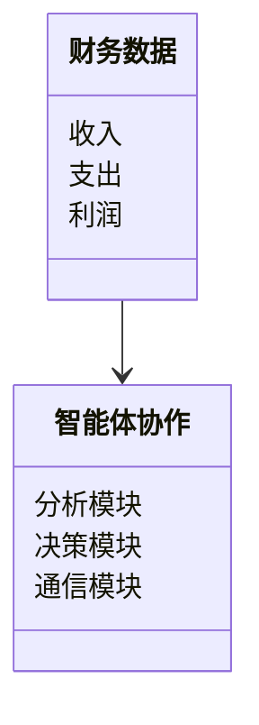
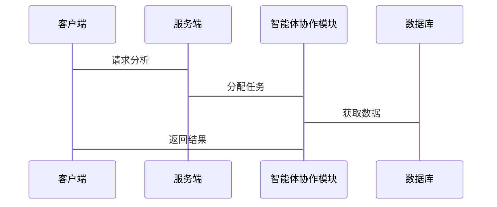

                 


# AI智能体协作提升财务报表分析的准确性和效率

> 关键词：AI智能体，财务报表分析，协作机制，算法原理，系统架构

> 摘要：本文深入探讨了AI智能体协作在财务报表分析中的应用，分析了其在提升准确性和效率方面的优势，并详细介绍了其核心概念、算法原理和系统架构设计。通过实际案例分析，展示了AI智能体协作在财务报表分析中的具体应用和效果。

---

## 第1章 AI智能体协作的背景与概念

### 1.1 AI智能体的基本概念

#### 1.1.1 AI智能体的定义与特点
AI智能体（Artificial Intelligence Agent）是指能够感知环境、自主决策并执行任务的智能系统。与传统的单一任务程序不同，AI智能体具备以下特点：
- **自主性**：能够自主决策，无需人工干预。
- **反应性**：能够实时感知环境并做出反应。
- **协作性**：能够与其他智能体或系统进行协作。

#### 1.1.2 多智能体协作的原理
多智能体协作是指多个智能体通过通信和协调共同完成复杂任务的过程。其核心在于智能体之间的通信与任务分配机制。

#### 1.1.3 智能体协作与传统数据分析的区别
传统的数据分析方法依赖于固定的算法和规则，而智能体协作能够动态调整策略，适应复杂多变的环境。

### 1.2 财务报表分析的现状与挑战

#### 1.2.1 财务报表分析的传统方法
传统的财务报表分析主要依赖人工审查和固定模型，效率较低且容易受到主观因素的影响。

#### 1.2.2 传统方法的局限性
- 数据量大：财务报表涉及大量数据，人工分析效率低。
- 精度不足：传统方法难以捕捉复杂数据关系。
- 人为因素：容易受到分析人员主观判断的影响。

#### 1.2.3 提高财务报表分析准确性和效率的需求
随着企业规模的扩大和数据量的增加，传统方法已无法满足高效、精准的分析需求。

### 1.3 AI智能体协作在财务报表分析中的应用前景

#### 1.3.1 AI智能体协作的优势
- 高效性：通过智能体协作快速处理大量数据。
- 精准性：智能体能够识别复杂的数据关系，提高分析精度。
- 灵活性：能够动态调整分析策略，适应变化。

#### 1.3.2 AI智能体协作在财务报表分析中的潜在场景
- 自动化数据提取：智能体协作从多种数据源提取财务数据。
- 异常检测：通过协作发现财务数据中的异常项。
- 财务预测：基于历史数据和市场趋势，智能体协作进行财务预测。

#### 1.3.3 应用中的挑战与解决方案
- 智能体之间的通信效率：通过优化通信协议和任务分配机制提高协作效率。
- 数据隐私：通过加密和权限控制保护财务数据的安全。

---

## 第2章 AI智能体协作的核心概念与联系

### 2.1 多智能体协作的原理

#### 2.1.1 多智能体系统的定义
多智能体系统是指由多个相互作用的智能体组成的系统，每个智能体都具有一定的自主性和决策能力。

#### 2.1.2 多智能体协作的基本机制
- **任务分配**：智能体之间根据自身能力和当前状态分配任务。
- **通信与协调**：通过通信协议交换信息，协调行动。
- **决策机制**：基于共享信息做出集体决策。

#### 2.1.3 智能体之间的通信与协调
智能体之间的通信可以通过消息传递或共享数据库实现。协调机制包括同步协议和冲突解决策略。

### 2.2 财务报表分析中的智能体协作架构

#### 2.2.1 智能体协作的层次结构
- **感知层**：智能体感知外部数据。
- **决策层**：智能体基于感知数据做出决策。
- **执行层**：智能体根据决策执行任务。

#### 2.2.2 智能体协作的任务分配
任务分配可以通过多种策略实现，例如基于角色分配和基于能力分配。

#### 2.2.3 智能体协作的决策机制
决策机制可以基于规则、基于模型或基于学习，具体取决于任务需求。

### 2.3 智能体协作与财务数据的关系

#### 2.3.1 财务数据的结构化与非结构化
财务数据可以是结构化的（如表格数据）或非结构化的（如文本数据）。

#### 2.3.2 智能体协作对财务数据的处理方式
智能体协作能够同时处理结构化和非结构化数据，通过自然语言处理技术分析文本数据。

#### 2.3.3 智能体协作如何提升数据处理效率
通过并行处理和任务分配，智能体协作能够显著提高数据处理效率。

---

## 第3章 AI智能体协作的算法原理

### 3.1 分布式计算与多智能体协作

#### 3.1.1 分布式计算的基本概念
分布式计算是指将计算任务分布在多台计算设备上进行，充分利用资源。

#### 3.1.2 分布式计算在多智能体协作中的应用
通过分布式计算，多个智能体可以同时处理不同部分的数据，提高整体效率。

#### 3.1.3 分布式计算的优缺点
- **优点**：资源利用率高，计算速度快。
- **缺点**：通信开销大，容易出现资源竞争。

### 3.2 多智能体强化学习

#### 3.2.1 强化学习的基本原理
强化学习是指智能体通过与环境互动，学习策略以最大化累计奖励。

#### 3.2.2 多智能体强化学习的挑战
- **状态空间复杂**：多个智能体的协作增加了状态空间的复杂性。
- **策略协调**：智能体之间需要协调策略，避免冲突。

#### 3.2.3 多智能体强化学习在财务报表分析中的应用
例如，在财务预测任务中，多个智能体可以分别负责不同部分的数据分析，通过协作提高预测精度。

### 3.3 联合学习与知识共享

#### 3.3.1 联合学习的定义与特点
联合学习是指多个学习器通过共享知识共同提高性能。

#### 3.3.2 知识共享的机制与方法
知识可以通过共享模型参数或共享数据进行。

#### 3.3.3 联合学习在财务报表分析中的应用
例如，在异常检测任务中，多个智能体可以通过共享知识提高检测精度。

---

## 第4章 财务报表分析的数学模型与公式

### 4.1 财务报表分析的数学模型

#### 4.1.1 线性回归模型
线性回归模型用于预测变量与自变量之间的线性关系。

$$ y = \beta_0 + \beta_1 x_1 + \beta_2 x_2 + \dots + \beta_n x_n $$

#### 4.1.2 决策树模型
决策树模型通过构建树状结构进行分类或回归。

#### 4.1.3 聚类分析
聚类分析用于将相似的数据点归为一类。

### 4.2 多智能体协作的数学模型

#### 4.2.1 多智能体协作的通信模型
通信模型可以基于图论进行描述，例如使用图的边权重表示通信效率。

#### 4.2.2 多智能体协作的任务分配模型
任务分配模型可以基于优化理论，例如线性规划。

---

## 第5章 系统分析与架构设计

### 5.1 系统应用场景

#### 5.1.1 财务数据来源
财务数据可能来源于企业的ERP系统、财务报表等。

#### 5.1.2 业务场景
智能体协作可以在财务数据分析、预测和决策支持中应用。

### 5.2 系统功能设计

#### 5.2.1 领域模型
领域模型可以通过Mermaid类图表示，展示系统中各实体之间的关系。



#### 5.2.2 系统架构
系统架构可以通过Mermaid架构图表示，展示系统的各个组成部分及其关系。


### 5.3 系统接口与交互设计

#### 5.3.1 系统接口
系统接口可以通过REST API或MQTT协议实现。

#### 5.3.2 系统交互
系统交互可以通过Mermaid序列图表示。



---

## 第6章 项目实战

### 6.1 环境安装

#### 6.1.1 安装Python
需要安装Python 3.8及以上版本。

#### 6.1.2 安装依赖库
需要安装以下依赖库：
- `numpy`
- `pandas`
- `scikit-learn`
- `matplotlib`

### 6.2 核心代码实现

#### 6.2.1 智能体协作模块
```python
import numpy as np
import pandas as pd

class Agent:
    def __init__(self, id):
        self.id = id
        self.data = None

    def receive_data(self, data):
        self.data = data

    def process_data(self):
        # 示例：计算平均值
        return np.mean(self.data)

# 初始化智能体
agent1 = Agent(1)
agent2 = Agent(2)

# 分配任务
agent1.receive_data([10, 20, 30])
agent2.receive_data([40, 50, 60])

# 协作处理
result1 = agent1.process_data()
result2 = agent2.process_data()

# 综合结果
final_result = (result1 + result2) / 2
print(final_result)
```

#### 6.2.2 数据分析模块
```python
import pandas as pd
from sklearn.ensemble import RandomForestRegressor

# 加载数据
data = pd.read_csv('financial_data.csv')

# 训练模型
model = RandomForestRegressor()
model.fit(data[['revenue', 'expenses']], data['profit'])

# 预测
new_data = pd.DataFrame({'revenue': [100], 'expenses': [50]})
predicted_profit = model.predict(new_data)
print(predicted_profit)
```

### 6.3 案例分析与解读

#### 6.3.1 案例背景
某企业希望利用AI智能体协作进行财务预测。

#### 6.3.2 数据准备
使用企业的历史财务数据，包括收入、支出和利润。

#### 6.3.3 模型训练与预测
通过训练随机森林回归模型，预测未来季度的利润。

#### 6.3.4 结果分析
预测结果与实际数据进行对比，评估模型的准确性。

---

## 第7章 最佳实践与总结

### 7.1 小结
本文详细介绍了AI智能体协作在财务报表分析中的应用，包括其核心概念、算法原理和系统架构设计。

### 7.2 最佳实践
- 确保数据质量和完整性。
- 合理设计智能体之间的通信机制。
- 定期更新模型和算法。

### 7.3 注意事项
- 数据隐私和安全问题需要重点关注。
- 智能体协作的效率和准确性需要不断优化。

### 7.4 拓展阅读
建议读者进一步学习多智能体协作、分布式计算和强化学习的相关知识。

---

作者：AI天才研究院/AI Genius Institute & 禅与计算机程序设计艺术/Zen And The Art of Computer Programming

---

通过以上内容，我们系统地介绍了AI智能体协作在财务报表分析中的应用，从理论到实践，帮助读者全面理解其优势和实现方法。

