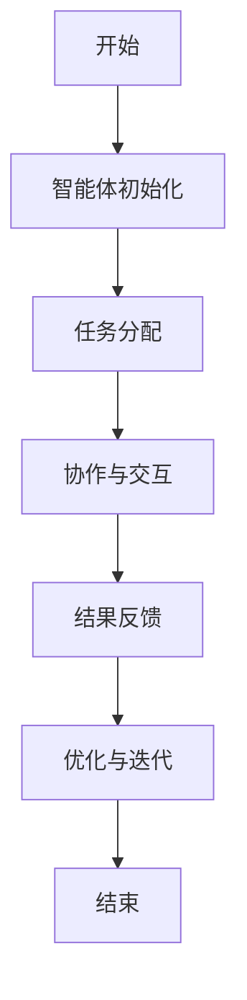
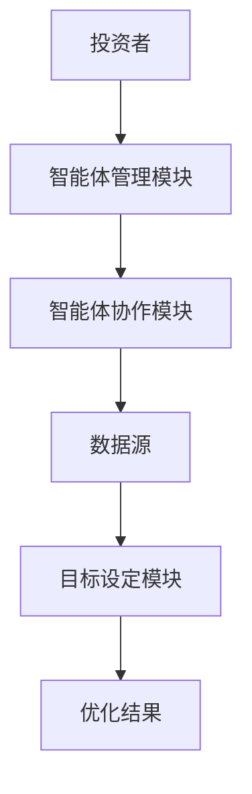
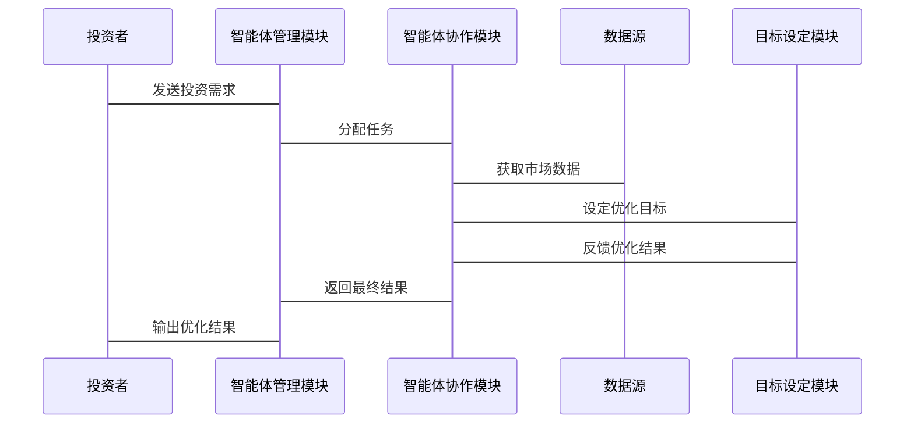

                 


# AI智能体协作：优化价值投资的全球产业布局策略

> 关键词：AI智能体协作，价值投资，全球产业布局，优化策略，人工智能，投资组合管理

> 摘要：本文探讨AI智能体协作在优化价值投资和全球产业布局中的应用策略，通过分析AI智能体协作的核心概念、算法原理、系统架构与项目实战，结合数学模型与实际案例，为读者提供一套完整的AI驱动的投资优化解决方案。

---

# 第一部分: AI智能体协作与价值投资的背景与概念

## 第1章: AI智能体协作的背景与问题背景

### 1.1 问题背景
#### 1.1.1 传统投资与产业布局的局限性
传统投资决策依赖于人工分析，存在信息处理效率低、决策周期长、风险控制能力有限等问题。全球产业布局的复杂性进一步加剧了这些挑战，企业需要在多个市场间协调资源，实现最优配置。

#### 1.1.2 AI技术在投资领域的应用现状
人工智能技术的快速发展为投资领域带来了革命性变化，从量化交易到智能投顾，AI技术在投资决策中的作用日益重要。然而，如何将AI技术应用于全球产业布局的优化，仍是一个待深入研究的问题。

#### 1.1.3 全球产业布局的复杂性与挑战
全球产业布局涉及多个市场、多种资源和多维度的竞争与协同关系。传统的线性思维难以应对复杂多变的市场环境，亟需一种更加智能化、动态化的解决方案。

### 1.2 问题描述
#### 1.2.1 传统投资决策的痛点
- 信息过载导致决策效率低下
- 风险评估不全面
- 投资组合优化难度大

#### 1.2.2 产业布局中的协同与竞争
- 企业间的协同效应难以量化
- 资源分配的动态平衡问题
- 全球市场的不确定性对企业布局的影响

#### 1.2.3 AI智能体协作的必要性
- AI技术能够帮助投资者快速处理海量信息
- 智能体协作可以实现多目标优化
- AI驱动的动态调整能力能够应对市场变化

### 1.3 问题解决与边界
#### 1.3.1 AI智能体协作的核心目标
- 提高投资决策的效率和准确性
- 实现全球产业布局的动态优化
- 通过协作实现资源的最优配置

#### 1.3.2 解决方案的边界与外延
- 解决方案仅针对价值投资和产业布局问题
- 边界不包括企业的日常运营和内部管理
- 外延可扩展至其他领域，如供应链优化和风险管理

#### 1.3.3 核心要素与组成结构
- 核心要素：智能体、协作机制、数据源、目标函数
- 组成结构：通过智能体协作实现全局优化

## 第2章: AI智能体协作的核心概念与联系

### 2.1 核心概念原理
#### 2.1.1 AI智能体的定义与特征
AI智能体是一种能够感知环境、自主决策并执行任务的实体。其核心特征包括：
- **自主性**：无需外部干预
- **反应性**：能够实时感知环境变化
- **协作性**：能够与其他智能体协同工作

#### 2.1.2 协作机制的数学模型
协作机制可以通过以下数学模型描述：
$$
\text{收益} = \sum_{i=1}^{n} \text{智能体}_i(\text{贡献})
$$

其中，$\text{智能体}_i$ 表示第 $i$ 个智能体的贡献，$n$ 为智能体总数。

#### 2.1.3 价值投资的量化模型
价值投资可以通过以下量化模型实现：
$$
\text{投资价值} = \sum_{i=1}^{m} w_i \cdot x_i
$$

其中，$w_i$ 表示第 $i$ 个资产的权重，$x_i$ 表示第 $i$ 个资产的市场表现，$m$ 为资产总数。

### 2.2 核心概念属性对比
#### 2.2.1 智能体类型对比表格
| 智能体类型 | 知识表示 | 决策方式 | 协作能力 |
|------------|----------|----------|-----------|
| 简单智能体 | 关键特征 | 基于规则 | 有限协作   |
| 复杂智能体 | 全局特征 | 基于模型 | 强大的协作 |

#### 2.2.2 协作机制对比表格
| 协作机制 | 描述 | 优缺点 | 适用场景 |
|----------|------|--------|----------|
| 基于规则 | 基于预定义规则 | 简单易实现，但灵活性差 | 稳定场景 |
| 基于模型 | 基于数学模型 | 灵活性高，但计算复杂 | 动态场景 |

#### 2.2.3 价值投资模型对比表格
| 投资模型 | 描述 | 优缺点 | 适用场景 |
|----------|------|--------|----------|
| 单一模型 | 基于单一资产 | 简单，但风险高 | 低风险场景 |
| 组合模型 | 基于资产组合 | 分散风险，收益稳定 | 高风险场景 |

### 2.3 ER实体关系图
```mermaid
er
    Investor {id, name, portfolio}
    Agent {id, type, capability}
    Collaboration {id, investor_id, agent_id, interaction_type}
    Data_Source {id, type, source}
    Goal {id, description, priority}
```

---

# 第三部分: AI智能体协作的算法原理与数学模型

## 第3章: AI智能体协作的算法原理

### 3.1 算法原理
#### 3.1.1 多智能体协作算法概述
多智能体协作算法是一种基于分布式计算的算法，通过多个智能体之间的协作实现全局优化。其核心思想是通过智能体之间的信息共享和协同决策，实现复杂任务的分解与执行。

#### 3.1.2 基于强化学习的协作机制
强化学习是一种通过智能体与环境交互来学习策略的算法。在多智能体协作中，强化学习可以通过以下步骤实现：
1. 智能体感知环境状态
2. 根据策略选择动作
3. 执行动作并获得奖励
4. 根据奖励调整策略

#### 3.1.3 联合学习与知识共享
联合学习是一种通过多个智能体共享知识来提高整体性能的算法。其核心是通过智能体之间的知识共享，实现全局最优。

### 3.2 算法流程图


### 3.3 代码实现
```python
import numpy as np
import tensorflow as tf

# 定义智能体类
class Agent:
    def __init__(self, state_dim, action_dim):
        self.state_dim = state_dim
        self.action_dim = action_dim
        self.model = self.build_model()

    def build_model(self):
        model = tf.keras.Sequential([
            tf.keras.layers.Dense(64, activation='relu', input_dim=self.state_dim),
            tf.keras.layers.Dense(self.action_dim, activation='softmax')
        ])
        return model

    def act(self, state):
        prediction = self.model.predict(np.array([state]))
        return np.argmax(prediction[0])

# 定义协作环境类
class CollaborationEnvironment:
    def __init__(self, num_agents):
        self.num_agents = num_agents
        self.agents = [Agent(state_dim, action_dim) for _ in range(num_agents)]
        self.state_dim = state_dim
        self.action_dim = action_dim

    def step(self, states):
        actions = []
        for i in range(self.num_agents):
            actions.append(self.agents[i].act(states[i]))
        return actions

# 初始化环境
env = CollaborationEnvironment(num_agents=3)
state = np.random.randn(env.state_dim)

# 执行协作
actions = env.step(state)
print(actions)
```

---

## 第4章: AI智能体协作的数学模型与公式

### 4.1 协作机制的数学模型
协作机制可以通过以下数学模型描述：
$$
\text{收益} = \sum_{i=1}^{n} w_i \cdot x_i
$$

其中，$w_i$ 表示第 $i$ 个智能体的权重，$x_i$ 表示第 $i$ 个智能体的贡献，$n$ 为智能体总数。

### 4.2 价值投资的数学模型
价值投资可以通过以下数学模型实现：
$$
\text{投资价值} = \sum_{i=1}^{m} w_i \cdot x_i
$$

其中，$w_i$ 表示第 $i$ 个资产的权重，$x_i$ 表示第 $i$ 个资产的市场表现，$m$ 为资产总数。

### 4.3 动态优化的数学模型
动态优化可以通过以下数学模型实现：
$$
\text{最优解} = \arg \max_{x} \sum_{i=1}^{n} w_i \cdot x_i
$$

其中，$x$ 表示优化变量，$w_i$ 表示权重，$n$ 为变量总数。

---

# 第四部分: AI智能体协作的系统分析与架构设计

## 第5章: 系统分析与架构设计

### 5.1 系统架构设计


### 5.2 系统功能设计
- **投资者模块**：接收投资者的需求并进行任务分配
- **智能体管理模块**：管理多个智能体并协调其协作
- **智能体协作模块**：实现智能体之间的信息共享与协同决策
- **数据源模块**：提供市场数据和相关信息
- **目标设定模块**：设定优化目标并进行结果反馈

### 5.3 系统接口设计
- **输入接口**：接收投资者的需求和市场数据
- **输出接口**：输出优化结果和反馈信息
- **协作接口**：实现智能体之间的信息共享与协同

### 5.4 系统交互流程图


---

## 第6章: 项目实战

### 6.1 环境安装
- **Python**：安装Python 3.8或更高版本
- **TensorFlow**：安装TensorFlow 2.0或更高版本
- **Keras**：安装Keras 2.4或更高版本
- **Mermaid**：安装Mermaid CLI或使用在线编辑器

### 6.2 核心代码实现
```python
# 智能体协作实现
class Collaboration:
    def __init__(self, agents):
        self.agents = agents

    def collaborate(self, task):
        results = []
        for agent in self.agents:
            results.append(agent.act(task))
        return results

# 价值投资优化实现
class ValueInvestment:
    def __init__(self, assets):
        self.assets = assets

    def optimize(self, weights):
        return np.dot(weights, self.assets)
```

### 6.3 实际案例分析
- **案例背景**：假设投资者有三个资产，权重分别为0.3、0.4、0.3，市场表现分别为10%、15%、20%
- **优化过程**：
  1. 初始化智能体
  2. 分配投资任务
  3. 智能体协作优化
  4. 输出最终结果

### 6.4 项目小结
通过实际案例分析，我们可以看到AI智能体协作在价值投资优化中的巨大潜力。通过智能体协作，投资者可以实现资产的动态优化，提高投资收益。

---

## 第7章: 最佳实践与注意事项

### 7.1 小结
- AI智能体协作是一种高效的投资优化方法
- 通过协作机制和数学模型可以实现全局优化
- 实际应用中需要注意数据质量和算法选择

### 7.2 注意事项
- **数据质量**：确保数据的准确性和完整性
- **算法选择**：根据实际需求选择合适的算法
- **系统维护**：定期更新模型和优化参数

### 7.3 拓展阅读
- 《Reinforcement Learning: Theory and Algorithms》
- 《Multi-Agent Systems: Collaboration, Competition, and Applications》
- 《Practical TensorFlow 2.x: Build, Train, and Deploy Deep Neural Networks》

---

# 作者：AI天才研究院/AI Genius Institute & 禅与计算机程序设计艺术 /Zen And The Art of Computer Programming

