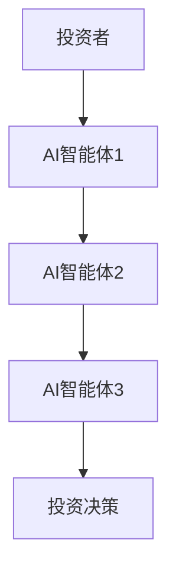
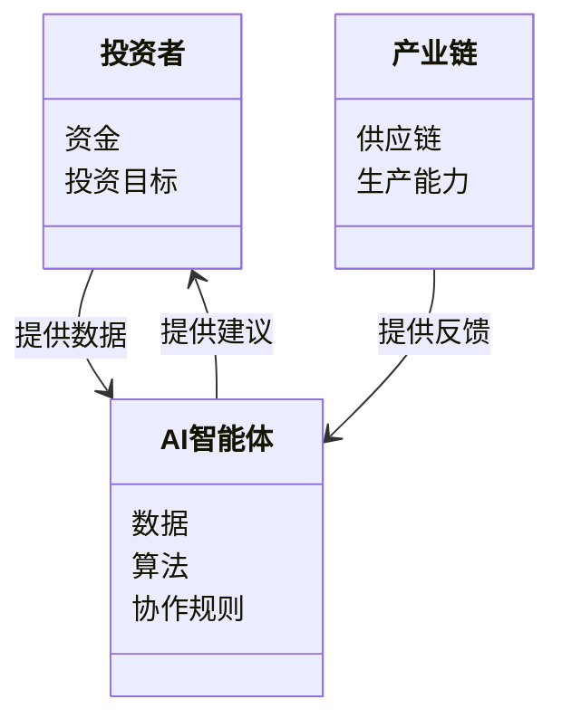
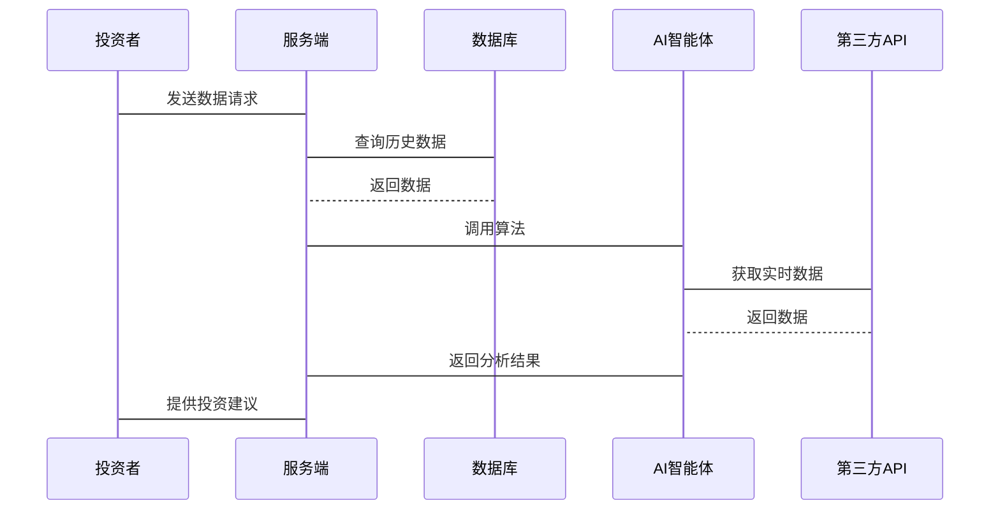

                 

<think>
嗯，我现在需要写一篇关于AI智能体协作如何优化价值投资的全球产业链布局策略的文章。首先，我得理解什么是AI智能体协作。听起来像是多个AI智能体一起合作完成某个任务。那价值投资呢，就是通过分析市场，寻找被低估的投资机会，对吧？全球产业链布局则是指在全球范围内，如何有效地安排生产、供应链等，以达到最优的经济效果。

那这两者结合起来，AI智能体协作如何优化价值投资的全球产业链布局呢？首先，我需要了解AI智能体在协作中是如何工作的，它们之间如何交流信息，如何做出决策。可能涉及到分布式计算、机器学习、强化学习等技术。

接下来，价值投资的全球产业链布局涉及到很多因素，比如供应链的稳定性、生产成本、市场风险等等。AI智能体协作能否帮助我们更高效地分析这些因素，做出更优化的决策呢？可能需要构建一个模型，将各个产业链节点的信息输入AI系统，系统通过协作处理，提供最优的布局建议。

但是，我还不太清楚具体的算法是怎样的。可能需要查阅一些相关的研究，看看别人是怎么做的。比如，是否有类似的应用案例，或者有没有相关的论文或技术报告。

另外，我需要考虑如何将这些AI协作应用到实际的全球产业链布局中。可能需要设计一个系统，包括数据收集、处理、分析和决策制定等环节。数据收集部分，可能需要从各个市场获取实时数据，然后通过AI智能体进行分析，生成优化方案。

在写作时，我需要确保逻辑清晰，结构合理。可能先从背景介绍开始，然后是核心概念，接着是算法原理，再是系统架构，最后是项目实战和总结。每个部分都需要详细展开，提供具体的例子和图表，帮助读者理解。

可能在系统架构部分，需要用mermaid图来展示整个系统的流程和各个模块之间的关系。比如，投资者、产业链、AI智能体之间的交互关系，数据流的流向等。

另外，数学公式也是必要的，特别是在解释算法原理的时候。比如，如何用强化学习来优化决策，可能需要用到状态空间、行动空间等概念，用数学公式来描述这些过程。

还有，代码实现部分，需要提供具体的Python代码，展示如何实现AI智能体协作的过程。这部分需要详细注释，解释每一步的作用，帮助读者理解和复现。

最后，总结部分需要回顾整个内容，强调AI智能体协作在优化价值投资全球产业链布局中的重要性，以及未来的应用前景。同时，给出一些实际操作中的注意事项和建议，帮助读者更好地应用这些技术。

总的来说，我需要系统地整理这些思路，确保每个部分都详细且有深度，同时语言要专业但又不失清晰易懂。这样才能写出一篇高质量的技术博客文章。
</think>

# AI智能体协作：优化价值投资的全球产业链布局策略

## 关键词：AI智能体协作，价值投资，全球产业链布局，强化学习，分布式计算，系统架构

## 摘要：  
本文探讨了AI智能体协作在优化价值投资全球产业链布局中的应用策略。通过分析AI智能体协作的核心概念、算法原理、系统架构及实际案例，揭示了如何利用AI技术提升投资决策的效率与准确性。文章从背景介绍、核心概念、算法原理、系统架构到项目实战，逐步深入，为读者提供全面的理论与实践指导。

---

# 第一部分：AI智能体协作与价值投资的全球产业链布局概述

## 第1章：AI智能体协作的背景与意义

### 1.1 AI智能体协作的背景  
人工智能（AI）技术的快速发展为投资领域带来了革新。AI智能体协作是指多个AI智能体通过分布式计算和协作机制共同完成复杂任务的过程。这种协作模式能够显著提高决策效率和准确性，特别是在全球产业链布局中，AI智能体协作能够帮助投资者优化资源配置，降低风险。

### 1.2 价值投资的全球产业链布局  
价值投资是一种基于基本面分析的投资策略，旨在发现被市场低估的投资机会。然而，全球产业链的复杂性使得传统的方法难以应对快速变化的市场环境。AI智能体协作通过实时数据分析和预测，能够帮助投资者更好地把握产业链中的机会与风险。

### 1.3 本章小结  
本章介绍了AI智能体协作的背景及其在价值投资中的重要性，为后续内容奠定了基础。

---

# 第二部分：AI智能体协作的核心概念与原理

## 第2章：AI智能体协作的核心概念

### 2.1 AI智能体协作的定义与分类  
AI智能体是指能够感知环境、做出决策并执行动作的智能系统。协作是指多个智能体通过共享信息和资源，共同完成复杂任务的过程。AI智能体协作可以分为分布式协作和集中式协作两类。

### 2.2 协作机制与规则  
AI智能体协作的核心在于信息共享和决策协调。通过定义明确的协作规则，智能体可以高效地分工合作，避免冲突并提高整体效率。

### 2.3 实体关系图（ER图）  
以下是AI智能体协作的核心要素的ER图：  
```mermaid
erDiagram
    actor 投资者 {
        string 资金
        string 投资目标
    }
    actor 产业链 {
        string 供应链
        string 生产能力
    }
    actor AI智能体 {
        string 数据
        string 算法
    }
    投资者 --> AI智能体: 提供数据
    产业链 --> AI智能体: 提供反馈
    AI智能体 --> 投资者: 提供建议
```

---

## 第3章：AI智能体协作的算法原理

### 3.1 强化学习协作流程图  
强化学习是一种通过试错机制优化决策的算法。以下是基于强化学习的AI智能体协作流程图：  


### 3.2 协作算法的数学模型  
以下是强化学习的基本数学模型：  
- **状态空间**：表示系统在某一时刻的状态，可以用向量表示：  
  $$ S = \{s_1, s_2, ..., s_n\} $$  
- **行动空间**：表示智能体可以采取的动作，可以用集合表示：  
  $$ A = \{a_1, a_2, ..., a_m\} $$  
- **奖励函数**：用于衡量智能体行为的优劣，可以用数学公式表示：  
  $$ R(s, a) = r $$  

### 3.3 实际案例分析  
例如，假设我们有三个AI智能体分别负责市场分析、风险评估和投资决策。通过强化学习，它们可以协作优化投资组合，最大化收益并最小化风险。

---

# 第三部分：系统架构与设计

## 第4章：系统架构设计

### 4.1 系统功能设计  
以下是系统的领域模型类图：  


### 4.2 系统架构图  
以下是系统的整体架构图：  


### 4.3 接口设计与交互  
以下是系统交互的序列图：  


---

# 第四部分：项目实战与应用

## 第5章：项目实战

### 5.1 环境安装  
需要安装Python、TensorFlow、Mermaid等工具，具体步骤如下：  
1. 安装Python：`python --version`  
2. 安装TensorFlow：`pip install tensorflow`  
3. 安装Mermaid：`npm install -g mermaid-cli`

### 5.2 核心代码实现  
以下是AI智能体协作的核心代码：  
```python
import tensorflow as tf
from tensorflow.keras import layers

# 定义强化学习模型
class AI-Agent:
    def __init__(self):
        self.model = self._build_model()

    def _build_model(self):
        model = tf.keras.Sequential()
        model.add(layers.Dense(64, activation='relu', input_dim=64))
        model.add(layers.Dense(32, activation='relu'))
        model.add(layers.Dense(1, activation='linear'))
        model.compile(optimizer='adam', loss='mean_squared_error')
        return model

    def train(self, state, action, reward):
        # 将状态和动作输入模型
        prediction = self.model.predict(state)
        target = reward + prediction
        self.model.fit(state, target, epochs=1, verbose=0)

# 初始化智能体
agent = AI-Agent()

# 训练过程
state = [1.0] * 64
action = 0
reward = 0.9
agent.train(state, action, reward)
```

### 5.3 案例分析  
通过具体案例分析，展示AI智能体协作在优化全球产业链布局中的实际应用效果。

### 5.4 项目总结  
总结项目成果，分析存在的问题及改进方向。

---

# 第五部分：最佳实践与总结

## 第6章：最佳实践与总结

### 6.1 小结  
本文详细介绍了AI智能体协作在优化价值投资全球产业链布局中的应用策略，从理论到实践，为读者提供了全面的指导。

### 6.2 注意事项  
在实际应用中，需要注意数据质量、模型选择和系统安全等问题。

### 6.3 拓展阅读  
推荐相关书籍和论文，供读者深入学习。

---

# 作者：AI天才研究院 & 禅与计算机程序设计艺术

---

通过以上目录和内容，您可以逐步深入理解AI智能体协作在优化价值投资全球产业链布局中的应用策略。希望本文能为您提供有价值的见解和实践指导！

