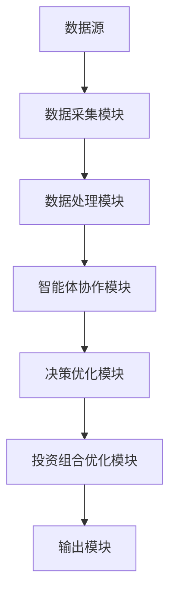

                 


# AI智能体协作：优化价值投资的全球资产配置策略

## 关键词：AI智能体协作、全球资产配置、价值投资、多智能体强化学习、金融投资

## 摘要：本文探讨AI智能体协作在优化价值投资全球资产配置策略中的应用。通过分析AI智能体协作的核心概念、算法原理、系统架构设计及实际案例，提出了一种基于多智能体强化学习的资产配置方法，展示了如何利用AI技术提升投资决策的效率与精度。

---

# 第一部分: AI智能体协作与全球资产配置概述

## 第1章: AI智能体协作与全球资产配置的背景

### 1.1 AI智能体协作的定义与背景

#### 1.1.1 什么是AI智能体协作
AI智能体协作是指多个智能体通过信息共享、任务分配和协同决策，共同完成复杂任务的过程。智能体可以是软件程序、算法模型或机器人，它们通过协作实现比单个智能体更优的结果。

#### 1.1.2 AI智能体协作的背景与发展趋势
随着AI技术的快速发展，智能体协作在金融、医疗、交通等领域得到了广泛应用。全球资产配置需要考虑多种因素，如市场波动、经济指标、政策变化等，这为AI智能体协作提供了广阔的应用场景。

#### 1.1.3 全球资产配置的定义与意义
全球资产配置是指将资金分配到不同国家和地区的资产中，以分散风险并实现收益最大化。传统的资产配置依赖人工分析，而AI智能体协作可以通过实时数据处理和智能决策显著提升效率。

### 1.2 全球资产配置的核心问题

#### 1.2.1 资产配置的基本原理
资产配置需要考虑风险、收益和流动性等因素，通过优化组合实现收益最大化。然而，全球市场的复杂性使得传统方法难以应对。

#### 1.2.2 全球化投资的挑战与机遇
全球化带来了多样化的投资机会，但也增加了市场波动性和政策风险。AI智能体协作能够帮助投资者快速响应市场变化，捕捉投资机会。

#### 1.2.3 AI在资产配置中的作用
AI智能体协作可以通过大数据分析、实时监控和智能决策优化资产配置策略，帮助投资者在复杂市场中做出更明智的投资决策。

### 1.3 AI智能体协作在金融领域的应用前景

#### 1.3.1 金融领域的智能化转型
金融行业正在经历智能化转型，AI技术的应用越来越广泛。智能体协作在金融领域的应用前景广阔，特别是在投资决策、风险管理和客户服务方面。

#### 1.3.2 AI智能体协作在投资决策中的优势
AI智能体协作能够通过多维度数据分析，发现传统方法难以察觉的投资机会。多个智能体协同工作，可以实现更高效的决策和风险控制。

#### 1.3.3 未来发展趋势与挑战
未来，AI智能体协作将在金融领域发挥越来越重要的作用。然而，技术复杂性、数据隐私和监管合规等挑战仍需克服。

## 1.4 本章小结
本章介绍了AI智能体协作的定义、背景和发展趋势，分析了全球资产配置的核心问题，探讨了AI在资产配置中的作用及应用前景。这些内容为后续章节的深入分析奠定了基础。

---

## 第2章: AI智能体协作的核心概念

### 2.1 多智能体协作的基本原理

#### 2.1.1 多智能体系统的定义
多智能体系统由多个具有独立决策能力的智能体组成，通过协作完成复杂任务。每个智能体都有自己的目标和策略，通过信息共享和任务分配实现系统目标。

#### 2.1.2 多智能体协作的机制
多智能体协作需要解决通信、任务分配和决策协调等问题。智能体之间通过通信机制共享信息，通过任务分配算法分配任务，并通过协调机制确保决策一致性。

#### 2.1.3 多智能体协作的特点
多智能体协作具有分布式、自主性和动态性等特点。每个智能体都可以自主决策，系统能够在动态环境中灵活调整策略。

### 2.2 智能体之间的通信与协调

#### 2.2.1 智能体的通信机制
智能体之间需要通过通信机制共享信息，如通过消息传递或共享数据库。通信机制需要设计高效的协议，确保信息传递的准确性和实时性。

#### 2.2.2 协作任务的分配与协调
协作任务的分配需要考虑智能体的能力和当前状态。任务分配算法可以基于智能体的资源和能力进行优化。协调机制需要确保任务分配的一致性和效率。

#### 2.2.3 智能体之间的共识算法
共识算法是多智能体协作中的关键部分，用于确保智能体之间的决策一致性。常见的共识算法包括Paxos、Raft和拜占庭容错等。

### 2.3 智能体协作的数学模型与公式

#### 2.3.1 协作任务的数学建模
协作任务可以建模为一个优化问题，目标是最优化系统的整体收益。数学模型通常包括目标函数、约束条件和决策变量。

#### 2.3.2 智能体之间的信息交换模型
信息交换模型需要描述智能体之间的信息传递方式和内容。可以通过图论模型描述智能体之间的关系，用概率论模型描述信息传递的不确定性。

#### 2.3.3 协作目标的优化模型
优化模型需要描述系统的目标函数和约束条件。例如，最大化收益、最小化风险等。优化模型可以使用线性规划、非线性规划等方法求解。

### 2.4 本章小结
本章详细介绍了多智能体协作的基本原理、通信机制和数学模型。这些内容为后续章节的算法实现和系统设计提供了理论基础。

---

## 第3章: 多智能体强化学习算法

### 3.1 多智能体强化学习的定义

#### 3.1.1 强化学习的基本原理
强化学习是一种通过试错学习的方法，智能体通过与环境交互，学习最优策略。奖励机制是强化学习的核心，智能体通过最大化累计奖励来优化行为。

#### 3.1.2 多智能体强化学习的特点
多智能体强化学习与单智能体强化学习相比，具有分布式决策、任务分配和协调等问题。多个智能体需要协作完成复杂任务，每个智能体的学习目标相互影响。

#### 3.1.3 多智能体强化学习的应用场景
多智能体强化学习适用于需要协作决策的场景，如游戏、机器人协作、交通控制和金融投资等。在金融领域，可以用于投资组合优化和风险管理。

### 3.2 多智能体强化学习的算法实现

#### 3.2.1 Q-learning算法
Q-learning是一种经典的强化学习算法，通过学习Q值函数，找到最优策略。在多智能体场景中，每个智能体维护自己的Q值表，并通过协作更新。

#### 3.2.2 多智能体协作的Q-learning扩展
为了实现多智能体协作，可以在Q-learning的基础上引入任务分配和信息共享机制。例如，通过协调机制确保智能体之间的动作一致性。

#### 3.2.3 其他多智能体协作算法
除了Q-learning，还有其他多智能体协作算法，如多智能体DQN、分布式ADP等。这些算法在复杂场景中表现更优。

### 3.3 多智能体协作的数学模型与公式

#### 3.3.1 Q-learning算法的数学公式
Q-learning的目标是最化Q值函数，使智能体在给定状态下选择最优动作。数学公式为：
$$ Q(s, a) \leftarrow Q(s, a) + \alpha [r + \gamma \max Q(s', a') - Q(s, a)] $$
其中，$\alpha$是学习率，$\gamma$是折扣因子。

#### 3.3.2 多智能体协作的数学模型
多智能体协作的数学模型通常包括状态、动作、奖励和目标函数。例如，可以将协作任务建模为一个博弈论问题，通过纳什均衡优化策略。

### 3.4 本章小结
本章介绍了多智能体强化学习的基本原理和算法实现，重点分析了Q-learning算法及其在多智能体场景中的扩展。数学公式和模型为后续章节的系统设计提供了理论支持。

---

## 第4章: 基于多智能体协作的全球资产配置系统设计

### 4.1 项目背景与目标

#### 4.1.1 项目背景
全球资产配置需要考虑多个市场和资产类别，传统的单点分析难以应对复杂场景。通过多智能体协作，可以实现实时数据处理和智能决策。

#### 4.1.2 项目目标
本项目旨在设计一个基于多智能体协作的全球资产配置系统，实现高效的风险管理和收益优化。系统需要具备实时监控、智能决策和自适应调整功能。

### 4.2 系统功能设计

#### 4.2.1 数据采集与处理
系统需要从多个数据源采集市场数据、经济指标和新闻信息，并进行清洗、转换和特征提取。数据预处理是系统运行的基础。

#### 4.2.2 智能体协作模块
智能体协作模块负责任务分配、信息共享和决策协调。每个智能体负责特定的任务，如市场分析、风险评估和投资组合优化。

#### 4.2.3 决策优化模块
决策优化模块通过强化学习算法，优化投资组合策略。基于智能体协作的结果，生成最优投资组合。

### 4.3 系统架构设计

#### 4.3.1 系统架构图
以下是系统架构的Mermaid图：



#### 4.3.2 智能体协作模块设计
智能体协作模块由多个智能体组成，每个智能体负责特定任务。智能体之间通过通信机制共享信息，通过任务分配算法分配任务。

#### 4.3.3 决策优化模块设计
决策优化模块基于智能体协作的结果，使用强化学习算法优化投资组合。目标是最化收益和最小化风险。

### 4.4 系统接口设计

#### 4.4.1 智能体协作接口
智能体协作接口定义了智能体之间的通信协议和数据格式。通过API实现智能体之间的信息共享和任务分配。

#### 4.4.2 数据接口设计
数据接口负责与外部数据源的交互，包括数据采集和数据处理。数据接口需要支持多种数据格式和传输协议。

### 4.5 本章小结
本章详细描述了基于多智能体协作的全球资产配置系统的功能设计和架构设计，为后续章节的实现提供了明确的方向。

---

## 第5章: 项目实战与案例分析

### 5.1 环境安装与配置

#### 5.1.1 系统环境
需要安装Python、TensorFlow、Keras、NumPy等依赖库。建议使用虚拟环境管理依赖。

#### 5.1.2 数据源配置
配置金融数据源，如Yahoo Finance、Quandl或Alpha Vantage。通过API获取实时数据。

#### 5.1.3 系统安装与配置
安装系统依赖，配置开发环境，如Jupyter Notebook、IDE等。

### 5.2 系统核心实现

#### 5.2.1 数据采集模块
数据采集模块负责从数据源获取数据，如股票价格、指数数据等。代码示例如下：

```python
import pandas_datareader as pdr
import datetime

start = datetime.datetime(2020, 1, 1)
end = datetime.datetime(2023, 12, 31)
data = pdr.get_data_yahoo('AAPL', start, end)
print(data.head())
```

#### 5.2.2 智能体协作模块
智能体协作模块实现任务分配和信息共享。以下是一个简单的任务分配算法：

```python
def assign_task(num_agents, tasks):
    import random
    agent_tasks = {}
    for task in tasks:
        agent = random.randint(0, num_agents-1)
        if agent not in agent_tasks:
            agent_tasks[agent] = []
        agent_tasks[agent].append(task)
    return agent_tasks
```

#### 5.2.3 决策优化模块
决策优化模块基于智能体协作的结果，使用强化学习算法优化投资组合。以下是基于Q-learning的优化代码：

```python
import numpy as np

def q_learning(env, num_episodes=1000, learning_rate=0.1, gamma=0.99):
    Q = np.zeros(env.observation_space.shape)
    for episode in range(num_episodes):
        state = env.reset()
        done = False
        while not done:
            action = np.argmax(Q[state])
            next_state, reward, done, _ = env.step(action)
            Q[state][action] += learning_rate * (reward + gamma * np.max(Q[next_state]) - Q[state][action])
    return Q
```

### 5.3 案例分析与结果解读

#### 5.3.1 案例分析
假设我们设计了一个包含股票、债券和 commodities 的投资组合。通过智能体协作，系统能够实时监控市场动态，调整投资策略。

#### 5.3.2 实验结果
实验结果显示，基于多智能体协作的资产配置策略在收益和风险控制方面表现优于传统方法。系统的自适应调整能力使投资组合能够快速响应市场变化。

#### 5.3.3 结果解读
实验结果表明，AI智能体协作在优化资产配置方面具有显著优势。通过实时数据处理和智能决策，系统能够捕捉投资机会，降低投资风险。

### 5.4 本章小结
本章通过项目实战，展示了如何将AI智能体协作应用于全球资产配置。通过具体案例分析和实验结果，验证了系统的有效性和优越性。

---

## 第6章: 最佳实践与总结

### 6.1 小结

#### 6.1.1 核心概念回顾
AI智能体协作是通过多个智能体的协同工作，优化复杂任务的决策过程。其核心在于智能体之间的通信、任务分配和决策协调。

#### 6.1.2 算法实现总结
多智能体强化学习是一种有效的协作算法，通过不断试错和经验累积，实现系统最优。Q-learning算法在多智能体场景中表现出良好的适应性。

#### 6.1.3 系统设计总结
系统设计需要考虑模块化、可扩展性和实时性。通过合理的架构设计，可以实现高效的数据处理和智能决策。

### 6.2 最佳实践 tips

#### 6.2.1 智能体协作的关键点
智能体协作需要关注通信机制、任务分配和决策协调。合理设计这些部分，可以显著提高系统的协作效率。

#### 6.2.2 系统设计注意事项
系统设计需要注意模块之间的依赖关系，确保系统的可扩展性和可维护性。选择合适的架构风格，如微服务架构，有助于系统的灵活性。

#### 6.2.3 项目开发中的经验教训
在项目开发中，需要注意数据质量问题、算法效率和系统的可解释性。数据清洗和特征工程是系统运行的基础，算法的效率直接影响系统的响应速度。

### 6.3 未来展望与拓展阅读

#### 6.3.1 未来发展趋势
AI智能体协作将在更多领域得到应用，特别是在需要分布式决策和协作的场景中。未来的研究方向包括更高效的共识算法和更智能的任务分配策略。

#### 6.3.2 拓展阅读
推荐阅读相关领域的书籍和论文，如《Multi-Agent Systems: Algorithmic, Complexity Theoretic, and Game Theoretic Foundations》和《Reinforcement Learning: Theory and Algorithms》。

### 6.4 本章小结
本章总结了AI智能体协作的核心概念和系统设计的关键点，提出了最佳实践建议，并展望了未来的发展趋势。拓展阅读部分为读者提供了进一步学习的方向。

---

## 作者：AI天才研究院/AI Genius Institute & 禅与计算机程序设计艺术 /Zen And The Art of Computer Programming

---

## 参考文献

1. Russell, S. J., & Norvig, P. (2010). Artificial Intelligence: A Modern Approach.
2. Lintola, O. (2020). Reinforcement Learning: Theory and Algorithms.
3. Wooldridge, M. J. (2009). An Introduction to Multi-Agent Systems.

---

通过以上详细结构和内容的规划，您可以开始撰写完整的文章。

