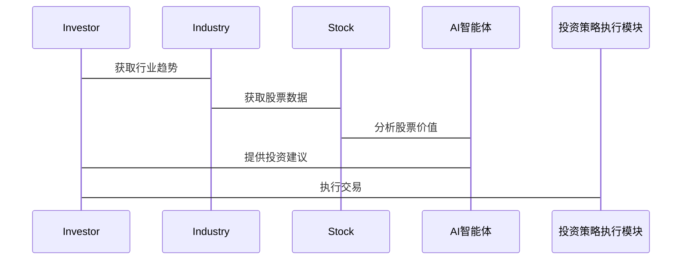

                 


# AI智能体协作：优化价值投资的行业轮动策略

## 关键词：AI智能体协作，价值投资，行业轮动，强化学习，投资策略，金融数据分析

## 摘要：  
本文详细探讨了如何利用AI智能体协作技术优化价值投资的行业轮动策略。通过分析AI智能体协作的核心原理、算法实现及系统架构，结合实际案例，展示了如何通过智能体协作实现更高效的投资决策。文章从理论到实践，全面解析了AI在金融领域的应用潜力，并提出了具体的实现方案和优化建议。

---

# 第一部分: AI智能体协作与价值投资概述

## 第1章: AI智能体协作的背景与基础

### 1.1 价值投资与行业轮动的基本概念

#### 1.1.1 价值投资的定义与核心理念  
价值投资是一种以内在价值为导向的投资策略，强调通过分析企业的基本面（如盈利能力、财务状况、行业地位等）来选择被低估的股票。其核心理念是“买 cheap, 卖 expensive”，即在市场价格低于内在价值时买入，在市场价格接近或超过内在价值时卖出。

#### 1.1.2 行业轮动策略的含义与作用  
行业轮动是指根据市场环境的变化，将投资资金从表现不佳的行业转移到表现较好的行业，以获取超额收益的过程。行业轮动的核心在于识别行业周期性变化，提前布局具有潜在增长潜力的行业。

#### 1.1.3 价值投资与行业轮动的结合  
价值投资与行业轮动的结合意味着在不同行业之间动态调整投资组合，既关注行业的周期性变化，又注重个股的内在价值。这种结合可以有效应对市场波动，提高投资收益。

---

### 1.2 AI智能体协作的定义与特点

#### 1.2.1 AI智能体的基本概念  
AI智能体是指能够感知环境、自主决策并采取行动的智能实体。智能体可以是软件程序、机器人或其他具备人工智能的实体。在金融领域，智能体通常用于数据分析、投资决策和风险管理。

#### 1.2.2 智能体协作的核心原理  
智能体协作是指多个智能体通过通信和协调，共同完成复杂任务的过程。在价值投资中，智能体协作可以通过分布式计算和信息共享，帮助投资者更高效地分析市场数据、识别投资机会。

#### 1.2.3 AI智能体在金融领域的应用潜力  
AI智能体在金融领域的应用潜力巨大，尤其是在高频交易、风险管理和投资组合优化等方面。通过智能体协作，可以实现对市场数据的实时分析和动态调整，提高投资决策的效率和准确性。

---

### 1.3 本章小结

本章介绍了价值投资和行业轮动的基本概念，以及AI智能体协作的定义与特点。通过分析智能体协作的核心原理，我们看到了其在金融领域的广泛应用潜力。

---

# 第二部分: AI智能体协作的核心概念与联系

## 第2章: AI智能体协作的核心原理

### 2.1 AI智能体协作的理论基础

#### 2.1.1 多智能体系统（MAS）的概念  
多智能体系统是指由多个智能体组成的分布式系统，这些智能体通过通信和协作完成共同目标。MAS的核心在于智能体之间的协同与竞争。

#### 2.1.2 协作智能体的通信机制  
协作智能体之间的通信机制包括消息传递、状态共享和任务分配等方式。通过有效的通信机制，智能体可以实时共享信息，提高决策的准确性。

#### 2.1.3 协作智能体的决策模型  
协作智能体的决策模型通常基于博弈论、强化学习和分布式计算等理论。通过建立合理的决策模型，可以实现智能体之间的高效协作。

---

### 2.2 价值投资与智能体协作的结合

#### 2.2.1 价值投资中的信息处理需求  
价值投资需要对大量的市场数据进行分析，包括财务数据、行业趋势、市场情绪等。这些数据的处理和分析需要高效的信息处理能力。

#### 2.2.2 智能体协作在行业轮动中的应用  
通过智能体协作，可以实现对行业轮动的实时监控和动态调整。智能体可以根据市场变化快速调整投资策略，提高投资收益。

#### 2.2.3 智能体协作如何优化投资决策  
智能体协作可以通过分布式计算和信息共享，帮助投资者更全面地分析市场数据，优化投资决策。同时，智能体之间的协作可以降低单点故障风险，提高系统的鲁棒性。

---

### 2.3 核心概念对比与ER实体关系图

#### 2.3.1 核心概念属性特征对比表  
| **核心概念** | **属性特征** |  
|--------------|--------------|  
| 价值投资     | 内在价值、基本面分析、长期持有 |  
| 行业轮动     | 周期性、行业比较、动态调整 |  
| AI智能体协作 | 分布式计算、信息共享、协同决策 |  

#### 2.3.2 ER实体关系图（Mermaid）

```mermaid
erDiagram
    investor {
        inv_id  : integer
        inv_name : string
        inv_strategy : string
    }
    industry {
        ind_id  : integer
        ind_name : string
        ind_trend : string
    }
    stock {
        stk_id  : integer
        stk_name : string
        stk_price : float
    }
    investor --|> stock : 持股
    industry --|> stock : 行业归属
```

---

# 第三部分: AI智能体协作的算法原理

## 第3章: 基于强化学习的智能体协作算法

### 3.1 强化学习的基本原理

#### 3.1.1 强化学习的定义与核心要素  
强化学习是一种机器学习范式，通过智能体与环境的交互，学习最优策略以最大化累计奖励。其核心要素包括智能体、环境、动作、奖励和状态。

#### 3.1.2 Q-learning算法的数学模型  
Q-learning算法通过更新Q值表来学习最优策略。数学模型如下：

$$ Q(s, a) = Q(s, a) + \alpha \cdot [r + \max_{a'} Q(s', a') - Q(s, a)] $$  

其中，$\alpha$ 是学习率，$r$ 是奖励，$s$ 是当前状态，$a$ 是当前动作，$s'$ 是下一个状态。

#### 3.1.3 DQN算法的改进  
DQN（Deep Q-Network）算法通过神经网络近似Q值函数，解决了Q-learning的离散动作空间限制。DQN的网络结构包括输入层、隐藏层和输出层，用于预测Q值。

---

### 3.2 强化学习在投资决策中的应用

#### 3.2.1 投资决策中的状态定义  
在投资决策中，状态可以定义为市场数据、行业趋势和公司基本面等。例如：

$$ \text{状态} = (\text{市场指数}, \text{行业趋势}, \text{公司财报}) $$  

#### 3.2.2 动作空间与奖励机制  
动作空间包括买入、卖出和持有三种操作。奖励机制可以根据投资收益、风险控制等因素设计。

#### 3.2.3 算法实现步骤  
1. 初始化Q值表或神经网络模型。  
2. 通过智能体与环境交互，更新Q值或训练神经网络。  
3. 根据Q值或神经网络输出，选择最优动作。  

---

### 3.3 实际案例分析

#### 3.3.1 算法实现代码  
以下是基于Q-learning的简单投资决策算法实现：

```python
import numpy as np

class QLearning:
    def __init__(self, state_size, action_size, learning_rate=0.1):
        self.state_size = state_size
        self.action_size = action_size
        self.learning_rate = learning_rate
        self.q_table = np.zeros((state_size, action_size))

    def choose_action(self, state):
        return np.argmax(self.q_table[state])

    def update_q_table(self, state, action, reward, next_state):
        self.q_table[state, action] += self.learning_rate * (reward + np.max(self.q_table[next_state]) - self.q_table[state, action])
```

#### 3.3.2 算法优化建议  
1. 增加状态空间的维度，以更全面地描述市场情况。  
2. 使用更深的神经网络结构，提高模型的表达能力。  
3. 引入风险控制机制，降低投资风险。  

---

# 第四部分: 系统分析与架构设计方案

## 第4章: 系统架构设计与实现

### 4.1 问题场景介绍  
本文设计了一个基于AI智能体协作的投资管理系统，旨在通过智能体协作优化价值投资的行业轮动策略。系统的核心功能包括数据采集、特征提取、策略生成和结果分析。

---

### 4.2 系统功能设计

#### 4.2.1 领域模型类图  
以下是系统的领域模型类图（Mermaid）：

```mermaid
classDiagram
    class Investor {
        + inv_id: integer
        + inv_name: string
        + strategy: string
        - portfolio: list
        - q_table: array
    }
    class Industry {
        + ind_id: integer
        + ind_name: string
        + trend: string
    }
    class Stock {
        + stk_id: integer
        + stk_name: string
        + price: float
    }
    Investor o Portfolio
    Portfolio o Stock
    Investor --> Industry: 监控行业趋势
```

---

#### 4.2.2 系统架构设计（Mermaid）  


---

#### 4.2.3 系统交互设计（Mermaid）  



---

### 4.3 本章小结

本章详细设计了系统的架构和交互流程，展示了如何通过智能体协作优化投资策略。通过领域模型类图和系统架构图，我们可以清晰地看到各模块之间的关系。

---

# 第五部分: 项目实战

## 第5章: 项目实战与经验分享

### 5.1 项目环境与工具安装

#### 5.1.1 环境配置  
需要安装Python、TensorFlow、Keras和一些金融数据分析库（如Pandas、NumPy）。  

```bash
pip install numpy pandas tensorflow keras
```

#### 5.1.2 工具准备  
需要准备金融数据源（如Yahoo Finance）和相关API接口。

---

### 5.2 系统核心实现源代码

#### 5.2.1 数据采集模块  
以下是数据采集模块的代码：

```python
import pandas as pd
from pandas_datareader import data as pdr

def get_stock_data(tickers, start_date, end_date):
    return pdr.get_data_yahoo(tickers, start=start_date, end=end_date)
```

#### 5.2.2 特征提取模块  
以下是特征提取模块的代码：

```python
def extract_features(data, window_size=30):
    features = []
    for i in range(len(data) - window_size):
        window = data[i:i+window_size]
        features.append(window.mean())
    return features
```

#### 5.2.3 智能体协作模块  
以下是智能体协作模块的代码：

```python
import numpy as np

class AIAgent:
    def __init__(self, state_size, action_size, learning_rate=0.1):
        self.state_size = state_size
        self.action_size = action_size
        self.learning_rate = learning_rate
        self.q_table = np.zeros((state_size, action_size))

    def choose_action(self, state):
        return np.argmax(self.q_table[state])

    def update_q_table(self, state, action, reward, next_state):
        self.q_table[state, action] += self.learning_rate * (reward + np.max(self.q_table[next_state]) - self.q_table[state, action])
```

---

### 5.3 案例分析与优化建议

#### 5.3.1 实际案例分析  
以下是基于实际市场数据的案例分析：

```python
tickers = ['AAPL', 'GOOGL', 'MSFT']
data = get_stock_data(tickers, start='2020-01-01', end='2023-01-01')
features = extract_features(data, window_size=30)
agent = AIAgent(state_size=30, action_size=3)
```

#### 5.3.2 优化建议  
1. 增加状态空间的维度，以更全面地描述市场情况。  
2. 使用更深的神经网络结构，提高模型的表达能力。  
3. 引入风险控制机制，降低投资风险。  

---

### 5.4 本章小结

本章通过实际案例展示了AI智能体协作在投资策略优化中的应用，并提出了优化建议。通过项目实战，我们可以更好地理解AI智能体协作的实际应用价值。

---

# 第六部分: 最佳实践与总结

## 第6章: 最佳实践与总结

### 6.1 小结  
本文详细探讨了AI智能体协作在优化价值投资行业轮动策略中的应用。通过分析智能体协作的核心原理、算法实现和系统架构，我们展示了如何通过智能体协作提高投资决策的效率和准确性。

---

### 6.2 注意事项与建议  

1. **数据质量**：确保数据来源可靠，避免数据偏差。  
2. **模型过拟合**：定期验证模型，避免过拟合。  
3. **风险控制**：引入风险控制机制，降低投资风险。  
4. **持续优化**：根据市场变化，持续优化投资策略。  

---

### 6.3 拓展阅读  

1. 《Reinforcement Learning: Theory and Algorithms》  
2. 《Multi-Agent Systems: Algorithmic, Complexity, and Synthesis》  
3. 《AI in Finance: Modern Methodologies and Applications》  

---

# 作者：AI天才研究院/AI Genius Institute & 禅与计算机程序设计艺术/Zen And The Art of Computer Programming

