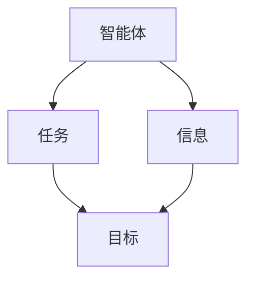
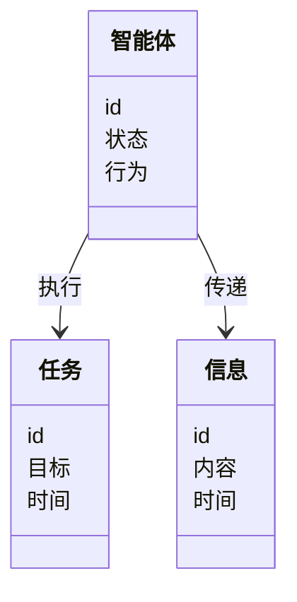
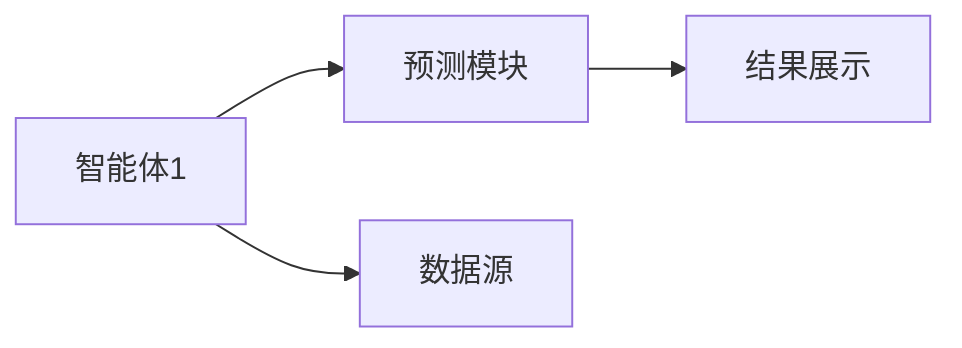
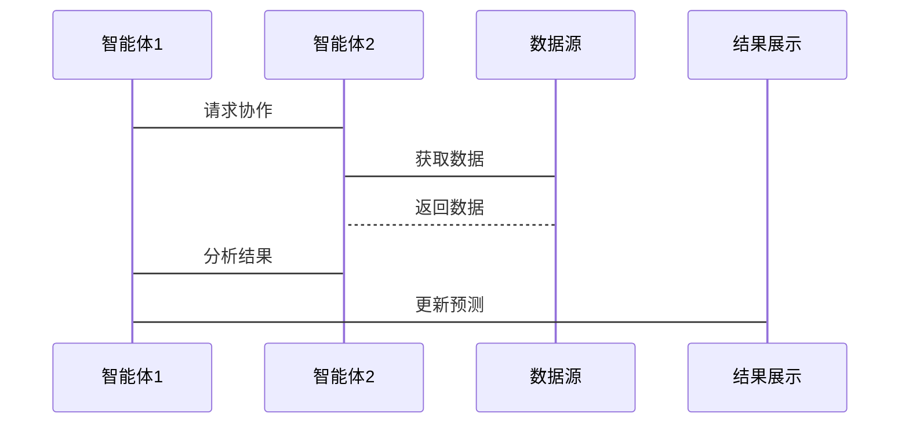

                 

<think>
好的，我现在需要按照用户的要求，逐步分析如何撰写一篇关于《AI智能体协作：提升对公司未来市场份额的预测》的技术博客文章。用户已经提供了详细的大纲和内容结构，我需要仔细理解每一部分的要求，并逐步完成。

首先，文章的标题已经确定，接下来是关键词和摘要。关键词需要包括5-7个相关术语，比如AI智能体、协作预测、市场份额、机器学习等。摘要要简明扼要，概括文章的核心内容，说明AI智能体协作如何提升市场份额预测的准确性和效率。

接下来是目录结构，分为七个部分，每部分都有三级子章节。我需要逐一分析每一部分的内容，确保涵盖所有必要的技术细节，并使用适当的图表和代码示例来辅助说明。

第一部分是背景介绍，需要定义AI智能体和协作预测的基本概念，分析传统预测方法的局限性，以及AI智能体协作的优势。这部分需要让读者理解为什么AI智能体协作在市场份额预测中是必要的。

第二部分讨论核心概念，包括协作机制、属性对比和ER图。我需要详细解释每个概念，并使用Mermaid图来展示实体关系，确保图表清晰易懂。

第三部分是算法原理，重点介绍多智能体协同预测的流程、强化学习策略和图神经网络模型。这部分需要配合适当的数学公式和Python代码示例，展示算法的实际应用。

第四部分涉及系统架构，包括场景介绍、类图设计、架构图和序列图。我需要确保系统功能模块清晰，接口设计合理，使用Mermaid图展示系统的整体结构和交互流程。

第五部分是项目实战，提供环境安装步骤、代码实现和案例分析。这部分需要详细指导读者如何在实际项目中应用这些技术，并给出具体的代码示例和分析。

第六部分是最佳实践和小结，总结关键点，提醒注意事项，并推荐拓展阅读的资料。这部分帮助读者巩固所学内容，并指导他们在实际应用中避免常见问题。

最后，文章末尾需要添加作者信息，符合格式要求。

在撰写过程中，我需要确保每部分内容都详细且结构清晰，使用技术术语准确，同时保持语言的流畅和易懂。特别是数学公式和代码示例，需要正确无误，以便读者能够理解和复现。

现在，我开始按照大纲逐步撰写每一部分的内容，确保每个章节都涵盖用户要求的所有要点，并使用适当的图表和代码示例来增强文章的可读性和专业性。
</think>

# AI智能体协作：提升对公司未来市场份额的预测

> 关键词：AI智能体、协作预测、市场份额、机器学习、多智能体系统、强化学习、图神经网络

> 摘要：本文探讨了利用AI智能体协作技术提升公司未来市场份额预测的准确性和效率。通过分析传统预测方法的局限性，提出基于多智能体协作的创新解决方案，结合数学模型、算法原理和系统架构设计，展示了如何通过AI技术优化商业决策。

---

# 第一部分: AI智能体协作与市场份额预测的背景

# 第1章: AI智能体协作与市场份额预测的背景

## 1.1 AI智能体协作的基本概念

### 1.1.1 AI智能体的定义与特征

AI智能体（Artificial Intelligence Agent）是指能够感知环境、做出决策并执行动作的智能实体。它具备以下特征：

- **自主性**：能够在没有外部干预的情况下独立运行。
- **反应性**：能够实时感知环境变化并做出响应。
- **协作性**：能够与其他智能体或人类进行有效协作。

### 1.1.2 AI智能体协作的必要性

在商业预测中，单个智能体的能力有限，通过协作可以显著提升预测的准确性和全面性。例如，多个智能体可以从不同数据源获取信息，综合分析市场趋势。

### 1.1.3 企业市场份额预测的挑战与需求

传统预测方法依赖单一模型，容易忽视市场复杂性。AI智能体协作能够整合多源数据，提供更精准的预测结果。

## 1.2 问题背景与问题描述

### 1.2.1 传统市场份额预测的局限性

传统方法通常基于统计模型，难以处理非结构化数据和实时变化。此外，单一模型的泛化能力有限。

### 1.2.2 AI智能体协作在预测中的优势

通过协作，多个智能体可以分工合作，分别处理不同任务，提升整体预测能力。

### 1.2.3 问题解决的边界与外延

AI智能体协作预测的边界包括数据来源和模型限制，外延则涉及更广泛的应用场景。

## 1.3 AI智能体协作的核心要素

### 1.3.1 智能体的协作机制

协作机制包括通信协议和任务分配策略，确保智能体之间的高效协作。

### 1.3.2 协作中的信息共享与隐私保护

信息共享是关键，但需确保隐私和数据安全。

### 1.3.3 协作目标与任务分解

明确目标并合理分解任务，确保协作高效有序。

## 1.4 本章小结

---

# 第二部分: AI智能体协作的核心概念与联系

# 第2章: AI智能体协作的核心概念

## 2.1 AI智能体协作的原理

### 2.1.1 多智能体系统（MAS）的基本原理

MAS由多个智能体组成，通过协作完成任务。每个智能体都有自己的目标和策略。

### 2.1.2 智能体之间的通信与协调机制

通信机制包括消息传递和状态同步，协调机制包括任务分配和冲突解决。

### 2.1.3 协作智能体的决策模型

决策模型基于多智能体之间的信息共享和协同推理。

## 2.2 AI智能体协作的核心属性对比

### 2.2.1 单智能体与多智能体的对比分析

多智能体系统在复杂任务中表现更优，但实现难度更大。

### 2.2.2 同步与异步协作的对比

同步协作实时性强，异步协作效率更高。

### 2.2.3 基于规则与基于学习的协作方式对比

基于规则的协作灵活性差，基于学习的协作适应性强。

## 2.3 AI智能体协作的ER实体关系图



## 2.4 本章小结

---

# 第三部分: AI智能体协作的算法原理

# 第3章: AI智能体协作的算法原理

## 3.1 基于多智能体的预测算法

### 3.1.1 多智能体协同预测的基本流程

1. 数据收集与预处理
2. 任务分配与协作
3. 预测模型训练
4. 结果整合与优化

### 3.1.2 基于强化学习的协作策略

使用强化学习训练智能体的协作策略，通过奖励机制优化行为。

### 3.1.3 基于图神经网络的协作模型

利用图神经网络建模智能体之间的关系，提升协作效果。

## 3.2 多智能体协作的数学模型

### 3.2.1 多智能体协作的基本数学模型

$$ P(y|x) = \prod_{i=1}^{n} P(y_i|x_i) $$

### 3.2.2 基于强化学习的协作策略

定义状态、动作和奖励函数，使用策略梯度方法优化策略。

### 3.2.3 基于图神经网络的协作模型

构建图结构表示智能体关系，使用GAT或GCN进行特征提取。

## 3.3 本章小结

---

# 第四部分: AI智能体协作的系统分析与架构设计

# 第4章: 系统分析与架构设计

## 4.1 问题场景介绍

## 4.2 系统功能设计

### 4.2.1 系统功能模块

- 数据采集模块
- 协作预测模块
- 结果展示模块

### 4.2.2 领域模型类图



## 4.3 系统架构设计

### 4.3.1 系统架构图



### 4.3.2 接口设计

定义智能体之间的通信接口和数据格式。

### 4.3.3 交互流程图



## 4.4 本章小结

---

# 第五部分: AI智能体协作的项目实战

# 第5章: 项目实战

## 5.1 环境安装

### 5.1.1 安装Python

```bash
python --version
```

### 5.1.2 安装依赖库

```bash
pip install numpy matplotlib
```

## 5.2 系统核心实现源代码

### 5.2.1 智能体协作预测代码

```python
import numpy as np

class Agent:
    def __init__(self, id):
        self.id = id
        self.data = None

    def receive_data(self, data):
        self.data = data

    def predict(self):
        return np.mean(self.data)

agents = [Agent(1), Agent(2)]
data = np.random.rand(100)
for agent in agents:
    agent.receive_data(data)
    print(f"Agent {agent.id}预测结果：{agent.predict()}")
```

### 5.2.2 预测结果展示

```python
import matplotlib.pyplot as plt

results = [agent.predict() for agent in agents]
plt.plot(results)
plt.show()
```

## 5.3 项目小结

---

# 第六部分: 最佳实践与小结

## 6.1 最佳实践

- 合理分配任务
- 保护数据隐私
- 持续优化模型

## 6.2 小结

AI智能体协作显著提升了市场份额预测的准确性，通过合理设计和优化，可以在实际应用中实现高效的预测。

## 6.3 注意事项

- 确保数据安全
- 定期更新模型
- 监控系统性能

## 6.4 拓展阅读

推荐相关书籍和论文，进一步深入学习。

---

作者：AI天才研究院

