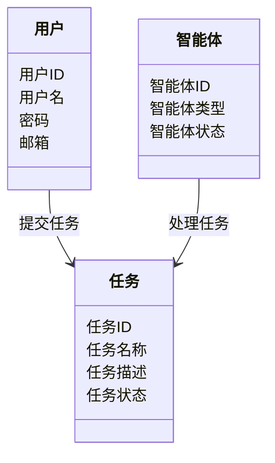
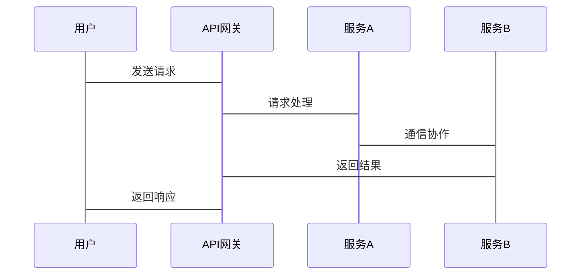

                 


# AI智能体协作：提升对公司未来竞争力的预测

> 关键词：AI智能体，协作机制，数据驱动，预测模型，系统架构，项目实战

> 摘要：本文探讨了AI智能体协作如何提升公司未来竞争力的预测能力。通过详细分析协作机制、数据驱动的预测模型、系统架构设计和项目实战，展示了如何利用AI智能体的协作优势，优化公司战略决策，从而在竞争激烈的市场中占据优势地位。

---

## 第1章 AI智能体协作的背景与概念

### 1.1 AI智能体的基本概念

AI智能体（Artificial Intelligence Agent）是指具备感知环境、自主决策和执行任务能力的智能系统。与传统AI相比，AI智能体更注重动态环境中的自主性和交互性。AI智能体的核心特征包括：自主性、反应性、目标导向性和协作性。

#### 1.1.1 AI智能体的定义
AI智能体是一个能够感知环境、理解需求并采取行动以实现目标的实体。它可以是一个软件程序、机器人或任何具备AI能力的系统。

#### 1.1.2 AI智能体的核心特征
- **自主性**：AI智能体能够自主决策，无需外部干预。
- **反应性**：能够实时感知环境变化并做出反应。
- **目标导向性**：通过目标驱动行动，优化决策过程。
- **协作性**：与其他智能体或人类协同工作，共同完成任务。

#### 1.1.3 AI智能体与传统AI的区别
传统AI注重任务执行，而AI智能体更注重自主性和协作性。传统AI如搜索引擎依赖预定义规则，而AI智能体能够动态调整策略，适应复杂环境。

### 1.2 AI智能体协作的重要性

AI智能体协作是指多个智能体协同工作，共同完成复杂任务的过程。协作能够提高效率、优化资源利用，增强系统的整体能力。

#### 1.2.1 协作的定义与内涵
协作是指多个智能体通过共享信息、分工合作，共同完成目标的过程。协作的关键在于信息共享和任务分配。

#### 1.2.2 协作在AI智能体中的作用
协作能够提高系统的整体性能，增强应对复杂任务的能力。例如，在企业中，协作的AI智能体可以优化资源配置，提高生产效率。

#### 1.2.3 协作对提升公司竞争力的意义
通过协作，AI智能体能够更高效地解决问题，为企业创造更大的价值。例如，在市场竞争中，协作的AI智能体能够快速响应客户需求，提升企业竞争力。

### 1.3 AI智能体协作的背景与趋势

AI智能体协作是当前AI技术发展的趋势之一。随着技术进步，AI智能体的应用场景越来越广泛。

#### 1.3.1 当前AI技术的发展现状
AI技术快速发展，应用场景涵盖自然语言处理、计算机视觉、机器人等领域。AI智能体协作技术逐渐成熟，应用范围扩大。

#### 1.3.2 协作AI智能体的应用场景
协作AI智能体广泛应用于企业协作、智能客服、智能制造等领域。例如，在智能制造中，协作的AI智能体可以优化生产流程，提高效率。

#### 1.3.3 未来AI协作的趋势分析
未来，AI智能体协作将更加智能化、自动化。通过深度学习和强化学习，协作AI智能体能够更好地适应复杂环境，提升协作效率。

---

## 第2章 AI智能体协作的核心机制

### 2.1 AI智能体协作的基本原理

协作机制是AI智能体协作的基础，包括通信、任务分配和决策过程。

#### 2.1.1 协作的通信机制
通信机制是协作的基础，确保智能体之间能够有效传递信息。

##### 通信协议的选择
选择适合的通信协议，如HTTP、WebSocket等，确保信息高效传递。

##### 信息传递的格式
信息传递格式如JSON、XML等，确保数据结构清晰，易于解析。

##### 信息安全性
通过加密技术确保通信安全，防止数据泄露。

#### 2.1.2 协作的任务分配
任务分配是协作的关键，确保每个智能体能够发挥其优势。

##### 任务分配策略
常用的任务分配策略包括轮询分配、基于能力分配和基于优先级分配。

##### 任务分解与组合
将复杂任务分解为子任务，合理分配给不同智能体完成。

##### 任务执行的监控与反馈
实时监控任务执行情况，及时调整分配策略。

#### 2.1.3 协作的决策过程
决策过程是协作的核心，确保智能体能够做出最优决策。

##### 分布式决策机制
每个智能体根据自身信息做出决策，避免集中决策的延迟。

##### 集中式决策机制
通过集中式决策系统，统一协调各智能体的行动。

##### 混合式决策机制
结合分布式和集中式决策的优点，灵活应对复杂环境。

### 2.2 协作中的信息共享与同步

信息共享是协作的基础，确保各智能体能够及时获取所需信息。

#### 2.2.1 信息共享的必要性
信息共享能够提高协作效率，避免信息孤岛。

#### 2.2.2 信息同步的技术实现
通过消息队列、数据库同步等技术，确保信息及时更新。

#### 2.2.3 信息冲突的解决方法
采用版本控制、仲裁机制等方法，解决信息冲突问题。

### 2.3 协作中的协调与优化

协调与优化是协作的关键，确保系统整体性能最优。

#### 2.3.1 协调的定义与实现
协调是指各智能体之间相互配合，共同完成任务。

##### 协调机制
通过制定规则、协议等，确保各智能体协同工作。

##### 协调工具
使用协作平台、通信工具等，辅助协调过程。

#### 2.3.2 协作优化的策略
通过优化任务分配、信息共享等策略，提高协作效率。

##### 策略制定
根据具体任务需求，制定合适的优化策略。

##### 策略实施
通过调整参数、改进算法等方法，实施优化策略。

##### 策略评估
定期评估优化效果，持续改进协作机制。

#### 2.3.3 协作效率的评估指标
评估协作效率需要考虑响应时间、任务完成率、资源利用率等指标。

---

## 第3章 数据驱动的竞争力预测

### 3.1 数据收集与处理

数据是预测的基础，高质量的数据能够提高预测准确性。

#### 3.1.1 数据来源与采集方法
数据来源包括内部数据、外部数据、公开数据等。

##### 数据采集方法
通过API接口、网络爬取、传感器采集等方式获取数据。

##### 数据清洗与预处理
对采集到的数据进行清洗，去除噪声，处理缺失值。

#### 3.1.2 数据存储与管理
采用数据库、数据仓库等技术，存储和管理数据。

##### 数据库选择
根据需求选择关系型数据库或NoSQL数据库。

##### 数据存储结构
设计合理的数据表结构，便于后续分析。

### 3.2 数据分析与特征提取

数据分析是预测的关键，特征提取能够提高模型性能。

#### 3.2.1 数据分析的基本方法
常用的数据分析方法包括描述性分析、诊断性分析、预测性分析和规范性分析。

##### 描述性分析
通过统计方法，描述数据的基本特征。

##### 诊断性分析
分析数据背后的原因，发现潜在问题。

##### 预测性分析
基于历史数据，预测未来趋势。

##### 规范性分析
制定数据驱动的决策规则，优化业务流程。

#### 3.2.2 特征提取的技术与工具
特征提取是将数据转换为高价值特征的过程。

##### 技术
使用主成分分析（PCA）、拉普拉斯特征选择法等技术提取特征。

##### 工具
利用Python的scikit-learn库、Pandas库等工具进行特征工程。

#### 3.2.3 数据特征对竞争力的影响
分析不同特征对竞争力的影响程度，识别关键特征。

##### 特征重要性评估
使用特征重要性评分（如随机森林特征重要性）评估各特征的影响。

##### 关键特征识别
通过可视化工具（如LIME解释器）识别对预测结果影响最大的特征。

### 3.3 数据驱动的预测模型

预测模型是数据驱动预测的核心，选择合适的模型能够提高预测准确性。

#### 3.3.1 预测模型的选择与设计
根据数据类型和任务需求选择模型。

##### 数据类型
区分分类、回归、聚类等问题类型。

##### 任务需求
考虑实时性、可解释性、计算资源等因素，选择适合的模型。

#### 3.3.2 模型训练与优化
通过训练数据优化模型参数，提高预测精度。

##### 训练方法
使用监督学习、无监督学习、半监督学习等方法进行训练。

##### 模型优化
通过网格搜索、随机搜索等方法，优化模型超参数。

##### 交叉验证
采用交叉验证评估模型泛化性能，防止过拟合。

#### 3.3.3 模型评估与验证
通过评估指标验证模型性能，选择最优模型。

##### 评估指标
根据不同任务选择合适的评估指标，如准确率、召回率、F1值、均方误差（MSE）等。

##### 模型验证
通过留出法、交叉验证法等方法，验证模型的稳定性和可靠性。

---

## 第4章 系统架构设计

### 4.1 系统功能设计

系统功能设计是系统架构的基础，明确各模块的功能和交互方式。

#### 4.1.1 领域模型
领域模型是系统功能设计的核心，描述系统的业务流程和数据关系。

##### 领域模型设计
通过绘制领域模型图（Mermaid类图），明确系统中的实体、属性和关系。

##### 类图展示


#### 4.1.2 功能模块划分
将系统划分为用户模块、任务模块、智能体模块和数据模块。

##### 功能模块划分
- **用户模块**：用户注册、登录、管理个人信息。
- **任务模块**：任务提交、分配、跟踪和管理。
- **智能体模块**：智能体注册、任务分配、执行任务。
- **数据模块**：数据采集、存储、处理和分析。

### 4.2 系统架构设计

系统架构设计是系统实现的关键，决定系统的扩展性和维护性。

#### 4.2.1 架构风格选择
根据需求选择适合的架构风格，如分层架构、微服务架构、事件驱动架构等。

##### 分层架构
将系统划分为表示层、业务逻辑层和数据访问层，便于模块化开发和维护。

##### 微服务架构
将系统功能模块化为独立的服务，通过API进行交互，提高系统的可扩展性和灵活性。

##### 事件驱动架构
通过事件驱动系统各组件协作，提高系统的实时性和响应能力。

#### 4.2.2 系统架构图
通过Mermaid架构图展示系统的整体架构。

##### 架构图展示


#### 4.2.3 接口设计
设计系统接口，明确接口的功能、参数和返回值。

##### 接口设计
- **API接口**：使用RESTful API设计风格，定义清晰的接口规范。
- **数据格式**：统一使用JSON格式，确保数据传递的一致性。

#### 4.2.4 系统交互设计
通过Mermaid序列图展示系统各组件之间的交互过程。

##### 交互图展示


### 4.3 系统实现

系统实现是系统架构设计的落地，需要具体的代码实现和测试。

#### 4.3.1 环境安装
安装必要的开发环境和工具，如Python、Django、Flask等框架。

##### 安装步骤
1. 安装Python：`apt-get install python3`
2. 安装Django：`pip install django`
3. 安装Django REST framework：`pip install djangorestframework`

#### 4.3.2 核心代码实现
实现系统的核心功能模块，如用户认证、任务分配、数据处理等。

##### 用户认证模块
```python
from django.contrib.auth.models import User
from rest_framework import viewsets
from rest_framework.permissions import IsAuthenticated
from rest_framework.authentication import TokenAuthentication

class UserViewSet(viewsets.ModelViewSet):
    queryset = User.objects.all()
    serializer_class = UserSerializer
    permission_classes = [IsAuthenticated]
    authentication_classes = [TokenAuthentication]
```

##### 任务分配模块
```python
from rest_framework import mixins
from rest_framework.viewsets import GenericViewSet

class TaskViewSet(mixins.CreateModelMixin,
                   mixins.RetrieveModelMixin,
                   mixins.ListModelMixin,
                   GenericViewSet):
    queryset = Task.objects.all()
    serializer_class = TaskSerializer
    permission_classes = [IsAuthenticated]
```

##### 数据处理模块
```python
import pandas as pd
from sklearn import preprocessing

# 数据预处理
data = pd.read_csv('data.csv')
data = data.dropna()
data = pd.get_dummies(data)
```

#### 4.3.3 系统功能测试
编写测试用例，验证系统功能的正确性。

##### 测试用例
1. 用户登录测试：验证用户能否成功登录。
2. 任务分配测试：验证任务能否正确分配给智能体。
3. 数据处理测试：验证数据预处理是否正确。

#### 4.3.4 系统优化
根据测试结果，优化系统性能，提高系统的稳定性和响应速度。

##### 性能优化
- 优化数据库查询，减少冗余查询。
- 使用缓存技术，提高数据访问效率。
- 优化API接口，减少响应时间。

---

## 第5章 项目实战

### 5.1 项目背景

项目背景是项目实施的基础，明确项目的初衷和目标。

#### 5.1.1 项目介绍
项目旨在通过AI智能体协作，提升公司未来竞争力的预测能力。

##### 项目目标
- 提高预测模型的准确性。
- 优化公司资源配置，提高生产效率。
- 提升客户满意度，增强市场竞争力。

#### 5.1.2 项目需求
项目需求包括数据采集、处理、分析和预测。

##### 功能需求
- 数据采集模块：采集市场数据、客户数据、生产数据等。
- 数据处理模块：清洗、预处理数据，提取特征。
- 数据分析模块：分析数据，识别趋势和规律。
- 预测模型模块：构建预测模型，进行竞争力预测。

##### 非功能需求
- 系统响应时间：≤2秒。
- 系统可用性：99.9%。

### 5.2 项目实施

项目实施是项目落地的关键，需要详细规划和执行。

#### 5.2.1 项目计划
制定详细的项目计划，包括任务分解、时间安排、资源分配等。

##### 任务分解
将项目分解为数据采集、数据处理、模型构建、系统集成等任务。

##### 时间安排
使用甘特图（Gantt Chart）制定项目进度计划。

##### 资源分配
明确项目团队成员的职责和任务分工。

#### 5.2.2 项目执行
按照项目计划，逐步实施项目，确保项目按计划推进。

##### 里程碑设置
设置关键里程碑，如数据采集完成、模型构建完成等。

##### 风险管理
识别潜在风险，制定应对措施，降低项目失败的风险。

### 5.3 项目总结

项目总结是项目实施的重要环节，总结经验教训，为未来项目提供参考。

#### 5.3.1 项目成果
总结项目实施的成果，如成功构建了预测模型，提高了预测准确性。

##### 成果展示
- 成功构建了基于AI智能体协作的预测模型。
- 提高了公司的市场竞争力。
- 增强了团队的协作能力。

#### 5.3.2 项目经验
总结项目实施过程中的经验教训，优化未来的项目管理。

##### 经验总结
- 项目计划的制定和执行是项目成功的关键。
- 团队协作和沟通是项目顺利进行的重要保障。
- 风险管理和应对措施能够降低项目失败的风险。

#### 5.3.3 项目教训
总结项目中出现的问题，分析原因，提出改进措施。

##### 教训总结
- 对需求理解不够深入，导致部分功能未能按时完成。
- 对外部环境变化准备不足，影响项目进度。
- 对团队成员的能力评估不够准确，导致部分任务完成质量不高。

---

## 第6章 最佳实践与小结

### 6.1 最佳实践

最佳实践是项目成功的重要保障，总结和推广最佳实践，提高项目成功率。

#### 6.1.1 项目管理
- 项目计划要详细，任务分解要合理。
- 团队协作要紧密，沟通要顺畅。
- 风险管理要到位，制定应急预案。

#### 6.1.2 技术实现
- 系统架构要合理，模块划分要清晰。
- 数据处理要规范，模型选择要科学。
- 代码实现要规范，测试要全面。

#### 6.1.3 系统优化
- 系统性能要优化，响应时间要控制。
- 系统安全要保障，防止数据泄露。
- 系统可扩展性要强，方便后续功能扩展。

### 6.2 小结

本文详细探讨了AI智能体协作如何提升公司未来竞争力的预测能力。通过分析协作机制、数据驱动的预测模型、系统架构设计和项目实战，展示了AI智能体协作在实际应用中的巨大潜力。

### 6.3 注意事项

在实际应用中，需要注意以下几点：

1. **数据隐私**：在数据采集和处理过程中，要严格遵守数据隐私保护法规，防止数据泄露。
2. **系统安全**：确保系统的安全性，防止恶意攻击和数据篡改。
3. **模型解释性**：选择具有较高解释性的模型，便于分析预测结果的原因，优化预测模型。
4. **持续优化**：定期评估系统性能，根据实际需求和环境变化，持续优化系统架构和预测模型。

### 6.4 拓展阅读

为了进一步深入学习AI智能体协作和数据驱动的预测技术，可以参考以下资料：

1. **《机器学习实战》**：Ian H. Witten等著，介绍了机器学习的基本概念和实战技术。
2. **《深入理解人工智能》**： Yoshua Bengio著，深入探讨人工智能的核心原理和技术。
3. **《分布式系统》**：Andrew S. Tanenbaum著，系统介绍分布式系统的设计和实现。
4. **《大数据分析与挖掘》**：Jiawei Han等著，详细讲解大数据分析与挖掘的技术和方法。

---

## 作者：AI天才研究院/AI Genius Institute & 禅与计算机程序设计艺术/Zen And The Art of Computer Programming

---

### 本文总结

通过本文的详细分析和实践，我们可以看到，AI智能体协作在提升公司未来竞争力的预测能力方面具有巨大潜力。通过合理设计协作机制、优化数据处理流程、构建高效的预测模型，并结合系统的架构设计和项目实战，公司可以在激烈的市场竞争中占据优势地位。未来，随着AI技术的不断发展，AI智能体协作的应用场景将更加广泛，为公司创造更大的价值。

