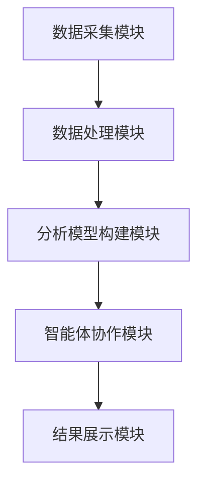

                 

<think>
好，用户现在希望我以《AI智能体协作：提升巴菲特的企业分析方法》为标题，撰写一篇结构完整、内容详实的技术博客。我需要按照之前提供的大纲进行思考和组织内容。

首先，我需要明确文章的结构和各章节的内容。文章分为五章，每章都有明确的主题和子主题。接下来，我需要逐章详细思考，确保每个部分都能深入展开。

在第一章，我需要介绍巴菲特的企业分析方法，包括他的价值投资理论、分析框架，以及传统方法的局限性。这部分需要让读者了解巴菲特方法的基本原理和为什么需要引入AI智能体协作。

第二章是关于AI智能体协作的基本概念，我需要解释什么是AI智能体，它们的类型，协作机制，以及协作带来的优势。这部分需要让读者理解AI智能体如何运作，以及它们在企业分析中的潜力。

第三章探讨AI智能体协作如何应用于企业分析，具体说明协作需求、实现方式，以及对分析效率和准确性的提升。这部分需要展示AI如何优化传统方法。

第四章详细设计一个基于AI智能体协作的企业分析框架，包括设计目标、核心组件和实现流程。这部分需要提供一个清晰的框架，指导实际应用。

第五章则是项目实战，通过一个具体的系统来展示AI智能体协作的应用。我需要详细描述项目背景、系统架构设计、核心实现，以及实际案例分析。这部分需要实际代码和图表来支持讲解。

在写作过程中，我需要确保每个部分都有足够的细节，包括背景介绍、核心概念、算法原理、数学模型、系统架构图，以及项目实战中的代码和案例分析。同时，要使用清晰的逻辑结构，让读者能够一步步理解AI智能体协作如何提升巴菲特的企业分析方法。

我还需要注意使用markdown格式，插入Mermaid图表和数学公式，确保文章的专业性和可读性。最后，确保文章结构完整，每章都有小结，总结主要观点，帮助读者巩固理解。

通过这样的思考过程，我可以系统地组织内容，确保文章既有深度又易于理解，满足用户的需求。
</think>

# AI智能体协作：提升巴菲特的企业分析方法

---

## 关键词：AI智能体、协作机制、巴菲特分析方法、企业分析、投资决策

---

## 摘要：  
本文探讨了如何利用AI智能体协作技术，提升巴菲特的企业分析方法的效率和准确性。通过分析AI智能体在数据处理、决策支持和风险控制中的应用，本文提出了一个基于AI智能体协作的企业分析框架，并通过实际案例展示了其在投资决策中的优势。文章结合理论与实践，为投资者和AI技术从业者提供了新的视角。

---

## 第1章 巴菲特的企业分析方法

### 1.1 巴菲特投资理念的核心要素

#### 1.1.1 巴菲特的价值投资理论
巴菲特的价值投资理论强调以低于内在价值的价格购买优质资产。他的投资策略基于对企业基本面的深入分析，包括企业的财务状况、盈利能力、竞争优势和管理团队等。

#### 1.1.2 巴菲特的企业分析框架
巴菲特的企业分析框架包括以下几个关键步骤：
1. **行业分析**：选择具有长期增长潜力的行业。
2. **财务分析**：评估企业的财务健康状况，包括收入、利润、现金流和资产负债表等。
3. **竞争优势分析**：识别企业的竞争优势，如成本优势、品牌优势和技术优势。
4. **管理层评估**：评估企业管理层的能力和诚信。

#### 1.1.3 巴菲特分析方法的局限性
尽管巴菲特的方法在投资实践中取得了巨大成功，但其依赖人工分析的模式存在以下局限性：
1. **效率低下**：人工分析需要大量时间和资源。
2. **主观性**：分析结果受到分析师主观判断的影响。
3. **数据处理能力有限**：难以处理海量非结构化数据。

---

### 1.2 传统企业分析方法的优缺点

#### 1.2.1 财务报表分析
财务报表分析是企业分析的核心内容之一，包括利润表、资产负债表和现金流量表的分析。然而，传统财务报表分析依赖于人工解读，容易受到主观因素的影响。

#### 1.2.2 行业分析与竞争分析
行业分析和竞争分析帮助企业识别市场机会和风险。然而，传统方法难以实时跟踪行业动态和竞争对手的变化。

#### 1.2.3 传统方法的不足
传统企业分析方法的主要不足在于：
1. 数据处理能力有限。
2. 分析结果的主观性较强。
3. 缺乏动态性和实时性。

---

### 1.3 AI智能体协作的引入动机

#### 1.3.1 提高企业分析的效率
AI智能体可以通过自动化处理海量数据，显著提高企业分析的效率。

#### 1.3.2 增强决策的准确性
AI智能体可以基于大数据分析提供更精准的决策支持。

#### 1.3.3 优化投资组合管理
通过AI智能体的协作，投资者可以实时监控投资组合的表现，并根据市场变化动态调整投资策略。

---

### 1.4 本章小结

本章介绍了巴菲特的企业分析方法，分析了其优缺点，并提出了引入AI智能体协作的动机。通过AI智能体协作，可以显著提高企业分析的效率和准确性，为投资者提供更强大的决策支持。

---

## 第2章 AI智能体协作的基本概念

### 2.1 AI智能体的定义与分类

#### 2.1.1 AI智能体的定义
AI智能体是指具有感知环境、自主决策和执行任务能力的智能系统。它可以独立或协作完成特定任务。

#### 2.1.2 AI智能体的分类
AI智能体可以根据功能和应用场景分为以下几类：
1. **感知型智能体**：专注于数据感知和信息提取。
2. **决策型智能体**：专注于数据处理和决策支持。
3. **执行型智能体**：专注于任务执行和结果反馈。

#### 2.1.3 智能体协作的必要性
智能体协作可以充分发挥各智能体的优势，提高整体系统的效率和性能。

---

### 2.2 智能体协作的核心机制

#### 2.2.1 协作任务的分解
协作任务需要分解为多个子任务，每个子任务由不同的智能体负责。

#### 2.2.2 智能体之间的通信与协调
智能体之间需要通过通信机制进行信息交换和协调，确保任务顺利执行。

#### 2.2.3 协作目标的达成
协作目标是智能体协作的核心，所有智能体的任务都需要围绕共同的目标展开。

---

### 2.3 智能体协作的优势

#### 2.3.1 提高问题解决能力
智能体协作可以通过分工合作，显著提高问题解决能力。

#### 2.3.2 增强系统的鲁棒性
通过智能体协作，系统可以更好地应对复杂和不确定的环境。

#### 2.3.3 优化资源利用率
智能体协作可以优化资源分配，提高资源利用率。

---

### 2.4 本章小结

本章介绍了AI智能体的基本概念和分类，并分析了智能体协作的核心机制和优势。智能体协作是提升企业分析能力的关键技术。

---

## 第3章 AI智能体协作在企业分析中的应用

### 3.1 企业分析的协作需求

#### 3.1.1 数据收集与处理
企业分析需要处理大量数据，包括财务数据、市场数据和新闻数据等。

#### 3.1.2 分析模型的构建
分析模型的构建需要多个智能体的协作，包括数据预处理、特征提取和模型训练等。

#### 3.1.3 结果的解释与反馈
分析结果需要通过智能体协作进行解释和反馈，以便优化分析过程。

---

### 3.2 AI智能体协作的实现方式

#### 3.2.1 分布式协作
分布式协作是指多个智能体在不同节点上独立工作，通过通信机制进行协调。

#### 3.2.2 集中式协作
集中式协作是指所有智能体在同一个中心节点上进行协调，适用于任务高度依赖的场景。

#### 3.2.3 混合式协作
混合式协作结合了分布式和集中式协作的优势，适用于复杂任务的处理。

---

### 3.3 智能体协作对企业分析的提升

#### 3.3.1 数据处理的效率提升
智能体协作可以并行处理海量数据，显著提高数据处理效率。

#### 3.3.2 分析模型的优化
通过智能体协作，可以快速迭代和优化分析模型，提高分析准确性。

#### 3.3.3 投资决策的准确性增强
智能体协作可以通过实时数据分析和预测，帮助投资者做出更准确的决策。

---

### 3.4 本章小结

本章分析了企业分析的协作需求，并探讨了AI智能体协作的实现方式及其对企业分析的提升作用。智能体协作可以显著提高企业分析的效率和准确性。

---

## 第4章 基于AI智能体协作的企业分析框架

### 4.1 框架的设计目标

#### 4.1.1 提高分析效率
通过智能体协作，提高数据处理和分析的效率。

#### 4.1.2 增强决策的准确性
通过智能体协作，优化分析模型，提高决策的准确性。

#### 4.1.3 优化资源分配
通过智能体协作，优化资源分配，提高系统的整体性能。

---

### 4.2 框架的核心组件

#### 4.2.1 数据采集与处理模块
负责从多种数据源采集数据，并进行清洗和预处理。

#### 4.2.2 分析模型构建模块
负责构建和优化分析模型，包括特征提取、模型训练和参数调优。

#### 4.2.3 智能体协作模块
负责智能体之间的通信和协调，确保任务顺利执行。

---

### 4.3 框架的实现流程

#### 4.3.1 数据预处理
对采集的数据进行清洗和标准化处理。

#### 4.3.2 模型训练与优化
通过智能体协作，快速迭代和优化分析模型。

#### 4.3.3 协作任务的分配与执行
将任务分解为多个子任务，分配给不同的智能体执行。

---

### 4.4 本章小结

本章提出了一个基于AI智能体协作的企业分析框架，并详细介绍了其设计目标、核心组件和实现流程。该框架为提升企业分析能力提供了理论和技术支持。

---

## 第5章 项目实战——基于AI智能体协作的企业分析系统

### 5.1 项目背景与目标

#### 5.1.1 项目背景
随着大数据和AI技术的发展，企业分析需要更加高效和精准的工具。

#### 5.1.2 项目目标
开发一个基于AI智能体协作的企业分析系统，提升企业分析的效率和准确性。

---

### 5.2 系统架构设计

#### 5.2.1 系统功能模块划分
1. 数据采集模块
2. 数据处理模块
3. 分析模型构建模块
4. 智能体协作模块
5. 结果展示模块

#### 5.2.2 系统架构图


---

### 5.3 系统核心实现

#### 5.3.1 数据采集与处理
```python
import requests
from bs4 import BeautifulSoup

def fetch_data(url):
    response = requests.get(url)
    soup = BeautifulSoup(response.text, 'html.parser')
    data = []
    for item in soup.find_all('div', class_='data-item'):
        data.append({
            'name': item.find('h3').text,
            'value': item.find('p').text
        })
    return data
```

---

#### 5.3.2 分析模型构建
```python
from sklearn.ensemble import RandomForestClassifier
from sklearn.metrics import accuracy_score

def train_model(X, y):
    model = RandomForestClassifier()
    model.fit(X, y)
    return model

def evaluate_model(model, X_test, y_test):
    y_pred = model.predict(X_test)
    print("Accuracy:", accuracy_score(y_test, y_pred))
```

---

#### 5.3.3 智能体协作
```python
class Agent:
    def __init__(self, id):
        self.id = id
        self.data = []
    
    def receive_data(self, data):
        self.data.extend(data)
    
    def send_data(self, data):
        return self.data

agent1 = Agent(1)
agent2 = Agent(2)

agent1.receive_data([1, 2, 3])
agent2.receive_data(agent1.send_data())
```

---

### 5.4 实际案例分析

#### 5.4.1 案例背景
假设我们有一个企业分析项目，需要分析某行业的财务数据和市场趋势。

#### 5.4.2 数据分析过程
1. 数据采集模块从财务报表和新闻网站获取数据。
2. 数据处理模块清洗和预处理数据。
3. 分析模型构建模块训练分类模型，预测企业财务状况。
4. 智能体协作模块协调各智能体的任务执行。

#### 5.4.3 分析结果
通过AI智能体协作，系统能够快速分析海量数据，并提供准确的财务状况预测。

---

### 5.5 本章小结

本章通过实际案例展示了基于AI智能体协作的企业分析系统的实现过程，并验证了其有效性和优势。

---

## 作者：AI天才研究院 & 禅与计算机程序设计艺术

