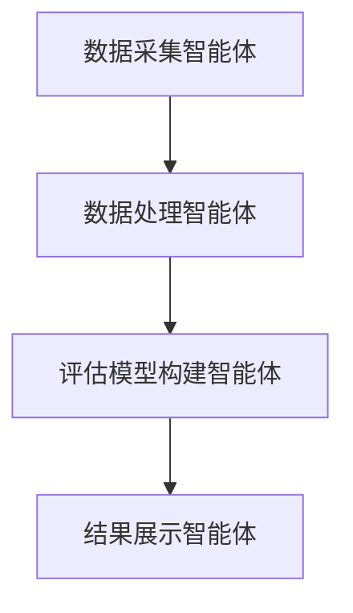
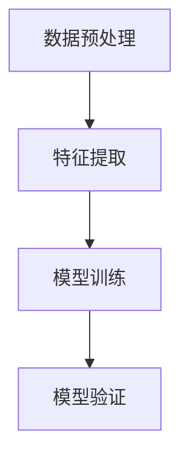
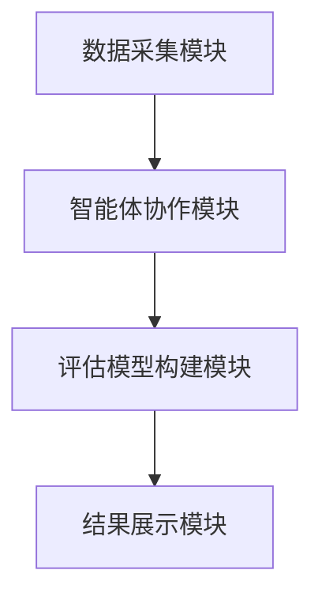
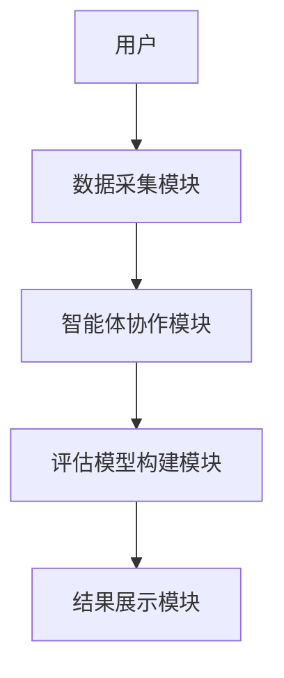

                 


# AI智能体协作：构建更全面的公司文化评估模型

> 关键词：AI智能体协作，公司文化评估，多智能体系统，协作机制，模型构建，评估指标

> 摘要：本文探讨如何利用AI智能体协作技术构建更全面的公司文化评估模型，通过分析公司文化的核心要素，提出基于多智能体协作的评估框架，并结合具体案例详细阐述模型的设计与实现。

---

## 第一部分：AI智能体协作与公司文化评估模型概述

### 第1章：背景介绍

#### 1.1 问题背景
##### 1.1.1 公司文化评估的传统方法与局限性
公司文化是组织管理的重要组成部分，传统的文化评估方法通常依赖于问卷调查、员工访谈和管理层反馈。这些方法虽然能够收集一定的数据，但存在以下问题：
- 数据收集成本高，耗时长。
- 评估结果主观性较强，难以量化。
- 难以捕捉动态变化的文化特征。

##### 1.1.2 当前公司文化管理中的痛点
随着企业规模的扩大和业务复杂性的增加，传统的文化评估方法已无法满足以下需求：
- 实时监测文化变化。
- 精准识别文化问题并提供解决方案。
- 跨部门协作效率低，难以形成统一的文化认知。

##### 1.1.3 AI智能体协作的引入与潜力
AI智能体协作技术能够通过分布式计算和机器学习算法，实时分析和评估组织文化。其潜力体现在：
- 提高评估效率和准确性。
- 实现跨部门协作的实时监控。
- 基于数据驱动的决策支持。

#### 1.2 问题描述
##### 1.2.1 公司文化评估的核心要素
公司文化评估的核心要素包括：
- 价值观一致性：员工对组织价值观的认同程度。
- 协作效率：部门间协作的流畅程度。
- 员工满意度：员工对工作环境的满意程度。
- 创新能力：组织的创新能力。

##### 1.2.2 传统评估模型的不足
- 数据孤岛：各部门数据分散，难以整合。
- 缺乏动态性：无法实时捕捉文化变化。
- 主观性较强：评估结果依赖人工判断。

##### 1.2.3 AI智能体协作的目标与意义
目标是通过智能体协作技术，构建一个实时、动态、数据驱动的公司文化评估模型。意义在于提高评估的客观性和及时性，为企业文化管理提供科学依据。

#### 1.3 问题解决
##### 1.3.1 AI智能体协作的基本思路
- 分布式数据采集：通过智能体实时采集各部门数据。
- 多智能体协作：智能体之间协同工作，共同完成文化评估。
- 数据分析与建模：利用机器学习算法对数据进行分析，构建评估模型。

##### 1.3.2 从数据到模型的构建过程
- 数据预处理：清洗和整合多源数据。
- 特征提取：提取文化评估的关键特征。
- 模型训练：基于机器学习算法训练评估模型。
- 模型验证：通过实际数据验证模型的准确性。

##### 1.3.3 模型的可扩展性与实用性
- 可扩展性：模型能够适应不同规模和类型的组织。
- 实用性：模型能够提供实时反馈和 actionable insights。

#### 1.4 边界与外延
##### 1.4.1 模型适用的范围
适用于中大型企业，特别是需要实时监测和优化组织文化的企业。

##### 1.4.2 与其他评估方法的对比
相比传统方法，AI智能体协作模型具有更高的效率和准确性。

##### 1.4.3 模型的局限性与改进方向
- 局限性：模型依赖于高质量的数据输入，数据不足可能导致评估不准确。
- 改进方向：优化数据采集机制，提高模型的鲁棒性。

#### 1.5 概念结构与核心要素组成
##### 1.5.1 公司文化评估模型的构成
- 数据采集层：负责数据的采集和预处理。
- 智能体协作层：负责数据的分析和评估。
- 用户交互层：负责结果的展示和反馈。

##### 1.5.2 AI智能体协作的核心要素
- 分布式智能体：负责数据的采集和处理。
- 协作机制：负责智能体之间的协同工作。
- 评估模型：负责文化评估的计算和输出。

##### 1.5.3 模型的输入与输出
- 输入：各部门数据，员工反馈。
- 输出：文化评估结果，改进建议。

---

### 第2章：核心概念与协作机制

#### 2.1 AI智能体协作的原理
##### 2.1.1 多智能体系统的基本概念
多智能体系统是由多个智能体组成的系统，智能体之间通过协作完成任务。

##### 2.1.2 智能体协作的核心机制
- 通信机制：智能体之间的信息交换。
- 协作机制：智能体之间的任务分配和协同工作。
- 冲突解决机制：解决协作过程中出现的冲突。

##### 2.1.3 协作目标与实现方式
- 目标：提高文化评估的效率和准确性。
- 实现方式：通过分布式计算和机器学习算法实现。

#### 2.2 核心概念对比分析
##### 2.2.1 智能体协作与传统协作的对比
| 对比维度 | 智能体协作 | 传统协作 |
|----------|------------|----------|
| 协作方式 | 分布式计算 | 人工协调 |
| 协作效率 | 高 | 低 |
| 协作效果 | 精准 | 主观 |

##### 2.2.2 模型构建的核心要素
- 数据来源：各部门数据。
- 智能体角色：数据采集、分析、反馈。
- 协作关系：智能体之间的协作关系。

#### 2.3 模型构建的概念图


---

### 第3章：算法原理与模型构建

#### 3.1 算法原理
##### 3.1.1 算法选择与原理
- 算法选择：基于机器学习的评估模型，如随机森林、支持向量机。
- 原理：通过训练模型，预测文化评估结果。

##### 3.1.2 算法实现步骤
1. 数据预处理：清洗和整合数据。
2. 特征提取：提取关键特征。
3. 模型训练：训练评估模型。
4. 模型验证：验证模型的准确性。

##### 3.1.3 算法流程图


#### 3.2 模型构建
##### 3.2.1 评估指标的权重计算
- 使用加权平均法计算各评估指标的权重。
- 公式：$$\text{权重} = \frac{\text{指标的重要性}}{\sum \text{所有指标的重要性}}$$

##### 3.2.2 模型的数学表达
- 公式：$$\text{文化评估结果} = \sum (\text{评估指标} \times \text{权重})$$

##### 3.2.3 模型的优化与调整
- 使用交叉验证优化模型参数。
- 调整模型结构以提高准确率。

#### 3.3 算法实现代码示例
```python
import pandas as pd
from sklearn.ensemble import RandomForestClassifier
from sklearn.metrics import accuracy_score

# 数据加载与预处理
data = pd.read_csv('culture_assessment_data.csv')
data = data.dropna()

# 特征提取
features = data[['valueAlignment', 'collaborationEfficiency', 'employeeSatisfaction', 'innovationAbility']]
labels = data['cultureScore']

# 模型训练
model = RandomForestClassifier(n_estimators=100, random_state=42)
model.fit(features, labels)

# 模型验证
predicted = model.predict(features)
print("准确率:", accuracy_score(labels, predicted))
```

---

### 第4章：系统分析与架构设计

#### 4.1 系统功能设计
##### 4.1.1 功能模块划分
- 数据采集模块：负责数据的采集和预处理。
- 智能体协作模块：负责智能体之间的协作。
- 评估模型构建模块：负责模型的训练和验证。
- 结果展示模块：负责结果的展示和反馈。

##### 4.1.2 功能模块之间的关系
- 数据采集模块 --> 智能体协作模块
- 智能体协作模块 --> 评估模型构建模块
- 评估模型构建模块 --> 结果展示模块

##### 4.1.3 功能模块的实现步骤
1. 数据采集模块：通过API接口采集各部门数据。
2. 智能体协作模块：智能体之间通过消息队列进行通信。
3. 评估模型构建模块：训练模型并保存模型参数。
4. 结果展示模块：通过可视化工具展示评估结果。

#### 4.2 系统架构设计
##### 4.2.1 系统架构图


##### 4.2.2 智能体协作模块的实现细节
- 使用分布式计算框架（如 Apache Kafka）进行智能体之间的通信。
- 每个智能体负责特定的任务，如数据处理、模型训练等。

#### 4.3 系统接口设计
##### 4.3.1 接口定义
- 数据采集接口：`GET /api/data`
- 模型训练接口：`POST /api/train`
- 结果查询接口：`GET /api/results`

##### 4.3.2 接口实现
- 使用 RESTful API 设计接口。
- 使用 Flask 或 Django 框架实现接口。

#### 4.4 系统交互流程图


---

### 第5章：项目实战

#### 5.1 项目环境与工具安装
##### 5.1.1 环境配置
- 操作系统：Linux 或 macOS
- Python 版本：3.8+

##### 5.1.2 工具安装
```bash
pip install pandas sklearn mermaid4jupyter jupyterlab
```

#### 5.2 核心代码实现
##### 5.2.1 数据采集模块
```python
import requests

def fetch_data():
    response = requests.get('http://localhost:8000/api/data')
    return response.json()
```

##### 5.2.2 智能体协作模块
```python
import kafka

def produce_data(topic, data):
    producer = kafka.Producer()
    producer.send(topic, data)
    producer.close()
```

##### 5.2.3 评估模型构建模块
```python
from sklearn.ensemble import RandomForestClassifier

def train_model(features, labels):
    model = RandomForestClassifier()
    model.fit(features, labels)
    return model
```

##### 5.2.4 结果展示模块
```python
import matplotlib.pyplot as plt

def plot_results(results):
    plt.bar(results.index, results.values)
    plt.show()
```

#### 5.3 项目实战案例分析
##### 5.3.1 案例背景
- 某公司希望优化其组织文化，提高员工满意度和协作效率。

##### 5.3.2 数据准备
- 采集各部门员工满意度、协作效率等数据。

##### 5.3.3 模型训练与验证
- 使用训练好的模型对数据进行评估，输出文化评估结果。

##### 5.3.4 模型结果分析
- 分析评估结果，提出改进建议，如优化团队协作流程。

---

### 第6章：最佳实践与总结

#### 6.1 最佳实践 tips
- 数据质量是模型准确性的关键，确保数据的完整性和准确性。
- 定期更新模型，适应组织文化的动态变化。
- 通过可视化工具直观展示评估结果，便于管理层理解和决策。

#### 6.2 小结
本文详细介绍了如何利用AI智能体协作技术构建更全面的公司文化评估模型，从背景介绍到算法实现，再到系统设计和项目实战，为读者提供了全面的指导。

#### 6.3 注意事项
- 模型的准确率依赖于数据质量，数据不足可能导致评估结果不准确。
- 模型的部署需要考虑系统的扩展性和稳定性。

#### 6.4 拓展阅读
- 推荐阅读《分布式系统与多智能体协作》。
- 关注最新的AI技术在组织文化管理中的应用。

---

## 作者：AI天才研究院 & 禅与计算机程序设计艺术

