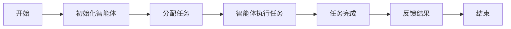
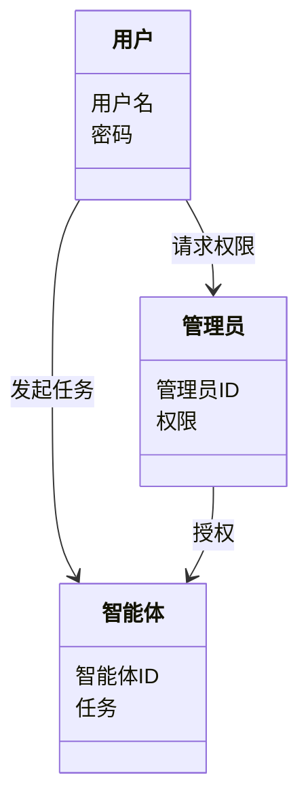

                 


# AI智能体协作：构建更全面的公司竞争优势评估模型

## 关键词：AI智能体、竞争优势评估、协作机制、系统架构、数学模型

## 摘要：  
本文深入探讨了如何利用AI智能体协作技术构建更全面的公司竞争优势评估模型。通过分析传统评估方法的局限性，提出了基于AI智能体协作的新模型，并详细阐述了其核心概念、算法原理、系统架构及实际应用案例。本文旨在为企业的竞争优势评估提供一种更高效、更精准的方法，助力企业在复杂竞争环境中保持领先地位。

---

## 第1章：AI智能体协作与竞争优势评估模型的背景与概念

### 1.1 问题背景

#### 1.1.1 企业竞争优势的传统评估方法  
传统的竞争优势评估方法主要依赖于财务指标、市场份额、产品性能等定量数据，以及行业专家的主观判断。这些方法虽然在一定程度上能够反映企业的竞争力，但存在以下问题：  
- 数据维度单一，难以全面捕捉企业的动态竞争力。  
- 评估过程耗时长，难以实时反馈。  
- 无法有效整合多源异构数据，尤其是非结构化数据。  

#### 1.1.2 AI智能体协作的兴起  
随着AI技术的快速发展，智能体协作逐渐成为企业数字化转型的重要工具。智能体协作是指多个AI智能体通过通信和协作完成特定任务的过程，其优势包括：  
- 高效性：智能体可以并行处理任务，提升整体效率。  
- 智能性：通过知识共享和协同学习，智能体能够不断优化决策能力。  
- 多样性：智能体可以根据任务需求灵活组合，适应不同场景。  

#### 1.1.3 当前竞争优势评估的痛点与挑战  
- 数据孤岛问题：企业内部数据分散在不同部门，难以统一整合。  
- 实时性不足：传统评估方法难以满足快速变化的市场环境需求。  
- 缺乏动态性：无法实时跟踪竞争对手和市场趋势的变化。  

### 1.2 问题描述

#### 1.2.1 传统评估模型的局限性  
- 数据维度有限，难以反映企业的动态竞争力。  
- 评估过程耗时长，难以实时反馈。  
- 非结构化数据的利用不足，导致信息丢失。  

#### 1.2.2 AI智能体协作在企业中的应用潜力  
- 通过智能体协作，企业可以实时收集、处理和分析多源数据。  
- 智能体之间的协作可以优化资源分配，提升决策效率。  
- 通过动态调整协作策略，企业可以快速响应市场变化。  

#### 1.2.3 构建更全面竞争优势评估模型的必要性  
- 提升企业对市场变化的敏感度和反应速度。  
- 优化资源配置，提升企业的核心竞争力。  
- 为管理层提供更精准的决策支持。  

### 1.3 问题解决与边界

#### 1.3.1 AI智能体协作如何解决传统模型的不足  
- 通过智能体协作，企业可以整合结构化和非结构化数据，提升数据的全面性。  
- 智能体的实时协作能力可以缩短评估周期，提升评估的实时性。  
- 通过动态调整协作策略，智能体可以适应市场环境的变化，提升评估的动态性。  

#### 1.3.2 模型的边界与适用场景  
- 适用于需要实时动态评估的企业场景。  
- 适用于数据来源多样、结构复杂的企业。  
- 适用于需要快速响应市场变化的企业。  

#### 1.3.3 核心概念与关键要素的定义  
- **AI智能体**：具有感知、决策和执行能力的实体，能够独立完成特定任务。  
- **协作机制**：智能体之间通过通信和协作完成复杂任务的过程。  
- **竞争优势评估模型**：通过智能体协作构建的评估企业竞争力的数学模型。  

---

## 第2章：AI智能体协作的核心概念与联系

### 2.1 核心概念原理

#### 2.1.1 AI智能体的基本概念  
AI智能体是一种具有感知、决策和执行能力的实体，能够独立完成特定任务。智能体的核心能力包括：  
- **感知能力**：通过传感器或数据接口获取外部信息。  
- **决策能力**：基于感知信息进行推理和决策。  
- **执行能力**：根据决策结果执行操作。  

#### 2.1.2 协作机制与通信协议  
智能体协作需要依赖高效的协作机制和通信协议。常见的协作机制包括：  
- **任务分配机制**：智能体根据自身能力分配任务。  
- **通信协议**：智能体之间通过预定义的协议进行信息交换。  
- **协调机制**：通过协调器或仲裁器解决协作中的冲突。  

#### 2.1.3 智能体协作的分类与层次  
智能体协作可以按照以下层次进行分类：  
- **协同学习**：智能体通过共享知识和经验提升整体能力。  
- **协同决策**：智能体通过协作完成复杂决策任务。  
- **协同执行**：智能体通过协作完成复杂任务的执行。  

### 2.2 核心概念对比分析

#### 2.2.1 不同协作模式的对比表格  
| 协作模式 | 描述 | 优点 | 缺点 |  
|---------|------|------|------|  
| 分散协作 | 每个智能体独立完成任务 | 简单高效 | 显式依赖，难以应对复杂任务 |  
| 集中式协作 | 通过中央控制器分配任务 | 高度协调 | 带宽需求高，存在单点故障 |  
| 分布式协作 | 智能体之间通过协商完成任务 | 高度灵活 | 协调复杂，效率可能较低 |  

#### 2.2.2 实体关系图（ER图）的 mermaid 表示  
```mermaid
erDiagram
    actor 用户 {
        string 用户名
        string 密码
    }
    actor 管理员 {
        string 管理员ID
        string 权限
    }
    actor 智能体 {
        string 智能体ID
        string 任务
    }
    用户 --> 管理员 : 请求权限
    用户 --> 智能体 : 发起任务
    管理员 --> 智能体 : 授权
```

---

## 第3章：AI智能体协作的算法原理与数学模型

### 3.1 算法原理

#### 3.1.1 协作算法的流程  


### 3.2 数学模型与公式

#### 3.2.1 协作效率的计算公式  
$$ E = \frac{\sum_{i=1}^{n} \text{完成任务数}_i}{n} $$  

#### 3.2.2 竞争优势评估的数学模型  
$$ S = \sum_{j=1}^{m} w_j \times f_j $$  
其中，$w_j$ 是第$j$个因素的权重，$f_j$ 是第$j$个因素的评估值。  

---

## 第4章：系统分析与架构设计

### 4.1 问题场景介绍

#### 4.1.1 企业竞争优势评估的复杂性  
企业竞争优势评估需要考虑的因素包括：  
- 市场份额  
- 产品性能  
- 客户满意度  
- 技术创新能力  

#### 4.1.2 AI智能体协作的应用场景  
- 实时监控市场动态  
- 动态调整企业战略  
- 协助管理层进行决策  

### 4.2 系统功能设计

#### 4.2.1 领域模型  


---

## 第5章：项目实战

### 5.1 环境安装

#### 5.1.1 安装Python环境  
```bash
python --version
pip install numpy
pip install matplotlib
```

### 5.2 系统核心实现源代码

#### 5.2.1 智能体协作算法实现  
```python
class Agent:
    def __init__(self, id):
        self.id = id
        self.tasks = []

    def receive_task(self, task):
        self.tasks.append(task)

    def execute_task(self):
        for task in self.tasks:
            # 执行任务逻辑
            pass

class CollaborativeSystem:
    def __init__(self):
        self.agents = []
        self.tasks = []

    def assign_task(self, task):
        # 分配任务给最合适的智能体
        pass
```

---

## 第6章：最佳实践、小结与注意事项

### 6.1 最佳实践 tips  
- 在实际应用中，建议先进行小规模测试，确保模型的稳定性和准确性。  
- 定期更新模型参数，以适应市场环境的变化。  
- 注意数据隐私和安全问题，确保数据的合法性和合规性。  

### 6.2 小结  
通过本文的详细阐述，我们可以看到，AI智能体协作技术为构建更全面的公司竞争优势评估模型提供了全新的思路和方法。通过智能体协作，企业可以更高效、更精准地评估自身的竞争优势，从而在激烈的市场竞争中占据优势。

### 6.3 注意事项  
- 在实际应用中，需要充分考虑数据的多样性和复杂性。  
- 确保智能体之间的通信和协作机制的高效性和可靠性。  
- 定期监控和优化模型的性能，以确保其稳定性和准确性。  

### 6.4 拓展阅读  
- 推荐阅读《Multi-Agent Systems: Collaboration, Complexity, and Control》。  
- 关注最新的AI协作技术进展，如分布式AI和边缘计算。  

---

## 作者：AI天才研究院/AI Genius Institute & 禅与计算机程序设计艺术 /Zen And The Art of Computer Programming  

---

以上是《AI智能体协作：构建更全面的公司竞争优势评估模型》的完整目录和内容概览。如需进一步探讨或获取详细内容，请随时联系。

